# PHÂN TÍCH VÀ THIẾT KẾ HỆ THỐNG THEO DOMAIN DRIVEN DESIGN

## 1. Giới thiệu

### 1.1. Mục đích tài liệu

Tài liệu này trình bày phân tích và thiết kế hệ thống Cab Booking System dưới góc nhìn Domain Driven Design kết hợp kiến trúc microservices. Nội dung được viết theo văn phong báo cáo, nhằm phục vụ trực tiếp cho phần phân tích thiết kế hệ thống trong đồ án hoặc báo cáo tốt nghiệp.

Trọng tâm của tài liệu là xác định rõ miền nghiệp vụ, các bounded context, mô hình miền cốt lõi, vai trò của từng microservice, cách các service giao tiếp đồng bộ và bất đồng bộ, cũng như các luồng nghiệp vụ chính trong hệ thống đặt xe công nghệ.

### 1.2. Phạm vi hệ thống

Hệ thống được xây dựng nhằm hỗ trợ hoạt động đặt xe công nghệ tương tự các nền tảng gọi xe phổ biến. Hệ thống phục vụ ba nhóm người dùng chính:

- Khách hàng, là người tạo yêu cầu đặt xe và theo dõi quá trình thực hiện chuyến đi.
- Tài xế, là người nhận chuyến, di chuyển đến điểm đón và thực hiện chuyến đi.
- Quản trị viên, là người theo dõi vận hành, giám sát dữ liệu toàn hệ thống và khai thác báo cáo quản trị.

Ngoài ba actor chính nêu trên, hệ thống còn có các thành phần hỗ trợ như cổng API, các dịch vụ hạ tầng, dịch vụ AI và các cơ chế truyền sự kiện phục vụ giao tiếp giữa các microservice.

### 1.3. Định hướng áp dụng DDD

Việc áp dụng Domain Driven Design trong hệ thống này nhằm đạt được các mục tiêu sau:

- Tổ chức hệ thống xoay quanh nghiệp vụ thay vì chỉ dựa trên tầng kỹ thuật.
- Phân tách ranh giới trách nhiệm rõ ràng giữa các miền nghiệp vụ.
- Giảm mức độ phụ thuộc trực tiếp giữa các thành phần khi hệ thống mở rộng.
- Tăng khả năng triển khai độc lập, kiểm thử độc lập và bảo trì độc lập cho từng phần.
- Hỗ trợ quá trình mô hình hóa nghiệp vụ theo ngôn ngữ phổ quát dùng chung giữa kỹ thuật và nghiệp vụ.

## 2. Tổng quan hệ thống

Cab Booking System là một hệ thống đặt xe theo mô hình nhiều ứng dụng frontend và nhiều dịch vụ backend. Hệ thống được tổ chức thành ba lớp chính:

- Lớp giao diện người dùng, bao gồm Customer App, Driver App và Admin Dashboard.
- Lớp điều phối truy cập, trong đó API Gateway là điểm vào thống nhất của toàn bộ client.
- Lớp nghiệp vụ, bao gồm các microservice phân tách theo từng bounded context.

Ở mức triển khai, hệ thống sử dụng PostgreSQL cho dữ liệu quan hệ, MongoDB cho dữ liệu dạng document, Redis cho cache và định vị, RabbitMQ cho event bus, và một AI Service riêng cho các chức năng suy luận hỗ trợ ước lượng giá hoặc ETA.

### 2.1. Kiến trúc tổng thể của hệ thống

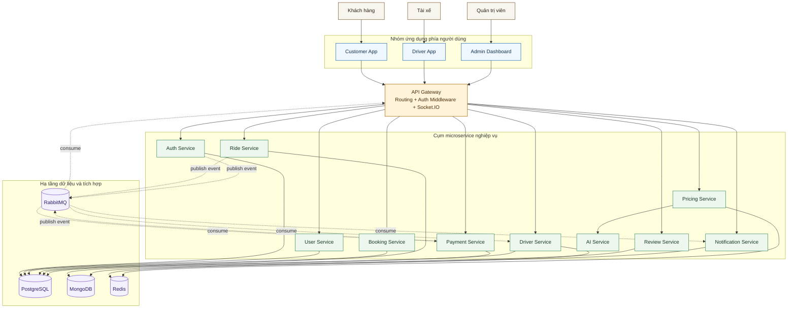

### 2.2. Nhận xét kiến trúc

Từ góc nhìn DDD, kiến trúc trên cho thấy hệ thống không tổ chức theo mô hình nguyên khối mà phân rã thành các khối nghiệp vụ có ranh giới rõ ràng. Mỗi service có thể được xem là một bounded context độc lập hoặc là hiện thực của một bounded context chính. Điều này đặc biệt phù hợp với bài toán đặt xe, vì nghiệp vụ có nhiều luồng trạng thái, nhiều actor và nhiều tương tác bất đồng bộ.

## 3. Xác định Domain và Subdomain

### 3.1. Domain cốt lõi của hệ thống

Miền nghiệp vụ tổng quát của hệ thống là vận hành dịch vụ đặt xe công nghệ theo thời gian thực. Trong miền tổng quát đó, có thể chia thành các domain và subdomain sau.

### 3.2. Core Domain

Core Domain là phần tạo ra giá trị khác biệt chính của hệ thống. Đây là nơi cần ưu tiên đầu tư thiết kế và kiểm soát chặt chẽ.

#### 3.2.1. Ride Orchestration Domain

Đây là miền quan trọng nhất, chịu trách nhiệm điều phối vòng đời chuyến đi từ thời điểm khách hàng xác nhận đặt xe đến khi chuyến đi hoàn tất hoặc bị hủy. Miền này quản lý trạng thái ride, logic chuyển trạng thái, liên kết với tài xế, cũng như quan hệ với các miền pricing, payment và notification.

#### 3.2.2. Driver Dispatch Domain

Miền này chịu trách nhiệm tìm tài xế phù hợp, kiểm tra tài xế đang trực tuyến, tra cứu vị trí hiện tại của tài xế, và hỗ trợ logic ghép chuyến. Trong thực tế, đây là miền trực tiếp quyết định hiệu quả vận hành của hệ thống.

#### 3.2.3. Pricing Domain

Miền pricing chịu trách nhiệm tính cước, ước lượng thời gian di chuyển, xác định hệ số surge và trả về thông tin ước lượng cho khách hàng trước khi đặt xe. Đây là miền ảnh hưởng trực tiếp đến trải nghiệm người dùng và hiệu quả kinh doanh.

### 3.3. Supporting Subdomain

Supporting Subdomain là các miền hỗ trợ nghiệp vụ cốt lõi, tuy không tạo ra sự khác biệt lớn nhất nhưng vẫn cần thiết để hệ thống vận hành hoàn chỉnh.

#### 3.3.1. Booking Domain

Booking Domain tiếp nhận yêu cầu đặt xe ban đầu, lưu thông tin điểm đón, điểm đến, phương thức đi xe, fare estimate tại thời điểm đặt và chuyển tiếp sang luồng tạo ride.

#### 3.3.2. Payment Domain

Payment Domain quản lý thanh toán, trạng thái giao dịch, hoàn tiền, lịch sử thanh toán và tích hợp với nhà cung cấp thanh toán nếu cần.

#### 3.3.3. Review Domain

Review Domain quản lý đánh giá sau chuyến đi, bao gồm số sao, nội dung nhận xét và thống kê chất lượng dịch vụ.

#### 3.3.4. Notification Domain

Notification Domain đảm nhiệm gửi thông báo cho khách hàng và tài xế thông qua email, SMS, hoặc thông báo trong ứng dụng.

#### 3.3.5. User Profile Domain

User Profile Domain quản lý thông tin hồ sơ người dùng bên ngoài phần định danh, ví dụ tên hiển thị, số điện thoại, ảnh đại diện, thông tin bổ sung.

### 3.4. Generic Subdomain

Generic Subdomain là các miền có tính hạ tầng hoặc tính hỗ trợ kỹ thuật nhiều hơn là nghiệp vụ đặc thù.

#### 3.4.1. Identity and Access Domain

Miền này đảm nhiệm đăng nhập, đăng ký, phân quyền, JWT và refresh token.

#### 3.4.2. API Composition Domain

Miền này do API Gateway đảm nhiệm, chịu trách nhiệm điều phối request từ frontend, gom dữ liệu từ nhiều service và cung cấp realtime hub.

#### 3.4.3. AI Estimation Support Domain

Miền này cung cấp chức năng suy luận mô hình để hỗ trợ pricing hoặc ETA, nhưng không trực tiếp sở hữu ride lifecycle.

### 3.5. Sơ đồ domain và subdomain

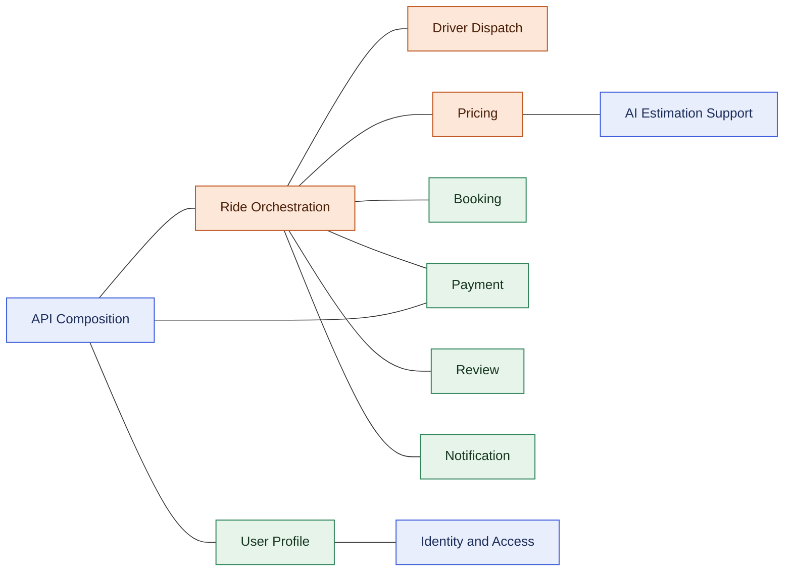

## 4. Xác định Actor tham gia vào hệ thống

### 4.1. Danh sách actor

Các actor tham gia vào hệ thống bao gồm cả actor con người và actor hệ thống.

| Actor | Vai trò trong hệ thống |
| --- | --- |
| Khách hàng | Tạo yêu cầu đặt xe, thanh toán, theo dõi chuyến đi, đánh giá sau chuyến |
| Tài xế | Nhận chuyến, cập nhật vị trí, thực hiện chuyến đi |
| Quản trị viên | Theo dõi hệ thống, thống kê, kiểm soát dữ liệu vận hành |
| Payment Provider hoặc cổng thanh toán | Cung cấp dịch vụ xử lý thanh toán ngoài |
| Dịch vụ bản đồ | Hỗ trợ geocoding, route, distance, ETA |
| AI Service | Hỗ trợ pricing và suy luận ETA hoặc multiplier |
| RabbitMQ | Trung gian truyền sự kiện bất đồng bộ |
| Hệ thống monitoring | Thu thập logs, metrics và tình trạng service |

### 4.2. Actor và các microservice mà actor tương tác

Một actor không chỉ làm việc với một service duy nhất. Trong hệ thống microservices, một thao tác nghiệp vụ của actor có thể đi qua nhiều bounded context.

| Actor | Các service liên quan |
| --- | --- |
| Khách hàng | API Gateway, Auth Service, User Service, Pricing Service, Booking Service, Ride Service, Payment Service, Review Service, Notification Service |
| Tài xế | API Gateway, Auth Service, Driver Service, Ride Service, Notification Service |
| Quản trị viên | API Gateway, Auth Service, User Service, Driver Service, Ride Service, Payment Service, Review Service |
| Payment Provider | Payment Service |
| Dịch vụ bản đồ | Pricing Service |
| AI Service | Pricing Service |

### 4.3. Sơ đồ actor và phạm vi tương tác

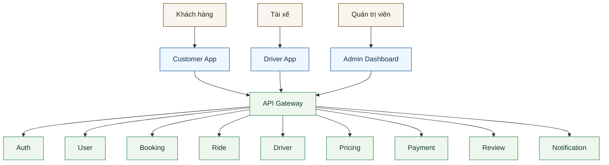

### 4.4. Sơ đồ use case cho từng actor

Để làm rõ góc nhìn người dùng trong hệ thống, phần này mô tả các use case chính tương ứng với từng actor nghiệp vụ. Các sơ đồ dưới đây được thể hiện bằng Mermaid theo dạng khối chức năng, tương đương với cách biểu diễn use case trong báo cáo phân tích hệ thống.

#### 4.4.1. Use case của khách hàng

Khách hàng là actor có phạm vi tương tác rộng nhất vì toàn bộ trải nghiệm đặt xe được khởi phát từ phía người dùng cuối. Từ lúc truy cập hệ thống, khách hàng có thể đăng ký tài khoản, đăng nhập, xem giá ước lượng, đặt xe, theo dõi chuyến đi, thanh toán và đánh giá sau chuyến.

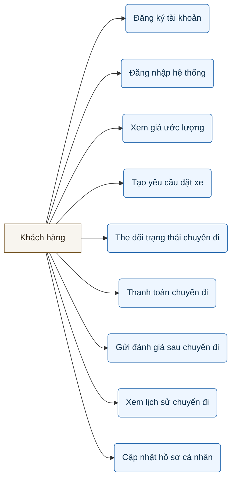

#### 4.4.2. Use case của tài xế

Tài xế là actor trực tiếp tham gia vào pha thực thi chuyến đi. Các use case của tài xế tập trung vào vận hành chuyến, quản lý trạng thái sẵn sàng, cập nhật vị trí và theo dõi hoạt động cá nhân.

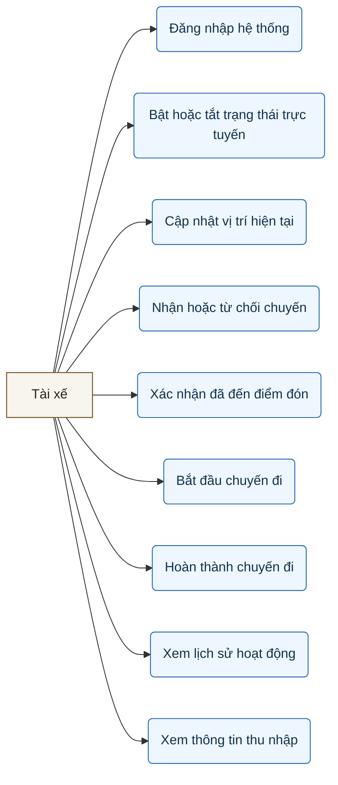

#### 4.4.3. Use case của quản trị viên

Quản trị viên là actor khai thác hệ thống ở góc nhìn điều hành. Các use case của actor này tập trung vào thống kê, giám sát, truy vấn dữ liệu vận hành và quản trị tổng hợp.

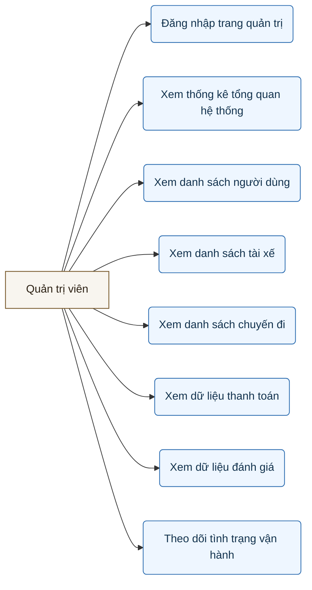

### 4.5. Activity diagram cho từng actor

Nếu use case thể hiện actor có thể làm gì, thì activity diagram mô tả trình tự hành động tiêu biểu của actor trong một kịch bản nghiệp vụ. Trong phạm vi hệ thống này, mỗi actor được mô tả bằng một activity diagram đại diện cho chuỗi thao tác chính nhất.

#### 4.5.1. Activity diagram của khách hàng

Sơ đồ dưới đây mô tả luồng nghiệp vụ điển hình của khách hàng, bắt đầu từ truy cập hệ thống đến khi hoàn tất chuyến đi và gửi đánh giá.

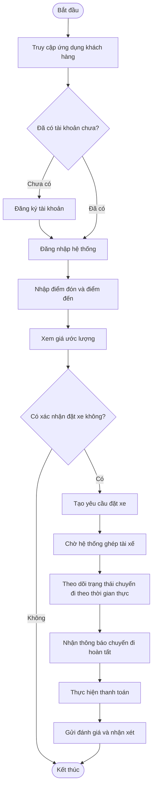

#### 4.5.2. Activity diagram của tài xế

Sơ đồ sau mô tả quy trình thao tác của tài xế từ thời điểm bắt đầu ca làm đến khi hoàn tất một chuyến đi.

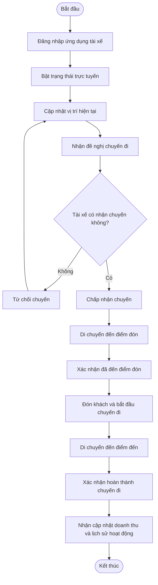

#### 4.5.3. Activity diagram của quản trị viên

Quản trị viên làm việc chủ yếu với dữ liệu tổng hợp và giám sát vận hành, do đó activity diagram tập trung vào quy trình đăng nhập, truy vấn dữ liệu và theo dõi hệ thống.

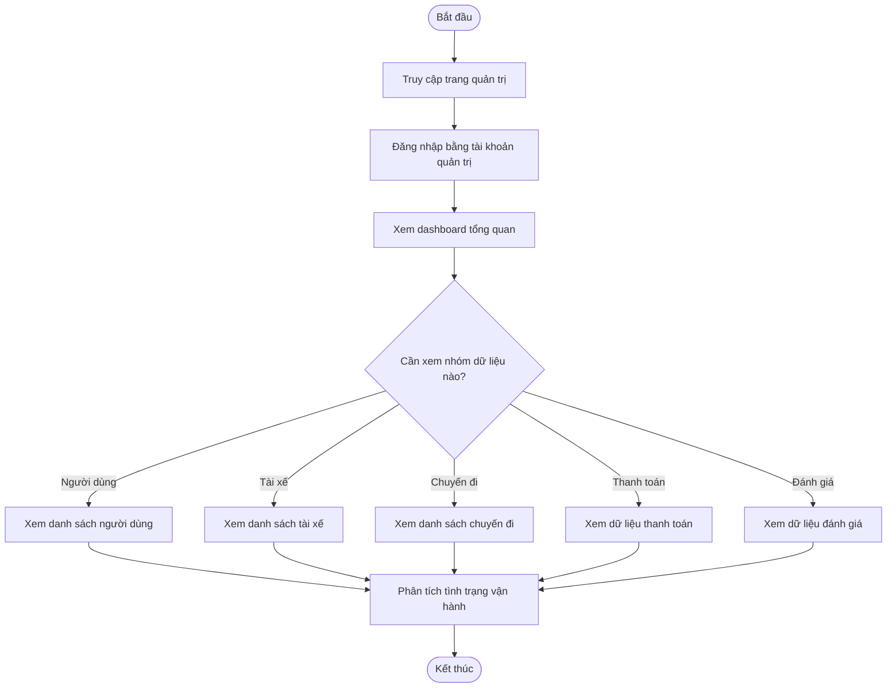

### 4.6. Ý nghĩa của nhóm sơ đồ use case và activity

Nhóm sơ đồ use case và activity giúp tài liệu thiết kế có thêm góc nhìn hành vi hệ thống. Nếu phần bounded context và microservice tập trung mô tả cấu trúc miền nghiệp vụ, thì nhóm sơ đồ này làm rõ cách từng actor thực sự tương tác với hệ thống trong các kịch bản sử dụng. Đây là phần đặc biệt phù hợp để đưa vào báo cáo vì giúp liên kết giữa yêu cầu nghiệp vụ, thiết kế hệ thống và trải nghiệm người dùng.

## 5. Xác định Bounded Context

Trong DDD, bounded context là ranh giới mà trong đó mô hình miền có ý nghĩa thống nhất, thuật ngữ không bị nhập nhằng, và quy tắc nghiệp vụ được diễn giải theo một cách nhất quán. Trong hệ thống này, các bounded context được thể hiện tương đối rõ qua từng microservice.

### 5.1. Identity Context

- Mục tiêu: quản lý định danh người dùng, đăng nhập, đăng ký, phân quyền và token.
- Thuật ngữ cốt lõi: user identity, credential, access token, refresh token, role.
- Service hiện thực: Auth Service.

### 5.2. User Profile Context

- Mục tiêu: quản lý hồ sơ mở rộng của người dùng ngoài phần identity.
- Thuật ngữ cốt lõi: profile, full name, phone number, avatar, customer info.
- Service hiện thực: User Service.

### 5.3. Booking Context

- Mục tiêu: tiếp nhận yêu cầu đặt xe ở giai đoạn tiền ride.
- Thuật ngữ cốt lõi: booking request, pickup, dropoff, vehicle type, estimate snapshot.
- Service hiện thực: Booking Service.

### 5.4. Ride Context

- Mục tiêu: quản lý ride lifecycle và các trạng thái của chuyến đi.
- Thuật ngữ cốt lõi: ride, ride status, assignment, pickup, start, complete, cancel.
- Service hiện thực: Ride Service.

### 5.5. Driver Context

- Mục tiêu: quản lý tài xế, trạng thái online, vị trí, tính khả dụng.
- Thuật ngữ cốt lõi: driver, current location, online status, availability.
- Service hiện thực: Driver Service.

### 5.6. Pricing Context

- Mục tiêu: tính toán giá ước lượng, chi phí dự kiến, khoảng cách và ETA.
- Thuật ngữ cốt lõi: estimated fare, final fare, surge, ETA, distance, duration.
- Service hiện thực: Pricing Service.

### 5.7. Payment Context

- Mục tiêu: quản lý giao dịch thanh toán và trạng thái thanh toán.
- Thuật ngữ cốt lõi: payment, payment intent, transaction, paid, failed, refunded.
- Service hiện thực: Payment Service.

### 5.8. Review Context

- Mục tiêu: quản lý đánh giá dịch vụ sau chuyến đi.
- Thuật ngữ cốt lõi: rating, review, comment, driver feedback.
- Service hiện thực: Review Service.

### 5.9. Notification Context

- Mục tiêu: quản lý tạo và gửi thông báo theo từng sự kiện nghiệp vụ.
- Thuật ngữ cốt lõi: notification, recipient, channel, delivery status.
- Service hiện thực: Notification Service.

### 5.10. API Composition Context

- Mục tiêu: làm điểm vào thống nhất, gom dữ liệu và phát realtime.
- Thuật ngữ cốt lõi: route, proxy, websocket channel, realtime event.
- Service hiện thực: API Gateway.

### 5.11. AI Estimation Context

- Mục tiêu: cung cấp suy luận mô hình hỗ trợ pricing hoặc ETA.
- Thuật ngữ cốt lõi: inference request, ETA prediction, multiplier prediction.
- Service hiện thực: AI Service.

### 5.12. Context map

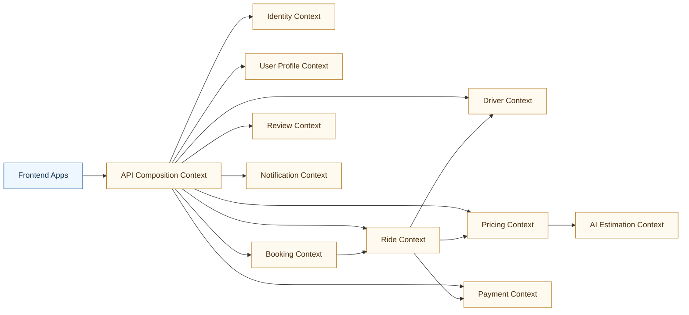

## 6. Xác định Entities, Value Objects và Aggregates

Phần này mô tả các thành phần miền quan trọng theo DDD. Mục tiêu không phải là sao chép hoàn toàn cấu trúc lớp trong mã nguồn, mà là mô hình hóa nghiệp vụ ở mức khái niệm phục vụ thiết kế hệ thống.

### 6.1. Identity Context

#### Entities

- UserIdentity
- RefreshTokenSession
- RoleAssignment

#### Value Objects

- Email
- PasswordHash
- JwtTokenPair
- AuthClaims
- UserRole

#### Aggregate

- UserIdentity Aggregate
  - Aggregate root: UserIdentity
  - Quy tắc chính: một user identity quản lý tập thông tin định danh và trạng thái truy cập của người dùng.

### 6.2. User Profile Context

#### Entities

- UserProfile
- CustomerProfile
- DriverProfileReference

#### Value Objects

- FullName
- PhoneNumber
- AvatarUrl
- ContactInfo

#### Aggregate

- UserProfile Aggregate
  - Aggregate root: UserProfile
  - Quy tắc chính: hồ sơ hiển thị của người dùng được tách khỏi phần định danh và xác thực.

### 6.3. Booking Context

#### Entities

- Booking
- BookingAuditEntry

#### Value Objects

- PickupLocation
- DropoffLocation
- VehicleType
- FareEstimateSnapshot
- BookingStatus

#### Aggregate

- Booking Aggregate
  - Aggregate root: Booking
  - Quy tắc chính: một booking đại diện cho yêu cầu đặt xe ban đầu trước khi chuyển thành ride.

### 6.4. Ride Context

#### Entities

- Ride
- RideAssignment
- RideTimelineEntry

#### Value Objects

- RideStatus
- RouteSummary
- FareBreakdown
- CustomerReference
- DriverReference
- CancellationReason

#### Aggregate

- Ride Aggregate
  - Aggregate root: Ride
  - Quy tắc chính: Ride là nguồn sự thật cho vòng đời chuyến đi và toàn bộ state transition phải diễn ra hợp lệ.

### 6.5. Driver Context

#### Entities

- Driver
- DriverAvailability
- DriverLocationRecord

#### Value Objects

- GeoCoordinate
- DriverStatus
- VehicleInfo
- LicenseInfo
- OnlineState

#### Aggregate

- Driver Aggregate
  - Aggregate root: Driver
  - Quy tắc chính: tài xế chỉ có thể nhận chuyến nếu đang online và sẵn sàng.

### 6.6. Pricing Context

#### Entities

- PricingRule
- FarePolicy

#### Value Objects

- Money
- SurgeMultiplier
- DistanceKm
- DurationMinutes
- PricingInput
- PricingResult

#### Aggregate

- FarePolicy Aggregate
  - Aggregate root: FarePolicy
  - Quy tắc chính: giá tiền phải được tính nhất quán từ cùng một bộ quy tắc và tham số đầu vào.

### 6.7. Payment Context

#### Entities

- Payment
- PaymentAttempt
- Refund

#### Value Objects

- PaymentStatus
- PaymentMethod
- TransactionId
- Amount
- Currency

#### Aggregate

- Payment Aggregate
  - Aggregate root: Payment
  - Quy tắc chính: một payment gắn với một ride và trạng thái thanh toán phải phản ánh đúng tiến trình giao dịch.

### 6.8. Review Context

#### Entities

- Review

#### Value Objects

- Rating
- ReviewComment
- ReviewTarget

#### Aggregate

- Review Aggregate
  - Aggregate root: Review
  - Quy tắc chính: review chỉ được tạo cho chuyến đi hợp lệ và đã hoàn tất.

### 6.9. Notification Context

#### Entities

- Notification
- DeliveryAttempt

#### Value Objects

- NotificationType
- Recipient
- DeliveryStatus
- TemplateCode
- NotificationPayload

#### Aggregate

- Notification Aggregate
  - Aggregate root: Notification
  - Quy tắc chính: notification phải theo dõi được kênh gửi, người nhận và trạng thái phát hành.

## 7. Xác định Microservices và mô tả chi tiết từng service

### 7.1. Danh sách microservice trong hệ thống

| STT | Microservice | Bounded Context chính | Vai trò tổng quát |
| --- | --- | --- | --- |
| 1 | API Gateway | API Composition Context | Điểm vào thống nhất cho toàn bộ client |
| 2 | Auth Service | Identity Context | Quản lý xác thực, JWT, refresh token, role |
| 3 | User Service | User Profile Context | Quản lý hồ sơ mở rộng của người dùng |
| 4 | Booking Service | Booking Context | Tiếp nhận và xác nhận yêu cầu đặt xe |
| 5 | Ride Service | Ride Context | Điều phối vòng đời chuyến đi |
| 6 | Driver Service | Driver Context | Quản lý tài xế, vị trí và trạng thái hoạt động |
| 7 | Pricing Service | Pricing Context | Tính cước và ETA |
| 8 | Payment Service | Payment Context | Quản lý thanh toán |
| 9 | Review Service | Review Context | Quản lý đánh giá sau chuyến đi |
| 10 | Notification Service | Notification Context | Gửi và lưu thông báo |
| 11 | AI Service | AI Estimation Context | Suy luận ETA hoặc multiplier hỗ trợ pricing |

### 7.2. API Gateway

#### Mục đích

API Gateway là điểm vào thống nhất của toàn bộ frontend. Thay vì để các ứng dụng khách gọi trực tiếp đến từng microservice, mọi request đều đi qua API Gateway để được xác thực, điều phối và gom dữ liệu.

#### Trách nhiệm chính

- Làm cổng vào duy nhất cho Customer App, Driver App và Admin Dashboard.
- Thực hiện xác thực JWT và kiểm tra quyền truy cập.
- Định tuyến request đến đúng service phía sau.
- Thực hiện aggregation dữ liệu cho các màn hình tổng hợp, đặc biệt là dashboard quản trị.
- Là realtime hub duy nhất thông qua Socket.IO, nhận event từ RabbitMQ và phát lại đến client phù hợp.

#### Dữ liệu sở hữu

- Không sở hữu dữ liệu nghiệp vụ dài hạn.
- Có thể giữ trạng thái ngắn hạn liên quan đến kết nối realtime hoặc metadata của request.

#### Giao tiếp

- Sync: gọi Auth, User, Booking, Ride, Driver, Pricing, Payment, Review, Notification bằng REST hoặc gRPC.
- Async: consume các ride event và payment event để phát realtime đến frontend.

### 7.3. Auth Service

#### Mục đích

Auth Service là service chịu trách nhiệm quản lý định danh người dùng và quyền truy cập.

#### Trách nhiệm chính

- Đăng ký tài khoản.
- Đăng nhập và phát access token, refresh token.
- Xử lý refresh token.
- Quản lý role và các thông tin định danh lõi.
- Cung cấp xác thực cho các bounded context khác.

#### Dữ liệu sở hữu

- Bảng user identity.
- Bảng token session hoặc refresh token.
- Thông tin vai trò và quyền hạn cơ bản.

#### Giao tiếp

- Sync: được API Gateway gọi khi login, register, authorize.
- Async: có thể phát event như user.registered hoặc user.logged_in.

### 7.4. User Service

#### Mục đích

User Service tách biệt phần hồ sơ người dùng khỏi phần định danh, giúp mô hình dữ liệu không bị dồn hết vào Auth Service.

#### Trách nhiệm chính

- Lưu và cập nhật hồ sơ người dùng.
- Cung cấp dữ liệu hiển thị cho customer, driver hoặc admin.
- Làm nguồn profile cho các tác vụ đọc dữ liệu người dùng.

#### Dữ liệu sở hữu

- Hồ sơ người dùng.
- Thông tin liên hệ, ảnh đại diện, metadata hiển thị.

#### Giao tiếp

- Sync: được API Gateway và một số service khác gọi khi cần profile information.

### 7.5. Booking Service

#### Mục đích

Booking Service là điểm bắt đầu của nghiệp vụ đặt xe. Service này lưu yêu cầu đặt xe ở giai đoạn đầu trước khi chuyển sang Ride Service.

#### Trách nhiệm chính

- Tiếp nhận pickup, dropoff, vehicle type và thông tin ước lượng.
- Tạo booking hợp lệ.
- Lưu snapshot về giá ước lượng tại thời điểm khách hàng xác nhận.
- Kích hoạt quá trình tạo ride downstream.

#### Dữ liệu sở hữu

- Bảng booking.
- Trạng thái booking và dấu vết yêu cầu đặt xe.

#### Giao tiếp

- Sync: nhận request từ API Gateway, phối hợp với Ride Service.
- Async: có thể phát event liên quan đến booking nếu mở rộng sau này.

### 7.6. Ride Service

#### Mục đích

Ride Service là trái tim nghiệp vụ của hệ thống. Đây là service sở hữu vòng đời chuyến đi và các trạng thái nghiệp vụ quan trọng.

#### Trách nhiệm chính

- Tạo ride từ booking.
- Quản lý state transition của ride.
- Điều phối assign driver.
- Phát hành domain event khi trạng thái ride thay đổi.
- Lưu lịch sử diễn tiến của chuyến đi.

#### Dữ liệu sở hữu

- Bảng ride.
- Lịch sử trạng thái ride.
- Quan hệ giữa ride, customer và driver.

#### Giao tiếp

- Sync: gọi Driver Service và Pricing Service khi cần dữ liệu trực tiếp.
- Async: publish ride.created, ride.finding_driver_requested, ride.assigned, ride.picking_up, ride.started, ride.completed.

### 7.7. Driver Service

#### Mục đích

Driver Service quản lý miền dữ liệu và trạng thái của tài xế. Service này không sở hữu toàn bộ ride lifecycle nhưng là đầu mối quan trọng của bài toán phân bổ tài xế.

#### Trách nhiệm chính

- Quản lý hồ sơ tài xế.
- Quản lý online hoặc offline.
- Cập nhật vị trí hiện tại của tài xế.
- Tìm tài xế gần nhất hoặc danh sách tài xế khả dụng.
- Cập nhật khả năng nhận chuyến của tài xế.

#### Dữ liệu sở hữu

- Hồ sơ tài xế.
- Thông tin phương tiện.
- Trạng thái trực tuyến.
- Dữ liệu định vị và geo lookup.

#### Giao tiếp

- Sync: được Gateway hoặc Ride Service gọi.
- Async: consume event liên quan đến ghép tài xế hoặc trạng thái ride.

### 7.8. Pricing Service

#### Mục đích

Pricing Service cung cấp chức năng tính cước và ước lượng di chuyển. Đây là service có thể mở rộng mạnh trong tương lai nhờ tích hợp mô hình AI hoặc nhiều chiến lược pricing.

#### Trách nhiệm chính

- Tính giá ước lượng cho khách hàng trước khi đặt xe.
- Tính ETA và quãng đường.
- Áp dụng surge multiplier theo chính sách.
- Gọi AI Service khi cần mô hình suy luận hỗ trợ.

#### Dữ liệu sở hữu

- Chính sách giá.
- Cache tính toán, dữ liệu route, dữ liệu trung gian phục vụ pricing.

#### Giao tiếp

- Sync: được Gateway và Ride Service gọi.
- Sync ngoài: gọi AI Service và dịch vụ bản đồ.

### 7.9. Payment Service

#### Mục đích

Payment Service quản lý toàn bộ vòng đời thanh toán sau chuyến đi.

#### Trách nhiệm chính

- Tạo payment intent hoặc payment record.
- Cập nhật trạng thái thanh toán.
- Ghi nhận thanh toán thành công, thất bại hoặc hoàn tiền.
- Tích hợp với cổng thanh toán thực hoặc mô hình giả lập.

#### Dữ liệu sở hữu

- Bảng payment.
- Lịch sử giao dịch.
- Bản ghi refund và payment attempt.

#### Giao tiếp

- Sync: được API Gateway gọi khi khách hàng thanh toán.
- Async: consume ride.completed, publish payment.completed hoặc payment.failed.

### 7.10. Review Service

#### Mục đích

Review Service chịu trách nhiệm lưu đánh giá và nhận xét sau chuyến đi.

#### Trách nhiệm chính

- Tạo review cho ride đã hoàn tất.
- Lưu rating và comment.
- Trả dữ liệu đánh giá cho customer hoặc admin.
- Phục vụ thống kê chất lượng dịch vụ.

#### Dữ liệu sở hữu

- Collection review.
- Dữ liệu thống kê hoặc dữ liệu document liên quan.

#### Giao tiếp

- Sync: được Gateway gọi để tạo và đọc đánh giá.

### 7.11. Notification Service

#### Mục đích

Notification Service tạo và phát đi các thông báo nghiệp vụ khi có sự kiện quan trọng xảy ra.

#### Trách nhiệm chính

- Gửi thông báo cho khách hàng và tài xế.
- Lưu lịch sử gửi thông báo.
- Hỗ trợ các kênh email, SMS, hoặc in-app notification.
- Retry và theo dõi delivery status nếu cần.

#### Dữ liệu sở hữu

- Collection notification.
- Lịch sử gửi và trạng thái phát hành thông báo.

#### Giao tiếp

- Sync: có thể được Gateway gọi cho một số tác vụ trực tiếp.
- Async: consume ride event và payment event từ RabbitMQ.

### 7.12. AI Service

#### Mục đích

AI Service cung cấp khả năng suy luận mô hình nhằm hỗ trợ ước lượng ETA hoặc gợi ý multiplier cho pricing.

#### Trách nhiệm chính

- Nhận input từ Pricing Service.
- Trả về kết quả dự đoán ETA hoặc các chỉ số hỗ trợ tính giá.
- Tách riêng phần suy luận khỏi business logic thuần của Node.js services.

#### Dữ liệu sở hữu

- Model file và runtime inference state.

#### Giao tiếp

- Sync: được Pricing Service gọi bằng HTTP.

### 7.13. Sơ đồ chi tiết vai trò từng service

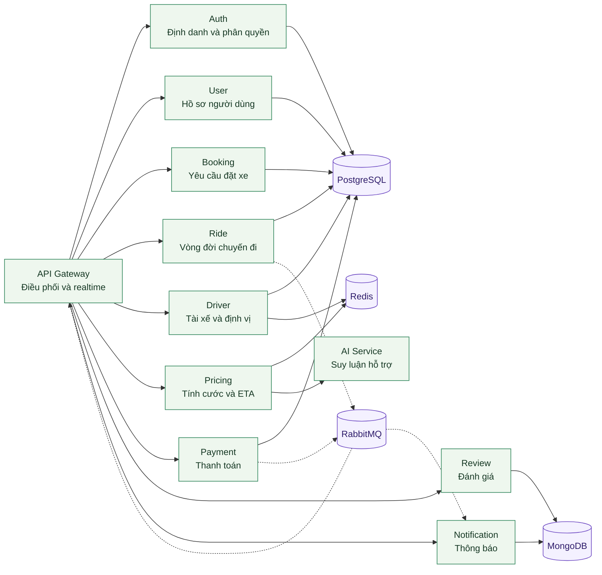

## 8. Xác định giao tiếp đồng bộ giữa các service

### 8.1. Mục đích của giao tiếp đồng bộ

Giao tiếp đồng bộ được sử dụng khi một service cần phản hồi ngay kết quả cho service gọi hoặc khi frontend cần nhận response theo mô hình request-response. Trong hệ thống này, giao tiếp đồng bộ chủ yếu sử dụng REST hoặc gRPC.

### 8.2. Giao tiếp sync chính

| Bên gọi | Bên được gọi | Hình thức | Mục đích |
| --- | --- | --- | --- |
| Frontend Apps | API Gateway | REST và WebSocket | Điểm vào thống nhất cho client |
| API Gateway | Auth Service | REST hoặc gRPC | Đăng nhập, xác thực, kiểm tra token |
| API Gateway | User Service | REST hoặc gRPC | Lấy thông tin hồ sơ người dùng |
| API Gateway | Booking Service | REST hoặc gRPC | Tạo booking |
| API Gateway | Ride Service | REST hoặc gRPC | Tạo ride, cập nhật trạng thái ride |
| API Gateway | Driver Service | REST hoặc gRPC | Truy vấn tài xế, cập nhật vị trí, nhận chuyến |
| API Gateway | Pricing Service | REST hoặc gRPC | Tính giá và ETA |
| API Gateway | Payment Service | REST hoặc gRPC | Thực hiện thanh toán |
| API Gateway | Review Service | REST hoặc gRPC | Tạo và lấy review |
| Ride Service | Driver Service | REST hoặc gRPC | Tìm tài xế phù hợp hoặc xác thực trạng thái tài xế |
| Ride Service | Pricing Service | REST hoặc gRPC | Lấy thông tin giá hoặc thông số pricing |
| Pricing Service | AI Service | REST | Gửi yêu cầu suy luận ETA hoặc multiplier |

### 8.3. Sơ đồ giao tiếp đồng bộ

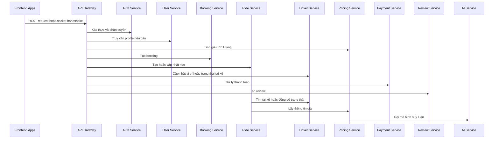

## 9. Xác định giao tiếp bất đồng bộ bằng sự kiện

### 9.1. Lý do sử dụng giao tiếp async

Giao tiếp bất đồng bộ được áp dụng để giảm coupling thời gian thực giữa các bounded context, tăng khả năng mở rộng và hỗ trợ eventual consistency. Trong hệ thống đặt xe, nhiều trạng thái không cần frontend chờ response tức thời từ toàn bộ chuỗi xử lý phía sau, do đó event-driven architecture là lựa chọn phù hợp.

### 9.2. Hạ tầng truyền sự kiện

- RabbitMQ đóng vai trò event bus trung tâm.
- Ride Service và Payment Service là hai publisher quan trọng nhất.
- API Gateway, Notification Service, Driver Service và Payment Service là các consumer tiêu biểu tùy loại sự kiện.

### 9.3. Các nhóm sự kiện chính

| Nhóm sự kiện | Ví dụ |
| --- | --- |
| Ride Event | ride.created, ride.finding_driver_requested, ride.assigned, ride.picking_up, ride.started, ride.completed |
| Payment Event | payment.completed, payment.failed, payment.refunded |
| Auth Event | user.registered, user.logged_in |
| Notification Trigger Event | các event được Notification Service consume để phát thông báo |

### 9.4. Bảng publisher và consumer

| Event | Publisher | Consumer chính |
| --- | --- | --- |
| ride.finding_driver_requested | Ride Service | Driver Service, API Gateway |
| ride.assigned | Ride Service | API Gateway, Notification Service |
| ride.picking_up | Ride Service | API Gateway, Notification Service |
| ride.started | Ride Service | API Gateway, Notification Service |
| ride.completed | Ride Service | Payment Service, API Gateway, Notification Service |
| payment.completed | Payment Service | Notification Service, API Gateway |
| user.logged_in | Auth Service | Logging hoặc monitoring consumer nếu cần |

### 9.5. Sơ đồ giao tiếp bất đồng bộ

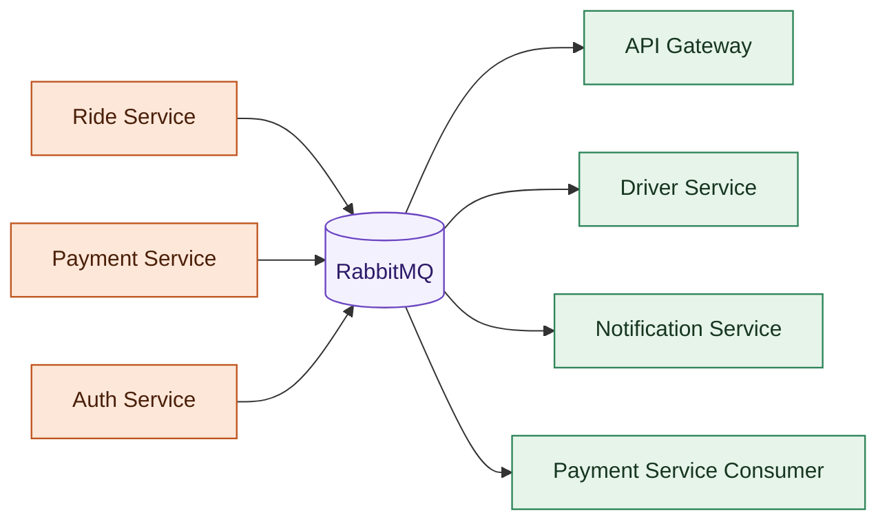

## 10. Các giao tiếp giữa các service

### 10.1. Giao tiếp trực tiếp

- API Gateway gọi Auth Service để xử lý xác thực và token.
- API Gateway gọi User Service để lấy hồ sơ người dùng.
- API Gateway gọi Booking Service để tạo yêu cầu đặt xe.
- API Gateway gọi Ride Service để khởi tạo và cập nhật ride.
- API Gateway gọi Driver Service để lấy thông tin tài xế và cập nhật trạng thái tài xế.
- API Gateway gọi Pricing Service để tính cước.
- API Gateway gọi Payment Service để xử lý thanh toán.
- API Gateway gọi Review Service để tạo đánh giá.
- Ride Service gọi Driver Service và Pricing Service khi cần dữ liệu đồng bộ.
- Pricing Service gọi AI Service để suy luận hỗ trợ.

### 10.2. Giao tiếp gián tiếp qua event

- Ride Service phát event cho API Gateway để đẩy realtime.
- Ride Service phát event cho Payment Service để tạo thanh toán sau khi hoàn tất.
- Ride Service phát event cho Notification Service để gửi thông báo.
- Payment Service phát event cho Notification Service và API Gateway sau khi thanh toán hoàn tất.

### 10.3. Sơ đồ phụ thuộc giữa các service

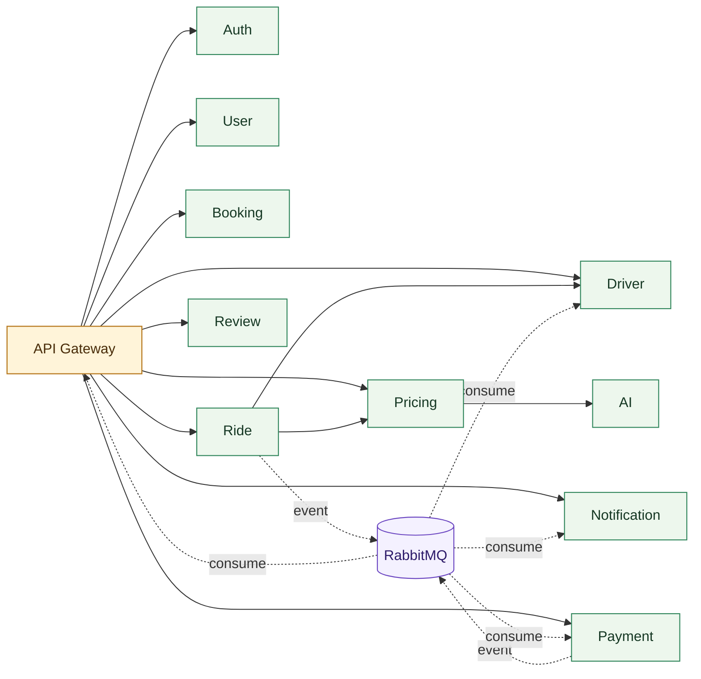

## 11. Các luồng nghiệp vụ chính

### 11.1. Luồng đăng ký và đăng nhập

Đây là luồng nền tảng để người dùng và tài xế có thể truy cập hệ thống.

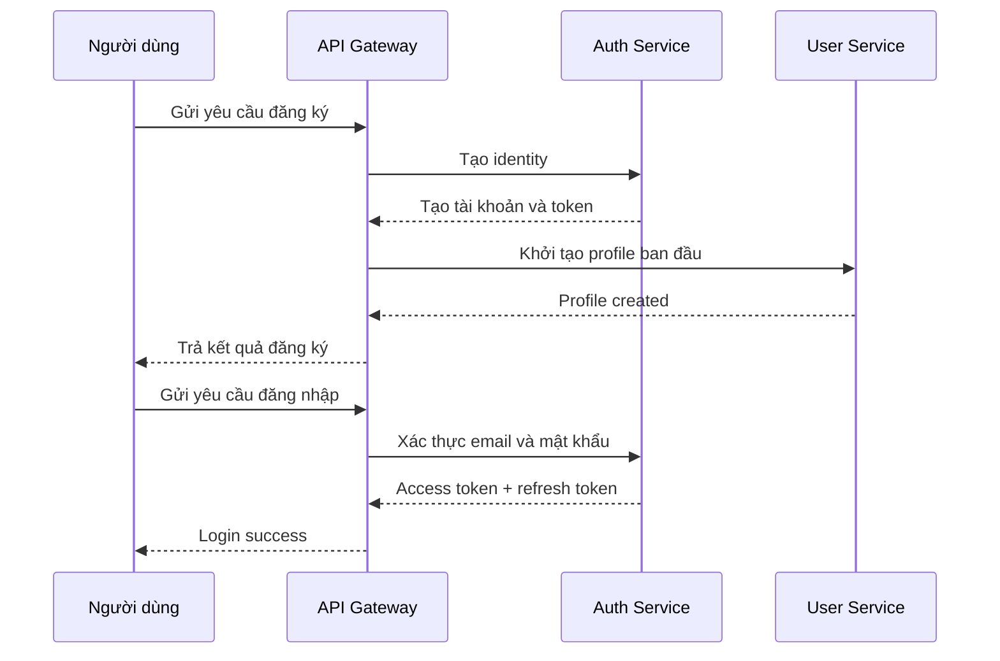

### 11.2. Luồng đặt xe và ghép tài xế

Đây là luồng nghiệp vụ cốt lõi nhất của hệ thống.

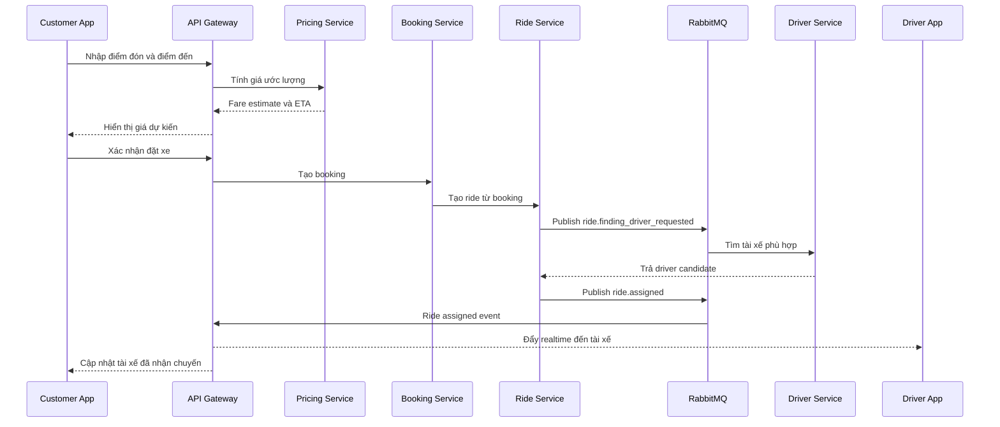

### 11.3. Luồng thực hiện chuyến đi

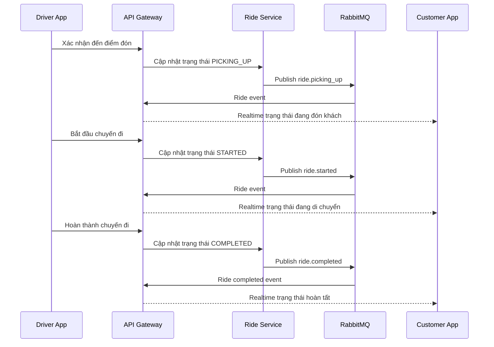

### 11.4. Luồng thanh toán và đánh giá sau chuyến đi

### 11.5. Luồng quản trị vận hành

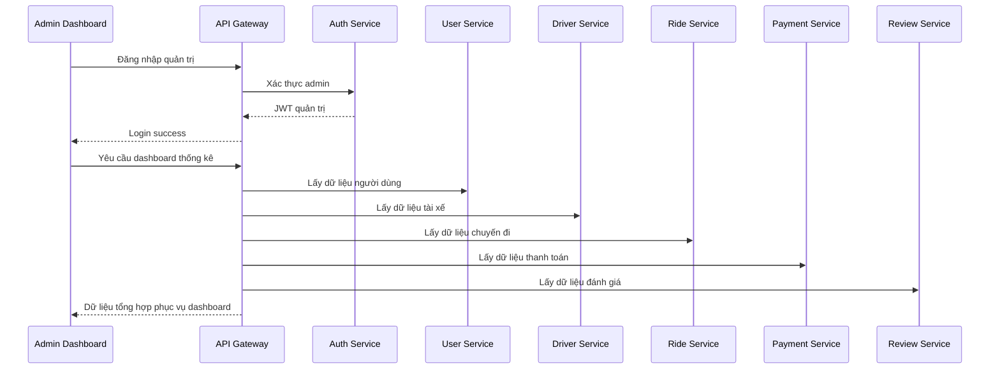

## 12. Vẽ kiến trúc tổng thể theo góc nhìn báo cáo

### 12.1. Sơ đồ tổng hợp theo lớp

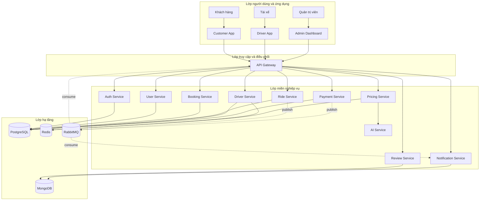

### 12.2. Ý nghĩa của sơ đồ tổng thể

Sơ đồ tổng thể cho thấy hệ thống được tổ chức thành nhiều lớp có ranh giới rõ ràng. Lớp ứng dụng chỉ đảm nhiệm trải nghiệm người dùng. Lớp API Gateway đóng vai trò lớp bảo vệ và điều phối. Lớp nghiệp vụ bao gồm các bounded context được hiện thực bằng microservice. Lớp hạ tầng lưu trữ dữ liệu và hỗ trợ tích hợp bất đồng bộ. Cách phân lớp này phù hợp với DDD vì giúp tách mô hình nghiệp vụ ra khỏi chi tiết hạ tầng nhưng vẫn giữ được khả năng triển khai độc lập.

## 13. Đánh giá theo góc nhìn DDD

Từ kết quả phân tích, có thể rút ra một số nhận định chính như sau:

- Hệ thống có sự phân tách bounded context tương đối rõ ràng, đặc biệt ở các miền Auth, Ride, Driver, Pricing, Payment, Review và Notification.
- Ride Service là trung tâm của nghiệp vụ và là aggregate quan trọng nhất trong toàn bộ hệ thống.
- Driver Service không nên ôm toàn bộ logic ride lifecycle mà nên tập trung vào miền tài xế, vị trí và khả năng nhận chuyến.
- API Gateway đóng vai trò anti-corruption layer đối với frontend, đồng thời là nơi tổng hợp dữ liệu và phát realtime.
- RabbitMQ giúp hệ thống thực hiện eventual consistency giữa các bounded context thay vì bắt buộc đồng bộ chặt ở mọi bước.
- Pricing Service và AI Service nên được xem là quan hệ hỗ trợ, trong đó AI Service chỉ là domain phụ trợ cho suy luận chứ không phải nơi sở hữu nghiệp vụ đặt xe.

## 14. Kết luận

Phân tích hệ thống theo Domain Driven Design cho thấy Cab Booking System là một bài toán phù hợp với mô hình microservices phân theo bounded context. Mỗi service trong hệ thống không chỉ là một đơn vị triển khai, mà còn phản ánh một ranh giới nghiệp vụ tương đối độc lập. Cách tiếp cận này giúp hệ thống dễ mở rộng, dễ kiểm thử, dễ triển khai độc lập và dễ duy trì khi số lượng actor, số lượng chuyến đi và nhu cầu tích hợp tiếp tục tăng lên.

Ở góc nhìn báo cáo, việc tổ chức hệ thống theo DDD giúp phần phân tích thiết kế có cơ sở logic rõ ràng hơn. Thay vì chỉ liệt kê các service, tài liệu đã xác định được miền nghiệp vụ, ranh giới mô hình, trách nhiệm từng service, luồng dữ liệu và cách phối hợp giữa các thành phần. Đây là nền tảng thích hợp để phát triển tiếp sang các phần như thiết kế chi tiết API, thiết kế cơ sở dữ liệu, event storming hoặc thiết kế use case trong các chương tiếp theo của báo cáo.