# Phân Tích Thiết Kế Hệ Thống Theo Domain Driven Design

## 1. Giới thiệu

Tài liệu này mô tả hệ thống Cab Booking System dưới góc nhìn Domain Driven Design (DDD) kết hợp kiến trúc microservices. Mục tiêu là phân tích rõ miền nghiệp vụ, ranh giới ngữ cảnh, các thực thể cốt lõi, cách các microservice giao tiếp với nhau, cũng như mô tả các actor và các luồng nghiệp vụ chính của hệ thống.

Trong đó hệ thống được triển khai bằng nhiều microservice Node.js/TypeScript, một AI service riêng, API Gateway, cùng các thành phần hạ tầng như PostgreSQL, MongoDB, Redis và RabbitMQ.

## 2. Mục tiêu kiến trúc theo DDD

Việc áp dụng DDD trong hệ thống đặt xe nhằm giải quyết các bài toán sau:

- Tách rõ từng miền nghiệp vụ như xác thực, đặt xe, điều phối chuyến, tài xế, thanh toán, đánh giá, thông báo.
- Giảm coupling giữa các thành phần khi hệ thống tăng trưởng về số lượng người dùng, chuyến đi và tích hợp ngoài.
- Cho phép triển khai độc lập từng bounded context dưới dạng microservice.
- Tăng khả năng bảo trì, kiểm thử, mở rộng và thay thế từng phần mà không làm ảnh hưởng toàn hệ thống.
- Tổ chức lại mô hình hệ thống quanh business capability thay vì quanh tầng kỹ thuật.

## 3. Bài toán nghiệp vụ tổng quát

Hệ thống phục vụ ba nhóm người dùng chính:

- Khách hàng: đăng ký, đăng nhập, đặt xe, theo dõi tài xế, thanh toán, đánh giá sau chuyến.
- Tài xế: đăng nhập, cập nhật trạng thái sẵn sàng, nhận chuyến, thực hiện chuyến đi, theo dõi lịch sử hoạt động.
- Quản trị viên: theo dõi vận hành, thống kê hệ thống, quản lý người dùng, tài xế, doanh thu và chất lượng dịch vụ.

Ngoài ra còn có các hệ thống phụ trợ như AI service phục vụ ước lượng giá và ETA, cùng các thành phần hạ tầng hỗ trợ realtime, cache, event bus và monitoring.

## 4. Xác định Domain và Subdomain

### 4.1 Core Domain

Core Domain là phần tạo ra giá trị khác biệt lớn nhất cho hệ thống đặt xe.

- Ride Orchestration Domain
  - Quản lý vòng đời chuyến đi.
  - Điều phối trạng thái từ lúc tạo chuyến đến hoàn tất.
  - Phối hợp với Driver, Pricing, Booking, Payment và Notification.
- Driver Dispatch Domain
  - Xác định tài xế phù hợp theo vị trí, trạng thái online và mức độ khả dụng.
  - Hỗ trợ logic nhận chuyến, từ chối chuyến và tái phân phối khi cần.
- Pricing Domain
  - Tính giá ước lượng, giá cuối, surge pricing, ETA.
  - Có thể tích hợp AI service như một miền hỗ trợ tính toán.

### 4.2 Supporting Subdomains

- Booking Domain
  - Tiếp nhận yêu cầu đặt xe từ khách hàng.
  - Tạo booking như bước trung gian trước khi sinh ride thực tế.
- Payment Domain
  - Xử lý thanh toán, trạng thái giao dịch, hoàn tiền và lịch sử thanh toán.
- Review Domain
  - Thu thập đánh giá, nhận xét và thống kê chất lượng dịch vụ.
- Notification Domain
  - Gửi thông báo realtime hoặc bất đồng bộ đến người dùng và tài xế.
- User Profile Domain
  - Quản lý hồ sơ mở rộng của khách hàng và tài xế ngoài phần identity.

### 4.3 Generic Subdomains

- Identity and Access Domain
  - Xử lý xác thực, JWT, refresh token, role, quyền truy cập.
- API Composition Domain
  - API Gateway làm entry point, thực hiện routing, realtime fan-out, auth middleware và aggregation.
- Observability Domain
  - Monitoring, logging, metrics, tracing và health check.

### 4.4 Sơ đồ Domain và Subdomain

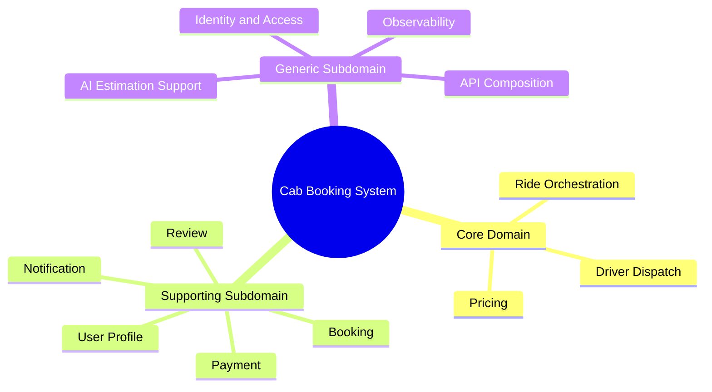

## 5. Xác định Bounded Context

Trong DDD, bounded context là ranh giới mà trong đó một mô hình miền có ý nghĩa thống nhất. Với hệ thống này, mỗi bounded context gần như tương ứng với một microservice chính.

### 5.1 Identity Context

- Phạm vi: đăng ký, đăng nhập, JWT, refresh token, role, thông tin định danh lõi.
- Microservice tương ứng: Auth Service.
- Ngôn ngữ phổ quát: user, credential, access token, refresh token, role, permission.

### 5.2 User Profile Context

- Phạm vi: hồ sơ người dùng, dữ liệu mở rộng ngoài phần xác thực.
- Microservice tương ứng: User Service.
- Ngôn ngữ phổ quát: customer profile, driver profile reference, contact info, avatar, metadata.

### 5.3 Booking Context

- Phạm vi: tiếp nhận yêu cầu đặt xe từ khách hàng trước khi phát sinh ride chính thức.
- Microservice tương ứng: Booking Service.
- Ngôn ngữ phổ quát: booking request, pickup, dropoff, fare estimate snapshot, booking confirmation.

### 5.4 Ride Context

- Phạm vi: ride lifecycle, trạng thái chuyến, trạng thái điều phối, lịch sử ride.
- Microservice tương ứng: Ride Service.
- Ngôn ngữ phổ quát: ride, assigned, picking_up, started, completed, cancelled, matching workflow.

### 5.5 Driver Context

- Phạm vi: trạng thái tài xế, vị trí hiện tại, availability, hồ sơ vận hành của tài xế.
- Microservice tương ứng: Driver Service.
- Ngôn ngữ phổ quát: online, offline, current location, nearby driver, accept ride, reject ride.

### 5.6 Pricing Context

- Phạm vi: tính cước, ETA, quãng đường, surge multiplier.
- Microservice tương ứng: Pricing Service.
- Ngôn ngữ phổ quát: estimated fare, final fare, distance, duration, pricing policy, surge.

### 5.7 Payment Context

- Phạm vi: thanh toán, payment intent, payment status, refund.
- Microservice tương ứng: Payment Service.
- Ngôn ngữ phổ quát: payment, transaction, paid, failed, refunded.

### 5.8 Review Context

- Phạm vi: đánh giá chuyến đi, rating, comment, review history.
- Microservice tương ứng: Review Service.
- Ngôn ngữ phổ quát: rating, review, driver feedback, ride review.

### 5.9 Notification Context

- Phạm vi: gửi thông báo email, SMS, in-app hoặc realtime.
- Microservice tương ứng: Notification Service.
- Ngôn ngữ phổ quát: notification, recipient, template, delivery status.

### 5.10 API Gateway Context

- Phạm vi: composition layer, entry point cho client, routing và realtime hub.
- Microservice tương ứng: API Gateway.
- Ngôn ngữ phổ quát: route, proxy, session, client channel, socket event, admin aggregation.

### 5.11 AI Estimation Context

- Phạm vi: suy luận ETA hoặc mô hình hỗ trợ pricing.
- Microservice tương ứng: AI Service.
- Ngôn ngữ phổ quát: inference request, model prediction, ETA estimate, price multiplier.

### 5.12 Context Map tổng thể

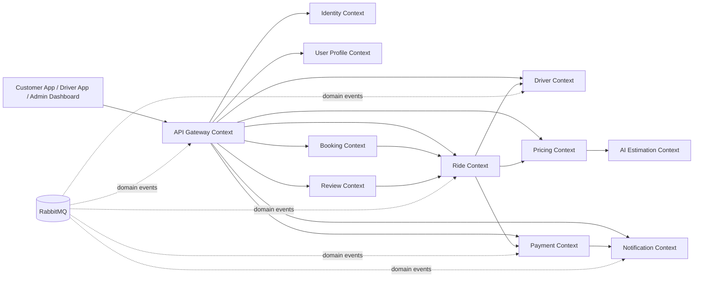

## 6. Xác định Entities, Value Objects và Aggregates

Phần này mô tả mô hình miền ở mức khái niệm. Một số aggregate phản ánh hiện trạng repo, một số là cách tổ chức hợp lý theo DDD để làm tài liệu phân tích thiết kế.

### 6.1 Identity Context

#### Entities

- UserIdentity
- RefreshTokenSession
- RoleAssignment

#### Value Objects

- Email
- PasswordHash
- JwtTokenPair
- UserRole
- AuthClaims

#### Aggregate

- UserIdentity Aggregate
  - Root: UserIdentity
  - Bao gồm: danh tính, trạng thái tài khoản, vai trò, refresh token session.

### 6.2 User Profile Context

#### Entities

- UserProfile
- CustomerProfile
- DriverProfileReference

#### Value Objects

- FullName
- PhoneNumber
- AvatarUrl
- AddressSummary

#### Aggregate

- UserProfile Aggregate
  - Root: UserProfile
  - Bao gồm thông tin hiển thị và metadata hồ sơ.

### 6.3 Booking Context

#### Entities

- Booking
- BookingSnapshot

#### Value Objects

- PickupLocation
- DropoffLocation
- RouteRequest
- FareEstimateSnapshot
- BookingStatus
- VehicleType

#### Aggregate

- Booking Aggregate
  - Root: Booking
  - Invariant chính:
    - Booking phải có pickup và dropoff hợp lệ.
    - Booking chỉ được xác nhận một lần.
    - Booking khi được xác nhận sẽ sinh một ride downstream.

### 6.4 Ride Context

#### Entities

- Ride
- RideTimelineEntry
- RideAssignment

#### Value Objects

- RideId
- RideStatus
- CustomerId
- DriverId
- RouteSummary
- FareBreakdown
- RideTimeWindow
- CancellationReason

#### Aggregate

- Ride Aggregate
  - Root: Ride
  - Invariant chính:
    - Một ride chỉ có một trạng thái hiện tại tại một thời điểm.
    - State transition phải đi theo thứ tự hợp lệ: requested -> assigned -> picking_up -> started -> completed hoặc cancelled.
    - Ride là nguồn sự thật cho trạng thái chuyến đi.

### 6.5 Driver Context

#### Entities

- Driver
- DriverAvailability
- DriverLocationLog

#### Value Objects

- DriverStatus
- GeoCoordinate
- VehicleInfo
- LicenseInfo
- OnlineState

#### Aggregate

- Driver Aggregate
  - Root: Driver
  - Invariant chính:
    - Driver chỉ nhận chuyến khi đang online và available.
    - Driver location mới nhất là trạng thái hợp lệ để tìm tài xế gần nhất.

### 6.6 Pricing Context

#### Entities

- PricingRule
- FarePolicy

#### Value Objects

- DistanceKm
- DurationMinutes
- SurgeMultiplier
- Money
- PricingInput
- PricingResult

#### Aggregate

- FarePolicy Aggregate
  - Root: FarePolicy
  - Invariant chính:
    - Giá được tính từ cùng một bộ quy tắc nhất quán.
    - Surge multiplier không âm và phải nằm trong ngưỡng chính sách cho phép.

### 6.7 Payment Context

#### Entities

- Payment
- Refund
- PaymentAttempt

#### Value Objects

- PaymentStatus
- TransactionId
- PaymentMethod
- Amount
- Currency

#### Aggregate

- Payment Aggregate
  - Root: Payment
  - Invariant chính:
    - Một payment phải gắn với một ride.
    - Payment completed không được completed lần hai.
    - Refund không vượt quá số tiền đã thanh toán.

### 6.8 Review Context

#### Entities

- Review

#### Value Objects

- Rating
- ReviewComment
- ReviewTarget

#### Aggregate

- Review Aggregate
  - Root: Review
  - Invariant chính:
    - Mỗi review phải gắn với một ride hoàn tất.
    - Rating nằm trong khoảng chính sách hệ thống quy định.

### 6.9 Notification Context

#### Entities

- Notification
- DeliveryAttempt

#### Value Objects

- NotificationType
- Recipient
- TemplateCode
- DeliveryStatus
- NotificationPayload

#### Aggregate

- Notification Aggregate
  - Root: Notification
  - Invariant chính:
    - Một notification phải có recipient và payload hợp lệ.
    - Trạng thái gửi phải phản ánh được quá trình retry hoặc fail.

## 7. Xác định Microservices

### 7.1 Bảng ánh xạ Bounded Context sang Microservice

| Bounded Context | Microservice | Trách nhiệm chính | Database chính |
| --- | --- | --- | --- |
| Identity Context | Auth Service | Đăng ký, đăng nhập, JWT, refresh token, role | PostgreSQL |
| User Profile Context | User Service | Hồ sơ người dùng mở rộng | PostgreSQL |
| Booking Context | Booking Service | Tạo booking trước khi sinh ride | PostgreSQL |
| Ride Context | Ride Service | Ride lifecycle và matching workflow | PostgreSQL |
| Driver Context | Driver Service | Hồ sơ tài xế, trạng thái, vị trí, khả dụng | PostgreSQL + Redis |
| Pricing Context | Pricing Service | Tính giá và ETA | Redis |
| Payment Context | Payment Service | Thanh toán và refund | PostgreSQL |
| Review Context | Review Service | Đánh giá và thống kê rating | MongoDB |
| Notification Context | Notification Service | Gửi thông báo và lưu lịch sử | MongoDB + Redis |
| API Gateway Context | API Gateway | Entry point, aggregation, realtime hub | Stateless |
| AI Estimation Context | AI Service | Suy luận ETA/price multiplier | Model runtime |

### 7.2 Nguyên tắc tách service

- Mỗi service sở hữu dữ liệu riêng, không ghi chéo sang database của service khác.
- Core logic của ride lifecycle nằm trong Ride Service.
- Driver Service chỉ chịu trách nhiệm thông tin tài xế, vị trí và khả dụng, không trở thành nơi điều phối toàn bộ lifecycle.
- API Gateway là nơi duy nhất làm realtime hub cho frontend.
- Pricing Service có thể gọi AI Service nhưng AI không sở hữu trạng thái ride hay payment.

## 8. Các actor tham gia vào hệ thống

### 8.1 Danh sách actor

- Khách hàng
- Tài xế
- Quản trị viên
- Hệ thống thanh toán ngoài hoặc mock payment provider
- Hệ thống định vị và bản đồ
- AI service
- Event bus RabbitMQ
- Monitoring/Operations

### 8.2 Actor và microservice tương tác

| Actor | Microservice tương tác trực tiếp hoặc gián tiếp |
| --- | --- |
| Khách hàng | API Gateway, Auth Service, User Service, Booking Service, Ride Service, Pricing Service, Payment Service, Review Service, Notification Service |
| Tài xế | API Gateway, Auth Service, Driver Service, Ride Service, Notification Service |
| Quản trị viên | API Gateway, Auth Service, User Service, Driver Service, Ride Service, Payment Service, Review Service |
| Payment Provider | Payment Service |
| Dịch vụ bản đồ | Pricing Service, Customer App |
| AI Service | Pricing Service |
| RabbitMQ | Ride Service, Driver Service, Payment Service, Notification Service, API Gateway |
| Monitoring/Operations | Tất cả service qua metrics, logs, health endpoints |

### 8.3 Sơ đồ actor tương tác đa miền

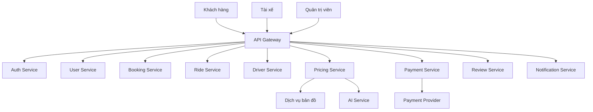

## 9. Giao tiếp đồng bộ giữa các service

Giao tiếp đồng bộ trong hệ thống hiện tại diễn ra chủ yếu theo hai hình thức:

- REST/HTTP cho request-response dễ tích hợp.
- gRPC cho service-to-service nội bộ cần contract rõ ràng và hiệu năng tốt hơn.

### 9.1 Đồng bộ từ frontend vào backend

- Frontend gọi API Gateway bằng HTTP/REST.
- API Gateway xác thực và proxy request đến service phù hợp.

### 9.2 Đồng bộ giữa các backend service

- Gateway gọi Auth/User/Booking/Ride/Driver/Pricing/Payment/Review bằng REST hoặc gRPC.
- Ride Service gọi Pricing Service và Driver Service để lấy dữ liệu đồng bộ khi cần.
- Booking Service gọi Ride Service hoặc phối hợp với Ride Service để tạo ride downstream.
- Pricing Service gọi AI Service bằng HTTP.

### 9.3 Bảng giao tiếp sync chính

| Bên gọi | Bên được gọi | Kiểu giao tiếp | Mục đích |
| --- | --- | --- | --- |
| Customer App | API Gateway | REST/WebSocket | Đặt xe, theo dõi ride, thanh toán, đánh giá |
| Driver App | API Gateway | REST/WebSocket | Cập nhật trạng thái, nhận chuyến, theo dõi dashboard |
| Admin Dashboard | API Gateway | REST | Thống kê, quản trị vận hành |
| API Gateway | Auth Service | REST/gRPC | Đăng nhập, xác thực, role |
| API Gateway | User Service | REST/gRPC | Lấy hồ sơ người dùng |
| API Gateway | Booking Service | REST/gRPC | Tạo booking |
| API Gateway | Ride Service | REST/gRPC | Tạo ride, cập nhật trạng thái ride |
| API Gateway | Driver Service | REST/gRPC | Truy vấn tài xế, cập nhật vị trí, trạng thái |
| API Gateway | Pricing Service | REST/gRPC | Tính giá ước lượng |
| API Gateway | Payment Service | REST/gRPC | Xử lý thanh toán |
| API Gateway | Review Service | REST/gRPC | Tạo và đọc review |
| Ride Service | Pricing Service | REST/gRPC | Lấy giá và ETA hoặc fare context |
| Ride Service | Driver Service | REST/gRPC | Tìm tài xế phù hợp và cập nhật assign |
| Pricing Service | AI Service | REST | Ước lượng ETA hoặc multiplier |

### 9.4 Sơ đồ giao tiếp sync

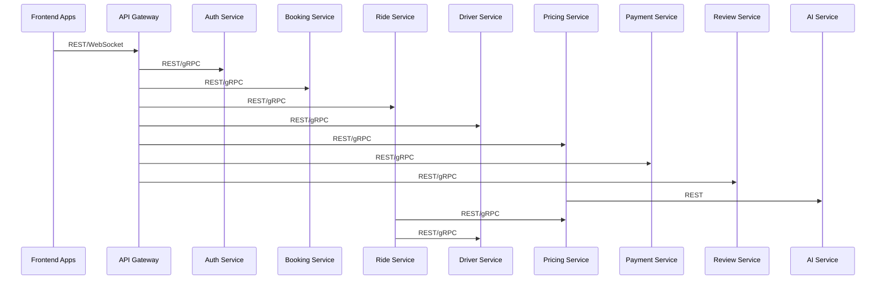

## 10. Giao tiếp bất đồng bộ bằng sự kiện

Giao tiếp bất đồng bộ được dùng cho các luồng cần tách rời tiến trình xử lý, tăng khả năng scale, giảm coupling thời gian thực và hỗ trợ event-driven architecture.

### 10.1 Event bus

- RabbitMQ đóng vai trò event bus chính.
- Các service publish và consume sự kiện theo domain event.

### 10.2 Nhóm sự kiện chính

- Ride events
  - ride.created
  - ride.finding_driver_requested
  - ride.assigned
  - ride.picking_up
  - ride.started
  - ride.completed
  - ride.cancelled
- Payment events
  - payment.completed
  - payment.failed
  - payment.refunded
- Auth/User events
  - user.logged_in
  - user.registered
- Notification trigger events
  - notification.requested
  - ride status fan-out events

### 10.3 Service nào publish và service nào consume

| Event | Publisher | Consumer chính |
| --- | --- | --- |
| ride.finding_driver_requested | Ride Service | Driver Service, API Gateway |
| ride.assigned | Ride Service | API Gateway, Notification Service |
| ride.picking_up | Ride Service | API Gateway, Notification Service |
| ride.started | Ride Service | API Gateway, Notification Service |
| ride.completed | Ride Service | Payment Service, API Gateway, Notification Service |
| payment.completed | Payment Service | Notification Service, API Gateway |
| user.logged_in | Auth Service | Audit/Monitoring hoặc downstream consumer nếu cần |

### 10.4 Sơ đồ giao tiếp async

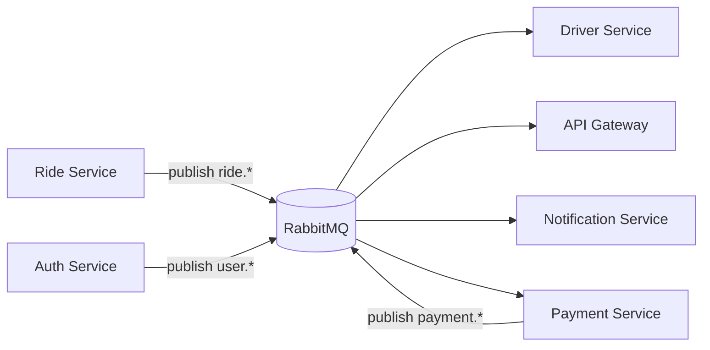

## 11. Các giao tiếp giữa các service

### 11.1 Giao tiếp trực tiếp

- API Gateway -> Auth Service
- API Gateway -> User Service
- API Gateway -> Booking Service
- API Gateway -> Ride Service
- API Gateway -> Driver Service
- API Gateway -> Pricing Service
- API Gateway -> Payment Service
- API Gateway -> Review Service
- API Gateway -> Notification Service
- Ride Service -> Driver Service
- Ride Service -> Pricing Service
- Pricing Service -> AI Service

### 11.2 Giao tiếp qua event

- Ride Service -> RabbitMQ -> API Gateway
- Ride Service -> RabbitMQ -> Driver Service
- Ride Service -> RabbitMQ -> Notification Service
- Ride Service -> RabbitMQ -> Payment Service
- Payment Service -> RabbitMQ -> Notification Service
- Payment Service -> RabbitMQ -> API Gateway

### 11.3 Sơ đồ phụ thuộc service-level

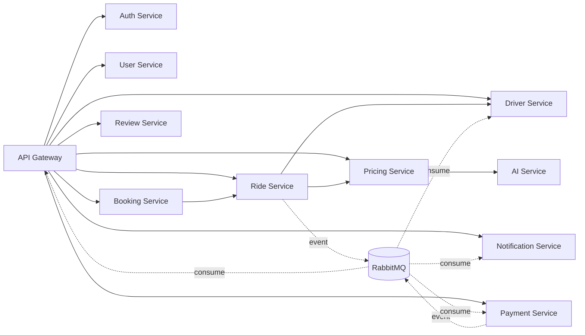

## 12. Kiến trúc tổng thể hệ thống

### 12.1 Kiến trúc tổng thể nhiều lớp

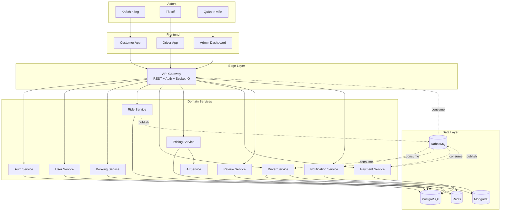

### 12.2 Giải thích kiến trúc tổng thể

- Frontend không gọi trực tiếp tất cả service mà đi qua API Gateway.
- API Gateway là một anti-corruption layer đối với client, đồng thời là realtime hub duy nhất.
- Các bounded context được tách riêng dưới dạng microservice có database ownership riêng.
- Dữ liệu transactional dùng PostgreSQL, dữ liệu document dùng MongoDB, cache và geo lookup dùng Redis.
- RabbitMQ được sử dụng để phát tán domain event, hỗ trợ eventual consistency giữa các context.

## 13. Các luồng nghiệp vụ chính

### 13.1 Luồng đăng ký và đăng nhập

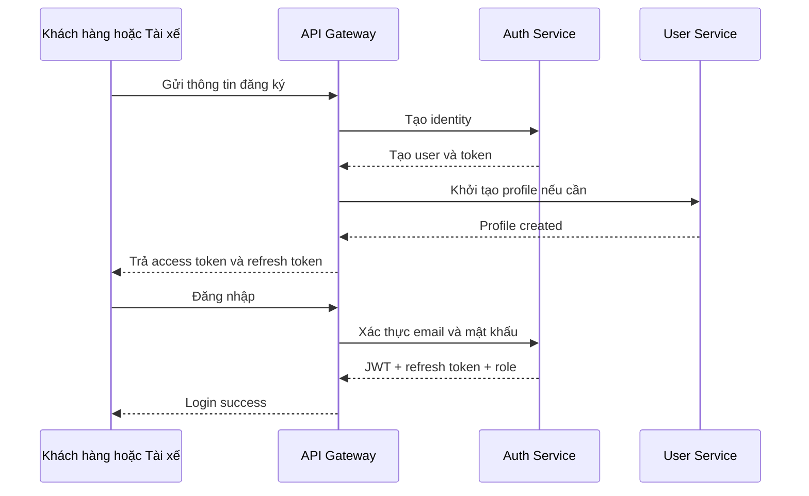

### 13.2 Luồng đặt xe và ghép tài xế

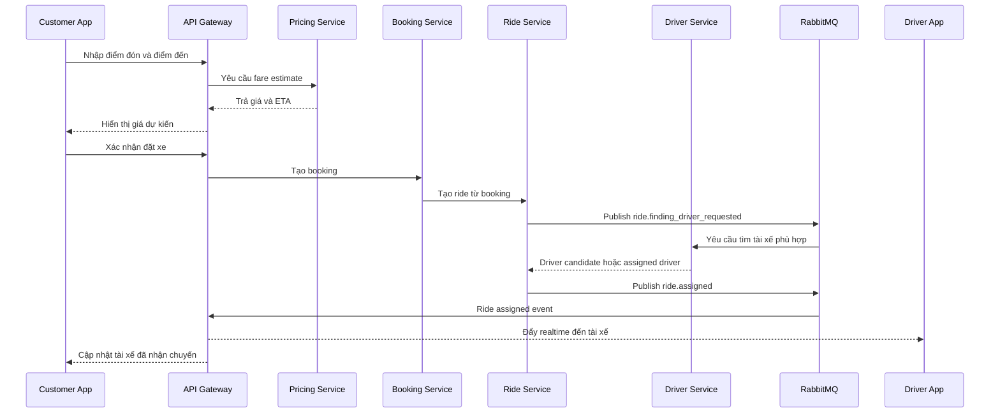

### 13.3 Luồng thực hiện chuyến đi

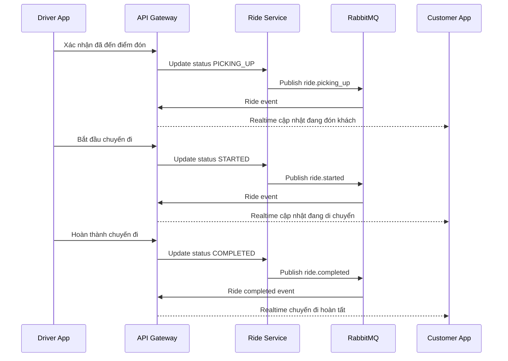

### 13.4 Luồng thanh toán và đánh giá sau chuyến

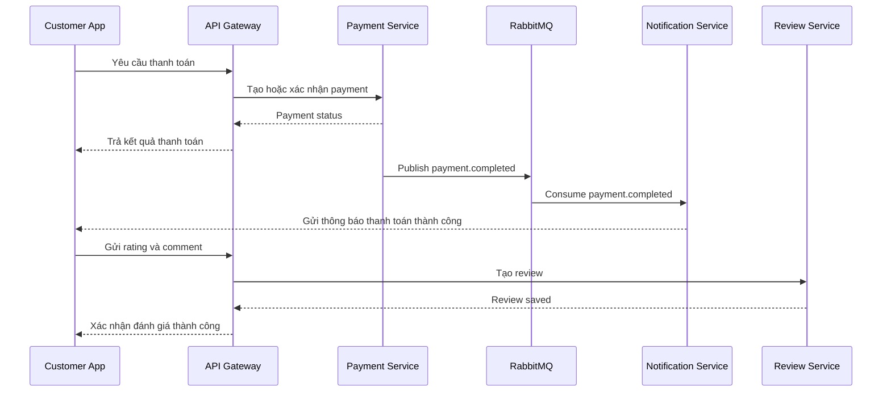

### 13.5 Luồng quản trị vận hành

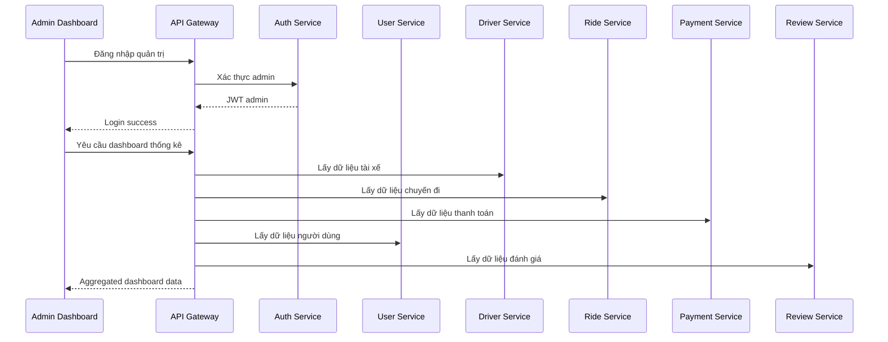

## 14. Tổng kết

Phân tích theo DDD cho thấy hệ thống Cab Booking System có thể được tổ chức một cách hợp lý quanh các bounded context tương ứng với năng lực nghiệp vụ cốt lõi của bài toán đặt xe. Trong đó:

- Ride, Driver Dispatch và Pricing là các miền có giá trị cốt lõi nhất.
- Auth, Payment, Notification, Review và User là các miền hỗ trợ nhưng vẫn có ranh giới rõ ràng.
- API Gateway đóng vai trò lớp điều phối phía client và realtime hub, không nên trở thành nơi chứa business logic cốt lõi.
- RabbitMQ là nền tảng để triển khai eventual consistency và giảm coupling thời gian thực giữa các microservice.
- Việc tách service theo bounded context giúp hệ thống dễ mở rộng, dễ kiểm thử, dễ bảo trì và phù hợp với định hướng kiến trúc microservices.

Tài liệu này có thể dùng làm nền cho các phần tiếp theo như thiết kế chi tiết từng context, event storming, chiến lược tích hợp, hoặc mô hình hóa use case trong báo cáo tốt nghiệp.