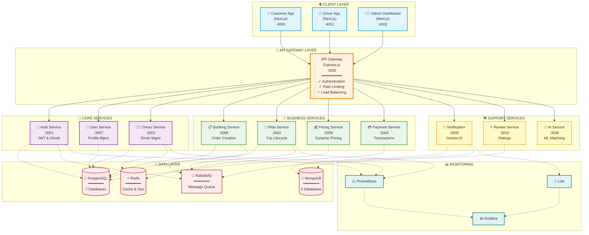
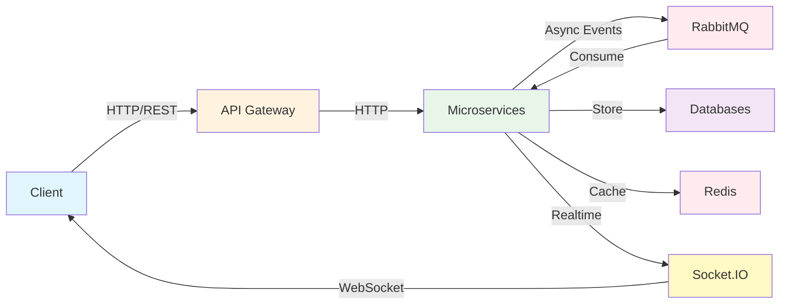
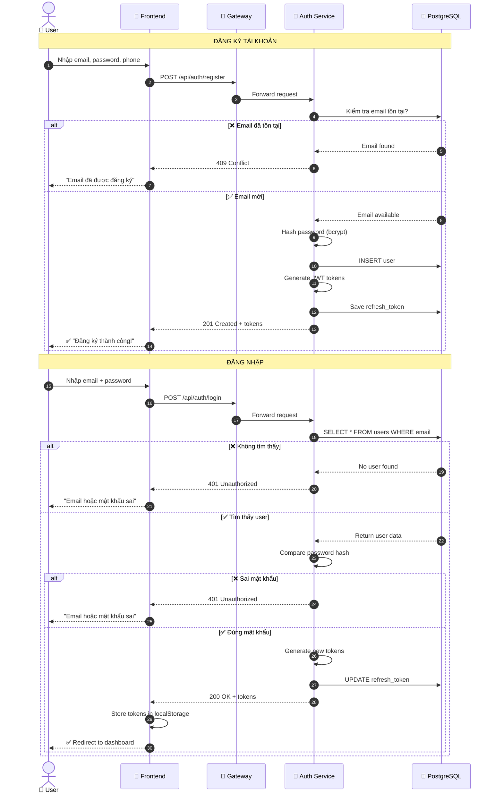
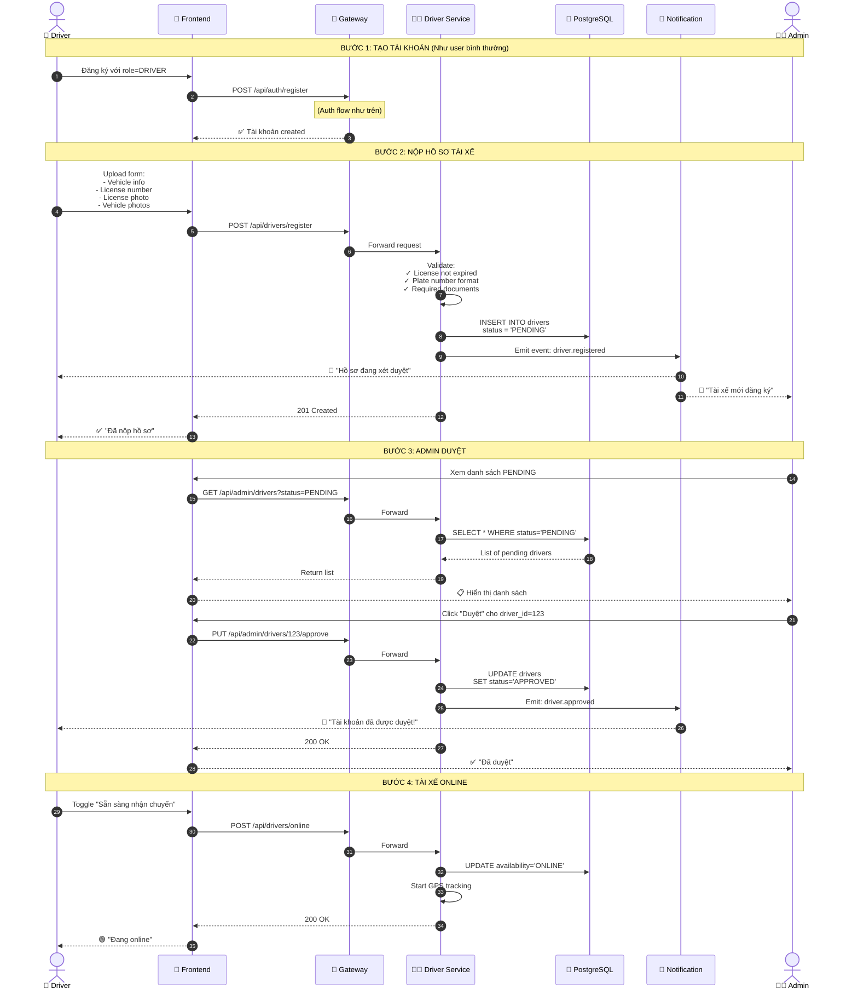
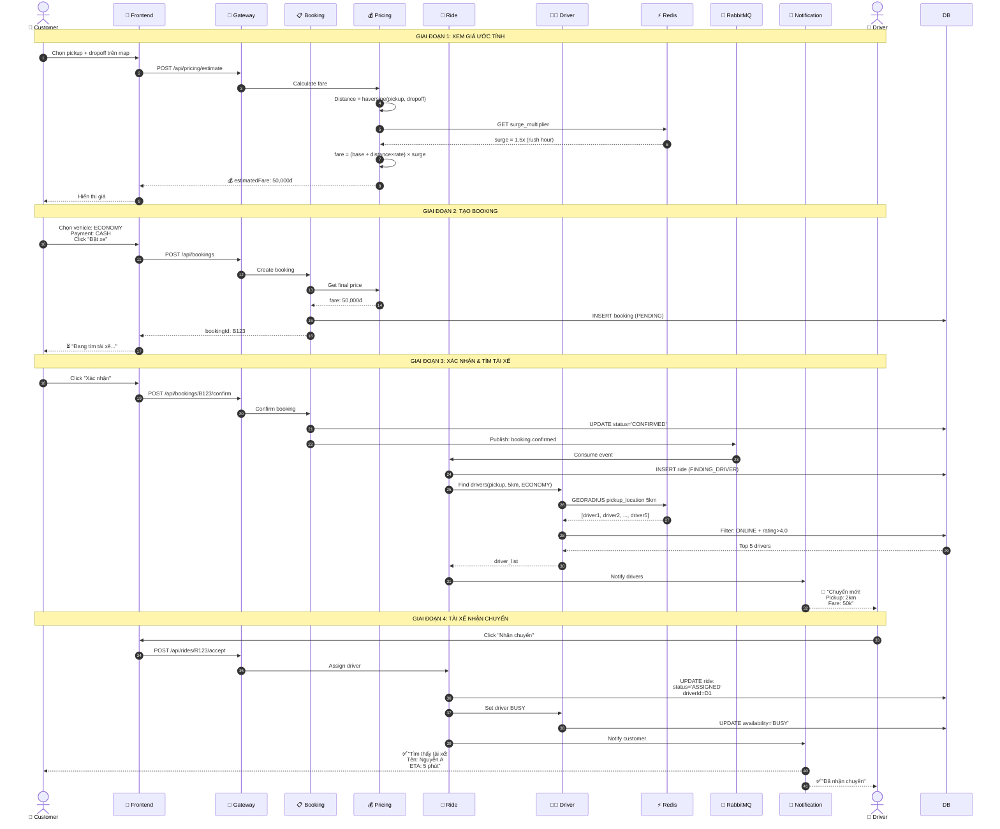
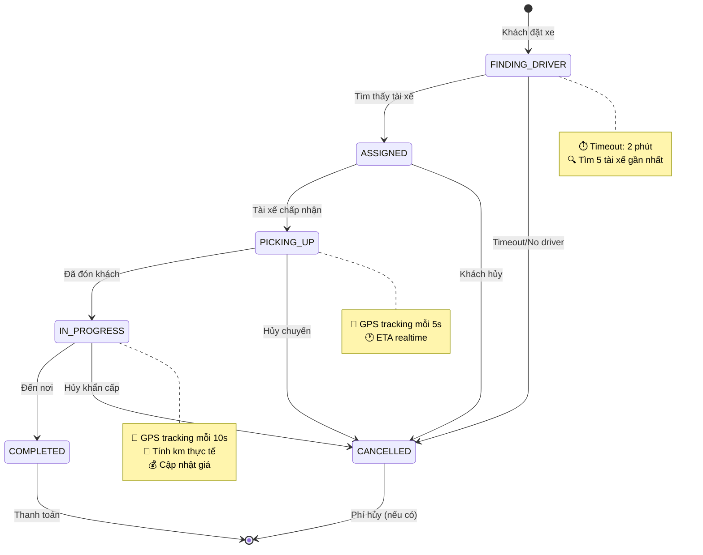
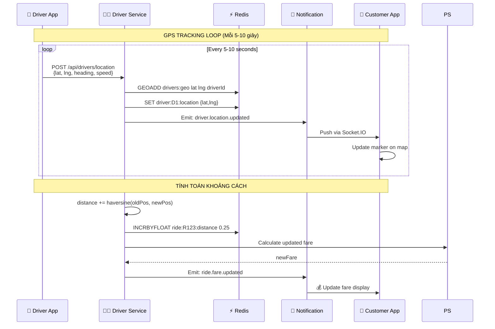
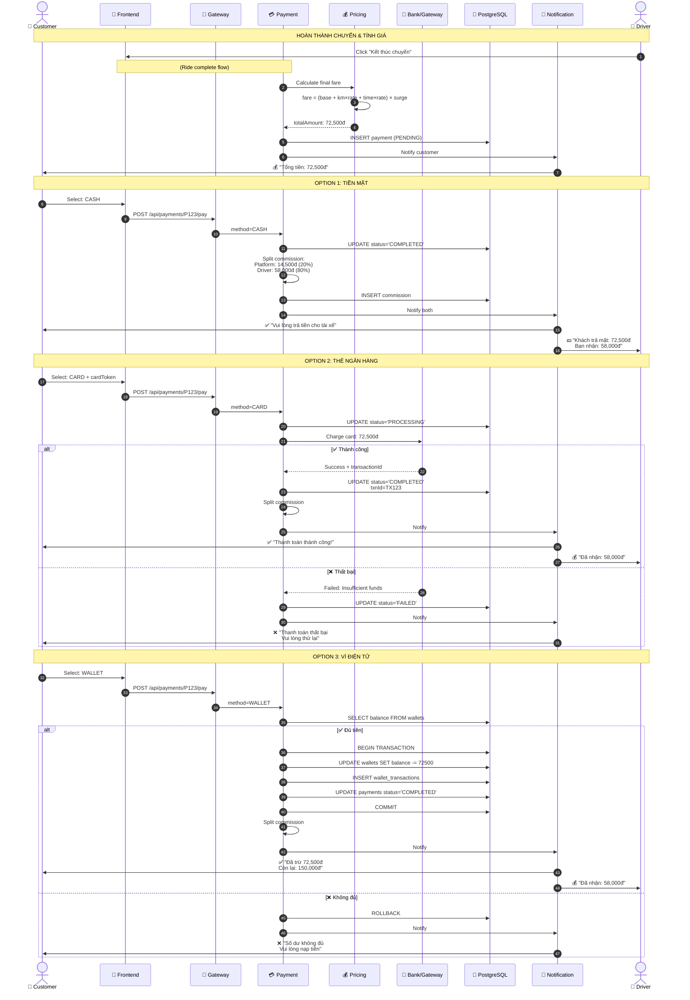
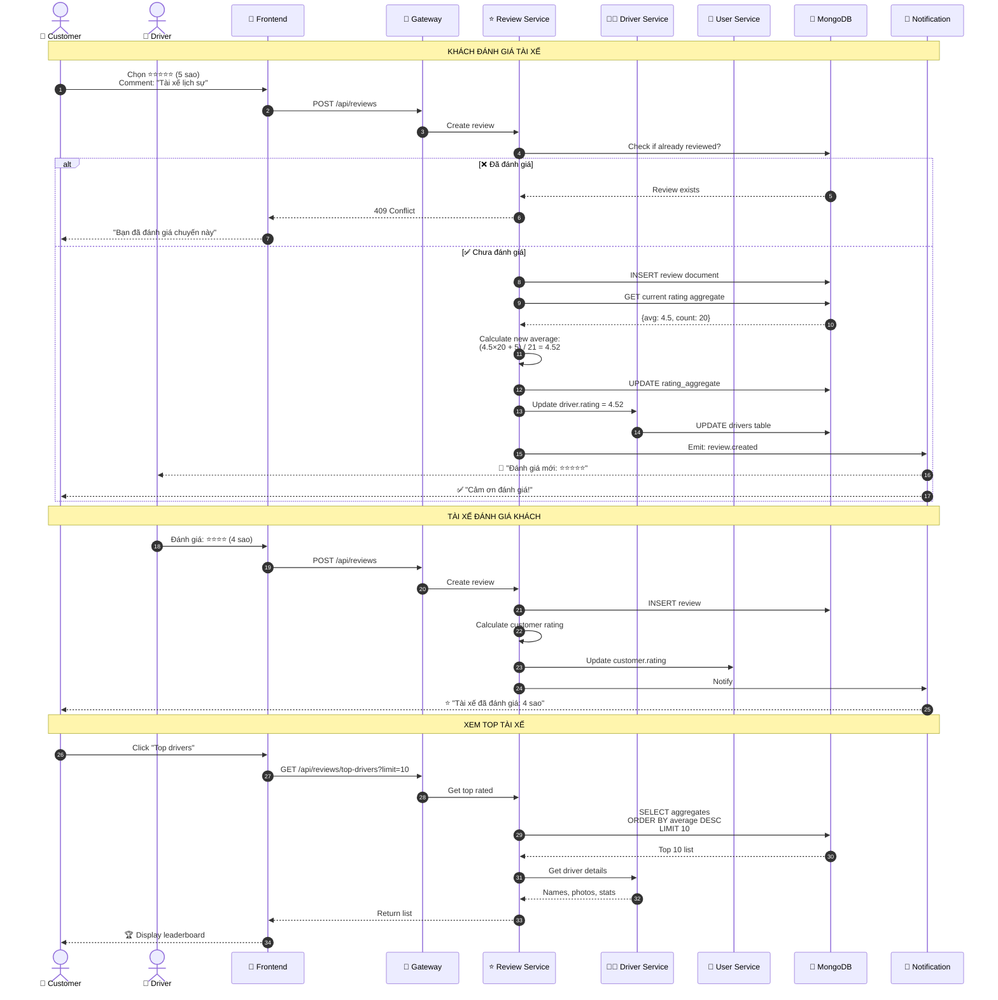

<div align="center">

# 🚖 CAB BOOKING SYSTEM
### Hệ Thống Đặt Xe Taxi Trực Tuyến

[](https://nodejs.org/)
[](https://www.typescriptlang.org/)
[](https://nextjs.org/)
[](https://www.docker.com/)
[](https://www.postgresql.org/)
[](https://www.mongodb.com/)
[](https://redis.io/)
[](https://www.rabbitmq.com/)

**Ứng dụng đặt xe theo mô hình Microservices với khả năng mở rộng cao**

[Tính năng](#-tính-năng-chính) • [Kiến trúc](#️-kiến-trúc-hệ-thống) • [Cài đặt](#-cài-đặt-nhanh) • [API Docs](#-api-endpoints) • [Sơ đồ luồng](#-các-luồng-hoạt-động-chính)

</div>

---

## 📋 Mục lục

- [🎯 Tổng quan hệ thống](#-tổng-quan-hệ-thống)
- [✨ Tính năng chính](#-tính-năng-chính)
- [🏗️ Kiến trúc hệ thống](#️-kiến-trúc-hệ-thống)
- [🛠️ Công nghệ sử dụng](#️-công-nghệ-sử-dụng)
- [🔄 Các luồng hoạt động chính](#-các-luồng-hoạt-động-chính)
- [🚀 Cài đặt nhanh](#-cài-đặt-nhanh)
- [📡 API Endpoints](#-api-endpoints)
- [💾 Database Schema](#-database-schema)
- [🧪 Testing](#-testing)
- [📊 Monitoring](#-monitoring)
- [📞 Liên hệ](#-liên-hệ)

---

## 🎯 Tổng quan hệ thống

**Cab Booking System** là nền tảng đặt xe trực tuyến được xây dựng trên kiến trúc **Microservices**, kết nối khách hàng với tài xế taxi theo thời gian thực. Hệ thống được thiết kế để xử lý hàng ngàn yêu cầu đồng thời với độ trễ thấp.

### 🎯 Mục tiêu dự án

| Mục tiêu | Mô tả |
|----------|-------|
| **📱 Trải nghiệm người dùng** | Giao diện trực quan, đặt xe nhanh chóng trong < 30 giây |
| **⚡ Hiệu suất cao** | Xử lý 1000+ requests/giây với độ trễ < 200ms |
| **🔒 Bảo mật** | JWT authentication, mã hóa dữ liệu nhạy cảm |
| **🚀 Khả năng mở rộng** | Scale độc lập từng service theo nhu cầu |
| **📊 Giám sát** | Real-time monitoring với Prometheus & Grafana |

### 💡 Điểm nổi bật

```
✨ Realtime Tracking       → Theo dõi vị trí tài xế với độ chính xác cao
🗺️ Google Maps Integration → Định vị, tính toán tuyến đường tối ưu
💰 Dynamic Pricing         → Giá linh hoạt theo cung cầu (surge pricing)
🔔 Push Notifications      → Thông báo tức thời qua Socket.IO
💳 Multi-Payment           → Tiền mặt, Thẻ ngân hàng, Ví điện tử
⭐ Rating System           → Đánh giá 2 chiều (khách ↔ tài xế)
🤖 AI Matching             → Thuật toán tìm tài xế tối ưu
📊 Analytics Dashboard     → Thống kê chi tiết cho admin
```

---

## ✨ Tính năng chính

<table>
<tr>
<td width="33%" valign="top">

### 👥 Khách hàng

- ✅ Đăng ký/Đăng nhập
- 🗺️ Chọn điểm đón/đến trên bản đồ
- 🚗 3 loại xe (Economy/Comfort/Premium)
- 💰 Xem giá ước tính trước
- 📍 Tracking tài xế realtime
- 💳 Đa phương thức thanh toán
- ⭐ Đánh giá tài xế
- 📜 Lịch sử chuyến đi
- 🎫 Mã giảm giá

</td>
<td width="33%" valign="top">

### 🚖 Tài xế

- 📝 Đăng ký với GPLX
- ✅ Xét duyệt hồ sơ
- 🟢 Bật/tắt trạng thái online
- 🔔 Nhận thông báo chuyến mới
- 📍 GPS tracking tự động
- 🗺️ Dẫn đường đến khách
- 💵 Theo dõi thu nhập
- ⭐ Xem rating cá nhân
- 📊 Báo cáo hàng ngày

</td>
<td width="33%" valign="top">

### 👨‍💼 Admin

- 👥 Quản lý user/driver
- ✅ Duyệt tài xế mới
- 📊 Dashboard thống kê
- 🗺️ Giám sát realtime
- 💰 Cấu hình bảng giá
- 🔥 Thiết lập surge pricing
- 📈 Báo cáo doanh thu
- 🚫 Khóa/mở khóa tài khoản
- 🛠️ Quản lý hệ thống

</td>
</tr>
</table>

---

## 🏗️ Kiến trúc hệ thống

### 📐 Sơ đồ kiến trúc tổng quan



### 🔧 Chi tiết các Microservices

<table>
<tr>
<th width="20%">Service</th>
<th width="15%">Port</th>
<th width="35%">Chức năng</th>
<th width="15%">Database</th>
<th width="15%">Tech Stack</th>
</tr>

<tr>
<td><b>🚪 API Gateway</b></td>
<td><code>3000</code></td>
<td>
• Cổng vào duy nhất<br/>
• JWT verification<br/>
• Rate limiting<br/>
• Request routing
</td>
<td>-</td>
<td>Express.js<br/>TypeScript</td>
</tr>

<tr>
<td><b>🔐 Auth Service</b></td>
<td><code>3001</code></td>
<td>
• Đăng ký/Đăng nhập<br/>
• JWT generation<br/>
• Refresh tokens<br/>
• Password hashing
</td>
<td>PostgreSQL<br/>(auth_db)</td>
<td>Express.js<br/>Prisma<br/>bcrypt</td>
</tr>

<tr>
<td><b>👤 User Service</b></td>
<td><code>3007</code></td>
<td>
• Quản lý hồ sơ<br/>
• Upload avatar<br/>
• Cập nhật thông tin<br/>
• User preferences
</td>
<td>PostgreSQL<br/>(user_db)</td>
<td>Express.js<br/>Prisma<br/>AWS S3</td>
</tr>

<tr>
<td><b>🧑‍✈️ Driver Service</b></td>
<td><code>3003</code></td>
<td>
• Đăng ký tài xế<br/>
• Quản lý hồ sơ GPLX<br/>
• Tracking GPS realtime<br/>
• Trạng thái online/offline
</td>
<td>PostgreSQL<br/>(driver_db)<br/>+Redis (geo)</td>
<td>Express.js<br/>Prisma<br/>Redis<br/>GEORADIUS</td>
</tr>

<tr>
<td><b>📋 Booking Service</b></td>
<td><code>3008</code></td>
<td>
• Tạo đơn đặt xe<br/>
• Xác nhận booking<br/>
• Hủy booking<br/>
• Lịch sử đặt xe
</td>
<td>PostgreSQL<br/>(booking_db)</td>
<td>Express.js<br/>Prisma<br/>RabbitMQ</td>
</tr>

<tr>
<td><b>🚕 Ride Service</b></td>
<td><code>3002</code></td>
<td>
• Vòng đời chuyến đi<br/>
• Matching driver<br/>
• Tracking progress<br/>
• Hoàn thành chuyến
</td>
<td>PostgreSQL<br/>(ride_db)</td>
<td>Express.js<br/>Prisma<br/>Socket.IO<br/>RabbitMQ</td>
</tr>

<tr>
<td><b>💰 Pricing Service</b></td>
<td><code>3009</code></td>
<td>
• Tính giá ước tính<br/>
• Surge pricing<br/>
• Bảng giá động<br/>
• Distance calculation
</td>
<td>Redis</td>
<td>Express.js<br/>Redis<br/>Haversine</td>
</tr>

<tr>
<td><b>💳 Payment Service</b></td>
<td><code>3004</code></td>
<td>
• Xử lý thanh toán<br/>
• Multi-payment methods<br/>
• Ví điện tử<br/>
• Commission split
</td>
<td>PostgreSQL<br/>(payment_db)</td>
<td>Express.js<br/>Prisma<br/>Stripe API</td>
</tr>

<tr>
<td><b>🔔 Notification</b></td>
<td><code>3005</code></td>
<td>
• Push notifications<br/>
• Realtime events<br/>
• Socket.IO connections<br/>
• SMS/Email queue
</td>
<td>MongoDB<br/>(notification_db)</td>
<td>Express.js<br/>Socket.IO<br/>Mongoose<br/>Twilio</td>
</tr>

<tr>
<td><b>⭐ Review Service</b></td>
<td><code>3010</code></td>
<td>
• Đánh giá chuyến đi<br/>
• Rating aggregation<br/>
• Top drivers<br/>
• Comment moderation
</td>
<td>MongoDB<br/>(review_db)</td>
<td>Express.js<br/>Mongoose</td>
</tr>

<tr>
<td><b>🤖 AI Service</b></td>
<td><code>3006</code></td>
<td>
• ML driver matching<br/>
• Demand prediction<br/>
• Route optimization<br/>
• Fraud detection
</td>
<td>-</td>
<td>FastAPI<br/>Python<br/>TensorFlow<br/>scikit-learn</td>
</tr>

</table>

### 🔄 Communication Pattern



**Pattern chính:**
- **Synchronous**: HTTP/REST cho request-response
- **Asynchronous**: RabbitMQ cho event-driven communication
- **Realtime**: Socket.IO cho live updates
- **Cache**: Redis cho high-performance reads

---

## 🛠️ Công nghệ sử dụng

<table>
<tr>
<td width="50%" valign="top">

### 🖥️ Backend Technologies

```yaml
Runtime & Language:
  - Node.js: 18.x LTS
  - TypeScript: 5.3
  - Python: 3.11 (AI Service)

Frameworks:
  - Express.js: 4.18
  - FastAPI: 0.104 (Python)
  - Socket.IO: 4.7

ORM/ODM:
  - Prisma: 5.7 (PostgreSQL)
  - Mongoose: 8.0 (MongoDB)

Authentication:
  - JWT: jsonwebtoken
  - bcrypt: Password hashing
  - Passport.js: OAuth strategies

Validation:
  - Zod: Schema validation
  - class-validator
```

</td>
<td width="50%" valign="top">

### 🌐 Frontend Technologies

```yaml
Framework:
  - Next.js: 14 (App Router)
  - React: 18
  - TypeScript: 5.3

Styling:
  - Tailwind CSS: 3.4
  - shadcn/ui: Components
  - Framer Motion: Animations

State Management:
  - Zustand: 4.4
  - TanStack Query: Server state
  - Context API

Maps & Location:
  - Google Maps API
  - @react-google-maps/api
  - Geolocation API

Real-time:
  - Socket.IO Client: 4.7
```

</td>
</tr>

<tr>
<td width="50%" valign="top">

### 💾 Databases & Cache

```yaml
Relational Database:
  - PostgreSQL: 16
  - Total: 7 databases
    • auth_db
    • user_db  
    • driver_db
    • booking_db
    • ride_db
    • payment_db
    • pricing_db

NoSQL Database:
  - MongoDB: 7
  - Total: 3 databases
    • notification_db
    • review_db
    • analytics_db

In-Memory:
  - Redis: 7
  - Use cases:
    • Geospatial queries
    • Session cache
    • Rate limiting
    • Pub/Sub
```

</td>
<td width="50%" valign="top">

### 🔧 DevOps & Infrastructure

```yaml
Containerization:
  - Docker: 24.0
  - Docker Compose: 2.23

Message Queue:
  - RabbitMQ: 3.12
  - Exchanges: topic, direct

Monitoring:
  - Prometheus: Metrics
  - Grafana: Dashboards
  - Loki: Log aggregation
  - Alertmanager: Alerts

CI/CD:
  - GitHub Actions
  - Docker Registry

Admin Tools:
  - pgAdmin: PostgreSQL GUI
  - Mongo Express: MongoDB GUI
  - RedisInsight: Redis GUI
```

</td>
</tr>

<tr>
<td colspan="2">

### 📦 Key Libraries & Tools

| Category | Libraries |
|----------|-----------|
| **API Client** | axios, fetch |
| **Date & Time** | date-fns, dayjs |
| **Validation** | zod, yup, joi |
| **Testing** | Jest, Vitest, Playwright, Supertest |
| **Code Quality** | ESLint, Prettier, Husky |
| **Documentation** | Swagger/OpenAPI, Postman |
| **File Upload** | multer, AWS S3 SDK |
| **Email** | nodemailer, SendGrid |
| **SMS** | Twilio |
| **Payment** | Stripe SDK |
| **AI/ML** | TensorFlow, scikit-learn, pandas |

</td>
</tr>
</table>

---

## 🔄 Các luồng hoạt động chính

> Các sơ đồ được tối ưu để hiển thị đẹp trên GitHub

### 🔐 Flow 1: Authentication (Đăng ký & Đăng nhập)



**Giải thích:**
- **Access Token**: JWT ngắn hạn (15 phút), chứa userId, role
- **Refresh Token**: JWT dài hạn (7 ngày), dùng để lấy access token mới
- **bcrypt**: Thuật toán hash password với salt, không thể reverse

---

### 🚗 Flow 2: Driver Registration (Tài xế đăng ký)



**Các trạng thái driver:**
- `PENDING`: Chờ duyệt
- `APPROVED`: Đã duyệt, có thể online
- `REJECTED`: Bị từ chối
- `SUSPENDED`: Bị tạm khóa

---

### 📋 Flow 3: Booking & Matching (Đặt xe & Ghép tài xế)



**Thuật toán matching:**
1. GEORADIUS tìm trong bán kính 5km
2. Filter: ONLINE, đúng vehicle type, rating > 4.0
3. Sort: khoảng cách gần nhất, rating cao nhất
4. Gửi cho top 5 drivers
5. First come, first served

---

### 🛣️ Flow 4: Trip Progress (Chuyến đi diễn ra)



**Chi tiết realtime tracking:**



---

### 💳 Flow 5: Payment (Thanh toán)



**Công thức tính giá:**

```
Base fare (Economy)    : 15,000đ
Distance charge        : 8.5km × 5,000đ/km = 42,500đ
Time charge            : 22 min × 500đ/min  = 11,000đ
                         ─────────────────────────
Subtotal               : 68,500đ
Surge multiplier (1.06): 68,500đ × 1.06     = 72,610đ
                         ─────────────────────────
Final (rounded)        : 72,500đ

Commission split:
  Platform (20%)       : 14,500đ
  Driver (80%)         : 58,000đ
```

---

### ⭐ Flow 6: Review & Rating (Đánh giá)



**Rating system benefits:**
- **Quality control**: Tài xế rating thấp có thể bị khóa
- **Trust building**: Khách tin tưởng hơn khi chọn tài xế
- **Incentive**: Tài xế cố gắng để có rating cao
- **Data**: Phân tích để cải thiện dịch vụ

---

## 🚀 Cài đặt nhanh

### 📋 Yêu cầu hệ thống

```bash
✅ Node.js   >= 18.0.0
✅ Docker    >= 24.0.0
✅ Docker Compose >= 2.20.0
✅ Git       >= 2.30.0
```

### 🔧 Bước 1: Clone repository

```bash
git clone https://github.com/your-username/cab-booking-system.git
cd cab-booking-system
```

### ⚙️ Bước 2: Cấu hình môi trường

Tạo file `.env` từ template:

```bash
cp .env.example .env
```

Cập nhật các biến quan trọng:

```env
# ============ Security (PHẢI ĐỔI!) ============
JWT_SECRET=your-super-secret-jwt-key-change-in-production-min-32-chars
INTERNAL_SERVICE_TOKEN=your-internal-service-token-change-in-production

# ============ Databases ============
POSTGRES_USER=postgres
POSTGRES_PASSWORD=postgres123
POSTGRES_DB=cab_booking

MONGO_USER=admin
MONGO_PASSWORD=admin123

# ============ Message Queue ============
RABBITMQ_USER=guest
RABBITMQ_PASS=guest

# ============ Google Maps API ============
# Lấy tại: https://console.cloud.google.com/apis/credentials
# Enable: Maps JavaScript API, Geocoding API, Distance Matrix API, Places API
NEXT_PUBLIC_GOOGLE_MAPS_API_KEY=your-google-maps-api-key-here

# ============ Admin Tools ============
PGADMIN_EMAIL=admin@cabbooking.local
PGADMIN_PASSWORD=admin123

GRAFANA_PASSWORD=admin123

# ============ Frontend URLs (Development) ============
NEXT_PUBLIC_API_URL=http://localhost:3000
NEXT_PUBLIC_SOCKET_URL=http://localhost:3000
NEXT_PUBLIC_CUSTOMER_APP_URL=http://localhost:4000
NEXT_PUBLIC_DRIVER_APP_URL=http://localhost:4001
NEXT_PUBLIC_ADMIN_APP_URL=http://localhost:4002

# ============ CORS ============
CORS_ORIGIN=http://localhost:4000,http://localhost:4001,http://localhost:4002
```

### 🐳 Bước 3: Khởi động hệ thống

```bash
# Khởi động tất cả services (14 containers)
docker-compose up -d

# Xem logs realtime
docker-compose logs -f

# Kiểm tra trạng thái
docker-compose ps
```

**Output mong đợi:**

```
NAME                     STATUS        PORTS
cab-api-gateway          Up           0.0.0.0:3000->3000/tcp
cab-auth-service         Up           3001/tcp
cab-user-service         Up           3007/tcp
cab-driver-service       Up           3003/tcp
cab-booking-service      Up           3008/tcp
cab-ride-service         Up           3002/tcp
cab-pricing-service      Up           3009/tcp
cab-payment-service      Up           3004/tcp
cab-notification-service Up           3005/tcp
cab-review-service       Up           3010/tcp
cab-ai-service           Up           3006/tcp
cab-postgresql           Up           5432/tcp
cab-mongodb              Up           27017/tcp
cab-redis                Up           6379/tcp
cab-rabbitmq             Up           5672/tcp, 15672/tcp
```

### 🌐 Bước 4: Truy cập ứng dụng

<table>
<tr>
<th>Ứng dụng</th>
<th>URL</th>
<th>Mô tả</th>
<th>Credentials</th>
</tr>
<tr>
<td>🚪 <b>API Gateway</b></td>
<td><a href="http://localhost:3000">localhost:3000</a></td>
<td>REST API chính</td>
<td>JWT token</td>
</tr>
<tr>
<td>📱 <b>Customer App</b></td>
<td><a href="http://localhost:4000">localhost:4000</a></td>
<td>Ứng dụng khách hàng</td>
<td>Đăng ký mới</td>
</tr>
<tr>
<td>🚗 <b>Driver App</b></td>
<td><a href="http://localhost:4001">localhost:4001</a></td>
<td>Ứng dụng tài xế</td>
<td>Đăng ký với GPLX</td>
</tr>
<tr>
<td>👨‍💼 <b>Admin Dashboard</b></td>
<td><a href="http://localhost:4002">localhost:4002</a></td>
<td>Trang quản trị</td>
<td>admin@cab.com / admin123</td>
</tr>
<tr>
<td colspan="4" style="background:#f5f5f5"><b>🛠️ ADMIN TOOLS</b></td>
</tr>
<tr>
<td>🐘 <b>pgAdmin</b></td>
<td><a href="http://localhost:5050">localhost:5050</a></td>
<td>PostgreSQL GUI</td>
<td>admin@cab.local / admin123</td>
</tr>
<tr>
<td>🍃 <b>Mongo Express</b></td>
<td><a href="http://localhost:8081">localhost:8081</a></td>
<td>MongoDB GUI</td>
<td>admin / admin123</td>
</tr>
<tr>
<td>🐰 <b>RabbitMQ</b></td>
<td><a href="http://localhost:15672">localhost:15672</a></td>
<td>Message Queue UI</td>
<td>guest / guest</td>
</tr>
<tr>
<td>📈 <b>Prometheus</b></td>
<td><a href="http://localhost:9090">localhost:9090</a></td>
<td>Metrics collector</td>
<td>-</td>
</tr>
<tr>
<td>📊 <b>Grafana</b></td>
<td><a href="http://localhost:3030">localhost:3030</a></td>
<td>Monitoring dashboard</td>
<td>admin / admin123</td>
</tr>
</table>

### ✅ Bước 5: Verify Health

```bash
# Kiểm tra API Gateway
curl http://localhost:3000/health

# Kiểm tra tất cả services
curl http://localhost:3000/health/all

# Kết quả mong đợi
{
  "status": "healthy",
  "services": {
    "auth": "up",
    "user": "up",
    "driver": "up",
    "booking": "up",
    "ride": "up",
    ...
  }
}
```

### 🧪 Bước 6: Test API

**Sử dụng Postman Collection:**

```bash
# Import file vào Postman
docs/postman-collection.json

# Hoặc test bằng curl
curl -X POST http://localhost:3000/api/auth/register \
  -H "Content-Type: application/json" \
  -d '{
    "email": "test@example.com",
    "password": "Test@123",
    "phone": "0901234567"
  }'
```

### 🛑 Dừng hệ thống

```bash
# Dừng tất cả services
docker-compose down

# Dừng và xóa volumes (dữ liệu sẽ mất)
docker-compose down -v

# Xóa images
docker-compose down --rmi all
```

---

## 📡 API Endpoints

### 🔐 Authentication

| Method | Endpoint | Description | Auth |
|--------|----------|-------------|------|
| `POST` | `/api/auth/register` | Đăng ký tài khoản | ❌ |
| `POST` | `/api/auth/login` | Đăng nhập | ❌ |
| `POST` | `/api/auth/refresh` | Làm mới token | ✅ |
| `POST` | `/api/auth/logout` | Đăng xuất | ✅ |
| `GET` | `/api/auth/me` | Lấy thông tin user | ✅ |

### 👤 Users

| Method | Endpoint | Description | Auth |
|--------|----------|-------------|------|
| `GET` | `/api/users/:id` | Lấy hồ sơ user | ✅ |
| `PUT` | `/api/users/:id` | Cập nhật hồ sơ | ✅ |
| `POST` | `/api/users/:id/avatar` | Upload avatar | ✅ |
| `GET` | `/api/users/:id/rides` | Lịch sử chuyến đi | ✅ |

### 🚗 Drivers

| Method | Endpoint | Description | Auth | Role |
|--------|----------|-------------|------|------|
| `POST` | `/api/drivers/register` | Đăng ký tài xế | ✅ | USER |
| `GET` | `/api/drivers/:id` | Thông tin tài xế | ✅ | ANY |
| `PUT` | `/api/drivers/:id` | Cập nhật thông tin | ✅ | DRIVER |
| `POST` | `/api/drivers/online` | Bật chế độ online | ✅ | DRIVER |
| `POST` | `/api/drivers/offline` | Tắt chế độ online | ✅ | DRIVER |
| `POST` | `/api/drivers/location` | Cập nhật vị trí | ✅ | DRIVER |
| `GET` | `/api/drivers/nearby` | Tài xế gần đây | ✅ | ANY |

### 📋 Bookings

| Method | Endpoint | Description | Auth | Role |
|--------|----------|-------------|------|------|
| `POST` | `/api/bookings` | Tạo booking | ✅ | CUSTOMER |
| `GET` | `/api/bookings/:id` | Chi tiết booking | ✅ | ANY |
| `POST` | `/api/bookings/:id/confirm` | Xác nhận đặt xe | ✅ | CUSTOMER |
| `POST` | `/api/bookings/:id/cancel` | Hủy booking | ✅ | CUSTOMER |
| `GET` | `/api/bookings` | Danh sách bookings | ✅ | ANY |

### 🚕 Rides

| Method | Endpoint | Description | Auth | Role |
|--------|----------|-------------|------|------|
| `GET` | `/api/rides` | Danh sách rides | ✅ | ANY |
| `GET` | `/api/rides/:id` | Chi tiết ride | ✅ | ANY |
| `POST` | `/api/rides/:id/accept` | Nhận chuyến | ✅ | DRIVER |
| `POST` | `/api/rides/:id/start-pickup` | Bắt đầu đón | ✅ | DRIVER |
| `POST` | `/api/rides/:id/start-trip` | Bắt đầu chuyến | ✅ | DRIVER |
| `POST` | `/api/rides/:id/complete` | Hoàn thành | ✅ | DRIVER |
| `POST` | `/api/rides/:id/cancel` | Hủy chuyến | ✅ | ANY |
| `GET` | `/api/rides/active` | Chuyến đang đi | ✅ | ANY |

### 💰 Pricing

| Method | Endpoint | Description | Auth |
|--------|----------|-------------|------|
| `POST` | `/api/pricing/estimate` | Ước tính giá | ✅ |
| `GET` | `/api/pricing/rates` | Bảng giá | ❌ |
| `GET` | `/api/pricing/surge` | Hệ số surge | ❌ |
| `PUT` | `/api/pricing/rates` | Cập nhật giá | ✅ (ADMIN) |

### 💳 Payments

| Method | Endpoint | Description | Auth | Role |
|--------|----------|-------------|------|------|
| `GET` | `/api/payments/:id` | Chi tiết payment | ✅ | ANY |
| `POST` | `/api/payments/:id/pay` | Thanh toán | ✅ | CUSTOMER |
| `POST` | `/api/payments/wallet/topup` | Nạp ví | ✅ | ANY |
| `GET` | `/api/payments/wallet/balance` | Số dư ví | ✅ | ANY |
| `GET` | `/api/payments/history` | Lịch sử GD | ✅ | ANY |

### ⭐ Reviews

| Method | Endpoint | Description | Auth |
|--------|----------|-------------|------|
| `POST` | `/api/reviews` | Tạo đánh giá | ✅ |
| `GET` | `/api/reviews/:id` | Chi tiết review | ✅ |
| `GET` | `/api/reviews/ride/:rideId` | Reviews của ride | ✅ |
| `GET` | `/api/reviews/driver/:driverId` | Reviews của driver | ✅ |
| `GET` | `/api/reviews/top-drivers` | Top tài xế | ❌ |

### 👨‍💼 Admin

| Method | Endpoint | Description | Auth | Role |
|--------|----------|-------------|------|------|
| `GET` | `/api/admin/stats` | Thống kê tổng quan | ✅ | ADMIN |
| `GET` | `/api/admin/users` | Danh sách users | ✅ | ADMIN |
| `GET` | `/api/admin/drivers` | Danh sách drivers | ✅ | ADMIN |
| `PUT` | `/api/admin/drivers/:id/approve` | Duyệt tài xế | ✅ | ADMIN |
| `PUT` | `/api/admin/drivers/:id/reject` | Từ chối tài xế | ✅ | ADMIN |
| `PUT` | `/api/admin/users/:id/suspend` | Khóa user | ✅ | ADMIN |
| `GET` | `/api/admin/rides/live` | Chuyến đang chạy | ✅ | ADMIN |

**Request Example:**

```bash
# Đăng ký
curl -X POST http://localhost:3000/api/auth/register \
  -H "Content-Type: application/json" \
  -d '{
    "email": "customer@example.com",
    "password": "Pass@123",
    "phone": "0901234567",
    "role": "CUSTOMER"
  }'

# Đăng nhập
curl -X POST http://localhost:3000/api/auth/login \
  -H "Content-Type: application/json" \
  -d '{
    "email": "customer@example.com",
    "password": "Pass@123"
  }'

# Response
{
  "accessToken": "eyJhbGc...",
  "refreshToken": "eyJhbGc...",
  "user": {
    "id": "123",
    "email": "customer@example.com",
    "role": "CUSTOMER"
  }
}

# Sử dụng token
curl http://localhost:3000/api/auth/me \
  -H "Authorization: Bearer eyJhbGc..."
```

---

## � Database Schema

### 🐘 PostgreSQL Databases (7 databases)

<details>
<summary><b>1. auth_db - Authentication</b></summary>

```sql
-- Users table
CREATE TABLE users (
    id UUID PRIMARY KEY DEFAULT gen_random_uuid(),
    email VARCHAR(255) UNIQUE NOT NULL,
    password_hash VARCHAR(255) NOT NULL,
    phone VARCHAR(20) UNIQUE NOT NULL,
    role VARCHAR(20) NOT NULL CHECK (role IN ('CUSTOMER', 'DRIVER', 'ADMIN')),
    status VARCHAR(20) DEFAULT 'ACTIVE' CHECK (status IN ('ACTIVE', 'SUSPENDED', 'DELETED')),
    created_at TIMESTAMP DEFAULT NOW(),
    updated_at TIMESTAMP DEFAULT NOW()
);

-- Refresh tokens
CREATE TABLE refresh_tokens (
    id UUID PRIMARY KEY DEFAULT gen_random_uuid(),
    token_id VARCHAR(255) UNIQUE NOT NULL,
    user_id UUID REFERENCES users(id) ON DELETE CASCADE,
    expires_at TIMESTAMP NOT NULL,
    created_at TIMESTAMP DEFAULT NOW()
);

CREATE INDEX idx_users_email ON users(email);
CREATE INDEX idx_refresh_tokens_user_id ON refresh_tokens(user_id);
```
</details>

<details>
<summary><b>2. user_db - User Profiles</b></summary>

```sql
CREATE TABLE user_profiles (
    id UUID PRIMARY KEY DEFAULT gen_random_uuid(),
    user_id UUID UNIQUE NOT NULL,
    first_name VARCHAR(100),
    last_name VARCHAR(100),
    avatar_url TEXT,
    date_of_birth DATE,
    address TEXT,
    rating DECIMAL(3,2) DEFAULT 5.0,
    total_rides INTEGER DEFAULT 0,
    created_at TIMESTAMP DEFAULT NOW(),
    updated_at TIMESTAMP DEFAULT NOW()
);

CREATE INDEX idx_user_profiles_user_id ON user_profiles(user_id);
```
</details>

<details>
<summary><b>3. driver_db - Drivers</b></summary>

```sql
CREATE TABLE drivers (
    id UUID PRIMARY KEY DEFAULT gen_random_uuid(),
    user_id UUID UNIQUE NOT NULL,
    
    -- Vehicle info
    vehicle_type VARCHAR(20) NOT NULL CHECK (vehicle_type IN ('ECONOMY', 'COMFORT', 'PREMIUM')),
    vehicle_brand VARCHAR(50),
    vehicle_model VARCHAR(50),
    vehicle_plate VARCHAR(20) UNIQUE NOT NULL,
    vehicle_color VARCHAR(30),
    vehicle_year INTEGER,
    
    -- License info
    license_number VARCHAR(50) UNIQUE NOT NULL,
    license_expiry DATE NOT NULL,
    license_photo_url TEXT,
    
    -- Status
    status VARCHAR(20) DEFAULT 'PENDING' CHECK (status IN ('PENDING', 'APPROVED', 'REJECTED', 'SUSPENDED')),
    availability VARCHAR(20) DEFAULT 'OFFLINE' CHECK (availability IN ('ONLINE', 'BUSY', 'OFFLINE')),
    
    -- Stats
    rating DECIMAL(3,2) DEFAULT 5.0,
    total_rides INTEGER DEFAULT 0,
    total_earnings DECIMAL(12,2) DEFAULT 0,
    
    -- Location (cached from Redis)
    last_lat DECIMAL(10,8),
    last_lng DECIMAL(11,8),
    last_location_update TIMESTAMP,
    
    created_at TIMESTAMP DEFAULT NOW(),
    updated_at TIMESTAMP DEFAULT NOW()
);

CREATE INDEX idx_drivers_user_id ON drivers(user_id);
CREATE INDEX idx_drivers_status ON drivers(status);
CREATE INDEX idx_drivers_availability ON drivers(availability);
CREATE INDEX idx_drivers_vehicle_type ON drivers(vehicle_type);
```
</details>

<details>
<summary><b>4. booking_db - Bookings</b></summary>

```sql
CREATE TABLE bookings (
    id UUID PRIMARY KEY DEFAULT gen_random_uuid(),
    customer_id UUID NOT NULL,
    
    -- Pickup
    pickup_lat DECIMAL(10,8) NOT NULL,
    pickup_lng DECIMAL(11,8) NOT NULL,
    pickup_address TEXT NOT NULL,
    
    -- Dropoff
    dropoff_lat DECIMAL(10,8) NOT NULL,
    dropoff_lng DECIMAL(11,8) NOT NULL,
    dropoff_address TEXT NOT NULL,
    
    -- Booking details
    vehicle_type VARCHAR(20) NOT NULL,
    estimated_distance DECIMAL(8,2),
    estimated_duration INTEGER,
    estimated_fare DECIMAL(10,2),
    
    payment_method VARCHAR(20) CHECK (payment_method IN ('CASH', 'CARD', 'WALLET')),
    notes TEXT,
    
    -- Status
    status VARCHAR(20) DEFAULT 'PENDING' CHECK (status IN ('PENDING', 'CONFIRMED', 'CANCELLED', 'COMPLETED')),
    cancellation_reason TEXT,
    
    created_at TIMESTAMP DEFAULT NOW(),
    updated_at TIMESTAMP DEFAULT NOW()
);

CREATE INDEX idx_bookings_customer_id ON bookings(customer_id);
CREATE INDEX idx_bookings_status ON bookings(status);
CREATE INDEX idx_bookings_created_at ON bookings(created_at DESC);
```
</details>

<details>
<summary><b>5. ride_db - Rides</b></summary>

```sql
CREATE TABLE rides (
    id UUID PRIMARY KEY DEFAULT gen_random_uuid(),
    booking_id UUID UNIQUE NOT NULL,
    customer_id UUID NOT NULL,
    driver_id UUID,
    
    -- Locations (from booking)
    pickup_lat DECIMAL(10,8) NOT NULL,
    pickup_lng DECIMAL(11,8) NOT NULL,
    pickup_address TEXT NOT NULL,
    dropoff_lat DECIMAL(10,8) NOT NULL,
    dropoff_lng DECIMAL(11,8) NOT NULL,
    dropoff_address TEXT NOT NULL,
    
    -- Ride details
    vehicle_type VARCHAR(20) NOT NULL,
    estimated_fare DECIMAL(10,2),
    final_fare DECIMAL(10,2),
    actual_distance DECIMAL(8,2),
    actual_duration INTEGER,
    
    payment_method VARCHAR(20),
    
    -- Status
    status VARCHAR(30) DEFAULT 'FINDING_DRIVER' CHECK (status IN (
        'FINDING_DRIVER',
        'ASSIGNED',
        'PICKING_UP',
        'IN_PROGRESS',
        'COMPLETED',
        'CANCELLED'
    )),
    
    -- Timestamps
    finding_driver_at TIMESTAMP DEFAULT NOW(),
    assigned_at TIMESTAMP,
    pickup_started_at TIMESTAMP,
    trip_started_at TIMESTAMP,
    completed_at TIMESTAMP,
    cancelled_at TIMESTAMP,
    
    cancellation_reason TEXT,
    cancelled_by VARCHAR(20),
    
    created_at TIMESTAMP DEFAULT NOW(),
    updated_at TIMESTAMP DEFAULT NOW()
);

CREATE INDEX idx_rides_customer_id ON rides(customer_id);
CREATE INDEX idx_rides_driver_id ON rides(driver_id);
CREATE INDEX idx_rides_status ON rides(status);
CREATE INDEX idx_rides_created_at ON rides(created_at DESC);
```
</details>

<details>
<summary><b>6. payment_db - Payments</b></summary>

```sql
CREATE TABLE payments (
    id UUID PRIMARY KEY DEFAULT gen_random_uuid(),
    ride_id UUID UNIQUE NOT NULL,
    customer_id UUID NOT NULL,
    driver_id UUID NOT NULL,
    
    -- Amount
    amount DECIMAL(10,2) NOT NULL,
    currency VARCHAR(3) DEFAULT 'VND',
    
    -- Payment method
    method VARCHAR(20) NOT NULL CHECK (method IN ('CASH', 'CARD', 'WALLET')),
    
    -- Card payment
    card_token VARCHAR(255),
    transaction_id VARCHAR(255),
    
    -- Status
    status VARCHAR(20) DEFAULT 'PENDING' CHECK (status IN ('PENDING', 'PROCESSING', 'COMPLETED', 'FAILED', 'REFUNDED')),
    
    -- Timestamps
    created_at TIMESTAMP DEFAULT NOW(),
    processed_at TIMESTAMP,
    failed_at TIMESTAMP,
    error_message TEXT
);

CREATE TABLE commissions (
    id UUID PRIMARY KEY DEFAULT gen_random_uuid(),
    payment_id UUID UNIQUE NOT NULL REFERENCES payments(id),
    ride_id UUID NOT NULL,
    
    total_amount DECIMAL(10,2) NOT NULL,
    platform_fee DECIMAL(10,2) NOT NULL,
    platform_percentage DECIMAL(5,2) DEFAULT 20.0,
    driver_earnings DECIMAL(10,2) NOT NULL,
    
    created_at TIMESTAMP DEFAULT NOW()
);

CREATE INDEX idx_payments_ride_id ON payments(ride_id);
CREATE INDEX idx_payments_customer_id ON payments(customer_id);
CREATE INDEX idx_payments_status ON payments(status);
```
</details>

<details>
<summary><b>7. pricing_db - Pricing (Optional, mostly in Redis)</b></summary>

```sql
CREATE TABLE pricing_rates (
    id SERIAL PRIMARY KEY,
    vehicle_type VARCHAR(20) UNIQUE NOT NULL,
    base_fare DECIMAL(10,2) NOT NULL,
    per_km_rate DECIMAL(10,2) NOT NULL,
    per_minute_rate DECIMAL(10,2) NOT NULL,
    minimum_fare DECIMAL(10,2) NOT NULL,
    booking_fee DECIMAL(10,2) DEFAULT 0,
    cancellation_fee DECIMAL(10,2) DEFAULT 0,
    
    effective_from TIMESTAMP DEFAULT NOW(),
    updated_at TIMESTAMP DEFAULT NOW()
);

INSERT INTO pricing_rates (vehicle_type, base_fare, per_km_rate, per_minute_rate, minimum_fare) VALUES
('ECONOMY', 15000, 5000, 500, 20000),
('COMFORT', 20000, 8000, 800, 30000),
('PREMIUM', 30000, 12000, 1200, 50000);
```
</details>

### 🍃 MongoDB Databases (3 databases)

<details>
<summary><b>1. notification_db</b></summary>

```javascript
// Collection: notifications
{
  _id: ObjectId,
  userId: String,
  type: String, // 'RIDE_ASSIGNED', 'DRIVER_ARRIVED', 'TRIP_STARTED', etc.
  title: String,
  message: String,
  data: {
    rideId: String,
    driverId: String,
    // ... other relevant data
  },
  status: String, // 'SENT', 'DELIVERED', 'READ'
  channels: [String], // ['PUSH', 'SMS', 'EMAIL', 'SOCKET']
  sentAt: Date,
  deliveredAt: Date,
  readAt: Date,
  createdAt: Date
}

// Indexes
db.notifications.createIndex({ userId: 1, createdAt: -1 });
db.notifications.createIndex({ status: 1 });
db.notifications.createIndex({ type: 1 });
```
</details>

<details>
<summary><b>2. review_db</b></summary>

```javascript
// Collection: reviews
{
  _id: ObjectId,
  rideId: String,
  
  // Reviewer
  reviewerId: String,
  reviewerType: String, // 'CUSTOMER' | 'DRIVER'
  
  // Reviewee
  revieweeId: String,
  revieweeType: String, // 'CUSTOMER' | 'DRIVER'
  
  // Rating
  rating: Number, // 1-5
  comment: String,
  
  // Tags
  tags: [String], // ['friendly', 'clean_car', 'safe_driving', etc.]
  
  // Moderation
  isVisible: Boolean,
  moderationStatus: String, // 'PENDING', 'APPROVED', 'REJECTED'
  
  createdAt: Date,
  updatedAt: Date
}

// Collection: rating_aggregates
{
  _id: ObjectId,
  entityId: String, // userId or driverId
  entityType: String, // 'CUSTOMER' | 'DRIVER'
  
  totalReviews: Number,
  averageRating: Number,
  
  // Rating distribution
  ratings: {
    5: Number,
    4: Number,
    3: Number,
    2: Number,
    1: Number
  },
  
  lastUpdated: Date
}

// Indexes
db.reviews.createIndex({ rideId: 1 });
db.reviews.createIndex({ revieweeId: 1, revieweeType: 1 });
db.rating_aggregates.createIndex({ entityId: 1, entityType: 1 }, { unique: true });
```
</details>

<details>
<summary><b>3. analytics_db (Optional)</b></summary>

```javascript
// Collection: ride_events
{
  _id: ObjectId,
  rideId: String,
  eventType: String,
  eventData: Object,
  timestamp: Date
}

// Collection: driver_sessions
{
  _id: ObjectId,
  driverId: String,
  startTime: Date,
  endTime: Date,
  totalOnlineMinutes: Number,
  totalRides: Number,
  totalEarnings: Number
}

// Indexes
db.ride_events.createIndex({ rideId: 1, timestamp: -1 });
db.driver_sessions.createIndex({ driverId: 1, startTime: -1 });
```
</details>

### ⚡ Redis Keys Structure

```bash
# Driver locations (Geospatial)
drivers:geo:online             # GEOADD for storing lat/lng
                                # GEORADIUS for finding nearby

# Driver status
driver:{id}:status             # STRING: 'ONLINE', 'BUSY', 'OFFLINE'
driver:{id}:location           # HASH: {lat, lng, heading, speed, timestamp}

# Ride tracking
ride:{id}:status               # STRING
ride:{id}:distance             # STRING (float)
ride:{id}:duration             # STRING (seconds)
ride:{id}:fare                 # STRING (float)

# Pricing
pricing:surge                  # HASH: {ECONOMY: 1.5, COMFORT: 1.3, ...}
pricing:rates:{vehicleType}    # HASH: {base, perKm, perMin}

# Session/Cache
session:{userId}               # STRING (JWT token)
cache:user:{userId}            # HASH (user profile)
cache:driver:{driverId}        # HASH (driver info)

# Rate limiting
ratelimit:{ip}                 # STRING with TTL
ratelimit:api:{userId}         # STRING with TTL

# Pub/Sub channels
location:updates               # Channel for broadcasting location updates
ride:events                    # Channel for ride status changes
```

---

## 🧪 Testing

### Unit Tests

```bash
# Run all unit tests
npm test

# Watch mode
npm run test:watch

# Coverage
npm run test:coverage
```

### Integration Tests

```bash
# Start test database
docker-compose -f docker-compose.test.yml up -d

# Run integration tests
npm run test:integration

# Cleanup
docker-compose -f docker-compose.test.yml down -v
```

### E2E Tests (Playwright)

```bash
# Install browsers
npx playwright install

# Run E2E tests
npm run test:e2e

# Run in UI mode
npm run test:e2e:ui

# Generate report
npm run test:e2e:report
```

### Load Testing (k6)

```bash
# Install k6
brew install k6  # macOS
# or download from https://k6.io

# Run load test
k6 run tests/load/booking-flow.js

# With custom VUs and duration
k6 run --vus 100 --duration 30s tests/load/booking-flow.js
```

---

## 📊 Monitoring

### 📈 Prometheus Metrics

Truy cập: http://localhost:9090

**Available metrics:**

```
# HTTP metrics
http_requests_total
http_request_duration_seconds
http_requests_in_progress

# Business metrics
bookings_created_total
rides_completed_total
payments_processed_total
active_drivers_gauge
active_rides_gauge

# System metrics
nodejs_heap_size_used_bytes
nodejs_heap_size_total_bytes
process_cpu_seconds_total
```

### 📊 Grafana Dashboards

Truy cập: http://localhost:3030 (admin / admin123)

**Pre-configured dashboards:**

1. **System Overview**
   - Total users, drivers, rides
   - Revenue today
   - Active rides
   - Average rating

2. **Service Health**
   - Request rate
   - Error rate
   - Response time (p50, p95, p99)
   - Service availability

3. **Business Metrics**
   - Bookings per hour
   - Completion rate
   - Cancellation rate
   - Payment success rate
   - Average fare

4. **Driver Metrics**
   - Online drivers
   - Utilization rate
   - Average earnings
   - Top performers

---

## 📞 Liên hệ

- 📧 Email: your-email@example.com
- 🐙 GitHub: [your-username](https://github.com/your-username)
- 💼 LinkedIn: [Your Name](https://linkedin.com/in/your-profile)

---

## 📄 License

Dự án này được phát triển cho mục đích học tập. Vui lòng không sử dụng cho mục đích thương mại mà không có sự cho phép.

---

<div align="center">

**⭐ Nếu thấy hữu ích, hãy cho dự án một star! ⭐**

Made with ❤️ by [Your Name]

[⬆ Về đầu trang](#-cab-booking-system)

</div>


