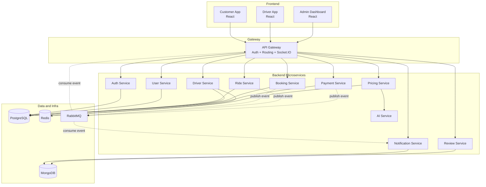
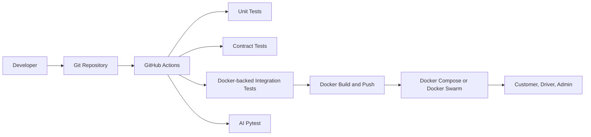
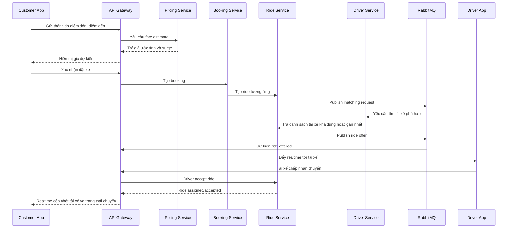
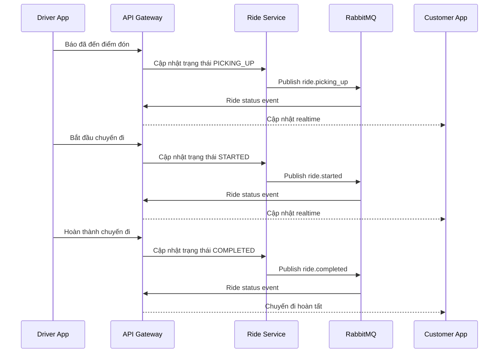
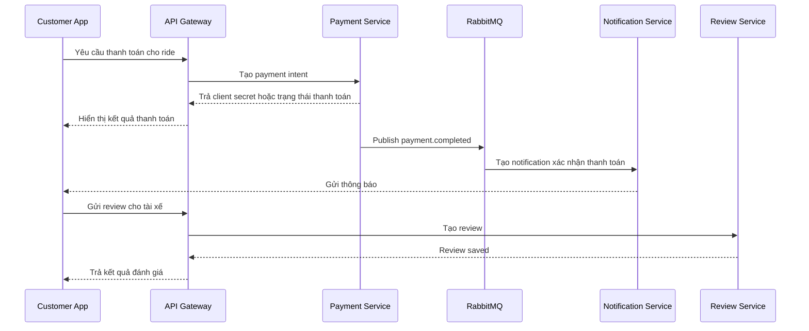
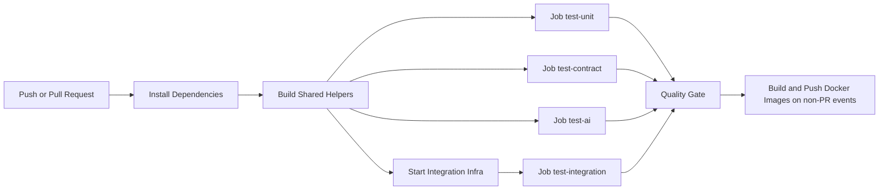

# Cab Booking System

[](https://www.typescriptlang.org/)
[](https://nodejs.org/)
[](https://react.dev/)
[](https://www.docker.com/)
[](https://fastapi.tiangolo.com/)

Hệ thống đặt xe công nghệ được xây dựng theo kiến trúc microservices, phục vụ ba nhóm người dùng chính: khách hàng, tài xế và quản trị viên. Dự án bao gồm ba ứng dụng frontend, một cụm backend microservices, hạ tầng dữ liệu đa mô hình và pipeline kiểm thử, CI/CD để hỗ trợ phát triển, vận hành và triển khai.

README này được viết theo hướng báo cáo tổng quan hệ thống, bám theo cấu trúc mô tả bài toán, mục tiêu thiết kế, kiến trúc microservices, sơ đồ luồng nghiệp vụ, mô hình dữ liệu, triển khai và kiểm thử.

## Mục lục

- [1. Thiết kế kiến trúc hệ thống](#1-thiết-kế-kiến-trúc-hệ-thống)
- [2. Kiến trúc tổng thể của hệ thống](#2-kiến-trúc-tổng-thể-của-hệ-thống)
- [3. Các luồng nghiệp vụ chính](#3-các-luồng-nghiệp-vụ-chính)
- [4. Mô hình dữ liệu và tích hợp](#4-mô-hình-dữ-liệu-và-tích-hợp)
- [5. Cấu trúc thư mục](#5-cấu-trúc-thư-mục)
- [6. Cổng dịch vụ và môi trường chạy](#6-cổng-dịch-vụ-và-môi-trường-chạy)
- [7. Hướng dẫn cài đặt và khởi động](#7-hướng-dẫn-cài-đặt-và-khởi-động)
- [8. Kiểm thử và CI/CD](#8-kiểm-thử-và-cicd)
- [9. Giám sát và vận hành](#9-giám-sát-và-vận-hành)
- [10. Hướng phát triển tiếp theo](#10-hướng-phát-triển-tiếp-theo)

## 1. Thiết kế kiến trúc hệ thống

### 1.1 Mục tiêu thiết kế

Hệ thống được xây dựng nhằm cung cấp một ứng dụng đặt xe taxi trực tuyến ở mức hoàn chỉnh cơ bản, tương tự mô hình hoạt động của Grab, Be hoặc Gojek, với trọng tâm là kết nối khách hàng và tài xế theo thời gian thực. Hệ thống cho phép người dùng đặt xe, tài xế nhận chuyến, và phía quản trị theo dõi toàn bộ trạng thái vận hành.

Việc lựa chọn kiến trúc microservices xuất phát từ các mục tiêu thiết kế sau:

- Kết nối nhanh giữa khách hàng và tài xế gần nhất.
- Ước lượng chi phí, thời gian đón và thời gian di chuyển đủ chính xác.
- Cập nhật trạng thái chuyến đi theo thời gian thực.
- Quản lý thanh toán, lịch sử chuyến đi, đánh giá và khiếu nại.
- Hỗ trợ quản trị tập trung khi số lượng người dùng và số chuyến tăng cao.
- Tăng khả năng mở rộng và bảo trì của toàn bộ hệ thống.
- Cho phép triển khai độc lập từng thành phần.
- Dễ dàng tích hợp thêm chức năng mới mà không ảnh hưởng đến toàn bộ hệ thống.
- Đảm bảo hiệu năng tốt, phản hồi nhanh và dễ mở rộng theo chiều ngang.

Nếu toàn bộ hệ thống được xây dựng theo kiến trúc nguyên khối, các vấn đề thường gặp là khó mở rộng, khó cô lập lỗi, khó tối ưu theo từng miền nghiệp vụ và khó triển khai độc lập từng thành phần. Vì vậy, dự án này lựa chọn kiến trúc microservices kết hợp giao tiếp đồng bộ qua HTTP và bất đồng bộ qua hàng đợi sự kiện.

### 1.2 Yêu cầu kỹ thuật

Các yêu cầu kỹ thuật cốt lõi của hệ thống được hiện thực trong repo hiện tại gồm:

- Frontend: React cho ba ứng dụng riêng biệt, hỗ trợ cập nhật realtime trạng thái chuyến đi.
- Backend: Node.js, Express.js, TypeScript cho cụm microservices nghiệp vụ.
- Kiến trúc: Microservices, mỗi service phụ trách một miền nghiệp vụ rõ ràng.
- Cơ sở dữ liệu: PostgreSQL cho transactional domain, MongoDB cho document domain.
- Giao tiếp giữa các service: REST API nội bộ và RabbitMQ cho event-driven flow.
- Authentication: JWT và internal service token.
- Triển khai: Docker, Docker Compose, Docker Swarm, GitHub Actions.

### 1.3 Chức năng chính

Hệ thống được thiết kế để đáp ứng các mục tiêu chính sau:

- Cung cấp trải nghiệm đặt xe xuyên suốt cho khách hàng từ tạo yêu cầu, ghép tài xế, theo dõi chuyến đi, thanh toán đến đánh giá sau chuyến.
- Hỗ trợ tài xế vận hành trên di động hoặc web: nhận chuyến, cập nhật trạng thái, theo dõi thu nhập, xem lịch sử hoạt động.
- Cung cấp dashboard quản trị để giám sát vận hành, người dùng, tài xế, doanh thu và chất lượng dịch vụ.
- Cho phép mở rộng độc lập từng miền nghiệp vụ như xác thực, chuyến đi, tài xế, pricing, payment, review, notification.
- Tăng tính tin cậy nhờ tách biệt database theo service, tách luồng realtime, dùng queue cho event-driven workflow.
- Hỗ trợ quy trình kiểm thử và CI/CD đủ rõ ràng để sẵn sàng commit và triển khai.

Theo góc nhìn người dùng và tài xế, các chức năng trọng tâm bao gồm:

- Người dùng: đăng ký, đăng nhập, đặt xe, xem vị trí tài xế, nhận thông báo khi tài xế nhận chuyến, thanh toán sau chuyến.
- Tài xế: đăng nhập, bật/tắt trạng thái sẵn sàng nhận chuyến, nhận hoặc từ chối chuyến, cập nhật trạng thái chuyến.
- Quản trị: xem thống kê số chuyến, doanh thu, tài xế hoạt động, người dùng mới và các chỉ số vận hành.

### 1.4 Các thành phần microservices đề xuất và hiện thực

Kiến trúc thực tế trong repo hiện tại gồm các service chính sau, tương ứng với định hướng thiết kế ban đầu:

- User/Auth domain: đăng ký, đăng nhập, quản lý thông tin người dùng, xác thực và phân quyền theo role.
- Ride domain: xử lý logic đặt xe, tạo ride, cập nhật trạng thái chuyến và matching workflow.
- Driver domain: quản lý hồ sơ tài xế, online/offline, vị trí hiện tại, khả dụng nhận chuyến.
- Payment domain: tạo payment intent, xử lý thanh toán và refund.
- Notification domain: gửi thông báo realtime hoặc bất đồng bộ.
- Gateway domain: trung gian giữa frontend và các backend service, quản lý routing, xác thực token và realtime hub.

## 2. Kiến trúc tổng thể của hệ thống

### 2.1 Tổng quan hai khối chính

Hệ thống được chia thành hai phần lớn:

- Frontend: được xây dựng bằng React, cho phép khách hàng, tài xế và quản trị viên thao tác trên giao diện riêng.
- Backend: được phát triển bằng Node.js + Express + TypeScript theo kiến trúc microservices, kết hợp một AI service viết bằng FastAPI cho suy luận mô hình.

### 2.2 Mô tả tổng quan giải pháp

Giải pháp được tổ chức thành bốn lớp:

- Lớp giao diện: ba ứng dụng React cho customer, driver và admin.
- Lớp gateway: API Gateway là điểm vào thống nhất cho client, thực hiện routing, auth middleware, admin aggregation và realtime hub.
- Lớp nghiệp vụ: các service Node.js tách theo domain và một AI service FastAPI xử lý suy luận mô hình.
- Lớp hạ tầng dữ liệu: PostgreSQL, MongoDB, Redis, RabbitMQ cùng stack monitoring tùy chọn.

Các quyết định kiến trúc chính:

- Dùng API Gateway để giảm coupling giữa frontend và nhiều backend service.
- Dùng PostgreSQL cho dữ liệu nghiệp vụ có quan hệ, MongoDB cho review và notification dạng document, Redis cho cache và geo lookup.
- Dùng RabbitMQ cho các luồng bất đồng bộ như ride lifecycle, matching request, notification và payment event.
- Dùng AI service riêng để cô lập mô hình dự báo ETA/price khỏi nghiệp vụ Node.js.

### 2.3 Sơ đồ kiến trúc hệ thống (Block Diagram)


```mermaid
graph TB
    subgraph Frontend
        Customer[Customer App\nReact]
        Driver[Driver App\nReact]
        Admin[Admin Dashboard\nReact]
    end

    subgraph Gateway
        APIGW[API Gateway\nAuth + Routing + Socket.IO]
    end

    subgraph Backend Microservices
        Auth[Auth Service]
        User[User Service]
        Ride[Ride Service]
        DriverSvc[Driver Service]
        Booking[Booking Service]
        Payment[Payment Service]
        Pricing[Pricing Service]
        Notification[Notification Service]
        Review[Review Service]
        AI[AI Service]
    end

    subgraph Data and Infra
        Postgres[(PostgreSQL)]
        Mongo[(MongoDB)]
        Redis[(Redis)]
        Rabbit[RabbitMQ]
    end

    Customer --> APIGW
    Driver --> APIGW
    Admin --> APIGW

    APIGW --> Auth
    APIGW --> User
    APIGW --> Ride
    APIGW --> DriverSvc
    APIGW --> Booking
    APIGW --> Payment
    APIGW --> Pricing
    APIGW --> Notification
    APIGW --> Review

    Auth --> Postgres
    User --> Postgres
    Ride --> Postgres
    DriverSvc --> Postgres
    Booking --> Postgres
    Payment --> Postgres
    Notification --> Mongo
    Review --> Mongo
    DriverSvc --> Redis
    Pricing --> Redis
    Pricing --> AI

    Booking -. publish event .-> Rabbit
    Ride -. publish event .-> Rabbit
    Payment -. publish event .-> Rabbit
    Rabbit -. consume event .-> Notification
    Rabbit -. consume event .-> APIGW
```

### 2.4 Giải thích sơ đồ

- API Gateway là điểm vào duy nhất đối với frontend, giúp kiểm soát xác thực, phân quyền, throttling và tổng hợp response.
- Ride Service giữ vai trò trung tâm trong ride lifecycle và matching workflow.
- Driver Service chịu trách nhiệm dữ liệu tài xế, khả dụng và vị trí địa lý, không ôm logic orchestration của toàn bộ ride lifecycle.
- Pricing Service là miền tính cước, surge pricing và gọi AI Service khi cần mô hình suy luận.
- Notification Service và Review Service tách riêng vì đặc thù document-based và workload khác với transactional domain.
- Mỗi service sở hữu dữ liệu riêng, giảm phụ thuộc trực tiếp giữa các miền nghiệp vụ.
- RabbitMQ được dùng để phát tán sự kiện backend và hỗ trợ xử lý bất đồng bộ.

### 2.5 Sơ đồ triển khai và vận hành


```mermaid
flowchart LR
    Dev[Developer] --> Git[Git Repository]
    Git --> CI[GitHub Actions]
    CI --> Unit[Unit Tests]
    CI --> Contract[Contract Tests]
    CI --> Integration[Docker-backed Integration Tests]
    CI --> AITest[AI Pytest]
    Integration --> Images[Docker Build and Push]
    Images --> Runtime[Docker Compose or Docker Swarm]
    Runtime --> Users[Customer, Driver, Admin]
```

### 2.6 Tóm tắt kiến trúc

| Thành phần | Chức năng chính | Công nghệ sử dụng |
| --- | --- | --- |
| React UI | Giao diện đặt xe, theo dõi chuyến đi, dashboard | React |
| API Gateway | Điều phối request, auth middleware, realtime hub | Node.js, Express, Socket.IO |
| Auth/User Service | Đăng ký, đăng nhập, quản lý user | Node.js, PostgreSQL |
| Driver Service | Quản lý tài xế, vị trí, trạng thái | Node.js, PostgreSQL, Redis |
| Ride/Booking Service | Đặt xe, điều phối ride, trạng thái chuyến | Node.js, PostgreSQL |
| Pricing Service | Tính cước, surge pricing, gọi AI | Node.js, Redis, FastAPI |
| Payment Service | Thanh toán, refund, doanh thu | Node.js, PostgreSQL |
| Notification Service | Realtime/asynchronous notification | Node.js, MongoDB, Redis |
| Review Service | Đánh giá và thống kê chất lượng dịch vụ | Node.js, MongoDB |
| Database Layer | Lưu trữ độc lập theo service | PostgreSQL, MongoDB |
| Triển khai | Đóng gói và scale service | Docker, Compose, Swarm |

## 3. Các luồng nghiệp vụ chính

### 3.1 Sơ đồ luồng dữ liệu (Sequence Diagram)

Các sơ đồ dưới đây mô tả ba kịch bản nghiệp vụ quan trọng nhất của hệ thống: đặt xe và ghép tài xế, thực hiện chuyến đi, thanh toán và đánh giá sau chuyến.

### 3.2 Luồng đặt xe và ghép tài xế


```mermaid
sequenceDiagram
    participant C as Customer App
    participant G as API Gateway
    participant P as Pricing Service
    participant B as Booking Service
    participant R as Ride Service
    participant D as Driver Service
    participant MQ as RabbitMQ
    participant DA as Driver App

    C->>G: Gửi thông tin điểm đón, điểm đến
    G->>P: Yêu cầu fare estimate
    P-->>G: Trả giá ước tính và surge
    G-->>C: Hiển thị giá dự kiến

    C->>G: Xác nhận đặt xe
    G->>B: Tạo booking
    B->>R: Tạo ride tương ứng
    R->>MQ: Publish matching request
    MQ->>D: Yêu cầu tìm tài xế phù hợp
    D-->>R: Trả danh sách tài xế khả dụng hoặc gần nhất
    R->>MQ: Publish ride offer
    MQ->>G: Sự kiện ride offered
    G-->>DA: Đẩy realtime tới tài xế
    DA->>G: Tài xế chấp nhận chuyến
    G->>R: Driver accept ride
    R-->>G: Ride assigned/accepted
    G-->>C: Realtime cập nhật tài xế và trạng thái chuyến
```

Giải thích luồng:

- Người dùng chọn điểm đón, điểm đến và nhận giá ước tính từ Pricing Service.
- Khi xác nhận đặt xe, Booking Service và Ride Service được gọi để tạo ride thực tế.
- Ride Service khởi phát matching workflow, phối hợp Driver Service và RabbitMQ để tìm tài xế phù hợp.
- Khi tài xế chấp nhận chuyến, hệ thống cập nhật trạng thái ride và đồng bộ realtime tới khách hàng.

### 3.3 Luồng thực hiện chuyến đi


```mermaid
sequenceDiagram
    participant Driver as Driver App
    participant Gateway as API Gateway
    participant Ride as Ride Service
    participant MQ as RabbitMQ
    participant Customer as Customer App

    Driver->>Gateway: Báo đã đến điểm đón
    Gateway->>Ride: Cập nhật trạng thái PICKING_UP
    Ride->>MQ: Publish ride.picking_up
    MQ->>Gateway: Ride status event
    Gateway-->>Customer: Cập nhật realtime

    Driver->>Gateway: Bắt đầu chuyến đi
    Gateway->>Ride: Cập nhật trạng thái STARTED
    Ride->>MQ: Publish ride.started
    MQ->>Gateway: Ride status event
    Gateway-->>Customer: Cập nhật realtime

    Driver->>Gateway: Hoàn thành chuyến đi
    Gateway->>Ride: Cập nhật trạng thái COMPLETED
    Ride->>MQ: Publish ride.completed
    MQ->>Gateway: Ride status event
    Gateway-->>Customer: Chuyến đi hoàn tất
```

Giải thích luồng:

- Tài xế cập nhật lần lượt các trạng thái như đến điểm đón, bắt đầu chuyến và hoàn thành chuyến.
- Ride Service phát sự kiện tương ứng qua RabbitMQ.
- API Gateway đóng vai trò realtime hub và đẩy trạng thái mới tới frontend ngay khi có thay đổi.

### 3.4 Luồng thanh toán và đánh giá sau chuyến


```mermaid
sequenceDiagram
    participant C as Customer App
    participant G as API Gateway
    participant Pay as Payment Service
    participant MQ as RabbitMQ
    participant N as Notification Service
    participant Rev as Review Service

    C->>G: Yêu cầu thanh toán cho ride
    G->>Pay: Tạo payment intent
    Pay-->>G: Trả client secret hoặc trạng thái thanh toán
    G-->>C: Hiển thị kết quả thanh toán

    Pay->>MQ: Publish payment.completed
    MQ->>N: Tạo notification xác nhận thanh toán
    N-->>C: Gửi thông báo

    C->>G: Gửi review cho tài xế
    G->>Rev: Tạo review
    Rev-->>G: Review saved
    G-->>C: Trả kết quả đánh giá
```

Giải thích luồng:

- Sau khi ride hoàn tất, Payment Service xử lý thanh toán hoặc ghi nhận trạng thái thanh toán.
- Nếu thanh toán thành công, sự kiện được publish để Notification Service tạo thông báo xác nhận.
- Khách hàng có thể gửi đánh giá và nhận xét cho tài xế thông qua Review Service.

## 4. Mô hình dữ liệu và tích hợp

### 4.1 Frontend và backend theo góc nhìn triển khai

Frontend được xây dựng dưới dạng SPA với React, phục vụ thao tác đăng nhập, đặt xe, theo dõi trạng thái chuyến đi và hiển thị hóa đơn hoặc thống kê. Backend được phát triển bằng Node.js + Express.js, tổ chức thành các service độc lập, mỗi service có database boundary riêng và giao tiếp với nhau qua HTTP nội bộ hoặc message queue.

### 4.2 Thành phần và trách nhiệm

#### 4.2.1 Frontend applications

| Thành phần | Vai trò chính | Cổng mặc định |
| --- | --- | --- |
| Customer App | Đặt xe, xem giá, theo dõi tài xế, thanh toán, đánh giá | 4000 |
| Driver App | Nhận chuyến, cập nhật vị trí, quản lý trạng thái online/offline | 4001 |
| Admin Dashboard | Theo dõi vận hành, quản lý tài xế, người dùng, doanh thu | 4002 |

#### 4.2.2 Backend services

| Service | Trách nhiệm chính | Database | Cổng |
| --- | --- | --- | --- |
| API Gateway | Entry point, auth middleware, route proxy, admin aggregation, Socket.IO hub | Không lưu state nghiệp vụ | 3000 |
| Auth Service | Đăng ký, đăng nhập, JWT, refresh token, thông tin user lõi | PostgreSQL `auth_db` | 3001 |
| Ride Service | Ride lifecycle, assign driver, state transition, ride history | PostgreSQL `ride_db` | 3002 |
| Driver Service | Hồ sơ tài xế, trạng thái, vị trí, tìm tài xế gần nhất | PostgreSQL `driver_db` + Redis | 3003 |
| Payment Service | Tạo payment intent, webhook mock, lịch sử thanh toán, refund | PostgreSQL `payment_db` | 3004 |
| Notification Service | Gửi email/SMS/in-app notification, retry, lưu lịch sử | MongoDB `notification_db` + Redis | 3005 |
| User Service | Hồ sơ người dùng mở rộng | PostgreSQL `user_db` | 3007 |
| Booking Service | Tạo booking, xác nhận booking, chuyển yêu cầu sang ride flow | PostgreSQL `booking_db` | 3008 |
| Pricing Service | Fare estimate, dynamic surge, route pricing, gọi AI Service | Redis | 3009 |
| Review Service | Đánh giá, nhận xét, thống kê rating | MongoDB `review_db` | 3010 |
| AI Service | Dự báo ETA/giá và các logic ML support | File/model runtime | 8000 |

#### 4.2.3 Infrastructure services

| Thành phần | Vai trò |
| --- | --- |
| PostgreSQL | Lưu dữ liệu giao dịch, người dùng, tài xế, ride, payment, booking |
| MongoDB | Lưu notification và review dạng document |
| Redis | Cache, geo-index, trạng thái trung gian, pricing runtime data |
| RabbitMQ | Event bus cho các luồng bất đồng bộ |
| Prometheus, Grafana, Loki, Promtail, cAdvisor, Node Exporter | Giám sát metrics, log, tài nguyên hạ tầng |

### 4.3 Nguyên tắc sở hữu dữ liệu

- Mỗi service sở hữu schema và database boundary riêng.
- Không có service nào ghi trực tiếp vào bảng hoặc collection của service khác.
- Tích hợp giữa service sử dụng REST nội bộ hoặc event qua RabbitMQ.

### 4.4 Phân tách database

| Hệ quản trị | Database | Service sử dụng |
| --- | --- | --- |
| PostgreSQL | `auth_db` | Auth Service |
| PostgreSQL | `user_db` | User Service |
| PostgreSQL | `ride_db` | Ride Service |
| PostgreSQL | `driver_db` | Driver Service |
| PostgreSQL | `booking_db` | Booking Service |
| PostgreSQL | `payment_db` | Payment Service |
| MongoDB | `notification_db` | Notification Service |
| MongoDB | `review_db` | Review Service |

### 4.5 Kiểu tích hợp

| Hình thức | Mục đích |
| --- | --- |
| HTTP sync | Request/response nghiệp vụ trực tiếp qua API Gateway hoặc internal route |
| RabbitMQ async | Phát tán sự kiện ride, payment, notification |
| Redis | Cache, tra cứu vị trí gần nhất, trạng thái realtime tạm thời |
| WebSocket | Đẩy trạng thái ride cho customer và driver theo thời gian thực |

### 4.6 Kết luận chương

Kiến trúc microservices giúp hệ thống dễ mở rộng, dễ bảo trì, có khả năng cô lập sự cố giữa các service và linh hoạt hơn khi tích hợp các công nghệ mới như AI, payment provider thực hoặc monitoring chuyên sâu. Đây là nền tảng phù hợp để phát triển một ứng dụng đặt xe trong bối cảnh triển khai thực tế.

## 5. Cấu trúc thư mục

```text
Cab-Booking-System-Project/
├── apps/
│   ├── customer-app/
│   ├── driver-app/
│   └── admin-dashboard/
├── services/
│   ├── api-gateway/
│   ├── auth-service/
│   ├── booking-service/
│   ├── driver-service/
│   ├── notification-service/
│   ├── payment-service/
│   ├── pricing-service/
│   ├── review-service/
│   ├── ride-service/
│   ├── user-service/
│   └── ai-service/
├── shared/
│   ├── api-client/
│   ├── types/
│   └── utils/
├── env/
├── monitoring/
├── scripts/
├── tests/
├── docker-compose.yml
├── docker-compose.prod.yml
├── docker-stack.yml
└── .github/workflows/ci-cd.yml
```

### Ý nghĩa các thư mục chính

- `apps/`: mã nguồn giao diện người dùng cho ba đối tượng sử dụng.
- `services/`: toàn bộ các microservice backend và AI service.
- `shared/`: kiểu dữ liệu, helper, internal auth, request-context và các tiện ích dùng chung.
- `scripts/`: script reset dữ liệu, seed, integration runner, test wrapper.
- `monitoring/`: cấu hình Prometheus, Loki, Promtail.
- `.github/workflows/`: pipeline CI/CD và build Docker image.

## 6. Cổng dịch vụ và môi trường chạy

### 6.1 Cổng dịch vụ backend

| Thành phần | Host port | Ghi chú |
| --- | --- | --- |
| API Gateway | 3000 | Entry point |
| Auth Service | 3001 | JWT, refresh token |
| Ride Service | 3002 | Ride lifecycle |
| Driver Service | 3003 | Driver profile, location |
| Payment Service | 3004 | Payment |
| Notification Service | 3005 | Notification |
| User Service | 3007 | User profile |
| Booking Service | 3008 | Booking |
| Pricing Service | 3009 | Pricing |
| Review Service | 3010 | Review |
| AI Service | 8000 | ML inference |

### 6.2 Cổng hạ tầng

| Thành phần | Host port | Ghi chú |
| --- | --- | --- |
| PostgreSQL | 5433 | Container port 5432 |
| MongoDB | 27017 | Root auth qua `admin` |
| Redis | 6379 | Cache và geo data |
| RabbitMQ | 5672 | AMQP |
| RabbitMQ UI | 15672 | Management UI |
| RabbitMQ Metrics | 15692 | Prometheus scrape |
| Prometheus | 9090 | Monitoring profile |
| Grafana | 3006 | Monitoring profile |
| Loki | 3100 | Monitoring profile |
| cAdvisor | 8081 | Monitoring profile |
| Node Exporter | 9100 | Monitoring profile |

### 6.3 Các tệp compose trong repo

| Tệp | Mục đích |
| --- | --- |
| `docker-compose.yml` | Chạy local/dev stack từ source và image build tại chỗ |
| `docker-compose.prod.yml` | Cấu hình production-oriented khi dùng image đã build |
| `.github/docker/docker-compose.integration.yml` | Hạ tầng dành riêng cho integration test trong CI hoặc local validation |
| `docker-stack.yml` | Triển khai theo hướng Docker Swarm |

## 7. Hướng dẫn cài đặt và khởi động

### 7.1 Yêu cầu môi trường

- Docker và Docker Compose.
- Node.js 20.x nếu chạy service hoặc frontend ngoài Docker.
- Python 3.11 nếu chạy AI service trực tiếp ngoài container.
- Git.

### 7.2 Khởi động backend bằng Docker

```bash
git clone <repository-url>
cd Cab-Booking-System-Project

# Chuẩn bị file biến môi trường theo cấu hình của dự án
# Sau đó build và khởi động backend
docker compose build
docker compose up -d
```

### 7.3 Kiểm tra hệ thống sau khi khởi động

```bash
docker compose ps
curl http://localhost:3000/health
curl http://localhost:3000/ready
curl http://localhost:3000/health/services
```

### 7.4 Chạy frontend apps

```bash
# Customer app
cd apps/customer-app
npm install
npm start

# Driver app
cd apps/driver-app
npm install
npm start

# Admin dashboard
cd apps/admin-dashboard
npm install
npm start
```

### 7.5 Reset và seed dữ liệu

```bash
# Windows
scripts\reset-database.bat

# Linux/macOS
./scripts/reset-database.sh

# Hoặc chỉ seed dữ liệu mẫu
npm run db:seed
```

### 7.6 Kết nối nhanh database local

```text
PostgreSQL: postgresql://<POSTGRES_USER>:<POSTGRES_PASSWORD>@localhost:5433/<db_name>
MongoDB: mongodb://<MONGO_USER>:<MONGO_PASSWORD>@localhost:27017/?authSource=admin
Redis: redis://localhost:6379
RabbitMQ UI: http://localhost:15672
```

## 8. Kiểm thử và CI/CD

### 8.1 Các mức kiểm thử chính

| Nhóm kiểm thử | Lệnh |
| --- | --- |
| Unit tests | `npm run test:unit` |
| Contract tests | `npm run test:contract` |
| Integration tests | `npm run test:integration` |
| AI service tests | `cd services/ai-service && pytest -q` |

### 8.2 Kiểm thử đã được xác nhận trong quá trình hoàn thiện backend

- Ở môi trường local, các nhóm kiểm thử cốt lõi đã được chạy để xác nhận luồng backend chính.
- Unit test backend đã được xử lý để chạy ổn định theo lệnh `npm run test:unit`.
- Contract test giữa Driver Service và Ride Service đã được cấu hình và dùng để kiểm tra tính tương thích ở mức service boundary.
- Docker-backed integration flow đã được dùng để kiểm tra chuỗi backend quan trọng trong môi trường gần với runtime thực tế.
- AI service có bộ pytest riêng để kiểm tra logic phía FastAPI.

Lưu ý: các kết quả trên phản ánh trạng thái kiểm chứng trong quá trình hoàn thiện backend và môi trường local. Chúng không nên được diễn đạt như cam kết rằng mọi lần chạy GitHub Actions đều đang pass tuyệt đối trên mọi nhánh hoặc mọi thời điểm.

### 8.3 Pipeline CI/CD

Workflow chính nằm tại `.github/workflows/ci-cd.yml` và được thiết kế theo mô hình quality gate trước khi build image. Cụ thể, pipeline hiện tại gồm các job chính sau:

- `test-unit`: cài dependency, build shared helpers, sau đó chạy `npm run test:unit` với PostgreSQL, MongoDB, Redis và RabbitMQ được cấp qua GitHub Actions services.
- `test-contract`: cài dependency, build shared helpers và chạy `npm run test:contract` để kiểm tra tính tương thích giữa một số service boundary quan trọng.
- `test-integration`: khởi động hạ tầng tích hợp riêng bằng file compose trong `.github/docker/docker-compose.integration.yml`, build backend artifact và chạy integration runner.
- `test-ai`: cài dependency Python và chạy `pytest -q` trong `services/ai-service`.
- `docker-build-and-push`: chỉ chạy khi không phải pull request và chỉ bắt đầu sau khi toàn bộ job kiểm thử phía trên hoàn tất; job này build và push image của từng service lên Docker Hub.

Theo đúng trạng thái hiện tại của dự án, nên mô tả pipeline này là pipeline CI/CD da duoc cau hinh va huong den tu dong hoa kiem thu, build va phat hanh image, thay vi khang dinh rang GitHub Actions da on dinh tuyet doi. Ly do la ket qua tren GitHub van con phu thuoc vao secret Docker Hub, moi truong runner, va tinh dong bo giua ma nguon voi cau hinh test trong workflow.

### 8.4 Sơ đồ pipeline kiểm thử


```mermaid
flowchart LR
    Start[Push or Pull Request] --> Install[Install Dependencies]
    Install --> Shared[Build Shared Helpers]
    Shared --> Unit[Job test-unit]
    Shared --> Contract[Job test-contract]
    Shared --> AI[Job test-ai]
    Shared --> Infra[Start Integration Infra]
    Infra --> Integration[Job test-integration]
    Unit --> Gate[Quality Gate]
    Contract --> Gate
    AI --> Gate
    Integration --> Gate
    Gate --> Push[Build and Push Docker Images on non-PR events]
```

### 8.5 Nhận xét thực tế về CI/CD

Ở góc nhìn báo cáo KLTN, phần CI/CD nên được chốt theo tinh thần sau:

- Dự án đã có workflow GitHub Actions tương đối đầy đủ cho unit test, contract test, integration test, AI test và build/push Docker image.
- Pipeline đã thể hiện đúng định hướng DevOps và tự động hóa kiểm thử của hệ thống microservices.
- Tuy nhiên, cần phân biệt rõ giữa "đã cấu hình pipeline" và "pipeline luôn pass ổn định trên GitHub".
- Với trạng thái hiện tại, cách diễn đạt chính xác nhất là: hệ thống đã xây dựng được nền tảng CI/CD khả dụng, nhưng vẫn cần tiếp tục hoàn thiện để đạt độ ổn định cao trên môi trường GitHub Actions thực tế.

## 9. Giám sát và vận hành

Hệ thống hỗ trợ monitoring profile để phục vụ quan sát hệ thống khi chạy local hoặc staging.

### 9.1 Thành phần monitoring

- Prometheus: thu thập metrics.
- Grafana: dashboard quan sát.
- Loki: tập trung log.
- Promtail: forward log từ container.
- cAdvisor: tài nguyên container.
- Node Exporter: tài nguyên host.

### 9.2 Cách bật monitoring profile

```bash
docker compose --profile monitoring up -d prometheus grafana loki promtail cadvisor node-exporter
```

### 9.3 Truy cập nhanh

- Prometheus: `http://localhost:9090`
- Grafana: `http://localhost:3006`
- Loki: `http://localhost:3100`

## 10. Hướng phát triển tiếp theo

Một số hướng mở rộng phù hợp cho giai đoạn tiếp theo:

- Bổ sung circuit breaker, retry policy và tracing phân tán giữa các service.
- Chuẩn hóa open-handle cleanup trong test để log CI sạch hơn.
- Nâng cấp AI service từ mô hình offline sang pipeline retraining định kỳ.
- Bổ sung payment provider thực thay cho mock webhook nội bộ.
- Mở rộng dashboard quản trị với heatmap khu vực và SLA realtime.
- Tăng cường bảo mật production: secret manager, TLS termination, audit trail, rate limit phân tầng.

## Kết luận

Cab Booking System là một bài toán điển hình cho kiến trúc microservices trong lĩnh vực vận tải số. Dự án giải quyết đồng thời nhiều yêu cầu thực tế: phân tách miền nghiệp vụ, cập nhật realtime, tối ưu theo vị trí, tính giá linh hoạt, phối hợp nhiều loại cơ sở dữ liệu và duy trì chất lượng phần mềm qua kiểm thử tự động và CI/CD.

Ở trạng thái hiện tại, backend đã đạt mức sẵn sàng commit với các luồng kiểm thử chính đã được xác nhận. README này đóng vai trò tài liệu tổng quan để phục vụ học thuật, onboarding kỹ thuật và vận hành hệ thống.