# Cab Booking System — Hệ thống đặt xe công nghệ

[](https://www.typescriptlang.org/)
[](https://nodejs.org/)
[](https://react.dev/)
[](https://www.docker.com/)
[](https://aws.amazon.com/)
[](https://foxgo.io.vn)

Hệ thống đặt xe công nghệ xây dựng theo kiến trúc **microservices**, phục vụ ba nhóm người dùng: khách hàng, tài xế và quản trị viên. Hệ thống gồm ba ứng dụng React SPA, mười một service Node.js/TypeScript (một **API Gateway** + mười dịch vụ nghiệp vụ), một **AI service** FastAPI/Python, hạ tầng dữ liệu đa mô hình (PostgreSQL, MongoDB, Redis, RabbitMQ) và pipeline CI/CD trên GitHub Actions triển khai lên AWS EC2.


> **Mục lục tài liệu Markdown:** [docs/README.md](docs/README.md) 

---

## Mục lục

- [1. Thiết kế kiến trúc hệ thống](#1-thiết-kế-kiến-trúc-hệ-thống)
- [2. Phân tích Domain-Driven Design (DDD)](#2-phân-tích-domain-driven-design-ddd)
- [3. Kiến trúc tổng thể](#3-kiến-trúc-tổng-thể)
- [4. Các luồng nghiệp vụ chính](#4-các-luồng-nghiệp-vụ-chính)
- [5. Mô hình dữ liệu và tích hợp](#5-mô-hình-dữ-liệu-và-tích-hợp)
- [6. Cấu trúc thư mục](#6-cấu-trúc-thư-mục)
- [7. Cổng dịch vụ và môi trường chạy](#7-cổng-dịch-vụ-và-môi-trường-chạy)
- [8. Hướng dẫn cài đặt và khởi động](#8-hướng-dẫn-cài-đặt-và-khởi-động)
- [9. Kiểm thử và CI/CD](#9-kiểm-thử-và-cicd)
- [10. Triển khai trên AWS](#10-triển-khai-trên-aws)
- [11. Monitoring và Observability](#11-monitoring-và-observability)
- [12. Hướng phát triển tiếp theo](#12-hướng-phát-triển-tiếp-theo)
- [13. Bộ sơ đồ và tài liệu hình (PNG / Mermaid)](#13-bộ-sơ-đồ-và-tài-liệu-hình-png--mermaid)

---

## 1. Thiết kế kiến trúc hệ thống

### 1.1 Mục tiêu thiết kế

Hệ thống được xây dựng nhằm cung cấp một ứng dụng đặt xe trực tuyến hoàn chỉnh, tương tự mô hình hoạt động của Grab hoặc Gojek, với trọng tâm là kết nối khách hàng và tài xế theo thời gian thực.

- **Kết nối nhanh** giữa khách hàng và tài xế gần nhất, sử dụng geospatial indexing và thuật toán scoring đa tiêu chí.
- **Ước lượng chi phí chính xác** dựa trên khoảng cách thực tế (OSRM), thời gian di chuyển và hệ số surge động.
- **Cập nhật trạng thái thời gian thực** qua Socket.IO cho cả khách hàng và tài xế trong suốt vòng đời chuyến đi.
- **Thanh toán đáng tin cậy** tích hợp MoMo và VNPay với idempotency, xử lý IPN callback nhiều lần.
- **Ví tài xế chuẩn fintech** với ký quỹ, giữ thu nhập T+24h, tất toán công nợ FIFO.
- **Tách biệt miền nghiệp vụ** rõ ràng — mỗi service sở hữu database riêng.
- **AI tùy chọn** — mọi lời gọi AI có timeout 150ms với fallback hoàn chỉnh.

### 1.2 Yêu cầu kỹ thuật

| Hạng mục | Lựa chọn | Lý do |
|---------|---------|-------|
| Frontend | React 18, Redux Toolkit | Quản lý state phức tạp (chuyến đi, ví, realtime) |
| Backend | Node.js 20, Express.js, TypeScript | Hiệu năng I/O cao, type safety |
| AI service | Python 3.11, FastAPI | Ecosystem ML (scikit-learn) |
| Giao tiếp sync | gRPC (protocol buffers) | Độ trễ thấp cho Pricing ↔ Driver lookup |
| Giao tiếp async | RabbitMQ topic exchange | Loose coupling cho ride lifecycle, payment |
| Realtime | Socket.IO + Redis Adapter | Cluster-aware WebSocket broadcast |
| CSDL quan hệ | PostgreSQL (port 5433) | ACID cho tài chính, ride state machine |
| CSDL document | MongoDB | Notification, review — schema linh hoạt |
| Cache & Geo | Redis | `GEOADD`/`GEORADIUS` O(log M) tìm tài xế |
| ORM | Prisma | Migration, type-safe queries cho **8** PostgreSQL DB (shared instance) |
| Xác thực | JWT (HS256) + Refresh Token | Stateless auth, revoke qua DB |
| Triển khai | Docker Swarm | Production scaling trên AWS |
| CI/CD | GitHub Actions | Quality gate → Docker Hub → SSH deploy |

### 1.3 Chức năng chính

#### Khách hàng
- Đăng ký bằng số điện thoại + OTP; đăng nhập bằng số điện thoại + mật khẩu
- Xem giá ước tính (surge, AI-assisted ETA) trước khi đặt
- Theo dõi tài xế trên bản đồ real-time trong suốt chuyến
- Thanh toán tiền mặt, MoMo, VNPay
- Chat và gọi điện WebRTC với tài xế trong chuyến
- Đánh giá tài xế, dùng voucher/mã giảm giá
- AI chatbot hỗ trợ (RAG-based)

#### Tài xế
- Đăng ký, upload hồ sơ xe + bằng lái; chờ admin duyệt
- Bật/tắt nhận chuyến (ONLINE/OFFLINE)
- Nhận offer, xem điểm đón/trả trên bản đồ
- Cập nhật trạng thái: đến đón → đã đón → hoàn thành
- Ví điện tử: nạp ký quỹ, xem thu nhập, rút tiền về ngân hàng

#### Quản trị viên
- Dashboard tổng quan: chuyến đi, doanh thu, tài xế hoạt động
- Duyệt/từ chối hồ sơ tài xế
- Quản lý ví thương nhân (merchant balance, ledger)
- Duyệt yêu cầu rút tiền của tài xế

### 1.4 Phân rã microservices

| Service | Bounded Context | Trách nhiệm |
|---------|----------------|-------------|
| API Gateway | Infrastructure | Entry point, JWT auth, proxy, Socket.IO hub, driver matching |
| Auth Service | Identity | Đăng ký OTP, đăng nhập mật khẩu, JWT / Refresh Token (OTP qua SMS/SNS/Twilio tùy cấu hình) |
| User Service | User Profile | Hồ sơ người dùng mở rộng |
| Driver Service | Driver Domain | Hồ sơ tài xế, trạng thái, vị trí địa lý |
| Ride Service | Ride Domain | Vòng đời chuyến đi, state machine, chat |
| Booking Service | Booking Domain | Tạo booking, xem giá, chuyển sang ride |
| Payment Service | Payment Domain | Thanh toán, IPN, hoa hồng, voucher |
| Wallet Service | Wallet Domain | Ví tài xế fintech, T+24h, FIFO debt |
| Pricing Service | Pricing Domain | Tính giá, surge, gọi AI |
| Notification Service | Notification | Email, SMS, push — event-driven |
| Review Service | Review Domain | Đánh giá hai chiều, rating |
| AI Service | AI/ML | ETA, surge, accept prob, wait time, RAG chatbot |

---

## 2. Phân tích Domain-Driven Design (DDD)

### 2.1 Bounded Contexts và Context Map

#### 2.1.1 Sơ đồ tổng quát hệ thống theo DDD

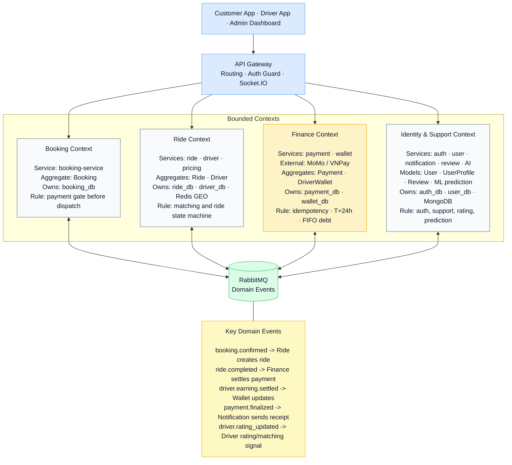
```mermaid
flowchart TB
    Apps["Customer App · Driver App · Admin Dashboard"]
    Gateway["API Gateway<br/>Routing · Auth Guard · Socket.IO"]
    MQ[("RabbitMQ<br/>Domain Events")]
    Events["Key Domain Events<br/><br/>booking.confirmed -> Ride creates ride<br/>ride.completed -> Finance settles payment<br/>driver.earning.settled -> Wallet updates<br/>payment.finalized -> Notification sends receipt<br/>driver.rating_updated -> Driver rating/matching signal"]

    Apps --> Gateway

    subgraph Domain["Bounded Contexts"]
        direction LR
        Booking["Booking Context<br/><br/>Service: booking-service<br/>Aggregate: Booking<br/>Owns: booking_db<br/>Rule: payment gate before dispatch"]
        Ride["Ride Context<br/><br/>Services: ride · driver · pricing<br/>Aggregates: Ride · Driver<br/>Owns: ride_db · driver_db · Redis GEO<br/>Rule: matching and ride state machine"]
        Finance["Finance Context<br/><br/>Services: payment · wallet<br/>External: MoMo / VNPay<br/>Aggregates: Payment · DriverWallet<br/>Owns: payment_db · wallet_db<br/>Rule: idempotency · T+24h · FIFO debt"]
        Support["Identity & Support Context<br/><br/>Services: auth · user · notification · review · AI<br/>Models: User · UserProfile · Review · ML prediction<br/>Owns: auth_db · user_db · MongoDB<br/>Rule: auth, support, rating, prediction"]
    end

    Gateway --> Booking
    Gateway --> Ride
    Gateway --> Finance
    Gateway --> Support

    Booking <--> MQ
    Ride <--> MQ
    Finance <--> MQ
    Support <--> MQ
    MQ --- Events

    classDef entry fill:#dbeafe,stroke:#60a5fa,color:#0f172a
    classDef context fill:#f8fafc,stroke:#64748b,color:#0f172a
    classDef finance fill:#fef3c7,stroke:#f59e0b,color:#0f172a
    classDef bus fill:#dcfce7,stroke:#22c55e,color:#0f172a
    classDef event fill:#fef9c3,stroke:#eab308,color:#0f172a
    class Apps,Gateway entry
    class Booking,Ride,Support context
    class Finance finance
    class MQ bus
    class Events event
```

#### 2.1.2 Bản thuyết trình: tách biệt Bounded Contexts

**Định nghĩa.** Domain-Driven Design là cách thiết kế phần mềm xoay quanh nghiệp vụ cốt lõi thay vì chỉ xoay quanh database hoặc framework. Mỗi phần mềm được chia thành các vùng nghiệp vụ rõ ràng, dùng cùng một ngôn ngữ với nghiệp vụ, gọi là ubiquitous language.

**Bounded Context** là ranh giới nơi một mô hình nghiệp vụ có ý nghĩa nhất quán. Ví dụ, trong hệ thống này, từ "booking" chỉ là yêu cầu đặt xe và cổng dispatch; còn "ride" mới là hành trình thực tế với trạng thái `PENDING`, `ACCEPTED`, `IN_PROGRESS`, `COMPLETED`.

**Context Map** là bản đồ thể hiện các bounded context liên hệ với nhau như thế nào. Trong FoxGo, các context không dùng chung database trực tiếp, mà giao tiếp qua API Gateway, HTTP/gRPC nội bộ và domain events trên RabbitMQ.

Khi trình bày sơ đồ này, có thể nói:

1. Nhìn từ trên xuống, ba ứng dụng Customer, Driver và Admin không gọi trực tiếp vào từng service, mà đi qua API Gateway. Gateway là lớp điều phối request, kiểm tra auth guard và duy trì realtime Socket.IO.
2. Ở giữa là bốn bounded context chính. Mỗi khối là một vùng nghiệp vụ độc lập, có service, aggregate, rule và database riêng.
3. Booking Context quản lý ý định đặt xe của khách. Nó sở hữu `Booking Aggregate`, lưu `booking_db`, giữ thông tin phương thức thanh toán và quyết định khi nào booking được mở dispatch gate.
4. Ride Context quản lý vận hành chuyến đi thực tế. Context này gồm Ride, Driver và Pricing: tạo ride, ghép tài xế, chuyển trạng thái chuyến đi, quản lý vị trí tài xế bằng Redis GEO và tính giá/ETA.
5. Finance Context quản lý toàn bộ tiền của chuyến đi. Payment Service xử lý payment intent, IPN MoMo/VNPay và idempotency; Wallet Service xử lý ví tài xế, giữ thu nhập T+24h và trả công nợ FIFO.
6. Identity & Support Context cung cấp năng lực nền cho hệ thống: Auth, User Profile, Notification, Review/Rating và AI prediction. Đây là nhóm hỗ trợ các context chính nhưng vẫn có model và dữ liệu riêng.
7. RabbitMQ ở dưới đóng vai trò event bus giữa các context. Ví dụ `booking.confirmed` tạo ride, `ride.completed` kích hoạt Finance finalize payment, `payment.finalized` tạo hóa đơn/thông báo, và `driver.rating_updated` cập nhật tín hiệu matching.
8. Điểm quan trọng của DDD ở đây là không context nào ghi trực tiếp vào database của context khác. Nếu Finance cần cập nhật ví, nó phát event; nếu Review cập nhật điểm tài xế, nó phát event hoặc gọi qua API nội bộ có kiểm soát.
9. Cách tách này giúp hệ thống module hóa cao: dễ test từng miền nghiệp vụ, dễ scale service theo tải thực tế, và hạn chế lỗi lan truyền giữa các phần nhạy cảm như booking, ride và thanh toán.

Tóm lại, DDD trong hệ thống này giúp biến một bài toán đặt xe lớn thành các miền nghiệp vụ độc lập nhưng phối hợp bằng event, phù hợp với kiến trúc microservices.

#### 2.1.3 Context map chi tiết theo service

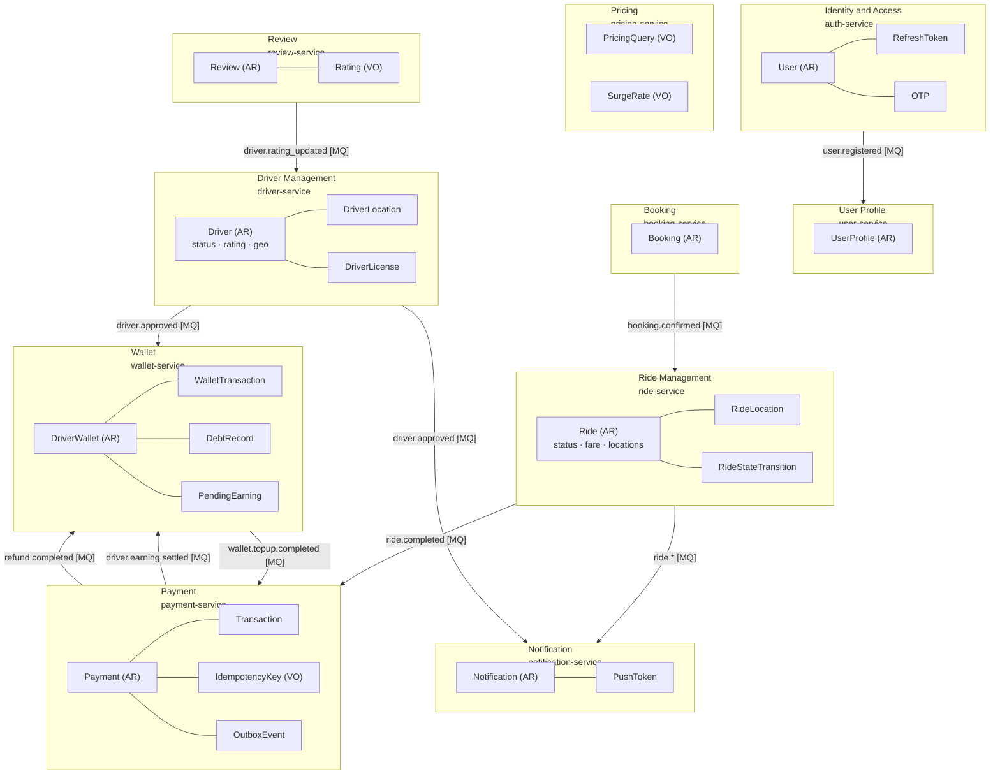
```mermaid
graph TB
    subgraph IAC["Identity and Access\nauth-service"]
        U["User (AR)"]
        RT["RefreshToken"]
        OTP_E["OTP"]
        U --- RT
        U --- OTP_E
    end

    subgraph UPC["User Profile\nuser-service"]
        UP["UserProfile (AR)"]
    end

    subgraph RIDC["Ride Management\nride-service"]
        R["Ride (AR)\nstatus · fare · locations"]
        RL["RideLocation"]
        RE["RideStateTransition"]
        R --- RL
        R --- RE
    end

    subgraph DRC["Driver Management\ndriver-service"]
        DV["Driver (AR)\nstatus · rating · geo"]
        DL["DriverLocation"]
        DLI["DriverLicense"]
        DV --- DL
        DV --- DLI
    end

    subgraph BC["Booking\nbooking-service"]
        BK["Booking (AR)"]
    end

    subgraph PRC["Pricing\npricing-service"]
        PQ["PricingQuery (VO)"]
        SR["SurgeRate (VO)"]
    end

    subgraph PAC["Payment\npayment-service"]
        P["Payment (AR)"]
        TX["Transaction"]
        IPK["IdempotencyKey (VO)"]
        OBX["OutboxEvent"]
        P --- TX
        P --- IPK
        P --- OBX
    end

    subgraph WC["Wallet\nwallet-service"]
        W["DriverWallet (AR)"]
        WT["WalletTransaction"]
        DR["DebtRecord"]
        PE["PendingEarning"]
        W --- WT
        W --- DR
        W --- PE
    end

    subgraph NC["Notification\nnotification-service"]
        N["Notification (AR)"]
        PT["PushToken"]
        N --- PT
    end

    subgraph RVC["Review\nreview-service"]
        RV["Review (AR)"]
        RAT["Rating (VO)"]
        RV --- RAT
    end

    RIDC -->|"ride.completed [MQ]"| PAC
    RIDC -->|"ride.* [MQ]"| NC
    PAC -->|"driver.earning.settled [MQ]"| WC
    PAC -->|"refund.completed [MQ]"| WC
    WC -->|"wallet.topup.completed [MQ]"| PAC
    IAC -->|"user.registered [MQ]"| UPC
    DRC -->|"driver.approved [MQ]"| WC
    DRC -->|"driver.approved [MQ]"| NC
    RVC -->|"driver.rating_updated [MQ]"| DRC
    BC -->|"booking.confirmed [MQ]"| RIDC
```

### 2.2 Aggregates, Entities và Value Objects

| Bounded Context | Aggregate Root | Entities | Value Objects | Domain Services |
|---|---|---|---|---|
| Identity & Access | User | RefreshToken | OTP (hash+ttl), Phone | OtpService, JwtService |
| User Profile | UserProfile | — | Address | — |
| Ride Management | Ride | RideLocation, RideStateTransition | Coordinate, Fare | RideStateMachine |
| Driver Management | Driver | DriverLicense | DriverLocation | AvailabilityChecker |
| Booking | Booking | — | EstimatedFare | — |
| Pricing | — | — | PricingResult, SurgeRate | PricingCalculator |
| Payment | Payment | Transaction, OutboxEvent | IdempotencyKey, Money | PaymentSaga |
| Wallet | DriverWallet | WalletTransaction, DebtRecord, PendingEarning | Money | CommissionCalculator |
| Notification | Notification | PushToken | — | SmsDispatcher |
| Review | Review | — | Rating (1–5) | — |


### 2.3 Domain Events

| Event | Publisher | Subscribers | Mô tả |
|---|---|---|---|
| `ride.created` | ride-service | api-gateway | Kích hoạt matching engine |
| `ride.accepted` | ride-service | api-gateway, notification | Tài xế chấp nhận |
| `ride.completed` | ride-service | payment, api-gateway, notification | Kích hoạt thanh toán |
| `ride.cancelled` | ride-service | payment, api-gateway, notification | Hoàn tiền nếu có |
| `booking.confirmed` | booking-service | ride-service | Tạo Ride từ Booking |
| `driver.earning.settled` | payment-service | wallet-service | Online: giữ thu nhập T+24h; cash: ghi nợ hoa hồng |
| `refund.completed` | payment-service | wallet, notification | Hoàn tiền |
| `wallet.topup.completed` | wallet-service | payment, notification | Nạp tiền thành công |
| `user.registered` | auth-service | user-service | Tạo UserProfile |
| `driver.approved` | driver-service | wallet, notification | Tạo ví + thông báo |
| `driver.rating_updated` | review-service | driver-service | Cập nhật rating |


### 2.4 Invariants và Business Rules

| Context | Invariant |
|---|---|
| Ride | Chỉ transition hợp lệ trong `VALID_TRANSITIONS` — không update `status` trực tiếp |
| Payment | `idempotencyKey` unique — IPN callback phải idempotent |
| Wallet | Trước khi ONLINE: `balance > DEBT_LIMIT` (-500,000đ) |
| Wallet | Cash ride: tài xế nhận tiền mặt, nợ `platformFee` vào wallet |
| Wallet | Thu nhập giữ T+24h trong `PendingEarning` trước khi release |
| Wallet | FIFO debt settlement: trả nợ cũ nhất trước |
| Wallet | Ký quỹ bắt buộc 300,000đ để kích hoạt ví |
| AI | Mọi call có timeout 150ms với fallback |

---

## 3. Kiến trúc tổng thể

### 3.1 Lớp kiến trúc

```
┌─────────────────────────────────────────────────────────────────────┐
│                        PRESENTATION LAYER                            │
│    Customer App (:4000)   Driver App (:4001)   Admin (:4002)        │
│              React 18 + Redux Toolkit + Socket.IO client            │
└────────────────────────────────┬────────────────────────────────────┘
                                 │ HTTPS + WebSocket
                                 ▼
┌─────────────────────────────────────────────────────────────────────┐
│                    Nginx (host) + Let's Encrypt SSL                  │
│   api.foxgo.io.vn → :3000 (proxy)                                   │
│   foxgo.io.vn     → /home/ubuntu/customer-build  (static)           │
└────────────────────────────────┬────────────────────────────────────┘
                                 │
┌────────────────────────────────▼────────────────────────────────────┐
│                          GATEWAY LAYER                               │
│                    API Gateway (:3000)                               │
│   JWT Verify  │  HTTP Proxy  │  Rate Limit  │  Address Normalize    │
│   Socket.IO Hub (Redis Adapter)  │  Driver Matching Engine           │
│   RabbitMQ Consumer  │  gRPC Bridge Client                          │
└────┬────────────┬─────────────┬────────────────┬────────────────────┘
     │ HTTP       │ gRPC        │ HTTP           │ WebSocket
     ▼            ▼             ▼                ▼
┌──────────┐  ┌──────────┐  ┌─────────────────────────────────────┐
│  Auth    │  │ Pricing  │  │     BUSINESS SERVICES LAYER          │
│  :3001   │  │  :3009   │  │  Ride  Driver  Booking  Payment      │
│  gRPC    │  │ gRPC:    │  │  Wallet  User  Notification  Review  │
│  :50051  │  │ :50057   │  │  (mỗi service: HTTP + DB riêng)     │
└──────────┘  └─────┬────┘  └─────────────────────────────────────┘
                    │ HTTP (timeout 150ms, fallback)
                    ▼
             ┌──────────┐
             │    AI    │
             │  :8000   │ FastAPI/Python — ETA, Surge, RAG
             └──────────┘
┌─────────────────────────────────────────────────────────────────────┐
│                        DATA & INFRA LAYER                            │
│  PostgreSQL:5433  MongoDB:27017  Redis:6379  RabbitMQ:5672          │
└─────────────────────────────────────────────────────────────────────┘
```

### 3.2 Sơ đồ kiến trúc hệ thống

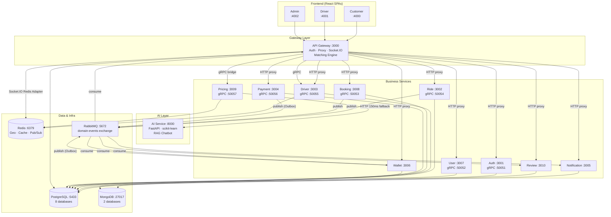
```mermaid
graph TB
    subgraph Frontend ["Frontend (React SPAs)"]
        Customer["Customer\n:4000"]
        Driver["Driver\n:4001"]
        Admin["Admin\n:4002"]
    end

    subgraph Gateway ["Gateway Layer"]
        APIGW["API Gateway :3000\nAuth · Proxy · Socket.IO\nMatching Engine"]
    end

    subgraph BusinessServices ["Business Services"]
        Auth["Auth :3001\ngRPC :50051"]
        User["User :3007\ngRPC :50052"]
        Booking["Booking :3008\ngRPC :50053"]
        Ride["Ride :3002\ngRPC :50054"]
        DriverSvc["Driver :3003\ngRPC :50055"]
        Payment["Payment :3004\ngRPC :50056"]
        Pricing["Pricing :3009\ngRPC :50057"]
        Wallet["Wallet :3006"]
        Notification["Notification :3005"]
        Review["Review :3010"]
    end

    subgraph AILayer ["AI Layer"]
        AI["AI Service :8000\nFastAPI · scikit-learn\nRAG Chatbot"]
    end

    subgraph DataLayer ["Data & Infra"]
        PG[("PostgreSQL :5433\n8 databases")]
        Mongo[("MongoDB :27017\n2 databases")]
        Redis[("Redis :6379\nGeo · Cache · Pub/Sub")]
        Rabbit["RabbitMQ :5672\ndomain-events exchange"]
    end

    Customer & Driver & Admin --> APIGW
    APIGW -- "HTTP proxy" --> Auth & User & Ride & DriverSvc
    APIGW -- "HTTP proxy" --> Booking & Payment & Wallet & Notification & Review
    APIGW -- "gRPC bridge" --> Pricing
    APIGW -- "gRPC" --> DriverSvc
    Pricing -- "HTTP 150ms fallback" --> AI

    Auth & User & Ride & DriverSvc --> PG
    Booking & Payment & Wallet --> PG
    APIGW --> PG
    Notification --> Mongo
    Review --> Mongo
    DriverSvc & Pricing --> Redis
    APIGW -- "Socket.IO Redis Adapter" --> Redis
    Ride & Booking -- "publish" --> Rabbit
    Payment & Wallet -- "publish (Outbox)" --> Rabbit
    Rabbit -- "consume" --> APIGW & Notification & Wallet & Review
```

### 3.3 Các pattern kỹ thuật cốt lõi

| Pattern | Service áp dụng | Vấn đề giải quyết |
|---------|----------------|------------------|
| **State Machine** | Ride Service | Kiểm soát chuyển trạng thái hợp lệ |
| **Outbox Pattern** | Payment, Wallet | at-least-once delivery dù RabbitMQ tạm ngắt |
| **Idempotency Key** | Payment | IPN callback nhiều lần không xử lý trùng |
| **Geospatial Index** | Driver + Gateway | Redis `GEOADD`/`GEORADIUS` O(log M) |
| **T+24h Pending Hold** | Wallet | Giữ thu nhập trước khi rút |
| **FIFO Debt Settlement** | Wallet | Ưu tiên trả nợ cũ nhất |
| **Security Deposit** | Wallet | Ký quỹ 300,000đ để kích hoạt ví |
| **WebRTC P2P** | Gateway + Client | Call thoại tài xế ↔ khách qua ICE relay |
| **gRPC Bridge** | API Gateway | HTTP→gRPC cho Pricing và Driver lookup |
| **AI Fallback** | Pricing | Timeout 150ms → fallback rule-based surge |
| **Database-per-Service** | Tất cả | Không chia sẻ schema |

### 3.4 Mô hình thiết kế (Design Patterns)

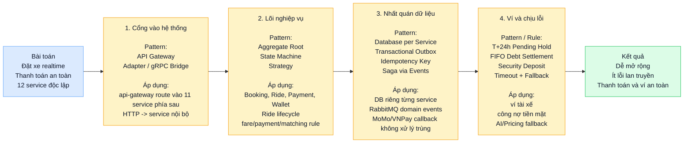
```mermaid
flowchart LR
    Problem["Bài toán<br/>Đặt xe realtime<br/>Thanh toán an toàn<br/>12 service độc lập"]

    Entry["1. Cổng vào hệ thống<br/><br/>Pattern:<br/>API Gateway<br/>Adapter / gRPC Bridge<br/><br/>Áp dụng:<br/>api-gateway route vào 11 service phía sau<br/>HTTP -> service nội bộ"]

    Core["2. Lõi nghiệp vụ<br/><br/>Pattern:<br/>Aggregate Root<br/>State Machine<br/>Strategy<br/><br/>Áp dụng:<br/>Booking, Ride, Payment, Wallet<br/>Ride lifecycle<br/>fare/payment/matching rule"]

    Consistency["3. Nhất quán dữ liệu<br/><br/>Pattern:<br/>Database per Service<br/>Transactional Outbox<br/>Idempotency Key<br/>Saga via Events<br/><br/>Áp dụng:<br/>DB riêng từng service<br/>RabbitMQ domain events<br/>MoMo/VNPay callback không xử lý trùng"]

    Finance["4. Ví và chịu lỗi<br/><br/>Pattern / Rule:<br/>T+24h Pending Hold<br/>FIFO Debt Settlement<br/>Security Deposit<br/>Timeout + Fallback<br/><br/>Áp dụng:<br/>ví tài xế<br/>công nợ tiền mặt<br/>AI/Pricing fallback"]

    Result["Kết quả<br/>Dễ mở rộng<br/>Ít lỗi lan truyền<br/>Thanh toán và ví an toàn"]

    Problem --> Entry --> Core --> Consistency --> Finance --> Result

    classDef problem fill:#dbeafe,stroke:#60a5fa,color:#0f172a
    classDef pattern fill:#fef3c7,stroke:#f59e0b,color:#0f172a
    classDef result fill:#dcfce7,stroke:#22c55e,color:#0f172a
    class Problem problem
    class Entry,Core,Consistency,Finance pattern
    class Result result
```

#### Bản thuyết trình: Design Patterns

**Định nghĩa.** Design Pattern là một cách tổ chức thiết kế đã được dùng nhiều lần để giải quyết một loại vấn đề quen thuộc. Ở đây, pattern không phải là một thư viện cụ thể, mà là cách hệ thống sắp xếp trách nhiệm để dễ mở rộng, dễ kiểm thử và giảm lỗi.

Khi thuyết trình, có thể nói theo ảnh từ trái sang phải:

1. **Bài toán của hệ thống** là đặt xe realtime, thanh toán an toàn và vận hành 12 service độc lập gồm `api-gateway` và 11 service phía sau. Vì vậy hệ thống cần pattern để kiểm soát ranh giới, trạng thái, dữ liệu và lỗi.
2. **Cổng vào hệ thống** dùng API Gateway. Tất cả Customer App, Driver App và Admin Dashboard đi qua gateway thay vì gọi thẳng 11 service nội bộ. Gateway xử lý routing, auth guard và bridge sang service nội bộ.
3. **Lõi nghiệp vụ** dùng Aggregate Root, State Machine và Strategy. `Booking`, `Ride`, `Payment`, `DriverWallet` là các aggregate chính. Ride State Machine giúp không chuyển sai trạng thái chuyến đi. Strategy dùng cho những phần có thể thay đổi như tính giá, provider thanh toán và scoring tài xế.
4. **Nhất quán dữ liệu** là phần quan trọng trong microservices. Mỗi service có database riêng, nên hệ thống dùng Transactional Outbox và RabbitMQ domain events để truyền sự kiện. Payment dùng Idempotency Key để callback MoMo/VNPay gọi lại nhiều lần cũng không bị trừ tiền hoặc cập nhật trùng. Toàn bộ luồng booking -> ride -> payment -> wallet được phối hợp như một Saga bằng event.
5. **Ví và chịu lỗi** là nhóm pattern/rule riêng cho nghiệp vụ tài chính. Thu nhập online của tài xế được giữ T+24h trước khi rút. Nếu chuyến tiền mặt, tài xế giữ tiền khách và ví ghi công nợ phí nền tảng, sau đó trả nợ theo FIFO. Security Deposit dùng để kích hoạt ví. Timeout + Fallback giúp AI/Pricing lỗi thì hệ thống vẫn trả được kết quả an toàn.
6. **Kết quả cuối cùng** là hệ thống dễ mở rộng, các service ít ảnh hưởng lẫn nhau, thanh toán không xử lý trùng, và ví tài xế có cơ chế kiểm soát công nợ rõ ràng.

Câu chốt có thể nói: “Các design pattern này không được đưa vào để làm hệ thống phức tạp hơn, mà để xử lý đúng những rủi ro thật của bài toán đặt xe: realtime, nhiều service, callback thanh toán lặp và dữ liệu tài chính cần chính xác.”

---

## 4. Các luồng nghiệp vụ chính

### 4.1 Luồng đặt xe và ghép tài xế

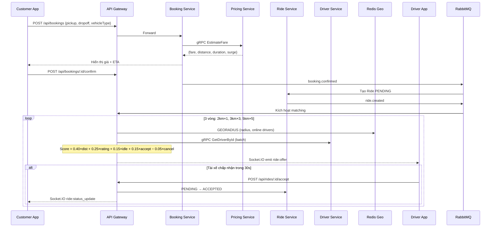
```mermaid
sequenceDiagram
    participant C as Customer App
    participant G as API Gateway
    participant B as Booking Service
    participant P as Pricing Service
    participant R as Ride Service
    participant D as Driver Service
    participant Redis as Redis Geo
    participant DA as Driver App

    C->>G: POST /api/bookings {pickup, dropoff, vehicleType}
    G->>B: Forward
    B->>P: gRPC EstimateFare
    P-->>B: {fare, distance, duration, surge}
    B-->>C: Hiển thị giá + ETA

    C->>G: POST /api/bookings/:id/confirm
    B->>RabbitMQ: booking.confirmed
    RabbitMQ->>R: Tạo Ride PENDING
    R->>RabbitMQ: ride.created
    RabbitMQ->>G: Kích hoạt matching

    loop 3 vòng: 2km×1, 3km×3, 5km×5
        G->>Redis: GEORADIUS (radius, online drivers)
        G->>D: gRPC GetDriverById (batch)
        Note over G: Score = 0.40×dist + 0.25×rating + 0.15×idle + 0.15×accept − 0.05×cancel
        G-->>DA: Socket.IO emit ride:offer
        alt Tài xế chấp nhận trong 30s
            DA->>G: POST /api/rides/:id/accept
            G->>R: PENDING → ACCEPTED
            G-->>C: Socket.IO ride:status_update
        end
    end
```

### 4.2 State Machine — Vòng đời chuyến đi

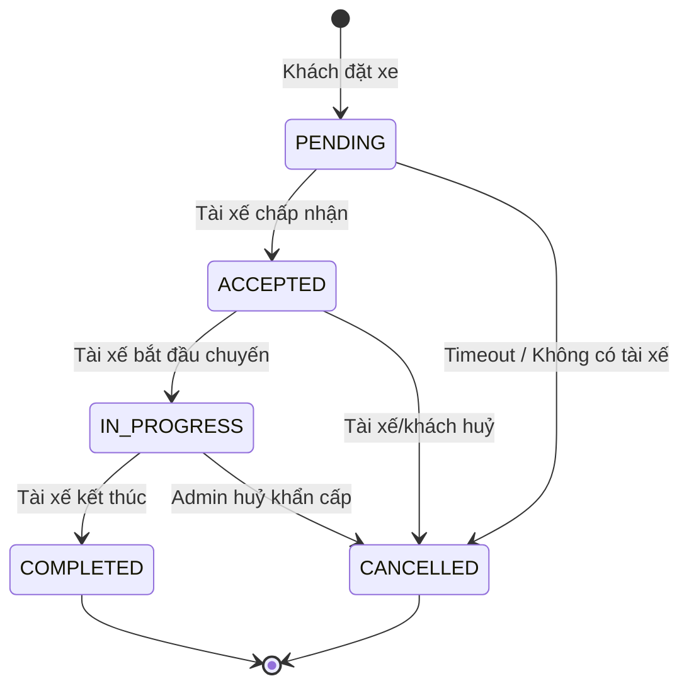
```mermaid
stateDiagram-v2
    [*] --> PENDING : Khách đặt xe
    PENDING --> ACCEPTED : Tài xế chấp nhận
    PENDING --> CANCELLED : Timeout / Không có tài xế

    ACCEPTED --> IN_PROGRESS : Tài xế bắt đầu chuyến
    ACCEPTED --> CANCELLED : Tài xế/khách huỷ

    IN_PROGRESS --> COMPLETED : Tài xế kết thúc
    IN_PROGRESS --> CANCELLED : Admin huỷ khẩn cấp

    COMPLETED --> [*]
    CANCELLED --> [*]
```

### 4.3 Luồng thanh toán (Outbox Pattern + Idempotency)

#### 4.3.1 Tạo thanh toán online và xử lý IPN

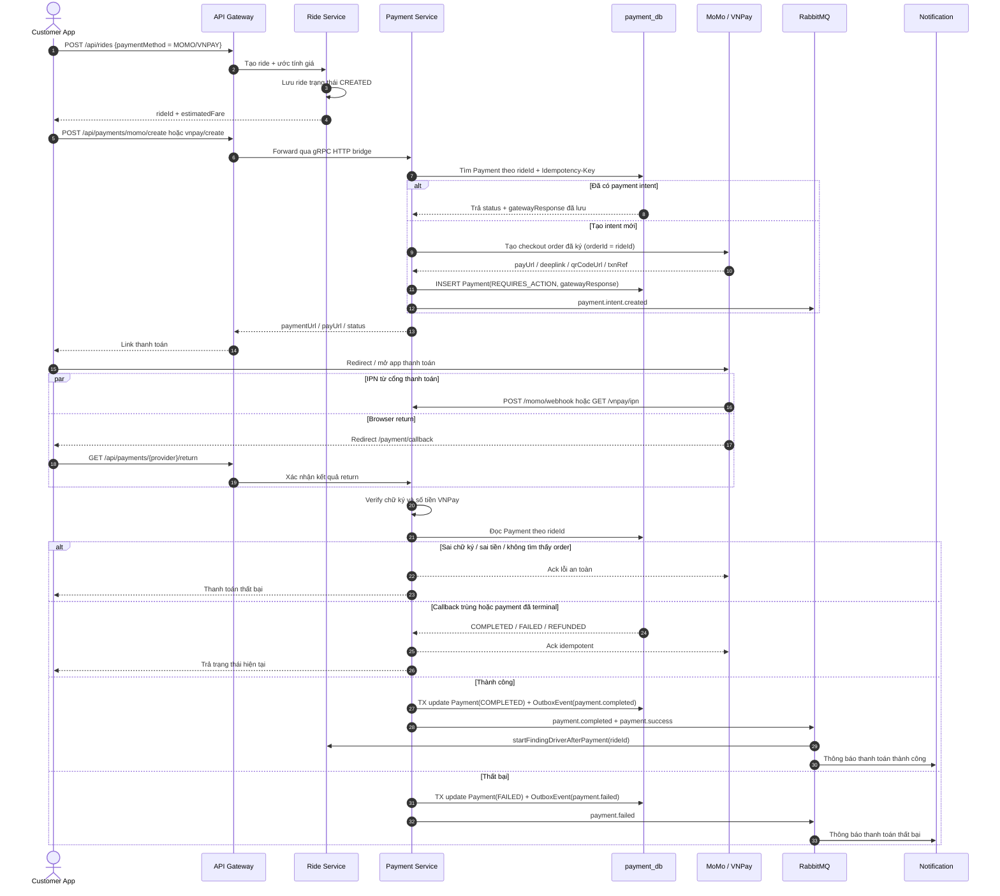
```mermaid
%%{init: {"sequence": {"mirrorActors": true}} }%%
sequenceDiagram
  autonumber
  actor C as Customer App
  participant G as API Gateway
  participant R as Ride Service
  participant Pay as Payment Service
  participant PDB as payment_db
  participant Provider as MoMo / VNPay
  participant MQ as RabbitMQ
  participant N as Notification

  C->>G: POST /api/rides {paymentMethod = MOMO/VNPAY}
  G->>R: Tạo ride + ước tính giá
  R->>R: Lưu ride trạng thái CREATED
  R-->>C: rideId + estimatedFare

  C->>G: POST /api/payments/momo/create hoặc vnpay/create
  G->>Pay: Forward qua gRPC HTTP bridge
  Pay->>PDB: Tìm Payment theo rideId + Idempotency-Key
  alt Đã có payment intent
    PDB-->>Pay: Trả status + gatewayResponse đã lưu
  else Tạo intent mới
    Pay->>Provider: Tạo checkout order đã ký (orderId = rideId)
    Provider-->>Pay: payUrl / deeplink / qrCodeUrl / txnRef
    Pay->>PDB: INSERT Payment(REQUIRES_ACTION, gatewayResponse)
    Pay->>MQ: payment.intent.created
  end
  Pay-->>G: paymentUrl / payUrl / status
  G-->>C: Link thanh toán
  C->>Provider: Redirect / mở app thanh toán

  par IPN từ cổng thanh toán
    Provider->>Pay: POST /momo/webhook hoặc GET /vnpay/ipn
  and Browser return
    Provider-->>C: Redirect /payment/callback
    C->>G: GET /api/payments/{provider}/return
    G->>Pay: Xác nhận kết quả return
  end

  Pay->>Pay: Verify chữ ký và số tiền VNPay
  Pay->>PDB: Đọc Payment theo rideId
  alt Sai chữ ký / sai tiền / không tìm thấy order
    Pay-->>Provider: Ack lỗi an toàn
    Pay-->>C: Thanh toán thất bại
  else Callback trùng hoặc payment đã terminal
    PDB-->>Pay: COMPLETED / FAILED / REFUNDED
    Pay-->>Provider: Ack idempotent
    Pay-->>C: Trả trạng thái hiện tại
  else Thành công
    Pay->>PDB: TX update Payment(COMPLETED) + OutboxEvent(payment.completed)
    Pay->>MQ: payment.completed + payment.success
    MQ->>R: startFindingDriverAfterPayment(rideId)
    MQ->>N: Thông báo thanh toán thành công
  else Thất bại
    Pay->>PDB: TX update Payment(FAILED) + OutboxEvent(payment.failed)
    Pay->>MQ: payment.failed
    MQ->>N: Thông báo thanh toán thất bại
  end
```

#### 4.3.2 Quyết toán sau khi chuyến hoàn thành

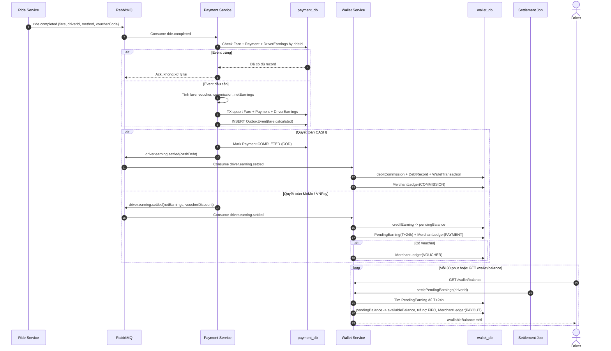
```mermaid
sequenceDiagram
  autonumber
  participant R as Ride Service
  participant MQ as RabbitMQ
  participant Pay as Payment Service
  participant PDB as payment_db
  participant W as Wallet Service
  participant WDB as wallet_db
  participant Job as Settlement Job
  actor D as Driver

  R->>MQ: ride.completed {fare, driverId, method, voucherCode}
  MQ->>Pay: Consume ride.completed
  Pay->>PDB: Check Fare + Payment + DriverEarnings by rideId
  alt Event trùng
    PDB-->>Pay: Đã có đủ record
    Pay-->>MQ: Ack, không xử lý lại
  else Event đầu tiên
    Pay->>Pay: Tính fare, voucher, commission, netEarnings
    Pay->>PDB: TX upsert Fare + Payment + DriverEarnings
    Pay->>PDB: INSERT OutboxEvent(fare.calculated)
  end

  alt Quyết toán CASH
    Pay->>PDB: Mark Payment COMPLETED (COD)
    Pay->>MQ: driver.earning.settled(cashDebt)
    MQ->>W: Consume driver.earning.settled
    W->>WDB: debitCommission + DebtRecord + WalletTransaction
    W->>WDB: MerchantLedger(COMMISSION)
  else Quyết toán MoMo / VNPay
    Pay->>MQ: driver.earning.settled(netEarnings, voucherDiscount)
    MQ->>W: Consume driver.earning.settled
    W->>WDB: creditEarning -> pendingBalance
    W->>WDB: PendingEarning(T+24h) + MerchantLedger(PAYMENT)
    alt Có voucher
      W->>WDB: MerchantLedger(VOUCHER)
    end
  end

  loop Mỗi 30 phút hoặc GET /wallet/balance
    D->>W: GET /wallet/balance
    Job->>W: settlePendingEarnings(driverId)
    W->>WDB: Tìm PendingEarning đủ T+24h
    W->>WDB: pendingBalance -> availableBalance, trả nợ FIFO, MerchantLedger(PAYOUT)
    W-->>D: availableBalance mới
  end
```

#### 4.3.3 Payment end-to-end của một chuyến đi

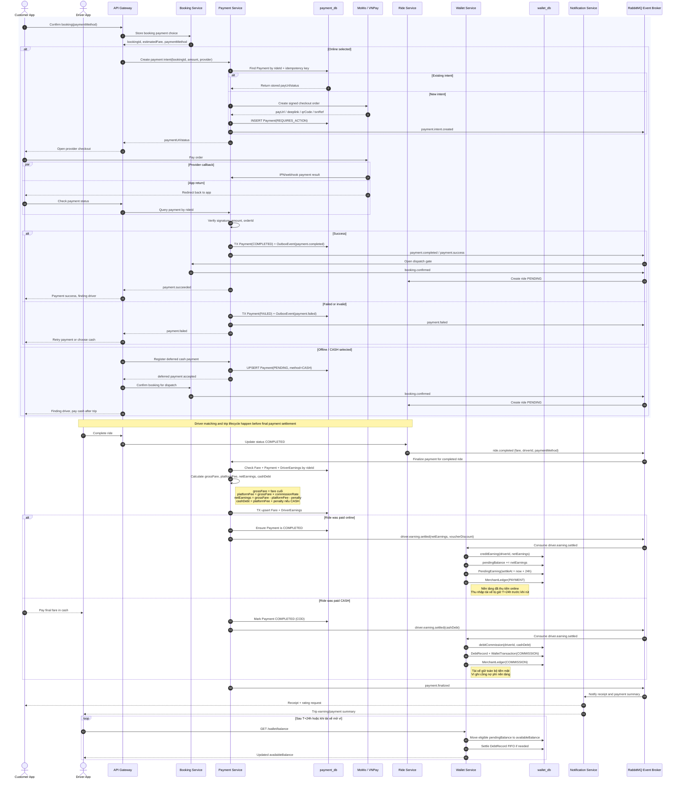
```mermaid
%%{init: {"sequence": {"mirrorActors": true}} }%%
sequenceDiagram
  autonumber
  actor C as Customer App
  actor D as Driver App
  participant G as API Gateway
  participant B as Booking Service
  participant Pay as Payment Service
  participant PDB as payment_db
  participant Provider as MoMo / VNPay
  participant Ride as Ride Service
  participant W as Wallet Service
  participant WDB as wallet_db
  participant N as Notification Service
  participant MQ as RabbitMQ Event Broker

  rect rgb(245, 247, 255)
    C->>G: Confirm booking(paymentMethod)
    G->>B: Store booking payment choice
    B-->>G: bookingId, estimatedFare, paymentMethod

    alt Online selected
      G->>Pay: Create payment intent(bookingId, amount, provider)
      Pay->>PDB: Find Payment by rideId + idempotency key
      alt Existing intent
        PDB-->>Pay: Return stored payUrl/status
      else New intent
        Pay->>Provider: Create signed checkout order
        Provider-->>Pay: payUrl / deeplink / qrCode / txnRef
        Pay->>PDB: INSERT Payment(REQUIRES_ACTION)
        Pay->>MQ: payment.intent.created
      end
      Pay-->>G: paymentUrl/status
      G-->>C: Open provider checkout
      C->>Provider: Pay order

      par Provider callback
        Provider->>Pay: IPN/webhook payment result
      and App return
        Provider-->>C: Redirect back to app
        C->>G: Check payment status
        G->>Pay: Query payment by rideId
      end

      Pay->>Pay: Verify signature, amount, orderId
      alt Success
        Pay->>PDB: TX Payment(COMPLETED) + OutboxEvent(payment.completed)
        Pay->>MQ: payment.completed / payment.success
        MQ->>B: Open dispatch gate
        B->>MQ: booking.confirmed
        MQ->>Ride: Create ride PENDING
        Pay-->>G: payment.succeeded
        G-->>C: Payment success, finding driver
      else Failed or invalid
        Pay->>PDB: TX Payment(FAILED) + OutboxEvent(payment.failed)
        Pay->>MQ: payment.failed
        Pay-->>G: payment.failed
        G-->>C: Retry payment or choose cash
      end
    else Offline / CASH selected
      G->>Pay: Register deferred cash payment
      Pay->>PDB: UPSERT Payment(PENDING, method=CASH)
      Pay-->>G: deferred payment accepted
      G->>B: Confirm booking for dispatch
      B->>MQ: booking.confirmed
      MQ->>Ride: Create ride PENDING
      G-->>C: Finding driver, pay cash after trip
    end
  end

  Note over Ride,D: Driver matching and trip lifecycle happen before final payment settlement

  D->>G: Complete ride
  G->>Ride: Update status COMPLETED
  Ride->>MQ: ride.completed {fare, driverId, paymentMethod}
  MQ->>Pay: Finalize payment for completed ride
  Pay->>PDB: Check Fare + Payment + DriverEarnings by rideId
  Pay->>Pay: Calculate grossFare, platformFee, netEarnings, cashDebt
  Note right of Pay: grossFare = fare cuối<br/>platformFee = grossFare × commissionRate<br/>netEarnings = grossFare - platformFee - penalty<br/>cashDebt = platformFee + penalty nếu CASH
  Pay->>PDB: TX upsert Fare + DriverEarnings

  alt Ride was paid online
    Pay->>PDB: Ensure Payment is COMPLETED
    Pay->>MQ: driver.earning.settled(netEarnings, voucherDiscount)
    MQ->>W: Consume driver.earning.settled
    W->>WDB: creditEarning(driverId, netEarnings)
    W->>WDB: pendingBalance += netEarnings
    W->>WDB: PendingEarning(settleAt = now + 24h)
    W->>WDB: MerchantLedger(PAYMENT)
    Note right of W: Nền tảng đã thu tiền online<br/>Thu nhập tài xế bị giữ T+24h trước khi rút
  else Ride was paid CASH
    C-->>D: Pay final fare in cash
    Pay->>PDB: Mark Payment COMPLETED (COD)
    Pay->>MQ: driver.earning.settled(cashDebt)
    MQ->>W: Consume driver.earning.settled
    W->>WDB: debitCommission(driverId, cashDebt)
    W->>WDB: DebtRecord + WalletTransaction(COMMISSION)
    W->>WDB: MerchantLedger(COMMISSION)
    Note right of W: Tài xế giữ toàn bộ tiền mặt<br/>Ví ghi công nợ phí nền tảng
  end

  Pay->>MQ: payment.finalized
  MQ->>N: Notify receipt and payment summary
  N-->>C: Receipt + rating request
  N-->>D: Trip earning/payment summary

  loop Sau T+24h hoặc khi tài xế mở ví
    D->>W: GET /wallet/balance
    W->>WDB: Move eligible pendingBalance to availableBalance
    W->>WDB: Settle DebtRecord FIFO if needed
    W-->>D: Updated availableBalance
  end
```

### 4.4 Luồng ví tài xế

```
availableBalance = balance - lockedBalance(300k) - pendingBalance(T+24h) - debt

CASH ride flow:
  1. Tài xế nhận toàn bộ tiền mặt từ khách
  2. DebtRecord: nợ platformFee (20% MOTORBIKE / 18% CAR_4 / 15% CAR_7)
  3. Settlement job hoặc GET /wallet/balance trả nợ FIFO khi có earning/top-up đủ điều kiện
```

### 4.5 Sequence end-to-end — Quy trình đặt xe

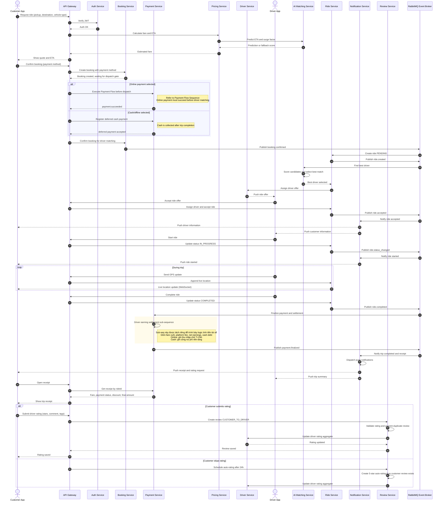
```mermaid
%%{init: {"sequence": {"mirrorActors": true}} }%%
sequenceDiagram
  autonumber
  actor Customer as Customer App
  participant Gateway as API Gateway
  participant Auth as Auth Service
  participant Booking as Booking Service
  participant Payment as Payment Service
  participant Pricing as Pricing Service
  participant Driver as Driver Service
  actor DriverApp as Driver App
  participant AI as AI Matching Service
  participant Ride as Ride Service
  participant Notification as Notification Service
  participant Review as Review Service
  participant Broker as RabbitMQ Event Broker

  Customer->>Gateway: Request ride (pickup, destination, vehicle type)
  Gateway->>Auth: Verify JWT
  Auth-->>Gateway: Auth OK
  Gateway->>Pricing: Calculate fare and ETA
  Pricing->>AI: Predict ETA and surge factor
  AI-->>Pricing: Prediction or fallback score
  Pricing-->>Gateway: Estimated fare
  Gateway-->>Customer: Show quote and ETA

  Customer->>Gateway: Confirm booking (payment method)
  Gateway->>Booking: Create booking with payment method
  Booking-->>Gateway: Booking created, waiting for dispatch gate
  rect rgb(245, 247, 255)
    alt Online payment selected
      Gateway->>Payment: Execute Payment Flow before dispatch
      Note right of Payment: Refer to Payment Flow Sequence<br/>Online payment must succeed before driver matching
      Payment-->>Gateway: payment.succeeded
    else Cash/offline selected
      Gateway->>Payment: Register deferred cash payment
      Note right of Payment: Cash is collected after trip completion
      Payment-->>Gateway: deferred payment accepted
    end
  end
  Gateway->>Booking: Confirm booking for driver matching
  Booking->>Broker: Publish booking.confirmed
  Broker->>Ride: Create ride PENDING
  Ride->>Broker: Publish ride.created

  Broker->>AI: Find best driver
  AI->>AI: Score candidates and select best match
  AI-->>Ride: Best driver selected
  Ride->>Driver: Assign driver offer
  Driver-->>DriverApp: Push ride offer
  DriverApp->>Gateway: Accept ride offer
  Gateway->>Ride: Assign driver and accept ride
  Ride->>Broker: Publish ride.accepted
  Broker->>Notification: Notify ride accepted
  Notification-->>Customer: Push driver information
  Notification-->>DriverApp: Push customer information

  DriverApp->>Gateway: Start ride
  Gateway->>Ride: Update status IN_PROGRESS
  Ride->>Broker: Publish ride.status_changed
  Broker->>Notification: Notify ride started
  Notification-->>Customer: Push ride started

  loop During trip
    DriverApp->>Gateway: Send GPS update
    Gateway->>Ride: Append live location
    Ride-->>Customer: Live location update (WebSocket)
  end

  DriverApp->>Gateway: Complete ride
  Gateway->>Ride: Update status COMPLETED
  Ride->>Broker: Publish ride.completed
  Broker->>Payment: Finalize payment and settlement
  rect rgb(255, 251, 235)
    Payment->>Payment: Driver earning settlement sub-sequence
    Note right of Payment: Sub-seq này được tách riêng để trình bày logic tính tiền tài xế<br/>Gồm fare cuối, platform fee, net earnings, cash debt<br/>Online: ghi thu nhập chờ T+24h<br/>Cash: ghi công nợ phí nền tảng
  end
  Payment->>Broker: Publish payment.finalized
  Broker->>Notification: Notify trip completed and receipt
  Notification->>Notification: Dispatch push notifications
  Notification-->>Customer: Push receipt and rating request
  Notification-->>DriverApp: Push trip summary

  Customer->>Gateway: Open receipt
  Gateway->>Payment: Get receipt by rideId
  Payment-->>Gateway: Fare, payment status, discount, final amount
  Gateway-->>Customer: Show trip receipt

  alt Customer submits rating
    Customer->>Gateway: Submit driver rating (stars, comment, tags)
    Gateway->>Review: Create review CUSTOMER_TO_DRIVER
    Review->>Review: Validate rating and prevent duplicate review
    Review->>Driver: Update driver rating aggregate
    Driver-->>Review: Rating updated
    Review-->>Gateway: Review saved
    Gateway-->>Customer: Rating saved
  else Customer skips rating
    Gateway->>Review: Schedule auto-rating after 24h
    Review->>Review: Create 5-star auto-rating if no customer review exists
    Review->>Driver: Update driver rating aggregate
  end
```

---

## 5. Mô hình dữ liệu và tích hợp

### 5.1 Phân tách database

| DBMS | Database | Service | Schema cốt lõi |
|------|---------|---------|---------------|
| PostgreSQL | `location_db` | API Gateway | Bảng địa giới hành chính (location admin) |
| PostgreSQL | `auth_db` | Auth | User, RefreshToken, AuditLog |
| PostgreSQL | `user_db` | User | UserProfile |
| PostgreSQL | `driver_db` | Driver | Driver, DriverLicense, DriverLocation |
| PostgreSQL | `ride_db` | Ride | Ride, RideStateTransition, RideChatMessage |
| PostgreSQL | `booking_db` | Booking | Booking |
| PostgreSQL | `payment_db` | Payment | Fare, Payment, DriverEarnings, OutboxEvent |
| PostgreSQL | `wallet_db` | Wallet | DriverWallet, PendingEarning, DebtRecord, MerchantLedger |
| MongoDB | `notification_db` | Notification | notifications, push_tokens |
| MongoDB | `review_db` | Review | reviews |

> **8** PostgreSQL database trên **một** instance (cổng host **5433** trong `docker-compose`). Mỗi service có Prisma client (hoặc SQL) riêng khi áp dụng.

### 5.2 ERD (các aggregate chính)

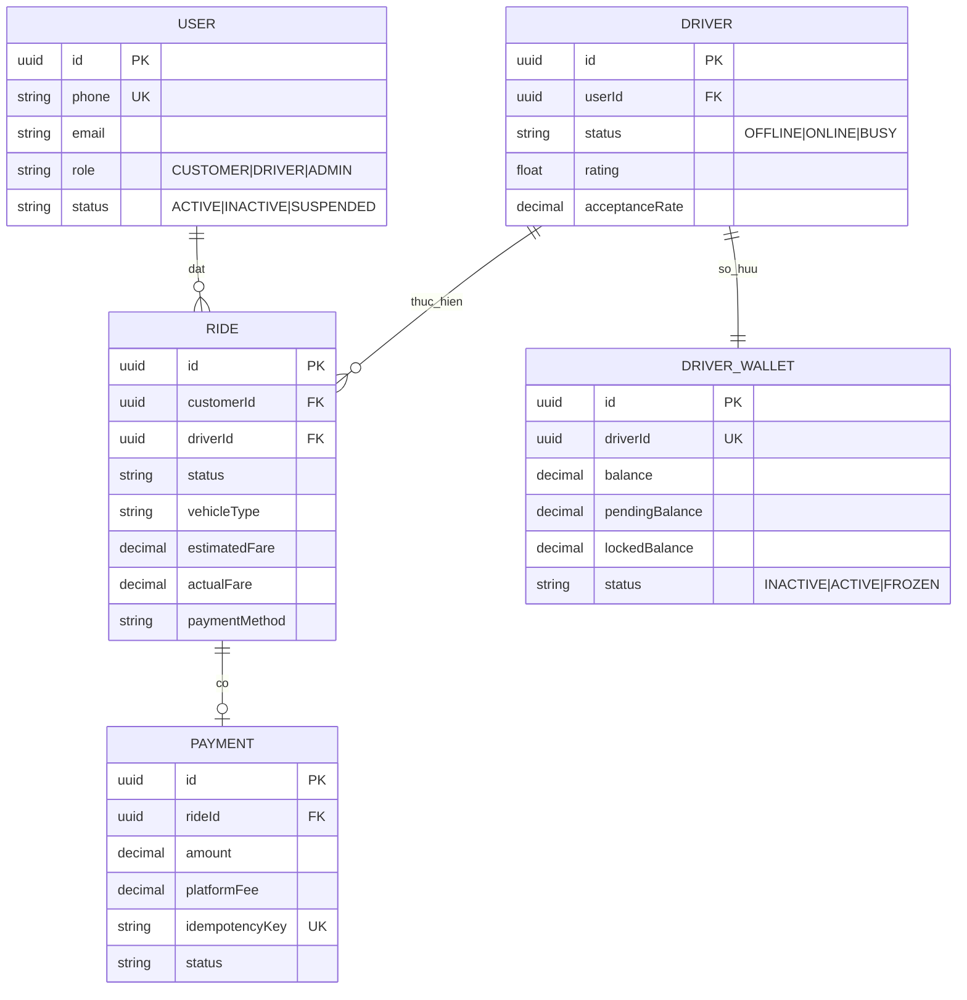
```mermaid
erDiagram
    USER {
        uuid id PK
        string phone UK
        string email
        string role "CUSTOMER|DRIVER|ADMIN"
        string status "ACTIVE|INACTIVE|SUSPENDED"
    }
    RIDE {
        uuid id PK
        uuid customerId FK
        uuid driverId FK
        string status
        string vehicleType
        decimal estimatedFare
        decimal actualFare
        string paymentMethod
    }
    DRIVER {
        uuid id PK
        uuid userId FK
        string status "OFFLINE|ONLINE|BUSY"
        float rating
        decimal acceptanceRate
    }
    PAYMENT {
        uuid id PK
        uuid rideId FK
        decimal amount
        decimal platformFee
        string idempotencyKey UK
        string status
    }
    DRIVER_WALLET {
        uuid id PK
        uuid driverId UK
        decimal balance
        decimal pendingBalance
        decimal lockedBalance
        string status "INACTIVE|ACTIVE|FROZEN"
    }
    USER ||--o{ RIDE : dat
    DRIVER ||--o{ RIDE : thuc_hien
    RIDE ||--o| PAYMENT : co
    DRIVER ||--|| DRIVER_WALLET : so_huu
```

---

## 6. Cấu trúc thư mục

```text
Cab-Booking-System-Project/
├── apps/
│   ├── customer-app/          # React SPA — khách hàng
│   ├── driver-app/            # React SPA — tài xế
│   └── admin-dashboard/       # React SPA — quản trị
│
├── services/
│   ├── api-gateway/           # HTTP 3000 — entry point, matching, Socket.IO
│   ├── auth-service/          # HTTP 3001, gRPC 50051 — OTP, JWT
│   ├── user-service/          # HTTP 3007, gRPC 50052
│   ├── booking-service/       # HTTP 3008, gRPC 50053
│   ├── ride-service/          # HTTP 3002, gRPC 50054 — state machine
│   ├── driver-service/        # HTTP 3003, gRPC 50055 — geo, location
│   ├── payment-service/       # HTTP 3004, gRPC 50056 — MoMo/VNPay
│   ├── pricing-service/       # HTTP 3009, gRPC 50057
│   ├── wallet-service/        # HTTP 3006 — fintech
│   ├── notification-service/  # HTTP 3005
│   ├── review-service/        # HTTP 3010
│   └── ai-service/            # HTTP 8000 — FastAPI, ML, RAG
│
├── shared/                    # @cab-booking/shared
│   ├── types/                 # TypeScript interfaces, events
│   ├── grpc/                  # Protobuf definitions
│   └── utils/                 # Internal auth, geo, validation
│
├── monitoring/
│   ├── README.md              # Docs chi tiết từng component
│   ├── prometheus/prometheus.yml
│   ├── loki/loki-config.yml
│   ├── promtail/promtail-config.yml
│   └── grafana/
│       ├── provisioning/      # Auto-config datasource + dashboard
│       └── dashboards/        # 4 JSON dashboards
│
├── img/                       # PNG sơ đồ / báo cáo (taxonomy `{loại}_{chức_năng}_…`)
│
├── docs/                      # Báo cáo, mục lục, mô tả từng service
│   ├── README.md
│   ├── bao-cao-kltn.md
│   ├── diagrams/              # DIAGRAM_GUIDE, mermaid/, …
│   └── services/              # 01-api-gateway.md … 12-ai-service.md
│
├── deploy/
│   ├── SWARM-SETUP.md         # Docker Swarm + AWS (hướng dẫn đầy đủ trong repo)
│   └── nginx/nginx-apps.conf  # Ví dụ server_name foxgo.io.vn / API proxy :3000
│
├── scripts/
│   ├── reset-database.sh/.bat # Reset + migrate + seed
│   ├── seed-database.ts        # Seed dữ liệu mẫu
│   ├── publish-bao-cao-docs-bundle.mjs
│   ├── export-bao-cao-mermaid.mjs
│   ├── verify-bao-cao-img-refs.mjs
│   ├── generate_diagrams.py    # Mermaid gốc docs/diagrams/mermaid/*.mmd → img/*.png
│   ├── run-integration-backend.ts  # Kiểm tra tích hợp (CI / local)
│   └── …                       # các script khác (xem thư mục)
│
├── .github/workflows/ci-cd.yml  # Pipeline CI/CD
├── docker-compose.yml           # Local dev stack
├── docker-stack.thesis.yml      # AWS Docker Swarm stack
└── package.json                 # Workspace root
```

---

## 7. Cổng dịch vụ và môi trường chạy

| Service | HTTP | gRPC | Database |
|---------|------|------|----------|
| API Gateway | **3000** | — | Redis, PostgreSQL `location_db` |
| Auth | 3001 | **50051** | auth_db |
| Ride | 3002 | **50054** | ride_db |
| Driver | 3003 | **50055** | driver_db + Redis |
| Payment | 3004 | **50056** | payment_db |
| Notification | 3005 | — | notification_db (Mongo) |
| Wallet | 3006 | — | wallet_db |
| User | 3007 | **50052** | user_db |
| Booking | 3008 | **50053** | booking_db |
| Pricing | 3009 | **50057** | Redis (stateless) |
| Review | 3010 | — | review_db (Mongo) |
| AI | **8000** | — | File models |
| PostgreSQL | **5433** | — | 8 databases |
| MongoDB | 27017 | — | 2 databases |
| Redis | 6379 | — | |
| RabbitMQ | 5672 | — | |
| RabbitMQ UI | 15672 | — | |

---

## 8. Hướng dẫn cài đặt và khởi động

### 8.1 Yêu cầu

- Node.js >= 20, npm >= 10
- Docker Desktop (Docker Compose v2)

### 8.2 Chạy local với Docker

```bash
git clone <repository-url>
cd Cab-Booking-System-Project
cp .env.example .env    # chỉnh sửa theo môi trường

docker compose up -d
```

| URL | Mục đích |
|-----|---------|
| http://localhost:4000 | Customer App |
| http://localhost:4001 | Driver App |
| http://localhost:4002 | Admin Dashboard |
| http://localhost:3000 | API Gateway |
| http://localhost:15672 | RabbitMQ (guest/guest) |

### 8.3 Chế độ dev (hot-reload)

```bash
npm run build:shared     # bắt buộc chạy trước
npm run dev:gateway      # API Gateway
npm run dev:auth         # Auth Service
# ... xem package.json để đầy đủ danh sách
```

### 8.4 Seed dữ liệu

```bash
npm run db:seed
# 1 admin, 20 khách hàng, 40 tài xế, 28 chuyến, vouchers
```

### 8.5 Lấy OTP bằng Postman (Docker & deploy)

**Chung:** `OTP_SMS_MODE=mock` và **`OTP_ENABLE_DEV_ENDPOINT=true`** phải có trên **cả `auth-service` và `api-gateway`** (để `GET /api/auth/dev/otp` không bị chặn bởi gateway khi `NODE_ENV=production`). Giá trị được nhận: `true` / `1` / `yes` / `on` (không phân biệt hoa thường, đã trim).

**Docker Compose (dev):** trong `docker-compose.yml` đã gắn sẵn `OTP_ENABLE_DEV_ENDPOINT=true` và `OTP_SMS_MODE=mock` cho auth; gateway cũng có cờ OTP. File mẫu: `env/auth.env.example` → copy thành `env/auth.env` nếu cần override. Hướng dẫn ngắn: `env/README.md`.

**Docker Compose prod (image từ registry):** `docker-compose.prod.yml` mặc định `OTP_ENABLE_DEV_ENDPOINT=true` và có thể đổi `OTP_SMS_MODE` qua biến môi trường root `.env`.

**Swarm / server:** tạo `~/cab-booking/env/auth.env` và `gateway.env` từ `env/auth.env.example` và `env/gateway.env.example`, điền secret và URL thật, rồi redeploy stack.

**Luồng Postman**

- **`foxgo_gateway_url`** (deploy) hoặc **`docker_gateway_url`** (Docker/local): là **gốc gateway**, không thêm `/api` cuối (ví dụ đúng: `http://localhost:3000`, `https://api.foxgo.io.vn`; sai: `.../api` — dễ thành `/api/api/...`).

1. `POST {foxgo_gateway_url}/api/auth/register-phone/start` — body `{ "phone": "0901234501" }` (hoặc `docker_gateway_url` khi chạy local).

2. `GET {foxgo_gateway_url}/api/auth/dev/otp?phone=0901234501&purpose=register` — hoặc `phone=%2B84901234501`. **Không** cần `Authorization`; số trong query có thể `0xxxxxxxxxx` hoặc `+84…` / `84…`.

**Collection Postman (hai file, hai tên biến — không dùng chung):**

- Deploy/staging: `postman/FoxGo-API-Deploy.postman_collection.json` — biến **`foxgo_gateway_url`**, mặc định `https://api.foxgo.io.vn`.
- Chỉ Docker/localhost: `postman/FoxGo-API-Docker-Local.postman_collection.json` — biến **`docker_gateway_url`**, mặc định `http://localhost:3000`.

**Import vào Postman:** mở **Import** (`Ctrl+O`), chọn **`FoxGo-API-Deploy.postman_collection.json`**, sau đó **Import** lại **`FoxGo-API-Docker-Local.postman_collection.json`**; hoặc trong một lần Import chọn **cả hai file** — thành **hai collection** cạnh nhau trong sidebar.

Đổi mật khẩu (quên mật khẩu) dùng `purpose=reset`:

```http
GET {foxgo_gateway_url}/api/auth/dev/otp?phone=0901234501&purpose=reset
```

- Local Docker: `docker_gateway_url=http://localhost:3000`
- Deploy: `foxgo_gateway_url=https://api.<domain>` (ví dụ `https://api.foxgo.io.vn`)

**Cảnh báo:** `OTP_ENABLE_DEV_ENDPOINT` chỉ nên bật trên môi trường demo / thử nghiệm. Production thật: tắt cờ này và dùng SMS thật, ví dụ:

```env
OTP_SMS_MODE=sns        # AWS SNS (EC2 IAM role), auth-service đã có @aws-sdk/client-sns
OTP_SMS_MODE=speedsms   # SpeedSMS VN
OTP_SMS_MODE=twilio
```

Nếu `OTP_SMS_MODE=sns` mà vẫn lỗi gửi OTP: kiểm tra IAM `sns:Publish`, Sandbox SNS, hoặc cấu hình provider.

**Gỡ lỗi nhanh (local):** `docker logs cab-auth-service 2>&1 | grep OTP`

---

## 9. Kiểm thử và CI/CD

### 9.1 Các mức kiểm thử

```bash
npm run test:unit        # unit tests (mock DB)
npm run test:contract    # driver ↔ ride service boundary
npm run test:integration # full stack với Docker infra
npm run test:coverage    # coverage report
cd services/ai-service && pytest -q  # AI service tests
```

### 9.2 CI/CD Pipeline

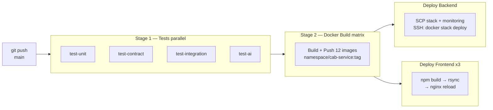
```mermaid
flowchart LR
    Push["git push\nmain"] --> S1

    subgraph S1["Stage 1 — Tests parallel"]
        T1["test-unit"]
        T2["test-contract"]
        T3["test-integration"]
        T4["test-ai"]
    end

    S1 --> S2

    subgraph S2["Stage 2 — Docker Build matrix"]
        D["Build + Push 12 images\nnamespace/cab-service:tag"]
    end

    S2 --> S3a
    S2 --> S3b

    subgraph S3a["Deploy Backend"]
        B["SCP stack + monitoring\nSSH: docker stack deploy"]
    end

    subgraph S3b["Deploy Frontend x3"]
        F["npm build → rsync\n→ nginx reload"]
    end
```

**Docker Hub pull rate:** các `Dockerfile` dùng mirror **AWS Public ECR** `public.ecr.aws/docker/library/*` (Node / Python official) để CI hạn chế lỗi giới hạn pull `docker.io` khi build song song.

---

## 10. Triển khai trên AWS

### 10.1 Kiến trúc minh họa (Nginx trên host + Docker Swarm)

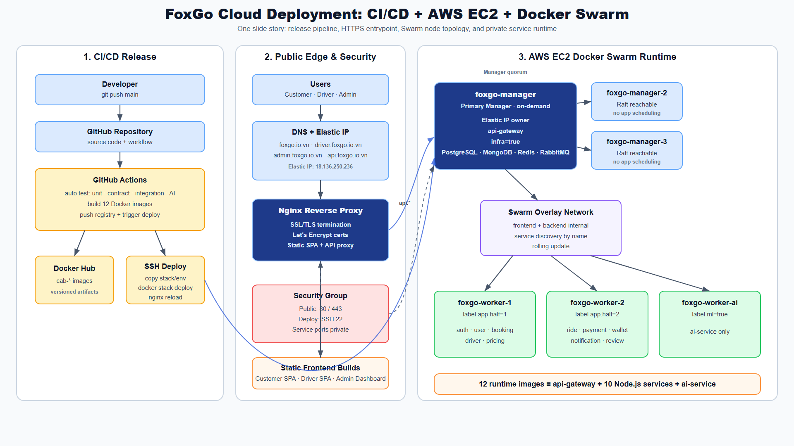

#### Bản thuyết trình: Triển khai & Hạ tầng Cloud

**Định nghĩa.** Containerization là cách đóng gói ứng dụng cùng dependency, runtime và cấu hình cần thiết vào container để chạy nhất quán giữa máy local, CI và server. Trong hệ thống này, mỗi service được build thành một Docker image riêng.

**Docker Swarm** là công cụ orchestration của Docker, dùng để chạy nhiều container như một stack, hỗ trợ service discovery, overlay network, rolling update và scale replica trên các EC2 node.

**AWS EC2** là lớp hạ tầng máy chủ cloud. Ở đây EC2 đóng vai trò runtime chính: chạy Nginx trên host, chạy Docker Swarm cho backend services, và lưu các thành phần hạ tầng như PostgreSQL, MongoDB, Redis, RabbitMQ theo cấu hình deploy.

**CI/CD** là quy trình tự động hóa từ lúc push code đến lúc triển khai. GitHub Actions chạy test, build Docker image, push lên Docker Hub, sau đó SSH vào EC2 để deploy stack.

**Nginx Reverse Proxy & SSL/TLS** là lớp bảo mật và định tuyến ở cửa vào. Nginx nhận traffic HTTPS, kết thúc SSL/TLS bằng certificate Let's Encrypt, phục vụ ba frontend static, và reverse proxy `api.foxgo.io.vn` vào `api-gateway`.

Với ảnh tổng hợp bên trên, phần trình bày nên đi theo 3 cột rõ ràng: CI/CD release, public edge, và AWS Swarm runtime.

#### Cách thuyết trình ảnh tổng hợp

Ảnh này gộp CI/CD và deploy runtime vào **một câu chuyện duy nhất**. Khi trình bày, nên đi theo đúng 3 cột trên ảnh, từ trái sang phải:

1. **Cột 1 — CI/CD Release.** Developer push code lên GitHub. GitHub Actions tự chạy test, build 12 Docker image, push image lên Docker Hub, rồi SSH vào EC2 để chạy `docker stack deploy` và reload Nginx. Ý chính: hệ thống không deploy thủ công từng service, mà release qua pipeline tự động.
2. **Cột 2 — Public Edge & Security.** Người dùng chỉ truy cập các domain public như `foxgo.io.vn`, `driver.foxgo.io.vn`, `admin.foxgo.io.vn`, `api.foxgo.io.vn`. Tất cả đi qua Nginx, nơi xử lý SSL/TLS, route frontend static và reverse proxy API vào `api-gateway`. Security Group chỉ mở 80/443 và SSH deploy, còn service ports không public trực tiếp.
3. **Cột 3 — AWS EC2 Docker Swarm Runtime.** Bên trong cloud là cụm Swarm. `foxgo-manager` là Primary Manager, giữ Elastic IP, chạy `api-gateway` và nhóm hạ tầng như PostgreSQL, MongoDB, Redis, RabbitMQ. Hai manager còn lại giữ Raft quorum. Worker 1 chạy nhóm auth/user/booking/driver/pricing, worker 2 chạy ride/payment/wallet/notification/review, còn worker AI chỉ chạy `ai-service`.
4. **Phần nối giữa các cột.** Mũi tên từ CI/CD sang runtime thể hiện image và stack được đưa lên Primary Manager. Mũi tên từ Nginx sang Primary Manager thể hiện `api.*` được reverse proxy vào `api-gateway`. Từ `api-gateway`, các service giao tiếp nội bộ qua Swarm overlay network.

Đoạn nói mẫu:

> “Ở slide này em trình bày toàn bộ deployment trong một ảnh. Bên trái là pipeline release: code được GitHub Actions test, build thành 12 Docker image và deploy lên EC2. Ở giữa là cửa vào public: người dùng chỉ đi qua DNS và Nginx HTTPS, Nginx vừa phục vụ frontend static vừa reverse proxy API. Bên phải là runtime thật trên AWS: Docker Swarm chia cụm thành manager quorum và worker nodes. Primary Manager giữ `api-gateway` và hạ tầng dữ liệu, hai worker app chia 10 service Node.js, còn worker AI chạy riêng `ai-service`. Nhờ cách này, bên ngoài chỉ thấy HTTPS qua Nginx, còn các service phía sau chạy private trong overlay network.”

Ý chính cần chốt: “Một lần push code sẽ đi qua CI/CD để tạo image và deploy stack; còn khi chạy thật, Nginx là cửa ngoài, Docker Swarm là lớp điều phối container, và các service nội bộ không public trực tiếp ra Internet.”

```
Internet
    ├── https://foxgo.io.vn          → Customer App (static)
    ├── https://driver.foxgo.io.vn   → Driver App (static)
    ├── https://admin.foxgo.io.vn    → Admin Dashboard (static)
    └── https://api.foxgo.io.vn      → API Gateway
              │
    ┌─────────┴──────────────────────────────────────┐
    │  AWS EC2 — Elastic IP tham chiếu: 18.136.250.236│
    │  Region ap-southeast-1 · Ubuntu 22.04           │
    │  (Kiểu instance / multi-node — xem SWARM-SETUP) │
    │                                                  │
    │  ┌─────── Nginx (host) ──────────────────────┐  │
    │  │  :80/:443 → SPA build (customer/driver/admin)│  │
    │  │  api.* → reverse proxy localhost:3000       │  │
    │  └───────────────────────────────────────────┘  │
    │                                                  │
    │  ┌─────── Docker Swarm ─────────────────────────┐  │
    │  │  Infra: PostgreSQL, MongoDB, Redis, RabbitMQ │  │
    │  │  11 service Node + 1 AI (FastAPI)            │  │
    │  │  Quan sát: Prometheus, Grafana, Loki (tuỳ bật)│  │
    │  └─────────────────────────────────────────────┘  │
    └────────────────────────────────────────────────────┘
```

### 10.2 GitHub Secrets (CI/CD — xem `.github/workflows/ci-cd.yml`)

| Secret | Ghi chú |
|--------|---------|
| `DOCKERHUB_USERNAME` | Namespace Docker Hub (image `…/cab-<service>`) |
| `DOCKERHUB_TOKEN` | Access token push image |
| `DEPLOY_HOST` | IP public hoặc hostname SSH (ví dụ Elastic IP) |
| `DEPLOY_USER` | User SSH (thường `ubuntu`) |
| `DEPLOY_SSH_KEY` | Private key PEM |
| `DEPLOY_PORT` | *(tuỳ chọn)* cổng SSH, mặc định 22 |
| `REACT_APP_API_URL` | Origin API công khai, ví dụ `https://api.foxgo.io.vn` |
| `REACT_APP_SOCKET_URL` | Trùng origin WebSocket (thường cùng API) |
| `REACT_APP_GOOGLE_MAPS_API_KEY` | *(tuỳ chọn)* |

Nếu backend deploy fail ở `appleboy/scp-action` với `dial tcp ...:22: i/o timeout`, lỗi xảy ra trước `docker stack deploy` nên chưa phải lỗi Swarm. Kiểm tra nhanh:

- EC2 Primary Manager đang `running`, không bị stop/terminate.
- Elastic IP/DNS trong `DEPLOY_HOST` đang trỏ đúng Primary Manager.
- Security Group/NACL mở inbound SSH `DEPLOY_PORT` từ GitHub Actions runners; với runner hosted IP động thường cần `0.0.0.0/0` cho port 22 hoặc dùng self-hosted runner/VPN.
- `DEPLOY_PORT` đúng cổng SSH thật, thường `22`.
- SSH daemon trên server đang chạy: `sudo systemctl status ssh`.

### 10.3 Deploy thủ công (kích hoạt lại pipeline)

```bash
git commit --allow-empty -m "ci: manual redeploy"
git push origin main
```

### 10.4 Hướng dẫn đầy đủ trên AWS (Swarm, SG, TLS, env)

Xem **[`deploy/SWARM-SETUP.md`](deploy/SWARM-SETUP.md)** (Elastic IP `18.136.250.236`, security group, multi-node có thể mở rộng).

---

## 11. Monitoring và Observability

### 11.1 Stack

| Component | Tác dụng | URL |
|-----------|---------|-----|
| **Prometheus** | Thu thập metrics mỗi 15s | `http://18.136.250.236:9090` *(tuỳ SG — có thể chỉ My IP)* |
| **Grafana** | Dashboard visualization | `http://18.136.250.236:3030` |
| **Loki** | Log aggregation | (qua Grafana) |
| **Promtail** | Log collector từ Docker | — |
| **cAdvisor** | Container metrics | *(thường nội bộ cluster / SG)* |
| **Node Exporter** | Host metrics | — |

### 11.2 Dashboards tự động load

| Dashboard | Nội dung |
|-----------|---------|
| System Overview | CPU, Memory, Disk, Network, Load Average của EC2 |
| Container Resources | CPU/Memory từng service Docker |
| Application Metrics | RabbitMQ queues, API Gateway AI matching |
| Service Logs | Log explorer theo service, filter error |

### 11.3 Metrics thu thập

- **Host**: CPU usage, memory, disk, network throughput, load average
- **Containers**: CPU/memory/network per service
- **RabbitMQ**: Queue depth, consumers, message rates
- **API Gateway**: HTTP requests, WebSocket connections, AI matching decisions
- **Logs**: Tất cả stdout/stderr từ **stack ứng dụng** (gateway + dịch vụ Node + AI) qua Docker

Xem chi tiết: [`monitoring/README.md`](monitoring/README.md)

---

## 12. Hướng phát triển tiếp theo

### Kỹ thuật
- **Distributed Tracing**: Tích hợp OpenTelemetry để trace xuyên suốt qua các service
- **Circuit Breaker**: Thêm opossum để tránh cascade failure
- **Kubernetes**: Chuyển từ Docker Swarm sang K8s cho production-grade orchestration
- **AI Retraining**: MLflow để train lại model định kỳ từ dữ liệu thực
- **gRPC Streaming**: Giảm overhead cập nhật vị trí tài xế

### Nghiệp vụ
- **Đặt xe trước**: Mở rộng Booking Service cho scheduled ride
- **Ride Pooling**: Chia sẻ chuyến đi nhiều khách cùng lộ trình
- **Payment Production**: Cấu hình merchant account MoMo/VNPay thật
- **Rating nâng cao**: Sentiment analysis từ comment

### Vận hành
- **Secret Management**: HashiCorp Vault hoặc AWS Secrets Manager
- **Multi-Region**: Redis Cluster, PostgreSQL replication
- **Alerting**: Grafana alerts qua Email/Slack/Telegram
- **Cost Optimization**: Reserved Instances nếu dùng dài hạn

---

## 13. Bộ sơ đồ và tài liệu hình (PNG / Mermaid)

- Quy ước vẽ / đặt tên: [`diagrams/DIAGRAM_GUIDE.md`](docs/diagrams/DIAGRAM_GUIDE.md)

---

**Tài liệu chi tiết:**
- Triển khai Swarm / AWS: [`deploy/SWARM-SETUP.md`](deploy/SWARM-SETUP.md)
- Mục lục `docs/`: [`docs/README.md`](docs/README.md)
- Monitoring: [`monitoring/README.md`](monitoring/README.md)
- Từng microservice: [`docs/services/`](docs/services/)
