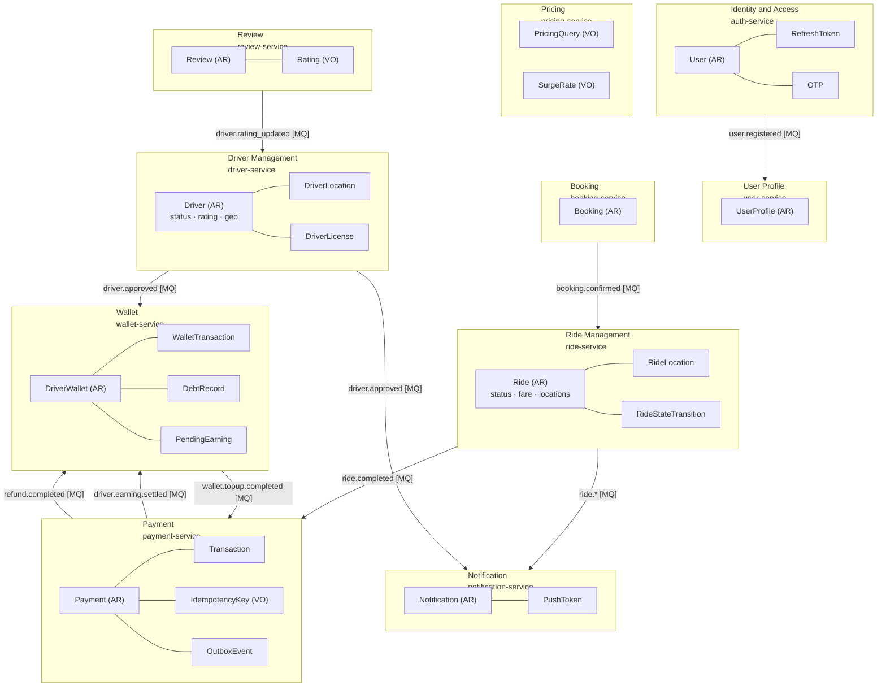
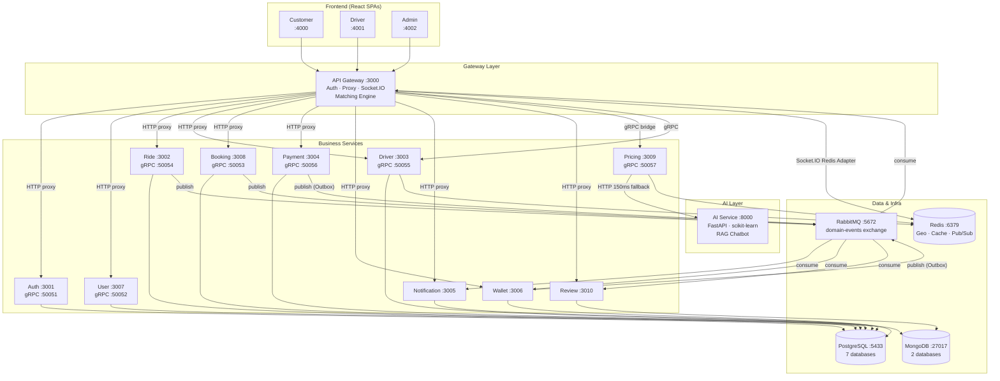
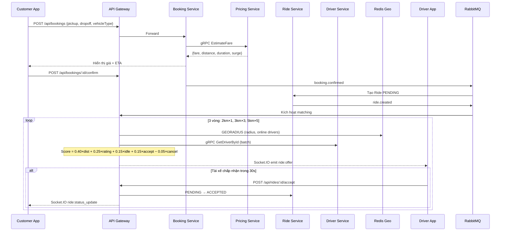
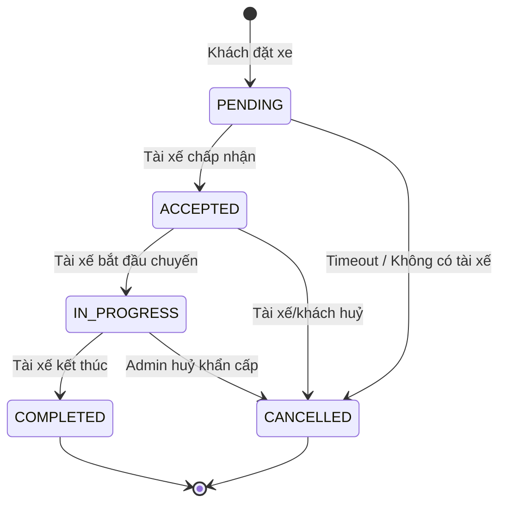
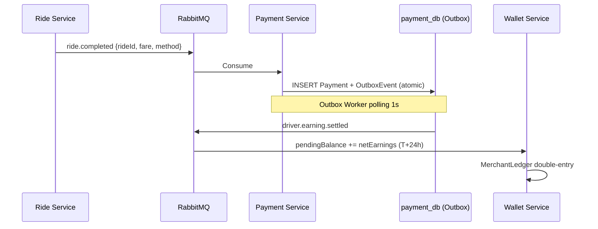
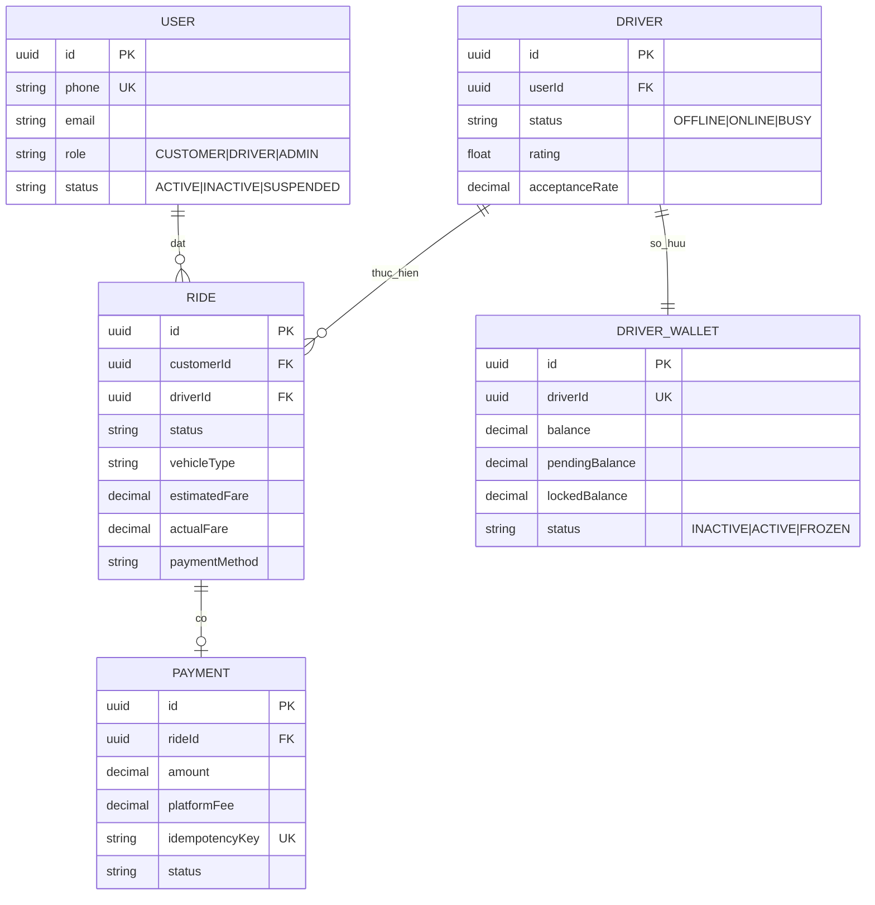
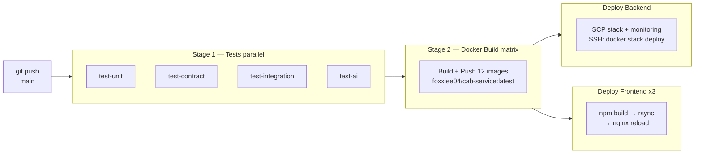

# Cab Booking System — Hệ thống đặt xe công nghệ

[](https://www.typescriptlang.org/)
[](https://nodejs.org/)
[](https://react.dev/)
[](https://www.docker.com/)
[](https://aws.amazon.com/)
[](https://foxgo.online)

Hệ thống đặt xe công nghệ xây dựng theo kiến trúc **microservices**, phục vụ ba nhóm người dùng: khách hàng, tài xế và quản trị viên. Hệ thống gồm ba ứng dụng React SPA, mười một microservice Node.js/TypeScript, một AI service FastAPI/Python, hạ tầng dữ liệu đa mô hình (PostgreSQL, MongoDB, Redis, RabbitMQ) và pipeline CI/CD trên GitHub Actions triển khai lên AWS EC2.

---

## Mục lục

- [1. Thiết kế kiến trúc hệ thống](#1-thiết-kế-kiến-trúc-hệ-thống)
- [2. Phân tích Domain-Driven Design (DDD)](#2-phân-tích-domain-driven-design-ddd)
- [3. Kiến trúc tổng thể](#3-kiến-trúc-tổng-thể)
- [4. Các luồng nghiệp vụ chính](#4-các-luồng-nghiệp-vụ-chính)
- [5. Mô hình dữ liệu và tích hợp](#5-mô-hình-dữ-liệu-và-tích-hợp)
- [6. Cấu trúc thư mục](#6-cấu-trúc-thư-mục)
- [7. Cổng dịch vụ và môi trường chạy](#7-cổng-dịch-vụ-và-môi-trường-chạy)
- [8. Hướng dẫn cài đặt và khởi động](#8-hướng-dẫn-cài-đặt-và-khởi-động)
- [9. Kiểm thử và CI/CD](#9-kiểm-thử-và-cicd)
- [10. Triển khai trên AWS](#10-triển-khai-trên-aws)
- [11. Monitoring và Observability](#11-monitoring-và-observability)
- [12. Hướng phát triển tiếp theo](#12-hướng-phát-triển-tiếp-theo)
- [13. Bộ sơ đồ hệ thống xuất sẵn](#13-bộ-sơ-đồ-hệ-thống-xuất-sẵn)

---

## 1. Thiết kế kiến trúc hệ thống

### 1.1 Mục tiêu thiết kế

Hệ thống được xây dựng nhằm cung cấp một ứng dụng đặt xe trực tuyến hoàn chỉnh, tương tự mô hình hoạt động của Grab hoặc Gojek, với trọng tâm là kết nối khách hàng và tài xế theo thời gian thực.

- **Kết nối nhanh** giữa khách hàng và tài xế gần nhất, sử dụng geospatial indexing và thuật toán scoring đa tiêu chí.
- **Ước lượng chi phí chính xác** dựa trên khoảng cách thực tế (OSRM), thời gian di chuyển và hệ số surge động.
- **Cập nhật trạng thái thời gian thực** qua Socket.IO cho cả khách hàng và tài xế trong suốt vòng đời chuyến đi.
- **Thanh toán đáng tin cậy** tích hợp MoMo và VNPay với idempotency, xử lý IPN callback nhiều lần.
- **Ví tài xế chuẩn fintech** với ký quỹ, giữ thu nhập T+24h, tất toán công nợ FIFO.
- **Tách biệt miền nghiệp vụ** rõ ràng — mỗi service sở hữu database riêng.
- **AI tùy chọn** — mọi lời gọi AI có timeout 150ms với fallback hoàn chỉnh.

### 1.2 Yêu cầu kỹ thuật

| Hạng mục | Lựa chọn | Lý do |
|---------|---------|-------|
| Frontend | React 18, Redux Toolkit | Quản lý state phức tạp (chuyến đi, ví, realtime) |
| Backend | Node.js 20, Express.js, TypeScript | Hiệu năng I/O cao, type safety |
| AI service | Python 3.11, FastAPI | Ecosystem ML (scikit-learn) |
| Giao tiếp sync | gRPC (protocol buffers) | Độ trễ thấp cho Pricing ↔ Driver lookup |
| Giao tiếp async | RabbitMQ topic exchange | Loose coupling cho ride lifecycle, payment |
| Realtime | Socket.IO + Redis Adapter | Cluster-aware WebSocket broadcast |
| CSDL quan hệ | PostgreSQL (port 5433) | ACID cho tài chính, ride state machine |
| CSDL document | MongoDB | Notification, review — schema linh hoạt |
| Cache & Geo | Redis | `GEOADD`/`GEORADIUS` O(log M) tìm tài xế |
| ORM | Prisma | Migration, type-safe queries cho 7 PostgreSQL DB |
| Xác thực | JWT (HS256) + Refresh Token | Stateless auth, revoke qua DB |
| Triển khai | Docker Swarm | Production scaling trên AWS |
| CI/CD | GitHub Actions | Quality gate → Docker Hub → SSH deploy |

### 1.3 Chức năng chính

#### Khách hàng
- Đăng ký bằng số điện thoại + OTP; đăng nhập bằng số điện thoại + mật khẩu
- Xem giá ước tính (surge, AI-assisted ETA) trước khi đặt
- Theo dõi tài xế trên bản đồ real-time trong suốt chuyến
- Thanh toán tiền mặt, MoMo, VNPay
- Chat và gọi điện WebRTC với tài xế trong chuyến
- Đánh giá tài xế, dùng voucher/mã giảm giá
- AI chatbot hỗ trợ (RAG-based)

#### Tài xế
- Đăng ký, upload hồ sơ xe + bằng lái; chờ admin duyệt
- Bật/tắt nhận chuyến (ONLINE/OFFLINE)
- Nhận offer, xem điểm đón/trả trên bản đồ
- Cập nhật trạng thái: đến đón → đã đón → hoàn thành
- Ví điện tử: nạp ký quỹ, xem thu nhập, rút tiền về ngân hàng

#### Quản trị viên
- Dashboard tổng quan: chuyến đi, doanh thu, tài xế hoạt động
- Duyệt/từ chối hồ sơ tài xế
- Quản lý ví thương nhân (merchant balance, ledger)
- Duyệt yêu cầu rút tiền của tài xế

### 1.4 Phân rã microservices

| Service | Bounded Context | Trách nhiệm |
|---------|----------------|-------------|
| API Gateway | Infrastructure | Entry point, JWT auth, proxy, Socket.IO hub, driver matching |
| Auth Service | Identity | Đăng ký OTP, đăng nhập mật khẩu, JWT/Refresh Token |
| User Service | User Profile | Hồ sơ người dùng mở rộng |
| Driver Service | Driver Domain | Hồ sơ tài xế, trạng thái, vị trí địa lý |
| Ride Service | Ride Domain | Vòng đời chuyến đi, state machine, chat |
| Booking Service | Booking Domain | Tạo booking, xem giá, chuyển sang ride |
| Payment Service | Payment Domain | Thanh toán, IPN, hoa hồng, voucher |
| Wallet Service | Wallet Domain | Ví tài xế fintech, T+24h, FIFO debt |
| Pricing Service | Pricing Domain | Tính giá, surge, gọi AI |
| Notification Service | Notification | Email, SMS, push — event-driven |
| Review Service | Review Domain | Đánh giá hai chiều, rating |
| AI Service | AI/ML | ETA, surge, accept prob, wait time, RAG chatbot |

---

## 2. Phân tích Domain-Driven Design (DDD)

### 2.1 Bounded Contexts và Context Map


```mermaid
graph TB
    subgraph IAC["Identity and Access\nauth-service"]
        U["User (AR)"]
        RT["RefreshToken"]
        OTP_E["OTP"]
        U --- RT
        U --- OTP_E
    end

    subgraph UPC["User Profile\nuser-service"]
        UP["UserProfile (AR)"]
    end

    subgraph RIDC["Ride Management\nride-service"]
        R["Ride (AR)\nstatus · fare · locations"]
        RL["RideLocation"]
        RE["RideStateTransition"]
        R --- RL
        R --- RE
    end

    subgraph DRC["Driver Management\ndriver-service"]
        DV["Driver (AR)\nstatus · rating · geo"]
        DL["DriverLocation"]
        DLI["DriverLicense"]
        DV --- DL
        DV --- DLI
    end

    subgraph BC["Booking\nbooking-service"]
        BK["Booking (AR)"]
    end

    subgraph PRC["Pricing\npricing-service"]
        PQ["PricingQuery (VO)"]
        SR["SurgeRate (VO)"]
    end

    subgraph PAC["Payment\npayment-service"]
        P["Payment (AR)"]
        TX["Transaction"]
        IPK["IdempotencyKey (VO)"]
        OBX["OutboxEvent"]
        P --- TX
        P --- IPK
        P --- OBX
    end

    subgraph WC["Wallet\nwallet-service"]
        W["DriverWallet (AR)"]
        WT["WalletTransaction"]
        DR["DebtRecord"]
        PE["PendingEarning"]
        W --- WT
        W --- DR
        W --- PE
    end

    subgraph NC["Notification\nnotification-service"]
        N["Notification (AR)"]
        PT["PushToken"]
        N --- PT
    end

    subgraph RVC["Review\nreview-service"]
        RV["Review (AR)"]
        RAT["Rating (VO)"]
        RV --- RAT
    end

    RIDC -->|"ride.completed [MQ]"| PAC
    RIDC -->|"ride.* [MQ]"| NC
    PAC -->|"driver.earning.settled [MQ]"| WC
    PAC -->|"refund.completed [MQ]"| WC
    WC -->|"wallet.topup.completed [MQ]"| PAC
    IAC -->|"user.registered [MQ]"| UPC
    DRC -->|"driver.approved [MQ]"| WC
    DRC -->|"driver.approved [MQ]"| NC
    RVC -->|"driver.rating_updated [MQ]"| DRC
    BC -->|"booking.confirmed [MQ]"| RIDC
```

### 2.2 Aggregates, Entities và Value Objects

| Bounded Context | Aggregate Root | Entities | Value Objects | Domain Services |
|---|---|---|---|---|
| Identity & Access | User | RefreshToken | OTP (hash+ttl), Phone | OtpService, JwtService |
| User Profile | UserProfile | — | Address | — |
| Ride Management | Ride | RideLocation, RideStateTransition | Coordinate, Fare | RideStateMachine |
| Driver Management | Driver | DriverLicense | DriverLocation | AvailabilityChecker |
| Booking | Booking | — | EstimatedFare | — |
| Pricing | — | — | PricingResult, SurgeRate | PricingCalculator |
| Payment | Payment | Transaction, OutboxEvent | IdempotencyKey, Money | PaymentSaga |
| Wallet | DriverWallet | WalletTransaction, DebtRecord, PendingEarning | Money | CommissionCalculator |
| Notification | Notification | PushToken | — | SmsDispatcher |
| Review | Review | — | Rating (1–5) | — |

### 2.3 Domain Events

| Event | Publisher | Subscribers | Mô tả |
|---|---|---|---|
| `ride.created` | ride-service | api-gateway | Kích hoạt matching engine |
| `ride.accepted` | ride-service | api-gateway, notification | Tài xế chấp nhận |
| `ride.completed` | ride-service | payment, api-gateway, notification | Kích hoạt thanh toán |
| `ride.cancelled` | ride-service | payment, api-gateway, notification | Hoàn tiền nếu có |
| `booking.confirmed` | booking-service | ride-service | Tạo Ride từ Booking |
| `driver.earning.settled` | payment-service | wallet-service | Credit ví tài xế |
| `refund.completed` | payment-service | wallet, notification | Hoàn tiền |
| `wallet.topup.completed` | wallet-service | payment, notification | Nạp tiền thành công |
| `user.registered` | auth-service | user-service | Tạo UserProfile |
| `driver.approved` | driver-service | wallet, notification | Tạo ví + thông báo |
| `driver.rating_updated` | review-service | driver-service | Cập nhật rating |

### 2.4 Invariants và Business Rules

| Context | Invariant |
|---|---|
| Ride | Chỉ transition hợp lệ trong `VALID_TRANSITIONS` — không update `status` trực tiếp |
| Payment | `idempotencyKey` unique — IPN callback phải idempotent |
| Wallet | Trước khi ONLINE: `balance > DEBT_LIMIT` (-500,000đ) |
| Wallet | Cash ride: tài xế nhận tiền mặt, nợ `platformFee` vào wallet |
| Wallet | Thu nhập giữ T+24h trong `PendingEarning` trước khi release |
| Wallet | FIFO debt settlement: trả nợ cũ nhất trước |
| Wallet | Ký quỹ bắt buộc 300,000đ để kích hoạt ví |
| AI | Mọi call có timeout 150ms với fallback |

---

## 3. Kiến trúc tổng thể

### 3.1 Lớp kiến trúc

```
┌─────────────────────────────────────────────────────────────────────┐
│                        PRESENTATION LAYER                            │
│    Customer App (:4000)   Driver App (:4001)   Admin (:4002)        │
│              React 18 + Redux Toolkit + Socket.IO client            │
└────────────────────────────────┬────────────────────────────────────┘
                                 │ HTTPS + WebSocket
                                 ▼
┌─────────────────────────────────────────────────────────────────────┐
│                    Nginx (host) + Let's Encrypt SSL                  │
│   api.foxgo.online → :3000 (proxy)                                  │
│   foxgo.online     → /home/ubuntu/customer-build  (static)          │
└────────────────────────────────┬────────────────────────────────────┘
                                 │
┌────────────────────────────────▼────────────────────────────────────┐
│                          GATEWAY LAYER                               │
│                    API Gateway (:3000)                               │
│   JWT Verify  │  HTTP Proxy  │  Rate Limit  │  Address Normalize    │
│   Socket.IO Hub (Redis Adapter)  │  Driver Matching Engine           │
│   RabbitMQ Consumer  │  gRPC Bridge Client                          │
└────┬────────────┬─────────────┬────────────────┬────────────────────┘
     │ HTTP       │ gRPC        │ HTTP           │ WebSocket
     ▼            ▼             ▼                ▼
┌──────────┐  ┌──────────┐  ┌─────────────────────────────────────┐
│  Auth    │  │ Pricing  │  │     BUSINESS SERVICES LAYER          │
│  :3001   │  │  :3009   │  │  Ride  Driver  Booking  Payment      │
│  gRPC    │  │ gRPC:    │  │  Wallet  User  Notification  Review  │
│  :50051  │  │ :50057   │  │  (mỗi service: HTTP + DB riêng)     │
└──────────┘  └─────┬────┘  └─────────────────────────────────────┘
                    │ HTTP (timeout 150ms, fallback)
                    ▼
             ┌──────────┐
             │    AI    │
             │  :8000   │ FastAPI/Python — ETA, Surge, RAG
             └──────────┘
┌─────────────────────────────────────────────────────────────────────┐
│                        DATA & INFRA LAYER                            │
│  PostgreSQL:5433  MongoDB:27017  Redis:6379  RabbitMQ:5672          │
└─────────────────────────────────────────────────────────────────────┘
```

### 3.2 Sơ đồ kiến trúc hệ thống


```mermaid
graph TB
    subgraph Frontend ["Frontend (React SPAs)"]
        Customer["Customer\n:4000"]
        Driver["Driver\n:4001"]
        Admin["Admin\n:4002"]
    end

    subgraph Gateway ["Gateway Layer"]
        APIGW["API Gateway :3000\nAuth · Proxy · Socket.IO\nMatching Engine"]
    end

    subgraph BusinessServices ["Business Services"]
        Auth["Auth :3001\ngRPC :50051"]
        User["User :3007\ngRPC :50052"]
        Booking["Booking :3008\ngRPC :50053"]
        Ride["Ride :3002\ngRPC :50054"]
        DriverSvc["Driver :3003\ngRPC :50055"]
        Payment["Payment :3004\ngRPC :50056"]
        Pricing["Pricing :3009\ngRPC :50057"]
        Wallet["Wallet :3006"]
        Notification["Notification :3005"]
        Review["Review :3010"]
    end

    subgraph AILayer ["AI Layer"]
        AI["AI Service :8000\nFastAPI · scikit-learn\nRAG Chatbot"]
    end

    subgraph DataLayer ["Data & Infra"]
        PG[("PostgreSQL :5433\n7 databases")]
        Mongo[("MongoDB :27017\n2 databases")]
        Redis[("Redis :6379\nGeo · Cache · Pub/Sub")]
        Rabbit["RabbitMQ :5672\ndomain-events exchange"]
    end

    Customer & Driver & Admin --> APIGW
    APIGW -- "HTTP proxy" --> Auth & User & Ride & DriverSvc
    APIGW -- "HTTP proxy" --> Booking & Payment & Wallet & Notification & Review
    APIGW -- "gRPC bridge" --> Pricing
    APIGW -- "gRPC" --> DriverSvc
    Pricing -- "HTTP 150ms fallback" --> AI

    Auth & User & Ride & DriverSvc --> PG
    Booking & Payment & Wallet --> PG
    Notification --> Mongo
    Review --> Mongo
    DriverSvc & Pricing --> Redis
    APIGW -- "Socket.IO Redis Adapter" --> Redis
    Ride & Booking -- "publish" --> Rabbit
    Payment & Wallet -- "publish (Outbox)" --> Rabbit
    Rabbit -- "consume" --> APIGW & Notification & Wallet & Review
```

### 3.3 Các pattern kỹ thuật cốt lõi

| Pattern | Service áp dụng | Vấn đề giải quyết |
|---------|----------------|------------------|
| **State Machine** | Ride Service | Kiểm soát chuyển trạng thái hợp lệ |
| **Outbox Pattern** | Payment, Wallet | at-least-once delivery dù RabbitMQ tạm ngắt |
| **Idempotency Key** | Payment | IPN callback nhiều lần không xử lý trùng |
| **Geospatial Index** | Driver + Gateway | Redis `GEOADD`/`GEORADIUS` O(log M) |
| **T+24h Pending Hold** | Wallet | Giữ thu nhập trước khi rút |
| **FIFO Debt Settlement** | Wallet | Ưu tiên trả nợ cũ nhất |
| **Security Deposit** | Wallet | Ký quỹ 300,000đ để kích hoạt ví |
| **WebRTC P2P** | Gateway + Client | Call thoại tài xế ↔ khách qua ICE relay |
| **gRPC Bridge** | API Gateway | HTTP→gRPC cho Pricing và Driver lookup |
| **AI Fallback** | Pricing | Timeout 150ms → fallback rule-based surge |
| **Database-per-Service** | Tất cả | Không chia sẻ schema |

---

## 4. Các luồng nghiệp vụ chính

### 4.1 Luồng đặt xe và ghép tài xế


```mermaid
sequenceDiagram
    participant C as Customer App
    participant G as API Gateway
    participant B as Booking Service
    participant P as Pricing Service
    participant R as Ride Service
    participant D as Driver Service
    participant Redis as Redis Geo
    participant DA as Driver App

    C->>G: POST /api/bookings {pickup, dropoff, vehicleType}
    G->>B: Forward
    B->>P: gRPC EstimateFare
    P-->>B: {fare, distance, duration, surge}
    B-->>C: Hiển thị giá + ETA

    C->>G: POST /api/bookings/:id/confirm
    B->>RabbitMQ: booking.confirmed
    RabbitMQ->>R: Tạo Ride PENDING
    R->>RabbitMQ: ride.created
    RabbitMQ->>G: Kích hoạt matching

    loop 3 vòng: 2km×1, 3km×3, 5km×5
        G->>Redis: GEORADIUS (radius, online drivers)
        G->>D: gRPC GetDriverById (batch)
        Note over G: Score = 0.40×dist + 0.25×rating + 0.15×idle + 0.15×accept − 0.05×cancel
        G-->>DA: Socket.IO emit ride:offer
        alt Tài xế chấp nhận trong 30s
            DA->>G: POST /api/rides/:id/accept
            G->>R: PENDING → ACCEPTED
            G-->>C: Socket.IO ride:status_update
        end
    end
```

### 4.2 State Machine — Vòng đời chuyến đi


```mermaid
stateDiagram-v2
    [*] --> PENDING : Khách đặt xe
    PENDING --> ACCEPTED : Tài xế chấp nhận
    PENDING --> CANCELLED : Timeout / Không có tài xế

    ACCEPTED --> IN_PROGRESS : Tài xế bắt đầu chuyến
    ACCEPTED --> CANCELLED : Tài xế/khách huỷ

    IN_PROGRESS --> COMPLETED : Tài xế kết thúc
    IN_PROGRESS --> CANCELLED : Admin huỷ khẩn cấp

    COMPLETED --> [*]
    CANCELLED --> [*]
```

### 4.3 Luồng thanh toán (Outbox Pattern + Idempotency)


```mermaid
sequenceDiagram
    participant R as Ride Service
    participant MQ as RabbitMQ
    participant Pay as Payment Service
    participant DB as payment_db (Outbox)
    participant Wallet as Wallet Service

    R->>MQ: ride.completed {rideId, fare, method}
    MQ->>Pay: Consume

    Pay->>DB: INSERT Payment + OutboxEvent (atomic)
    Note over Pay,DB: Outbox Worker polling 1s
    DB->>MQ: driver.earning.settled
    MQ->>Wallet: pendingBalance += netEarnings (T+24h)
    Wallet->>Wallet: MerchantLedger double-entry
```

### 4.4 Luồng ví tài xế

```
availableBalance = balance - lockedBalance(300k) - pendingBalance(T+24h) - debt

CASH ride flow:
  1. Tài xế nhận toàn bộ tiền mặt từ khách
  2. DebtRecord: nợ platformFee (20% MOTORBIKE / 18% CAR_4 / 15% CAR_7)
  3. Mỗi ngày: Outbox Worker trừ nợ FIFO từ thu nhập mới
```

---

## 5. Mô hình dữ liệu và tích hợp

### 5.1 Phân tách database

| DBMS | Database | Service | Schema cốt lõi |
|------|---------|---------|---------------|
| PostgreSQL | `auth_db` | Auth | User, RefreshToken, AuditLog |
| PostgreSQL | `user_db` | User | UserProfile |
| PostgreSQL | `driver_db` | Driver | Driver, DriverLicense, DriverLocation |
| PostgreSQL | `ride_db` | Ride | Ride, RideStateTransition, RideChatMessage |
| PostgreSQL | `booking_db` | Booking | Booking |
| PostgreSQL | `payment_db` | Payment | Fare, Payment, DriverEarnings, OutboxEvent |
| PostgreSQL | `wallet_db` | Wallet | DriverWallet, PendingEarning, DebtRecord, MerchantLedger |
| MongoDB | `notification_db` | Notification | notifications, push_tokens |
| MongoDB | `review_db` | Review | reviews |

> 7 PostgreSQL database chia sẻ 1 instance (port **5433**). Mỗi service có Prisma client riêng.

### 5.2 ERD (các aggregate chính)


```mermaid
erDiagram
    USER {
        uuid id PK
        string phone UK
        string email
        string role "CUSTOMER|DRIVER|ADMIN"
        string status "ACTIVE|INACTIVE|SUSPENDED"
    }
    RIDE {
        uuid id PK
        uuid customerId FK
        uuid driverId FK
        string status
        string vehicleType
        decimal estimatedFare
        decimal actualFare
        string paymentMethod
    }
    DRIVER {
        uuid id PK
        uuid userId FK
        string status "OFFLINE|ONLINE|BUSY"
        float rating
        decimal acceptanceRate
    }
    PAYMENT {
        uuid id PK
        uuid rideId FK
        decimal amount
        decimal platformFee
        string idempotencyKey UK
        string status
    }
    DRIVER_WALLET {
        uuid id PK
        uuid driverId UK
        decimal balance
        decimal pendingBalance
        decimal lockedBalance
        string status "INACTIVE|ACTIVE|FROZEN"
    }
    USER ||--o{ RIDE : dat
    DRIVER ||--o{ RIDE : thuc_hien
    RIDE ||--o| PAYMENT : co
    DRIVER ||--|| DRIVER_WALLET : so_huu
```

---

## 6. Cấu trúc thư mục

```text
Cab-Booking-System-Project/
├── apps/
│   ├── customer-app/          # React SPA — khách hàng
│   ├── driver-app/            # React SPA — tài xế
│   └── admin-dashboard/       # React SPA — quản trị
│
├── services/
│   ├── api-gateway/           # HTTP 3000 — entry point, matching, Socket.IO
│   ├── auth-service/          # HTTP 3001, gRPC 50051 — OTP, JWT
│   ├── user-service/          # HTTP 3007, gRPC 50052
│   ├── booking-service/       # HTTP 3008, gRPC 50053
│   ├── ride-service/          # HTTP 3002, gRPC 50054 — state machine
│   ├── driver-service/        # HTTP 3003, gRPC 50055 — geo, location
│   ├── payment-service/       # HTTP 3004, gRPC 50056 — MoMo/VNPay
│   ├── pricing-service/       # HTTP 3009, gRPC 50057
│   ├── wallet-service/        # HTTP 3006 — fintech
│   ├── notification-service/  # HTTP 3005
│   ├── review-service/        # HTTP 3010
│   └── ai-service/            # HTTP 8000 — FastAPI, ML, RAG
│
├── shared/                    # @cab-booking/shared
│   ├── types/                 # TypeScript interfaces, events
│   ├── grpc/                  # Protobuf definitions
│   └── utils/                 # Internal auth, geo, validation
│
├── monitoring/
│   ├── README.md              # Docs chi tiết từng component
│   ├── prometheus/prometheus.yml
│   ├── loki/loki-config.yml
│   ├── promtail/promtail-config.yml
│   └── grafana/
│       ├── provisioning/      # Auto-config datasource + dashboard
│       └── dashboards/        # 4 JSON dashboards
│
├── deploy/
│   ├── DEPLOY.md              # Hướng dẫn deploy AWS đầy đủ
│   ├── CLUSTER-AWS.md         # Kiến trúc multi-node (tham khảo)
│   └── nginx/nginx-apps.conf  # Nginx config tham khảo
│
├── scripts/
│   ├── reset-database.sh/.bat # Reset + migrate + seed
│   ├── seed-database.ts        # Seed dữ liệu mẫu
│   └── run-integration-backend.ts  # CI integration health check
│
├── .github/workflows/ci-cd.yml  # Pipeline CI/CD
├── docker-compose.yml           # Local dev stack
├── docker-stack.thesis.yml      # AWS Docker Swarm stack
└── package.json                 # Workspace root
```

---

## 7. Cổng dịch vụ và môi trường chạy

| Service | HTTP | gRPC | Database |
|---------|------|------|----------|
| API Gateway | **3000** | — | Redis |
| Auth | 3001 | **50051** | auth_db |
| Ride | 3002 | **50054** | ride_db |
| Driver | 3003 | **50055** | driver_db + Redis |
| Payment | 3004 | **50056** | payment_db |
| Notification | 3005 | — | notification_db (Mongo) |
| Wallet | 3006 | — | wallet_db |
| User | 3007 | **50052** | user_db |
| Booking | 3008 | **50053** | booking_db |
| Pricing | 3009 | **50057** | Redis (stateless) |
| Review | 3010 | — | review_db (Mongo) |
| AI | **8000** | — | File models |
| PostgreSQL | **5433** | — | 7 databases |
| MongoDB | 27017 | — | 2 databases |
| Redis | 6379 | — | |
| RabbitMQ | 5672 | — | |
| RabbitMQ UI | 15672 | — | |

---

## 8. Hướng dẫn cài đặt và khởi động

### 8.1 Yêu cầu

- Node.js >= 20, npm >= 10
- Docker Desktop (Docker Compose v2)

### 8.2 Chạy local với Docker

```bash
git clone <repository-url>
cd Cab-Booking-System-Project
cp .env.example .env    # chỉnh sửa theo môi trường

docker compose up -d
```

| URL | Mục đích |
|-----|---------|
| http://localhost:4000 | Customer App |
| http://localhost:4001 | Driver App |
| http://localhost:4002 | Admin Dashboard |
| http://localhost:3000 | API Gateway |
| http://localhost:15672 | RabbitMQ (guest/guest) |

### 8.3 Chế độ dev (hot-reload)

```bash
npm run build:shared     # bắt buộc chạy trước
npm run dev:gateway      # API Gateway
npm run dev:auth         # Auth Service
# ... xem package.json để đầy đủ danh sách
```

### 8.4 Seed dữ liệu

```bash
npm run db:seed
# 1 admin, 20 khách hàng, 40 tài xế, 28 chuyến, vouchers
```

### 8.5 Lấy OTP bằng Postman (Docker & deploy)

**Chung:** `OTP_SMS_MODE=mock` và **`OTP_ENABLE_DEV_ENDPOINT=true`** phải có trên **cả `auth-service` và `api-gateway`** (để `GET /api/auth/dev/otp` không bị chặn bởi gateway khi `NODE_ENV=production`). Giá trị được nhận: `true` / `1` / `yes` / `on` (không phân biệt hoa thường, đã trim).

**Docker Compose (dev):** trong `docker-compose.yml` đã gắn sẵn `OTP_ENABLE_DEV_ENDPOINT=true` và `OTP_SMS_MODE=mock` cho auth; gateway cũng có cờ OTP. File mẫu: `env/auth.env.example` → copy thành `env/auth.env` nếu cần override. Hướng dẫn ngắn: `env/README.md`.

**Docker Compose prod (image từ registry):** `docker-compose.prod.yml` mặc định `OTP_ENABLE_DEV_ENDPOINT=true` và có thể đổi `OTP_SMS_MODE` qua biến môi trường root `.env`.

**Swarm / server:** tạo `~/cab-booking/env/auth.env` và `gateway.env` từ `env/auth.env.example` và `env/gateway.env.example`, điền secret và URL thật, rồi redeploy stack.

Luồng Postman:

- **`base_url` là gốc gateway, không thêm `/api` cuối** (đúng: `http://localhost:3000`, `https://api.foxgo.io.vn`; sai: `https://api.foxgo.io.vn/api` — dễ thành `/api/api/auth/...`; gateway mới đã gộp một lớp trùng nhưng vẫn nên cấu hình đúng).
- GET lấy OTP **không** cần header `Authorization`; số trong query có thể `0xxxxxxxxxx` hoặc `+84…` / `84…` (server chuẩn hóa trùng Redis).

1. `POST {base_url}/api/auth/register-phone/start` — body `{ "phone": "0901234501" }`
2. `GET {base_url}/api/auth/dev/otp?phone=0901234501&purpose=register` — hoặc `phone=%2B84901234501`

**Collection:** `postman/FoxGo API.postman_collection.json` (đổi biến `base_url`). Chỉ Docker/localhost: `postman/FoxGo-API-Docker-Local.postman_collection.json`.

Đổi mật khẩu (quên mật khẩu) dùng `purpose=reset`:

```http
GET {base_url}/api/auth/dev/otp?phone=0901234501&purpose=reset
```

- Local Docker: `base_url=http://localhost:3000`
- Deploy: `base_url=https://api.<domain>` (ví dụ `https://api.foxgo.online`)

**Cảnh báo:** `OTP_ENABLE_DEV_ENDPOINT` chỉ nên bật trên môi trường demo / thử nghiệm. Production thật: tắt cờ này và dùng SMS thật, ví dụ:

```env
OTP_SMS_MODE=sns        # AWS SNS (EC2 IAM role), auth-service đã có @aws-sdk/client-sns
OTP_SMS_MODE=speedsms   # SpeedSMS VN
OTP_SMS_MODE=twilio
```

Nếu `OTP_SMS_MODE=sns` mà vẫn lỗi gửi OTP: kiểm tra IAM `sns:Publish`, Sandbox SNS, hoặc cấu hình provider.

## 9. Kiểm thử và CI/CD

### 9.1 Các mức kiểm thử

```bash
npm run test:unit        # unit tests (mock DB)
npm run test:contract    # driver ↔ ride service boundary
npm run test:integration # full stack với Docker infra
npm run test:coverage    # coverage report
cd services/ai-service && pytest -q  # AI service tests
```

### 9.2 CI/CD Pipeline


```mermaid
flowchart LR
    Push["git push\nmain"] --> S1

    subgraph S1["Stage 1 — Tests parallel"]
        T1["test-unit"]
        T2["test-contract"]
        T3["test-integration"]
        T4["test-ai"]
    end

    S1 --> S2

    subgraph S2["Stage 2 — Docker Build matrix"]
        D["Build + Push 12 images\nfoxxiee04/cab-service:latest"]
    end

    S2 --> S3a
    S2 --> S3b

    subgraph S3a["Deploy Backend"]
        B["SCP stack + monitoring\nSSH: docker stack deploy"]
    end

    subgraph S3b["Deploy Frontend x3"]
        F["npm build → rsync\n→ nginx reload"]
    end
```

**Docker Hub 429:** các `Dockerfile` dùng mirror **AWS Public ECR** `public.ecr.aws/docker/library/*` (Node / Python official) để CI không bị giới hạn pull `docker.io` khi build matrix song song.

---

## 10. Triển khai trên AWS

### 10.1 Kiến trúc hiện tại

```
Internet
    ├── https://foxgo.online         → Customer App
    ├── https://driver.foxgo.online  → Driver App
    ├── https://admin.foxgo.online   → Admin Dashboard
    └── https://api.foxgo.online     → API Gateway
              │
    ┌─────────┴──────────────────────────────────────┐
    │  EC2 t3.large — 18.136.250.236                  │
    │  Ubuntu 22.04 · ap-southeast-1 (Singapore)      │
    │  Elastic IP · Let's Encrypt SSL                 │
    │                                                  │
    │  ┌─────── Nginx (host) ──────────────────────┐  │
    │  │  :80/:443 → React builds (static files)   │  │
    │  │  api.foxgo.online → proxy :3000            │  │
    │  └───────────────────────────────────────────┘  │
    │                                                  │
    │  ┌─────── Docker Swarm (single-node) ─────────┐  │
    │  │  Infrastructure: PG, Mongo, Redis, RabbitMQ │  │
    │  │  Services: 11 Node.js + 1 Python AI         │  │
    │  │  Monitoring: Prometheus + Grafana + Loki    │  │
    │  └─────────────────────────────────────────────┘  │
    └────────────────────────────────────────────────────┘
```

### 10.2 GitHub Secrets

| Secret | Giá trị |
|--------|---------|
| `DOCKERHUB_USERNAME` | `foxxiee04` |
| `DOCKERHUB_TOKEN` | Docker Hub access token |
| `DEPLOY_HOST` | `18.136.250.236` |
| `DEPLOY_USER` | `ubuntu` |
| `DEPLOY_SSH_KEY` | Nội dung `cab-key.pem` |
| `REACT_APP_API_URL` | `https://api.foxgo.online` |
| `REACT_APP_SOCKET_URL` | `https://api.foxgo.online` |

### 10.3 Deploy thủ công (không cần thay đổi code)

```bash
git commit --allow-empty -m "ci: manual redeploy"
git push origin main
```

### 10.4 Hướng dẫn đầy đủ

Xem [`deploy/DEPLOY.md`](deploy/DEPLOY.md) cho toàn bộ quy trình từ đầu.

---

## 11. Monitoring và Observability

### 11.1 Stack

| Component | Tác dụng | URL |
|-----------|---------|-----|
| **Prometheus** | Thu thập metrics mỗi 15s | http://18.136.250.236:9090 |
| **Grafana** | Dashboard visualization | http://18.136.250.236:3030 |
| **Loki** | Log aggregation | (qua Grafana) |
| **Promtail** | Log collector từ Docker | — |
| **cAdvisor** | Container metrics | http://18.136.250.236:8081 |
| **Node Exporter** | Host metrics | — |

### 11.2 Dashboards tự động load

| Dashboard | Nội dung |
|-----------|---------|
| System Overview | CPU, Memory, Disk, Network, Load Average của EC2 |
| Container Resources | CPU/Memory từng service Docker |
| Application Metrics | RabbitMQ queues, API Gateway AI matching |
| Service Logs | Log explorer theo service, filter error |

### 11.3 Metrics thu thập

- **Host**: CPU usage, memory, disk, network throughput, load average
- **Containers**: CPU/memory/network per service
- **RabbitMQ**: Queue depth, consumers, message rates
- **API Gateway**: HTTP requests, WebSocket connections, AI matching decisions
- **Logs**: Tất cả stdout/stderr từ 12 services qua Docker

Xem chi tiết: [`monitoring/README.md`](monitoring/README.md)

---

## 12. Hướng phát triển tiếp theo

### Kỹ thuật
- **Distributed Tracing**: Tích hợp OpenTelemetry để trace xuyên suốt qua các service
- **Circuit Breaker**: Thêm opossum để tránh cascade failure
- **Kubernetes**: Chuyển từ Docker Swarm sang K8s cho production-grade orchestration
- **AI Retraining**: MLflow để train lại model định kỳ từ dữ liệu thực
- **gRPC Streaming**: Giảm overhead cập nhật vị trí tài xế

### Nghiệp vụ
- **Đặt xe trước**: Mở rộng Booking Service cho scheduled ride
- **Ride Pooling**: Chia sẻ chuyến đi nhiều khách cùng lộ trình
- **Payment Production**: Cấu hình merchant account MoMo/VNPay thật
- **Rating nâng cao**: Sentiment analysis từ comment

### Vận hành
- **Secret Management**: HashiCorp Vault hoặc AWS Secrets Manager
- **Multi-Region**: Redis Cluster, PostgreSQL replication
- **Alerting**: Grafana alerts qua Email/Slack/Telegram
- **Cost Optimization**: Reserved Instances nếu dùng dài hạn

---

## 13. Bộ sơ đồ hệ thống xuất sẵn

- Toàn bộ sơ đồ Mermaid trong `README.md` và `docs/**/*.md` đã được xuất vào thư mục `img_hethong/`.
- Mỗi sơ đồ có 2 định dạng:
  - File nguồn Mermaid: `*.mmd`
  - Ảnh vector: `*.svg`
- Danh sách ánh xạ source ↔ sơ đồ nằm trong:
  - `img_hethong/README.md`
  - `img_hethong/manifest.json`

Lệnh xuất lại khi tài liệu thay đổi:

```bash
node scripts/export-system-diagrams.cjs
npx -y @mermaid-js/mermaid-cli -i img_hethong/<file>.mmd -o img_hethong/<file>.svg -b transparent
```

---

**Tài liệu chi tiết:**
- Deploy: [`deploy/DEPLOY.md`](deploy/DEPLOY.md)
- Monitoring: [`monitoring/README.md`](monitoring/README.md)
- Service docs: [`docs/services/`](docs/services/)
