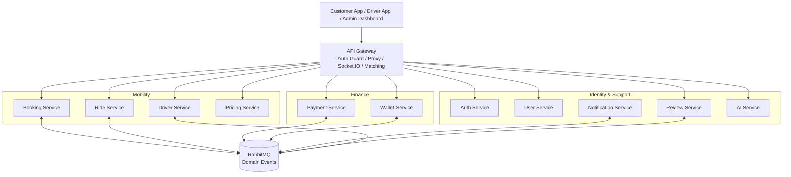
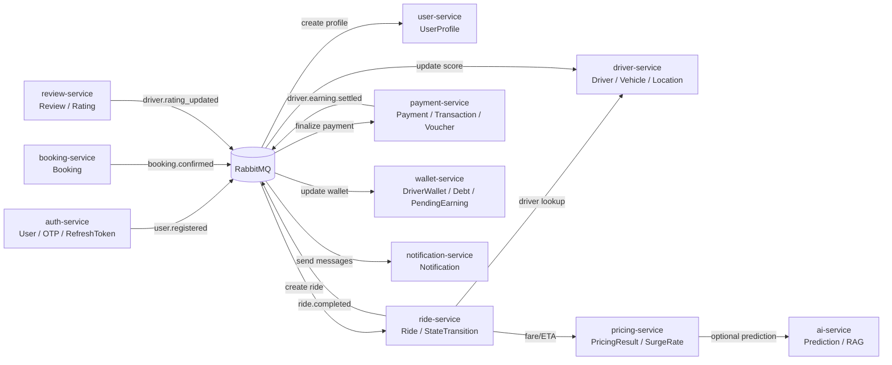
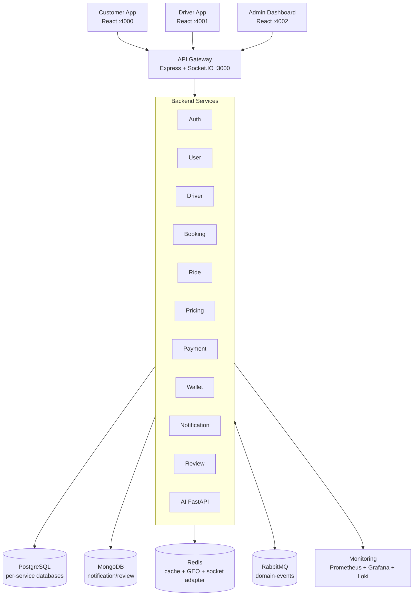
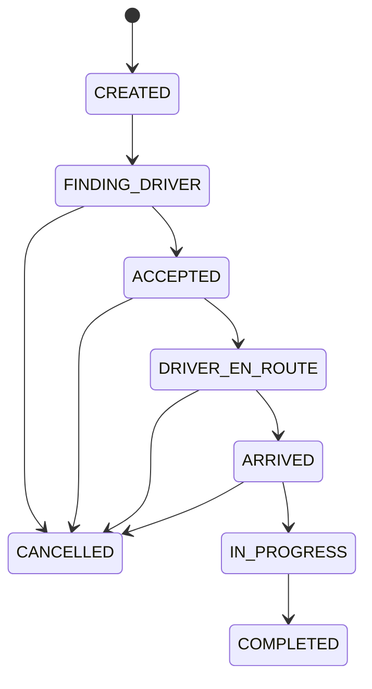
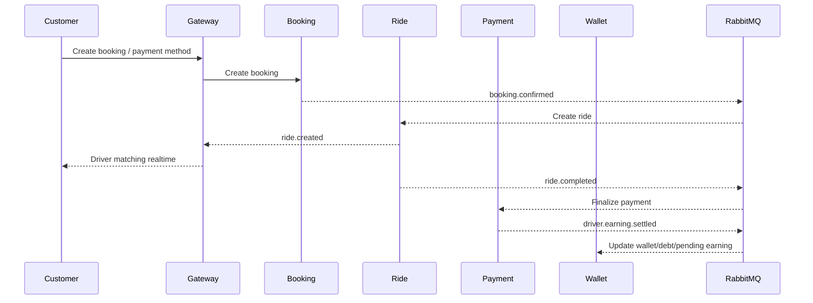
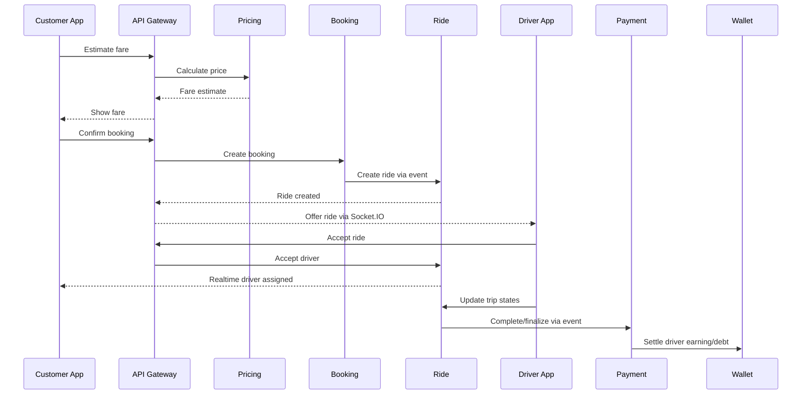
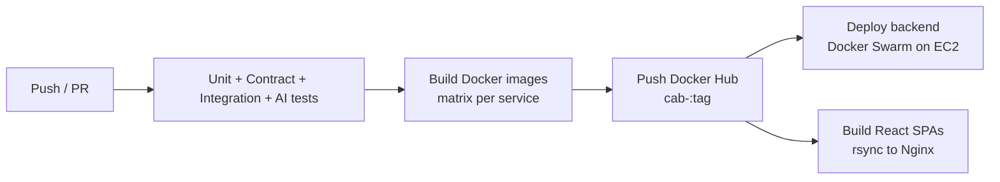

# Cab Booking System — FoxGo

[](https://www.typescriptlang.org/)
[](https://nodejs.org/)
[](https://react.dev/)
[](https://fastapi.tiangolo.com/)
[](https://www.docker.com/)
[](monitoring/README.md)


FoxGo là hệ thống đặt xe công nghệ được xây dựng theo kiến trúc microservices, mô phỏng đầy đủ ba vai trò chính: khách hàng, tài xế và quản trị viên. Dự án bao gồm 3 ứng dụng React, 11 service Node.js/TypeScript, 1 AI service FastAPI, cơ sở dữ liệu tách theo service, realtime Socket.IO, event bus RabbitMQ, Redis GEO cho ghép tài xế và bộ monitoring Prometheus/Grafana/Loki.

README này là tài liệu tổng quan trung tâm của dự án: mô tả kiến trúc, domain, luồng nghiệp vụ, cách chạy local, kiểm thử, seed dữ liệu, triển khai và các tài liệu liên quan.

---

## Mục lục

- [1. Thiết kế kiến trúc hệ thống](#1-thiết-kế-kiến-trúc-hệ-thống)
- [2. Phân tích Domain-Driven Design (DDD)](#2-phân-tích-domain-driven-design-ddd)
- [3. Kiến trúc tổng thể](#3-kiến-trúc-tổng-thể)
- [4. Các luồng nghiệp vụ chính](#4-các-luồng-nghiệp-vụ-chính)
- [5. Mô hình dữ liệu và tích hợp](#5-mô-hình-dữ-liệu-và-tích-hợp)
- [6. Cấu trúc thư mục](#6-cấu-trúc-thư-mục)
- [7. Cổng dịch vụ và môi trường chạy](#7-cổng-dịch-vụ-và-môi-trường-chạy)
- [8. Hướng dẫn cài đặt và khởi động](#8-hướng-dẫn-cài-đặt-và-khởi-động)
- [9. Kiểm thử và CI/CD](#9-kiểm-thử-và-cicd)
- [10. Triển khai trên AWS](#10-triển-khai-trên-aws)
- [11. Monitoring và Observability](#11-monitoring-và-observability)
- [12. Hướng phát triển tiếp theo](#12-hướng-phát-triển-tiếp-theo)
- [13. Bộ sơ đồ và tài liệu hình (PNG / Mermaid)](#13-bộ-sơ-đồ-và-tài-liệu-hình-png--mermaid)

---

## 1. Thiết kế kiến trúc hệ thống

### 1.1 Mục tiêu thiết kế

FoxGo được thiết kế như một hệ thống đặt xe hoàn chỉnh, tập trung vào các yêu cầu thường gặp trong một nền tảng mobility:

- Tách rõ ba giao diện người dùng: Customer App, Driver App và Admin Dashboard.
- Kết nối khách hàng với tài xế theo thời gian thực bằng Socket.IO và Redis.
- Tìm tài xế gần nhất bằng Redis GEO, mở rộng bán kính theo vòng và chấm điểm theo nhiều tiêu chí.
- Tính giá dựa trên loại xe, khoảng cách, thời gian, surge rate, voucher và dữ liệu hỗ trợ từ AI.
- Quản lý vòng đời chuyến đi bằng state machine để tránh cập nhật trạng thái sai thứ tự.
- Hỗ trợ thanh toán tiền mặt, MoMo/VNPay sandbox, callback IPN idempotent và quyết toán sau chuyến.
- Quản lý ví tài xế với ký quỹ, công nợ hoa hồng, thu nhập chờ xử lý T+24h và lịch sử giao dịch.
- Dùng database-per-service để giảm phụ thuộc dữ liệu giữa các bounded context.
- Có bộ seed dữ liệu, kịch bản demo, test và monitoring phục vụ bảo vệ/triển khai thử nghiệm.

### 1.2 Yêu cầu kỹ thuật

| Hạng mục | Công nghệ | Vai trò trong hệ thống |
|---|---|---|
| Frontend | React 18, Redux Toolkit, MUI, Leaflet/Google Maps | Ba SPA cho khách hàng, tài xế và admin |
| Backend | Node.js 20, Express, TypeScript | API Gateway và các service nghiệp vụ |
| AI service | Python 3.11, FastAPI, scikit-learn, FAISS/RAG | Dự đoán ETA/accept/wait time và chatbot hỗ trợ |
| Realtime | Socket.IO, Redis Adapter | Vị trí tài xế, trạng thái chuyến, chat, thông báo |
| Sync internal | HTTP nội bộ, gRPC/protobuf | Giao tiếp độ trễ thấp giữa service |
| Async internal | RabbitMQ topic exchange | Domain events giữa booking, ride, payment, wallet, notification |
| Database SQL | PostgreSQL, Prisma | Auth/User/Driver/Ride/Booking/Payment/Wallet |
| Database document | MongoDB | Notification và Review |
| Cache/Geo | Redis | Cache, rate-limit, session phụ trợ, driver geo index |
| Container | Docker Compose, Docker Swarm | Local dev và deploy AWS EC2 |
| CI/CD | GitHub Actions, Docker Hub, SSH deploy | Test, build image, deploy backend/frontend |
| Observability | Prometheus, Grafana, Loki, Promtail, cAdvisor, Node Exporter | Metrics, logs, dashboard và theo dõi hạ tầng |

### 1.3 Chức năng chính

#### Khách hàng

- Đăng ký/đăng nhập bằng số điện thoại, OTP và mật khẩu.
- Chọn điểm đón/trả, loại xe, voucher và phương thức thanh toán.
- Xem giá ước tính trước khi đặt chuyến.
- Theo dõi tài xế và trạng thái chuyến đi theo thời gian thực.
- Chat/gọi với tài xế trong chuyến.
- Thanh toán tiền mặt hoặc online qua MoMo/VNPay sandbox.
- Đánh giá tài xế, xem lịch sử chuyến đi và dùng chatbot hỗ trợ.

#### Tài xế

- Đăng ký tài khoản, khai báo hồ sơ tài xế, xe, giấy phép và ảnh xác minh.
- Chờ admin duyệt hồ sơ trước khi nhận chuyến.
- Bật/tắt trạng thái nhận chuyến, cập nhật vị trí GPS.
- Nhận offer chuyến, chấp nhận/từ chối, cập nhật các bước trong chuyến.
- Theo dõi ví, nạp tiền, xem công nợ hoa hồng và thu nhập.
- Chat/gọi với khách hàng trong chuyến.

#### Quản trị viên

- Xem dashboard tổng quan về người dùng, tài xế, chuyến đi và doanh thu.
- Duyệt/từ chối hồ sơ tài xế.
- Theo dõi merchant wallet, ledger, giao dịch thanh toán và hoa hồng.
- Kiểm tra dữ liệu vận hành, đánh giá, voucher và các luồng demo.

### 1.4 Phân rã microservices

| Service | Port | Bounded Context | Trách nhiệm chính |
|---|---:|---|---|
| API Gateway | 3000 | Infrastructure | Entry point, auth guard, proxy, Socket.IO hub, matching engine, metrics |
| Auth Service | 3001 / gRPC 50051 | Identity | OTP, đăng ký, đăng nhập, JWT, refresh token |
| User Service | 3007 / gRPC 50052 | User Profile | Hồ sơ người dùng mở rộng |
| Driver Service | 3003 / gRPC 50055 | Driver | Hồ sơ tài xế, xe, trạng thái, vị trí |
| Booking Service | 3008 / gRPC 50053 | Booking | Tạo yêu cầu đặt xe, giữ thông tin booking trước khi chuyển thành ride |
| Ride Service | 3002 / gRPC 50054 | Ride | State machine chuyến đi, offer tài xế, chat metadata |
| Pricing Service | 3009 / gRPC 50057 | Pricing | Tính giá, surge, ước lượng cước |
| Payment Service | 3004 / gRPC 50056 | Payment | Payment intent, MoMo/VNPay, IPN, voucher, hoa hồng |
| Wallet Service | 3006 | Wallet | Ví tài xế, ký quỹ, công nợ, pending earning T+24h |
| Notification Service | 3005 / gRPC 50058 | Notification | Email/SMS/push/log notification theo event |
| Review Service | 3010 / gRPC 50059 | Review | Đánh giá chuyến đi, rating tài xế/khách |
| AI Service | 8000 | AI/ML | ETA, accept probability, wait time, RAG chatbot |

---

## 2. Phân tích Domain-Driven Design (DDD)

### 2.1 Bounded Contexts và Context Map

Hệ thống được chia thành các bounded context để mỗi phần nghiệp vụ có dữ liệu, model và rule riêng. Các context không ghi trực tiếp vào database của nhau; chúng trao đổi qua API Gateway, HTTP/gRPC nội bộ hoặc RabbitMQ domain events.


```mermaid
flowchart TB
    Apps["Customer App / Driver App / Admin Dashboard"]
    Gateway["API Gateway\nAuth Guard / Proxy / Socket.IO / Matching"]
    MQ[("RabbitMQ\nDomain Events")]

    subgraph Identity["Identity & Support"]
        Auth["Auth Service"]
        User["User Service"]
        Notification["Notification Service"]
        Review["Review Service"]
        AI["AI Service"]
    end

    subgraph Mobility["Mobility"]
        Driver["Driver Service"]
        Booking["Booking Service"]
        Ride["Ride Service"]
        Pricing["Pricing Service"]
    end

    subgraph Finance["Finance"]
        Payment["Payment Service"]
        Wallet["Wallet Service"]
    end

    Apps --> Gateway
    Gateway --> Auth
    Gateway --> User
    Gateway --> Driver
    Gateway --> Booking
    Gateway --> Ride
    Gateway --> Pricing
    Gateway --> Payment
    Gateway --> Wallet
    Gateway --> Review
    Gateway --> AI

    Booking <--> MQ
    Ride <--> MQ
    Payment <--> MQ
    Wallet <--> MQ
    Notification <--> MQ
    Review <--> MQ
    Driver <--> MQ
```

#### 2.1.1 Sơ đồ tổng quát hệ thống theo DDD

| Context | Service liên quan | Dữ liệu sở hữu | Luật nghiệp vụ tiêu biểu |
|---|---|---|---|
| Identity & Access | auth-service | `auth_db` | OTP, JWT, refresh token, role |
| User Profile | user-service | `user_db` | Hồ sơ khách hàng/admin |
| Driver Management | driver-service | `driver_db`, Redis GEO | Duyệt hồ sơ, trạng thái online, vị trí |
| Booking | booking-service | `booking_db` | Tạo booking, xác nhận điều kiện trước dispatch |
| Ride Management | ride-service | `ride_db` | State machine chuyến đi, driver offer |
| Pricing | pricing-service | Stateless/Redis | Tính giá, surge, AI-assisted estimate |
| Payment | payment-service | `payment_db` | Payment intent, IPN idempotency, voucher, commission |
| Wallet | wallet-service | `wallet_db` | Ký quỹ, công nợ, T+24h earning |
| Notification | notification-service | MongoDB | Gửi/lưu thông báo |
| Review | review-service | MongoDB | Đánh giá và rating |
| AI/ML | ai-service | Model files, knowledge base | Prediction và chatbot fallback |

#### 2.1.2 Cách đọc Context Map

Luồng điển hình bắt đầu từ frontend gọi API Gateway. Gateway kiểm tra token, chuẩn hóa request và chuyển tiếp đến service đúng miền. Khi một thay đổi có ý nghĩa nghiệp vụ xảy ra, service phát domain event lên RabbitMQ để các service khác phản ứng mà không cần phụ thuộc trực tiếp.

Ví dụ: `booking.confirmed` được Booking Service phát ra để Ride Service tạo chuyến; `ride.completed` được Ride Service phát ra để Payment Service quyết toán; `driver.earning.settled` được Payment Service phát ra để Wallet Service cập nhật ví; Notification Service lắng nghe các event quan trọng để tạo thông báo.

#### 2.1.3 Context map chi tiết theo service


```mermaid
graph LR
    Auth["auth-service\nUser / OTP / RefreshToken"]
    User["user-service\nUserProfile"]
    Booking["booking-service\nBooking"]
    Ride["ride-service\nRide / StateTransition"]
    Driver["driver-service\nDriver / Vehicle / Location"]
    Pricing["pricing-service\nPricingResult / SurgeRate"]
    Payment["payment-service\nPayment / Transaction / Voucher"]
    Wallet["wallet-service\nDriverWallet / Debt / PendingEarning"]
    Review["review-service\nReview / Rating"]
    Notification["notification-service\nNotification"]
    AI["ai-service\nPrediction / RAG"]
    MQ[("RabbitMQ")]

    Auth -- user.registered --> MQ
    MQ -- create profile --> User
    Booking -- booking.confirmed --> MQ
    MQ -- create ride --> Ride
    Ride -- driver lookup --> Driver
    Ride -- fare/ETA --> Pricing
    Pricing -- optional prediction --> AI
    Ride -- ride.completed --> MQ
    MQ -- finalize payment --> Payment
    Payment -- driver.earning.settled --> MQ
    MQ -- update wallet --> Wallet
    Review -- driver.rating_updated --> MQ
    MQ -- update score --> Driver
    MQ -- send messages --> Notification
```

### 2.2 Aggregates, Entities và Value Objects

| Context | Aggregate Root | Entities | Value Objects / Rule Objects |
|---|---|---|---|
| Identity | User | RefreshToken | Phone, OTP, Role |
| User Profile | UserProfile | - | Address/Profile fields |
| Driver | Driver | Vehicle, DriverLicense | Coordinate, Availability, Rating |
| Booking | Booking | - | Pickup/Dropoff, EstimatedFare |
| Ride | Ride | RideLocation, RideStateTransition | RideStatus, Fare, Route |
| Pricing | - | - | PricingQuery, SurgeRate, PricingResult |
| Payment | Payment | Transaction, OutboxEvent | Money, IdempotencyKey, PaymentMethod |
| Wallet | DriverWallet | WalletTransaction, DebtRecord, PendingEarning | Balance, CommissionRate |
| Notification | Notification | PushToken | Channel, Template |
| Review | Review | - | Rating, Comment |

### 2.3 Domain Events

| Event | Publisher | Subscriber chính | Ý nghĩa |
|---|---|---|---|
| `user.registered` | auth-service | user-service | Tạo hồ sơ người dùng sau đăng ký |
| `driver.approved` | driver-service | wallet-service, notification-service | Tạo ví tài xế và gửi thông báo |
| `booking.confirmed` | booking-service | ride-service | Tạo ride từ booking đã xác nhận |
| `ride.created` | ride-service | api-gateway | Kích hoạt matching/dispatch |
| `ride.accepted` | ride-service | api-gateway, notification-service | Tài xế nhận chuyến |
| `ride.completed` | ride-service | payment-service, notification-service | Quyết toán sau chuyến |
| `ride.cancelled` | ride-service | payment-service, notification-service | Hủy chuyến và xử lý hoàn tiền nếu có |
| `payment.finalized` | payment-service | notification-service | Thanh toán hoàn tất |
| `driver.earning.settled` | payment-service | wallet-service | Cập nhật thu nhập/công nợ tài xế |
| `refund.completed` | payment-service | wallet-service, notification-service | Hoàn tiền |
| `driver.rating_updated` | review-service | driver-service | Cập nhật rating phục vụ matching |

### 2.4 Invariants và Business Rules

| Miền | Invariant / Rule |
|---|---|
| Ride | Trạng thái chuyến đi chỉ được chuyển qua state machine hợp lệ |
| Dispatch | Tài xế đã từ chối trong vòng trước không được offer lại cho cùng ride |
| Dispatch | Bán kính tìm kiếm mở rộng theo vòng; score ưu tiên khoảng cách, rating, idle time, acceptance rate |
| Payment | IPN/callback phải idempotent bằng `idempotencyKey` hoặc transaction reference |
| Payment | Voucher được validate trước khi áp dụng vào fare cuối |
| Wallet | Tài xế cần ví hợp lệ/ký quỹ để online nhận chuyến |
| Wallet | Chuyến tiền mặt ghi công nợ hoa hồng vào ví tài xế |
| Wallet | Chuyến online đưa thu nhập tài xế vào pending earning trước khi release T+24h |
| Review | Một chuyến chỉ nên có đánh giá hợp lệ theo vai trò |
| AI | AI là năng lực hỗ trợ; khi lỗi/timeout hệ thống vẫn dùng fallback rule-based |

---

## 3. Kiến trúc tổng thể

### 3.1 Lớp kiến trúc

```text
Presentation Layer
  Customer App (:4000)
  Driver App   (:4001)
  Admin App    (:4002)
        |
        | HTTP/WebSocket
        v
API Gateway (:3000)
  Auth guard, proxy, Socket.IO, matching, metrics
        |
        | HTTP/gRPC/RabbitMQ
        v
Domain Services
  Auth, User, Driver, Booking, Ride, Pricing,
  Payment, Wallet, Notification, Review, AI
        |
        v
Infrastructure
  PostgreSQL, MongoDB, Redis, RabbitMQ,
  Prometheus, Grafana, Loki, Docker
```

### 3.2 Sơ đồ kiến trúc hệ thống


```mermaid
flowchart TB
    C["Customer App\nReact :4000"]
    D["Driver App\nReact :4001"]
    A["Admin Dashboard\nReact :4002"]
    G["API Gateway\nExpress + Socket.IO :3000"]

    PG[("PostgreSQL\nper-service databases")]
    MG[("MongoDB\nnotification/review")]
    RD[("Redis\ncache + GEO + socket adapter")]
    MQ[("RabbitMQ\ndomain-events")]
    MON["Monitoring\nPrometheus + Grafana + Loki"]

    subgraph Services["Backend Services"]
        AUTH["Auth"]
        USER["User"]
        DRIVER["Driver"]
        BOOKING["Booking"]
        RIDE["Ride"]
        PRICING["Pricing"]
        PAYMENT["Payment"]
        WALLET["Wallet"]
        NOTI["Notification"]
        REVIEW["Review"]
        AI["AI FastAPI"]
    end

    C --> G
    D --> G
    A --> G
    G --> Services
    Services --> PG
    Services --> MG
    Services --> RD
    Services <--> MQ
    Services --> MON
```

### 3.3 Các pattern kỹ thuật cốt lõi

| Pattern | Nơi áp dụng | Mục đích |
|---|---|---|
| API Gateway | `services/api-gateway` | Một cửa vào cho frontend, auth, proxy và realtime |
| Database per Service | Prisma schemas theo service | Cô lập dữ liệu và ownership |
| Event-Driven Architecture | RabbitMQ `domain-events` | Giảm coupling giữa ride, payment, wallet, notification |
| State Machine | `ride-service` | Kiểm soát vòng đời chuyến đi |
| Outbox/Idempotency | `payment-service` | Xử lý callback và event tài chính an toàn hơn |
| Redis GEO Matching | `api-gateway`, `driver-service` | Tìm tài xế theo bán kính quanh điểm đón |
| Realtime Rooms | Socket.IO | Phát trạng thái ride/chat/location theo phòng |
| Graceful AI Fallback | `pricing-service`, `api-gateway`, `ai-service` | Không làm hỏng luồng chính khi AI chậm hoặc offline |
| Observability | Prometheus/Grafana/Loki | Theo dõi metrics, logs và container resources |

### 3.4 Mô hình thiết kế (Design Patterns)

| Pattern | Ví dụ trong dự án |
|---|---|
| Repository/Service Layer | Các service Node tách controller, service, repository/model |
| DTO + Validator | `dto/`, `validators/` trong từng service |
| Publisher/Consumer | `events/publisher.ts`, `events/consumer.ts` |
| Adapter | Payment gateway MoMo/VNPay, Socket.IO adapter, gRPC clients |
| Strategy | Chọn gateway thanh toán, chọn scoring/fallback AI |
| Saga-like Flow | Booking -> Ride -> Payment -> Wallet -> Notification |

---

## 4. Các luồng nghiệp vụ chính

### 4.1 Luồng đặt xe và ghép tài xế

1. Khách hàng chọn điểm đón, điểm đến, loại xe, voucher và phương thức thanh toán.
2. Frontend gọi API Gateway để lấy giá ước tính từ Pricing Service.
3. Booking Service tạo booking và phát `booking.confirmed`.
4. Ride Service tạo ride ở trạng thái ban đầu và phát `ride.created`.
5. API Gateway kích hoạt matching: đọc tài xế online từ Redis GEO, lọc theo loại xe/trạng thái/ví, chấm điểm và gửi offer qua Socket.IO.
6. Tài xế chấp nhận thì Ride Service chuyển trạng thái sang accepted; khách hàng nhận thông tin tài xế realtime.
7. Nếu tài xế từ chối hoặc hết thời gian, hệ thống mở rộng vòng tìm kiếm và loại các tài xế đã từ chối.

### 4.2 State Machine — Vòng đời chuyến đi


```mermaid
stateDiagram-v2
    [*] --> CREATED
    CREATED --> FINDING_DRIVER
    FINDING_DRIVER --> ACCEPTED
    FINDING_DRIVER --> CANCELLED
    ACCEPTED --> DRIVER_EN_ROUTE
    DRIVER_EN_ROUTE --> ARRIVED
    ARRIVED --> IN_PROGRESS
    IN_PROGRESS --> COMPLETED
    ACCEPTED --> CANCELLED
    DRIVER_EN_ROUTE --> CANCELLED
    ARRIVED --> CANCELLED
```

State machine giúp tránh các cập nhật nguy hiểm như hoàn thành chuyến khi chưa bắt đầu, nhận chuyến đã hủy hoặc ghi quyết toán nhiều lần.

### 4.3 Luồng thanh toán (Outbox Pattern + Idempotency)

#### 4.3.1 Tạo thanh toán online và xử lý IPN

- Payment Service tạo payment intent cho MoMo/VNPay sandbox.
- Người dùng hoàn tất thanh toán ở cổng sandbox.
- Gateway thanh toán gọi IPN/callback về Payment Service.
- Payment Service kiểm tra chữ ký/tham chiếu, xử lý idempotent và cập nhật trạng thái.
- Khi thanh toán thành công, booking/ride tiếp tục được mở dispatch theo cấu hình luồng.

#### 4.3.2 Quyết toán sau khi chuyến hoàn thành

- Ride Service phát `ride.completed`.
- Payment Service tính hoa hồng theo loại xe và phương thức thanh toán.
- Chuyến tiền mặt: tài xế giữ tiền khách trả, hệ thống ghi công nợ hoa hồng vào ví.
- Chuyến online: platform nhận tiền, phần thu nhập tài xế được ghi vào pending earning.
- Wallet Service cập nhật balance, debt hoặc pending earning theo event.

#### 4.3.3 Payment end-to-end của một chuyến đi


```mermaid
sequenceDiagram
    participant Customer
    participant Gateway
    participant Booking
    participant Ride
    participant Payment
    participant Wallet
    participant MQ as RabbitMQ

    Customer->>Gateway: Create booking / payment method
    Gateway->>Booking: Create booking
    Booking-->>MQ: booking.confirmed
    MQ-->>Ride: Create ride
    Ride-->>Gateway: ride.created
    Gateway-->>Customer: Driver matching realtime
    Ride-->>MQ: ride.completed
    MQ-->>Payment: Finalize payment
    Payment-->>MQ: driver.earning.settled
    MQ-->>Wallet: Update wallet/debt/pending earning
```

### 4.4 Luồng ví tài xế

Ví tài xế là phần tài chính riêng của Driver Domain:

- Ký quỹ ban đầu giúp tài xế đủ điều kiện online.
- Mỗi chuyến tiền mặt tạo khoản công nợ hoa hồng.
- Mỗi chuyến online tạo pending earning và release theo rule T+24h.
- Tài xế có thể nạp ví qua payment gateway.
- Admin theo dõi merchant wallet và ledger để kiểm tra dòng tiền hệ thống.

### 4.5 Sequence end-to-end — Quy trình đặt xe


```mermaid
sequenceDiagram
    participant C as Customer App
    participant G as API Gateway
    participant P as Pricing
    participant B as Booking
    participant R as Ride
    participant D as Driver App
    participant Pay as Payment
    participant W as Wallet

    C->>G: Estimate fare
    G->>P: Calculate price
    P-->>G: Fare estimate
    G-->>C: Show fare
    C->>G: Confirm booking
    G->>B: Create booking
    B->>R: Create ride via event
    R-->>G: Ride created
    G-->>D: Offer ride via Socket.IO
    D->>G: Accept ride
    G->>R: Accept driver
    R-->>C: Realtime driver assigned
    D->>R: Update trip states
    R->>Pay: Complete/finalize via event
    Pay->>W: Settle driver earning/debt
```

---

## 5. Mô hình dữ liệu và tích hợp

### 5.1 Phân tách database

| Database | Service sở hữu | Loại dữ liệu |
|---|---|---|
| `auth_db` | auth-service | User đăng nhập, OTP, refresh token |
| `user_db` | user-service | Hồ sơ người dùng |
| `driver_db` | driver-service | Tài xế, xe, giấy phép, trạng thái |
| `booking_db` | booking-service | Booking trước khi tạo ride |
| `ride_db` | ride-service / gateway location | Ride, state transition, dữ liệu vị trí phụ trợ |
| `payment_db` | payment-service | Payment, transaction, voucher, outbox |
| `wallet_db` | wallet-service | Ví, giao dịch ví, công nợ, pending earning |
| Mongo `notification_db` | notification-service | Notification documents |
| Mongo `review_db` | review-service | Reviews, rating records |
| Redis | gateway/driver/socket | Geo index, cache, rate-limit, socket adapter |

### 5.2 ERD (các aggregate chính)

ERD chi tiết nằm trong thư mục `diagrams/02_analysis_design/09_erd_per_service/`. README chỉ tóm tắt các aggregate trung tâm:

- Identity: `User`, `RefreshToken`, `OTP`.
- Driver: `Driver`, `DriverLicense`, `Vehicle`, `DriverLocation`.
- Booking/Ride: `Booking`, `Ride`, `RideLocation`, `RideStateTransition`.
- Payment: `Payment`, `Transaction`, `Voucher`, `OutboxEvent`.
- Wallet: `DriverWallet`, `WalletTransaction`, `DebtRecord`, `PendingEarning`.
- Support: `Notification`, `Review`, `Rating`.

---

## 6. Cấu trúc thư mục

```text
.
├── apps/
│   ├── customer-app/          # React SPA cho khách hàng (:4000)
│   ├── driver-app/            # React SPA cho tài xế (:4001)
│   └── admin-dashboard/       # React SPA cho quản trị viên (:4002)
├── services/
│   ├── api-gateway/           # Entry point, auth guard, proxy, Socket.IO, matching
│   ├── auth-service/          # OTP, login, JWT, refresh token
│   ├── user-service/          # User profile
│   ├── driver-service/        # Driver profile, vehicle, availability, location
│   ├── booking-service/       # Booking aggregate
│   ├── ride-service/          # Ride lifecycle/state machine
│   ├── pricing-service/       # Fare calculation and surge
│   ├── payment-service/       # Payment gateways, voucher, commission
│   ├── wallet-service/        # Driver wallet, debt, pending earning
│   ├── notification-service/  # Notification documents and dispatch
│   ├── review-service/        # Reviews and ratings
│   └── ai-service/            # FastAPI prediction and RAG chatbot
├── shared/                    # Shared types, gRPC proto, utility helpers
├── env/                       # Service-level env examples and deployment env files
├── scripts/                   # Seed, reset, bootstrap, integration scripts
├── docs/                      # Test scenarios, seed account reference, operation notes
├── diagrams/                  # Mermaid and generated architecture/analysis diagrams
├── monitoring/                # Prometheus, Grafana, Loki, Promtail config
├── deploy/                    # Swarm/AWS/Nginx deployment docs and config
├── postman/                   # API collections for local and deploy environments
├── docker-compose.yml         # Local Docker stack
├── docker-compose.prod.yml    # Production-like Compose
├── docker-stack.thesis.yml    # Docker Swarm stack for thesis deployment
└── package.json               # Root workspace scripts
```

---

## 7. Cổng dịch vụ và môi trường chạy

### Backend và hạ tầng local

| Thành phần | URL / Port |
|---|---|
| API Gateway | `http://localhost:3000` |
| Auth Service | `http://localhost:3001`, gRPC `50051` |
| Ride Service | `http://localhost:3002`, gRPC `50054` |
| Driver Service | `http://localhost:3003`, gRPC `50055` |
| Payment Service | `http://localhost:3004`, gRPC `50056` |
| Notification Service | `http://localhost:3005`, gRPC `50058` |
| Wallet Service | `http://localhost:3006` |
| User Service | `http://localhost:3007`, gRPC `50052` |
| Booking Service | `http://localhost:3008`, gRPC `50053` |
| Pricing Service | `http://localhost:3009`, gRPC `50057` |
| Review Service | `http://localhost:3010`, gRPC `50059` |
| AI Service | `http://localhost:8000` |
| PostgreSQL | `localhost:5433` |
| MongoDB | `localhost:27017` |
| Redis | `localhost:6379` |
| RabbitMQ | `localhost:5672` |
| RabbitMQ Management | `http://localhost:15672` |

### Frontend local

| App | URL |
|---|---|
| Customer App | `http://localhost:4000` |
| Driver App | `http://localhost:4001` |
| Admin Dashboard | `http://localhost:4002` |

### Monitoring local

| Thành phần | URL |
|---|---|
| Prometheus | `http://localhost:9090` |
| Grafana | `http://localhost:3030` |
| Loki | `http://localhost:3100` |
| cAdvisor | `http://localhost:8081` |
| Node Exporter | `http://localhost:9100` |

---

## 8. Hướng dẫn cài đặt và khởi động

### 8.1 Yêu cầu

- Node.js 20+ (CI hiện dùng Node 22), npm 10+.
- Docker Desktop hoặc Docker Engine có Docker Compose v2.
- Python 3.11 nếu chạy AI service ngoài Docker.
- Git Bash/WSL khuyến nghị cho các script `.sh`; Windows có script `.bat` cho reset local.

### 8.2 Chạy local với Docker

```powershell
git clone <repository-url>
cd Cab-Booking-System-Project
Copy-Item .env.example .env
npm ci
npm --prefix apps/customer-app ci
npm --prefix apps/driver-app ci
npm --prefix apps/admin-dashboard ci
npm run build:shared
npm run docker:up
```

Kiểm tra gateway:

```bash
curl http://localhost:3000/health
```

Khởi động ba frontend:

```bash
npm run dev:frontends
```

Sau khi chạy, mở:

- Customer App: `http://localhost:4000`
- Driver App: `http://localhost:4001`
- Admin Dashboard: `http://localhost:4002`
- RabbitMQ UI: `http://localhost:15672` (`guest` / `guest` nếu dùng cấu hình mặc định local)

Dừng stack:

```bash
npm run docker:down
```

### 8.3 Chế độ dev (hot-reload)

Các service Node có script dev riêng:

```bash
npm run build:shared
npm run dev:gateway
npm run dev:auth
npm run dev:ride
npm run dev:driver
npm run dev:payment
npm run dev:booking
npm run dev:pricing
npm run dev:user
npm run dev:notification
npm run dev:review
```

Ba frontend chạy song song bằng:

```bash
npm run dev:frontends
```

AI service có thể chạy bằng Docker trong stack hoặc chạy riêng trong `services/ai-service` nếu cần debug Python.

### 8.4 Seed dữ liệu

Dữ liệu demo được tạo qua API Gateway thật, giúp kiểm tra đủ luồng auth, driver, booking, ride, payment, wallet và review.

Reset và seed local:

```powershell
.\scripts\reset-database.bat
npx tsx scripts/seed-database.ts
```

Hoặc dùng script npm:

```bash
npm run db:seed
```

Trên macOS/Linux, dùng `cp .env.example .env` và `bash scripts/reset-database.sh` thay cho lệnh PowerShell/`.bat`.

Bộ seed hiện tạo dữ liệu demo cho admin, khách hàng, tài xế, voucher, chuyến đi, ví và lịch sử. Tài khoản tham khảo nằm ở [docs/seed-accounts-reference.md](docs/seed-accounts-reference.md). Kịch bản demo end-to-end nằm ở [docs/test-scenarios.md](docs/test-scenarios.md).

Một số tài khoản thường dùng:

| Vai trò | SĐT | Mật khẩu | App |
|---|---|---|---|
| Admin | `0900000001` | `Password@1` | `http://localhost:4002` |
| Customer demo | `0901234571` | `Password@1` | `http://localhost:4000` |
| Driver demo A | `0911234583` | `Password@1` | `http://localhost:4001` |
| Driver demo B | `0911234585` | `Password@1` | `http://localhost:4001` |
| Driver chờ duyệt | `0911234580` | `Password@1` | `http://localhost:4001` |

### 8.5 Lấy OTP bằng Postman (Docker & deploy)

Trong môi trường demo/local, hệ thống có thể bật OTP mock:

```env
OTP_SMS_MODE=mock
OTP_ENABLE_DEV_ENDPOINT=true
```

Luồng lấy OTP qua Gateway:

```http
POST http://localhost:3000/api/auth/register-phone/start
Content-Type: application/json

{ "phone": "0901234501" }
```

```http
GET http://localhost:3000/api/auth/dev/otp?phone=0901234501&purpose=register
```

Ghi chú:

- Không thêm `/api` vào cuối biến base URL trong Postman; base URL đúng là `http://localhost:3000` hoặc `https://api.<domain>`.
- Endpoint dev OTP chỉ dùng cho local/demo. Production thật cần tắt `OTP_ENABLE_DEV_ENDPOINT` và dùng provider SMS như SNS/SpeedSMS/Twilio.
- Hướng dẫn env chi tiết nằm ở [env/README.md](env/README.md).

---

## 9. Kiểm thử và CI/CD

### 9.1 Các mức kiểm thử

| Lệnh | Mục đích |
|---|---|
| `npm test` | Chạy test ở các workspace có script test |
| `npm run test:unit` | Unit test backend/shared |
| `npm run test:contract` | Contract test giữa driver-service và ride-service |
| `npm run test:integration` | Health/integration checks qua Docker infra |
| `npm run test:coverage` | Coverage report |
| `npm run test:shared` | Test package `shared` |
| `npm run smoke:gateway` | Smoke flow qua gateway |
| `npm run smoke:browser` | Cypress flow cho customer app |
| `cd services/ai-service && pytest -q` | Test AI service |

### 9.2 CI/CD Pipeline

Pipeline nằm ở [.github/workflows/ci-cd.yml](.github/workflows/ci-cd.yml).


```mermaid
flowchart LR
    Push["Push / PR"] --> Tests["Unit + Contract + Integration + AI tests"]
    Tests --> Build["Build Docker images\nmatrix per service"]
    Build --> Hub["Push Docker Hub\ncab-<service>:tag"]
    Hub --> Backend["Deploy backend\nDocker Swarm on EC2"]
    Hub --> Frontend["Build React SPAs\nrsync to Nginx"]
```

Các điểm chính:

- Test chạy song song để kiểm tra backend, contract và AI.
- Docker build dùng matrix cho từng service.
- Backend deploy bằng `docker stack deploy` với `docker-stack.thesis.yml`.
- Frontend build riêng cho `customer-app`, `driver-app`, `admin-dashboard` rồi copy lên server.
- Secrets quan trọng gồm Docker Hub, SSH deploy và các biến `REACT_APP_*`.

---

## 10. Triển khai trên AWS

### 10.1 Kiến trúc minh họa (Nginx trên host + Docker Swarm)

Môi trường deploy thesis dùng AWS EC2, Docker Swarm và Nginx trên host:

```text
Internet
  ├─ foxgo.io.vn / customer domain     -> Customer SPA static
  ├─ driver.foxgo.io.vn                -> Driver SPA static
  ├─ admin.foxgo.io.vn                 -> Admin SPA static
  └─ api.foxgo.io.vn                   -> Nginx reverse proxy -> API Gateway :3000

AWS EC2 / Docker Swarm
  ├─ Primary Manager: Nginx, API Gateway, infra stateful services
  ├─ Manager nodes: Raft quorum
  ├─ App workers: Node.js business services
  ├─ AI worker: FastAPI AI service
  └─ Monitoring: Prometheus, Grafana, Loki, Promtail, cAdvisor, Node Exporter
```

File deploy chính:

- [docker-stack.thesis.yml](docker-stack.thesis.yml): Swarm stack đầy đủ.
- [deploy/SWARM-SETUP.md](deploy/SWARM-SETUP.md): hướng dẫn tạo cluster, labels, secrets, env, deploy, reset/seed và vận hành.
- [deploy/nginx/nginx-apps.conf](deploy/nginx/nginx-apps.conf): mẫu cấu hình Nginx cho các SPA và API proxy.

### 10.2 GitHub Secrets (CI/CD — xem `.github/workflows/ci-cd.yml`)

| Secret | Ý nghĩa |
|---|---|
| `DOCKERHUB_USERNAME` | Namespace Docker Hub |
| `DOCKERHUB_TOKEN` | Token push/pull image |
| `DEPLOY_HOST` | IP hoặc hostname SSH của EC2 manager |
| `DEPLOY_USER` | User SSH, thường là `ubuntu` |
| `DEPLOY_SSH_KEY` | Private key PEM |
| `DEPLOY_PORT` | Cổng SSH, mặc định `22` |
| `REACT_APP_API_URL` | API public origin, ví dụ `https://api.<domain>` |
| `REACT_APP_SOCKET_URL` | Socket public origin, thường cùng API |
| `REACT_APP_GOOGLE_MAPS_API_KEY` | Tùy chọn cho bản đồ |

### 10.3 Deploy thủ công (kích hoạt lại pipeline)

Khi cần redeploy mà không đổi code:

```bash
git commit --allow-empty -m "ci: manual redeploy"
git push origin main
```

Trên server, có thể kiểm tra stack bằng:

```bash
docker node ls
docker stack services cab-booking
docker stack ps cab-booking --filter "desired-state=running"
curl http://127.0.0.1:3000/health
```

### 10.4 Hướng dẫn đầy đủ trên AWS (Swarm, SG, TLS, env)

Toàn bộ hướng dẫn chi tiết nằm ở [deploy/SWARM-SETUP.md](deploy/SWARM-SETUP.md), bao gồm:

- Tạo EC2 managers/workers và security group.
- Gắn Elastic IP.
- Cài Docker và init Swarm.
- Gán node labels `infra=true`, `nginx=true`, `app.half=1/2`, `ml=true`.
- Tạo Docker secrets và file `.env`/`env/*.env`.
- Deploy stack, migrate database, reset/seed trên Swarm.
- Kiểm tra monitoring, auto-scaler, disk và xử lý Spot Worker.

---

## 11. Monitoring và Observability

### 11.1 Stack

| Component | Vai trò | URL local |
|---|---|---|
| Prometheus | Thu thập metrics | `http://localhost:9090` |
| Grafana | Dashboard và Explore | `http://localhost:3030` |
| Loki | Lưu trữ logs | `http://localhost:3100` |
| Promtail | Thu log Docker container | Internal |
| cAdvisor | Container metrics | `http://localhost:8081` |
| Node Exporter | Host metrics | `http://localhost:9100` |

Tài liệu chi tiết nằm ở [monitoring/README.md](monitoring/README.md).

### 11.2 Dashboards tự động load

| Dashboard | Nội dung |
|---|---|
| System Overview | CPU, RAM, disk, network, uptime |
| Container Resources | CPU/RAM/network theo container/service |
| Application Metrics | RabbitMQ, API Gateway, AI matching metrics |
| Service Logs | Log explorer qua Loki |

### 11.3 Metrics thu thập

- Host metrics: CPU, memory, disk, network, load average.
- Container metrics: CPU, memory, restart, network I/O.
- RabbitMQ metrics: queue depth, message rate, consumers.
- API Gateway metrics: HTTP requests, websocket connections, matching/AI counters.
- Logs: stdout/stderr từ các service trong Docker.

---

## 12. Hướng phát triển tiếp theo

### Kỹ thuật

- Bổ sung distributed tracing bằng OpenTelemetry.
- Chuẩn hóa schema event và versioning cho domain events.
- Thêm circuit breaker/retry policy cho HTTP/gRPC internal calls.
- Tách location service nếu dữ liệu địa lý phát triển lớn.
- Chuẩn hóa migration strategy cho multi-service Prisma trong Swarm.

### Nghiệp vụ

- Đặt xe hẹn giờ.
- Chuyến ghép/ride pooling.
- Chính sách voucher theo phân khúc khách hàng.
- Quy trình khiếu nại và hoàn tiền nâng cao.
- Driver loyalty/ranking dựa trên hiệu suất.

### Vận hành

- Secret management bằng AWS Secrets Manager hoặc Vault.
- Backup/restore tự động cho PostgreSQL và MongoDB.
- Alerting qua Grafana contact points.
- Hardening production: TLS, private subnet, restricted security group, WAF/rate-limit.
- Tối ưu chi phí EC2/Spot và chiến lược scale dài hạn.

---

## 13. Bộ sơ đồ và tài liệu hình (PNG / Mermaid)

Các sơ đồ kiến trúc và phân tích nằm trong [diagrams/](diagrams/):

- `diagrams/01_system_architecture/`: kiến trúc hệ thống, deployment, monitoring, security, patterns.
- `diagrams/02_analysis_design/`: use case, activity, sequence, database, DDD, state machine, algorithm, ERD.
- `diagrams/README.md`: hướng dẫn tổng quan bộ sơ đồ.

Tài liệu hữu ích khác:

| Tài liệu | Nội dung |
|---|---|
| [deploy/SWARM-SETUP.md](deploy/SWARM-SETUP.md) | Triển khai AWS Docker Swarm chi tiết |
| [monitoring/README.md](monitoring/README.md) | Monitoring stack, dashboard, PromQL/LogQL |
| [docs/test-scenarios.md](docs/test-scenarios.md) | Kịch bản demo và kiểm thử nghiệp vụ |
| [docs/seed-accounts-reference.md](docs/seed-accounts-reference.md) | Tài khoản và dữ liệu seed |
| [docs/rebuild-and-reseed.md](docs/rebuild-and-reseed.md) | Reset/reseed local và Swarm |
| [env/README.md](env/README.md) | Ghi chú cấu hình env và OTP mock |

---

## Tóm tắt nhanh

FoxGo là một hệ thống đặt xe microservices đầy đủ từ frontend, backend, AI, realtime, payment, wallet đến monitoring và deploy. Để bắt đầu nhanh:

```powershell
Copy-Item .env.example .env
npm ci
npm --prefix apps/customer-app ci
npm --prefix apps/driver-app ci
npm --prefix apps/admin-dashboard ci
npm run build:shared
npm run docker:up
.\scripts\reset-database.bat
npx tsx scripts/seed-database.ts
npm run dev:frontends
```

Sau đó mở `http://localhost:4000`, `http://localhost:4001`, `http://localhost:4002` và dùng tài khoản trong [docs/seed-accounts-reference.md](docs/seed-accounts-reference.md).
