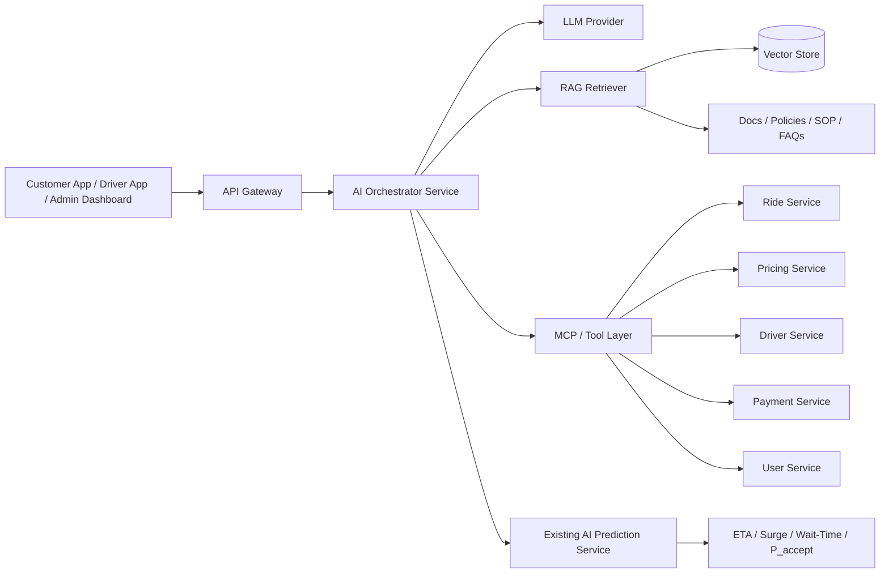

# Ke hoach nang cap AI tu ETA/Surge Predictor len RAG + Agent + MCP

## 1. Ket luan ngan

Co the nang cap.

AI hien tai trong he thong FoxGo chua phai la mot nen tang LLM/RAG/Agent/MCP. No dang la mot dich vu du doan chuyen biet hep, tap trung vao:

- du doan ETA
- goi y surge/price multiplier
- ho tro matching wait-time / accept-rate

Vi vay, cach nang cap dung khong phai la thay the toan bo `services/ai-service`, ma la mo rong thanh mot kien truc AI nhieu lop:

- giu lai AI hien tai cho bai toan du doan co cau truc
- bo sung LLM orchestration cho bai toan hoi dap, giai thich, tro ly van hanh
- bo sung RAG de truy van tai lieu noi bo, chinh sach, quy trinh
- bo sung Agent de thuc thi workflow co nhieu buoc
- bo sung MCP/tool layer de AI truy cap an toan cac microservice hien co

## 2. Hien trang he thong

### 2.1 Thanh phan dang co

- `services/ai-service`
  - FastAPI
  - model co dien (Random Forest / joblib)
  - du doan ETA, surge hint, wait-time, accept probability
- Cac microservice nghiep vu da ton tai:
  - `ride-service`
  - `pricing-service`
  - `driver-service`
  - `user-service`
  - `payment-service`
  - `booking-service`
  - `api-gateway`

### 2.2 Gioi han hien tai

AI hien tai khong lam duoc cac bai toan sau:

- tra loi cau hoi bang ngon ngu tu nhien dua tren tai lieu noi bo
- tong hop tinh huong van hanh da nguon du lieu
- thuc thi chuoi hanh dong co dieu kien
- truy cap co kiem soat vao nhieu service thong qua tools
- giai thich ly do gia, ETA, matching theo van phong tro ly AI

## 3. Kien truc muc tieu



## 4. Nguyen tac thiet ke

### 4.1 Khong dung LLM de thay the tinh toan nghiep vu quyet dinh

LLM khong nen la nguon su that cho:

- gia cuoc
- eta cuoi cung
- so du vi
- trang thai chuyen di
- doi soat thanh toan

Nhung gia tri nay van phai do service nghiep vu hien co cung cap.

### 4.2 LLM dung cho 3 nhom bai toan

- giai thich: vi sao gia tang, vi sao khong tim thay tai xe, vi sao vi bi khoa
- truy van tri thuc: doc chinh sach, tai lieu, SOP noi bo
- dieu phoi cong viec: agent hoa cac thao tac van hanh co nhieu buoc

### 4.3 MCP / tool layer phai bi gioi han quyen

AI khong duoc goi tu do toi DB. No chi duoc goi qua cac tool noi bo co whitelist ro rang, vi du:

- `get_ride_status`
- `get_driver_wallet_summary`
- `get_payment_status`
- `explain_price_breakdown`
- `find_nearby_driver_supply`

## 5. Cac lop can bo sung

### 5.1 AI Orchestrator Service

Nen them mot service moi, vi du:

- `services/ai-orchestrator-service`

Nhiem vu:

- nhan request AI tu gateway hoac dashboard
- chon mode phu hop: prediction / rag / agent
- goi LLM provider
- goi retriever
- goi tools/MCP
- ap dung safety policy, guardrail, audit log

### 5.2 RAG Layer

Nguon tri thuc de index:

- `README.md`
- `docs/architecture/*`
- `docs/seed-accounts-reference.md`
- `docs/huong-dan-test-thanh-toan-sandbox.md`
- policy van hanh, refund, khieu nai, OTP, dinh vi, matching

Can bo sung:

- chunking pipeline
- embedding pipeline
- vector store (Postgres pgvector / Qdrant / Weaviate)
- retriever + reranker

### 5.3 MCP / Tool Layer

Can them mot lop tools noi bo de AI truy cap nghiep vu theo cach co kiem soat.

Vi du cac tool dau tien:

- `ride.get_trip_context(rideId)`
- `pricing.get_price_breakdown(rideId | estimateInput)`
- `driver.get_driver_profile(driverId)`
- `wallet.get_wallet_state(driverId)`
- `payment.get_payment_summary(rideId)`
- `support.search_policy(query)`

### 5.4 Agent Layer

Agent phu hop cho cac workflow:

- giai quyet ticket ho tro
- giai thich refund that bai
- tong hop su co matching / payment / vi
- de xuat cach xu ly khi tai xe bi khoa vi

Agent khong nen tu dong tac dong len he thong san xuat neu khong co phan quyen va xac nhan.

## 6. Phuong an tich hop voi repo hien tai

### Phase 1: Giữ AI prediction hien tai, them orchestration

- giu `services/ai-service` cho ETA / surge / matching ML
- them `services/ai-orchestrator-service`
- them endpoint moi qua `api-gateway`, vi du:
  - `POST /api/ai/ask`
  - `POST /api/ai/explain-fare`
  - `POST /api/ai/support-assistant`

### Phase 2: Them RAG cho tri thuc noi bo

- index toan bo `docs/` va cac file chinh sach
- tao retriever cho support/admin assistant
- tra loi cac cau hoi nhu:
  - vi sao tai khoan tai xe bi khoa
  - quy trinh hoan tien VNPay/MoMo
  - chinh sach OTP / huy chuyen / doi soat

### Phase 3: Them MCP tools cho nghiep vu song dong

- tool doc context chuyen di
- tool doc vi / thanh toan / lich su
- tool doc matching metrics
- tool explain price breakdown tu pricing-service

### Phase 4: Agent hoa mot so quy trinh ho tro

- agent tiep nhan ticket
- agent tong hop timeline chuyen di
- agent dua ra de xuat xu ly
- con nguoi phe duyet truoc khi thuc thi hanh dong nhay cam

## 7. De xuat cau truc thu muc

```text
services/
  ai-service/                  # giu nguyen vai tro prediction ML hien tai
  ai-orchestrator-service/     # moi: LLM gateway + agent runtime + safety

shared/
  ai-tools/                    # tool contracts dung chung
  ai-prompts/                  # prompt templates / system policies
  ai-schemas/                  # zod/json schema cho tool IO

docs/
  architecture/
    ai-rag-agent-mcp-upgrade-plan.md
```

## 8. Use case co gia tri cao nhat de lam truoc

### 8.1 Giai thich gia cuoc

Input:

- diem don
- diem den
- loai xe
- surge
- distance
- duration

Output:

- gia goc
- phi theo quang duong
- phi theo thoi gian
- phu phi cuoc ngan / phi dich vu hang xe
- tong tien
- ly do gia tang

### 8.2 Tro ly ho tro noi bo

Cho admin / CSKH hoi bang ngon ngu tu nhien:

- vi sao chuyen nay hoan tien cham
- vi sao tai xe nay bi khoa nhan cuoc
- vi sao matching that bai

### 8.3 Tro ly cho tai xe va khach hang

- giai thich trang thai chuyen di
- giai thich vi sao vi am
- giai thich ly do chua co tai xe gan

## 9. Guardrail va quan sat he thong

Bat buoc them:

- audit log cho moi AI request
- luu prompt / tool calls / answer / latency
- redaction cho PII
- tool permission theo role
- fallback khi LLM timeout
- circuit breaker khi vector store / LLM provider loi

## 10. Ket luan de thuc thi

Huong nang cap kha thi nhat cho FoxGo la:

1. Giữ `ai-service` hien tai cho bai toan ML co cau truc.
2. Them mot `ai-orchestrator-service` moi cho LLM + RAG + Agent.
3. Them MCP/tool layer de AI goi duoc cac microservice hien co mot cach an toan.
4. Trien khai theo tung phase, uu tien use case giai thich gia, support noi bo va trip investigation.

Noi cach khac: co the nang cap len kien truc giong RAG/Agent/MCP, nhung nen di theo huong mo rong co kiem soat, khong nen bien AI hien tai thanh mot "LLM service" don le roi day het moi bai toan vao do.