# THIẾT KẾ VÀ XÂY DỰNG HỆ THỐNG ĐẶT XE TRỰC TUYẾN

> Toàn bộ nội dung trong file này do Claude viết dựa trên codebase thực tế.
> Điền `[...]` = thông tin cá nhân sinh viên.

---

## HƯỚNG DẪN DÙNG FILE NÀY ĐỂ DÀN TRANG WORD

File này được viết theo hướng có thể sao chép sang Microsoft Word và định dạng lại theo mẫu khóa luận. Khi đưa sang Word, nên giữ cấu trúc chương/mục hiện có, sau đó chèn hình từ thư mục `img/` theo bảng gợi ý dưới đây. Các đoạn `` trong file là vị trí gợi ý chèn ảnh; nếu Word không tự nhận Markdown image, dùng chức năng **Insert > Pictures** và chọn đúng file PNG tương ứng.

| Vị trí trong báo cáo | Hình nên chèn | Mục đích sử dụng |
|---|---|---|
| Chương 3, sau mục 3.2 | `img/07_use_case_overview.png` | Tổng quan tác nhân và use case chính của khách hàng, tài xế, quản trị viên |
| Chương 3, luồng đặt xe | `img/10_activity_booking_flow.png` | Mô tả activity flow khách đặt xe, hệ thống tính giá, tìm tài xế và hoàn thành chuyến |
| Chương 3, luồng nghiệp vụ đa vai trò | `img/12_bpmn_booking_lanes.png` | Thể hiện swimlane khách hàng, tài xế và hệ thống trong một chuyến đi |
| Chương 4, kiến trúc tổng thể | `img/01_system_architecture_overview.png` | Hình kiến trúc hệ thống tổng quan, phù hợp đặt ở đầu chương thiết kế |
| Chương 4, kiến trúc dữ liệu | `img/05_data_architecture.png` | Thể hiện database-per-service, Redis, RabbitMQ, MongoDB |
| Chương 4, context/event flow | `img/13_event_flow_rabbitmq.png` | Minh họa luồng domain event qua RabbitMQ |
| Chương 4, state machine chuyến đi | `img/08_state_machine_ride.png` | Minh họa vòng đời Ride và các trạng thái hợp lệ |
| Chương 4, state machine ví | `img/09_state_machine_wallet.png` | Minh họa trạng thái ví, pending balance, settlement |
| Chương 4, ERD lõi | `img/18_erd_core_services.png` | Sơ đồ quan hệ dữ liệu lõi giữa user, driver, booking, ride, payment, wallet |
| Chương 5, thuật toán matching | `img/15_driver_matching_flow.png` | Luồng tìm tài xế theo bán kính, scoring và offer |
| Chương 5, thanh toán | `img/04_booking_payment_flow.png`, `img/11_activity_payment_branch.png` | Trình bày luồng booking-payment và nhánh CASH/MoMo/VNPay |
| Chương 5, realtime | `img/03_realtime_communication_flow.png` | Chat, Socket.IO, WebRTC signaling và broadcast trạng thái |
| Chương 5, AI/RAG | `img/06_ai_ml_pipeline.png`, `img/16_rag_chatbot_architecture.png` | Minh họa pipeline ML và chatbot RAG |
| Chương 6, API Gateway | `img/14_api_gateway_routing_map.png`, `img/19_component_api_gateway.png` | Bảng định tuyến và component nội bộ Gateway |
| Chương 6, xác thực OTP | `img/17_sequence_auth_otp.png` | Sequence đăng ký/đăng nhập OTP |
| Chương 6, bảo mật | `img/20_security_trust_boundary.png` | Vùng tin cậy bảo mật giữa client, gateway, service và data layer |
| Chương 6 hoặc Hướng phát triển | `img/02_aws_deployment_architecture.png` | Kiến trúc triển khai cloud đề xuất |

---

## ABSTRACT

**DESIGN AND DEVELOPMENT OF AN ONLINE CAB BOOKING SYSTEM**

This thesis presents the analysis, design, and implementation of a scalable online cab booking system modeled after production ride-hailing platforms. Applying Domain-Driven Design (DDD), the system is decomposed into eleven bounded contexts, each realized as an independent microservice written in Node.js and TypeScript. Three single-page React applications serve customers, drivers, and platform administrators.

The architecture uses an API Gateway as the sole public entry point, with inter-service communication over gRPC (low-latency synchronous calls) and RabbitMQ topic exchange (asynchronous domain events). Key technical contributions include: a geospatial driver-dispatch algorithm executing up to three radius-expanding rounds with a five-factor weighted score and optional AI-predicted acceptance probability; an idempotent dual-gateway payment system (MoMo and VNPay) using outbox-pattern event publishing; a fintech-grade driver wallet implementing a 300,000 VND security-deposit model, T+24h pending-earnings hold, per-trip debt records with due dates, and first-in-first-out debt settlement; and a WebRTC peer-to-peer voice-call channel co-located with Socket.IO chat. All state transitions in the ride lifecycle are enforced by a domain state machine, preventing invalid status updates.

Test results confirm that dispatch completes within three rounds for simulated urban densities, duplicate IPN callbacks do not produce double-credits, and the pending-balance settlement correctly sequences debt paydown before releasing funds to the withdrawable balance.

**Keywords:** ride-hailing, Domain-Driven Design, microservices, geospatial matching, idempotent payment, driver wallet, WebRTC, Node.js, React, Docker.

---

## TÓM TẮT

**THIẾT KẾ VÀ XÂY DỰNG HỆ THỐNG ĐẶT XE TRỰC TUYẾN**

Khóa luận trình bày quá trình phân tích, thiết kế và hiện thực một hệ thống đặt xe trực tuyến có khả năng mở rộng, lấy cảm hứng từ các nền tảng giao thông thương mại như Grab và Gojek. Vận dụng phương pháp Thiết kế Hướng Lĩnh vực (DDD), hệ thống được phân rã thành mười một Bounded Context độc lập, mỗi context được hiện thực như một microservice riêng biệt viết bằng Node.js/TypeScript. Ba ứng dụng React đơn trang phục vụ lần lượt khách hàng, tài xế và quản trị viên nền tảng.

Kiến trúc sử dụng API Gateway làm điểm vào duy nhất, giao tiếp nội bộ qua gRPC (đồng bộ, độ trễ thấp) và RabbitMQ topic exchange (bất đồng bộ, event-driven). Các đóng góp kỹ thuật chính gồm: thuật toán điều phối tài xế theo địa lý với ba vòng mở rộng bán kính và hàm tính điểm đa tiêu chí; hệ thống thanh toán bất biến qua MoMo và VNPay theo mô hình Outbox Pattern; ví tài xế chuẩn fintech với ký quỹ, giữ thu nhập T+24h, công nợ từng chuyến có hạn thanh toán, tất toán FIFO; giao tiếp giọng nói WebRTC và chat Socket.IO giữa tài xế và khách hàng.

**Từ khóa:** đặt xe trực tuyến, DDD, vi dịch vụ, ghép cặp địa lý, thanh toán bất biến, ví tài xế, WebRTC, Node.js, React, Docker.

---

## LỜI CẢM ƠN

Chúng em xin gửi lời cảm ơn chân thành đến [TS./ThS. Họ và tên GVHD] đã tận tình hướng dẫn, định hướng kỹ thuật và theo dõi tiến độ trong suốt quá trình thực hiện khóa luận. Chúng em cũng xin cảm ơn quý Thầy/Cô Khoa Công nghệ Thông tin, Trường Đại học Công Nghiệp TP. Hồ Chí Minh đã truyền đạt kiến thức nền tảng trong bốn năm học.

**Người thực hiện đề tài**  
[Họ và tên SV1] — [Họ và tên SV2]

---

## DANH MỤC CÁC THUẬT NGỮ VIẾT TẮT

| Viết tắt | Đầy đủ | Nghĩa |
|---|---|---|
| DDD | Domain-Driven Design | Thiết kế hướng lĩnh vực |
| BC | Bounded Context | Ngữ cảnh giới hạn (trong DDD) |
| AR | Aggregate Root | Gốc tập hợp (trong DDD) |
| VO | Value Object | Đối tượng giá trị (trong DDD) |
| DE | Domain Event | Sự kiện miền |
| API | Application Programming Interface | Giao diện lập trình ứng dụng |
| SPA | Single Page Application | Ứng dụng đơn trang |
| JWT | JSON Web Token | Token xác thực |
| gRPC | Google Remote Procedure Call | Giao thức gọi hàm từ xa |
| ORM | Object-Relational Mapping | Ánh xạ đối tượng–CSDL |
| IPN | Instant Payment Notification | Thông báo thanh toán tức thời |
| GPS | Global Positioning System | Hệ thống định vị toàn cầu |
| WebRTC | Web Real-Time Communication | Giao tiếp thời gian thực web |
| CQRS | Command Query Responsibility Segregation | Phân tách lệnh–truy vấn |
| TTL | Time To Live | Thời gian tồn tại |
| FIFO | First In First Out | Vào trước ra trước |

---

# CHƯƠNG 1: GIỚI THIỆU

## 1.1. Bối cảnh và Lý do chọn đề tài

### 1.1.1. Thực trạng thị trường

Thị trường đặt xe công nghệ tại Việt Nam tăng trưởng mạnh mẽ trong giai đoạn 2018–2024. Theo báo cáo của Google và Temasek (2023), giá trị thị trường ride-hailing Đông Nam Á đạt 12,4 tỷ USD và dự kiến chạm mốc 19,7 tỷ USD vào năm 2027. Tại Việt Nam, Grab chiếm ưu thế với hơn 70% thị phần, tiếp theo là Be và Gojek [1].

Sự phổ biến của điện thoại thông minh (smartphone penetration > 73% tại Việt Nam năm 2023 theo Statista), băng thông rộng 4G/5G, và văn hóa sử dụng ví điện tử (MoMo, ZaloPay, VNPay) đã tạo điều kiện lý tưởng cho sự phát triển của các nền tảng giao thông số.

### 1.1.2. Thách thức kỹ thuật

Từ góc độ Hệ Thống Thông Tin, xây dựng một nền tảng đặt xe trực tuyến đặt ra những thách thức kỹ thuật đặc thù:

**Thách thức về quy mô và thời gian thực:**
- Hàng chục nghìn tài xế đồng thời cập nhật GPS mỗi vài giây
- Yêu cầu ghép cặp tài xế–khách hàng trong vòng < 5 giây
- Thông báo trạng thái chuyến đi phải đến đích ngay lập tức

**Thách thức về tính nhất quán tài chính:**
- Cổng thanh toán có thể gửi IPN callback nhiều lần → phải xử lý bất biến
- Ví tài xế cần phản ánh chính xác mọi giao dịch → phải có audit trail
- Công nợ chuyến tiền mặt phải được tất toán đúng thứ tự

**Thách thức về kiến trúc:**
- Yêu cầu mở rộng độc lập (scale independently) từng component
- Cần cô lập lỗi — lỗi một service không gây sập toàn bộ hệ thống
- Ranh giới nghiệp vụ rõ ràng để dễ bảo trì và mở rộng tính năng

### 1.1.3. Lý do chọn phương pháp DDD

Domain-Driven Design (DDD) là phương pháp thiết kế phần mềm tập trung vào mô hình hóa lĩnh vực nghiệp vụ, được Eric Evans giới thiệu năm 2003 [2]. DDD phù hợp đặc biệt với hệ thống đặt xe vì:

1. **Nghiệp vụ phức tạp**: ghép cặp tài xế, quản lý ví, thanh toán — mỗi lĩnh vực có ngôn ngữ, quy tắc và vòng đời riêng biệt.
2. **Nhiều nhóm phát triển**: DDD giúp các nhóm làm việc trên các Bounded Context khác nhau mà không can thiệp nhau.
3. **Ánh xạ tự nhiên sang microservices**: mỗi Bounded Context là cơ sở tự nhiên để xác định ranh giới microservice.

## 1.2. Mục tiêu đề tài

| # | Mục tiêu | Cách đo lường |
|---|---|---|
| 1 | Phân tích và đặc tả đầy đủ yêu cầu hệ thống theo DDD | Tài liệu Ubiquitous Language, Context Map, Domain Model |
| 2 | Thiết kế kiến trúc microservices với ranh giới BC rõ ràng | 11 service với Bounded Context riêng biệt |
| 3 | Hiện thực đầy đủ 3 ứng dụng frontend | Customer App, Driver App, Admin Dashboard hoạt động |
| 4 | Tích hợp thanh toán MoMo và VNPay với idempotency | Test pass với IPN trùng lặp |
| 5 | Xây dựng hệ thống ví tài xế theo mô hình fintech | pendingBalance, DebtRecord, settlement hoạt động đúng |
| 6 | Thuật toán ghép cặp tài xế theo địa lý | Dispatch < 5s trong điều kiện mô phỏng đô thị |
| 7 | Real-time communication (chat + voice call) | Socket.IO chat + WebRTC call hoạt động trong chuyến |

## 1.3. Phạm vi đề tài

**Trong phạm vi:**
- Đăng ký/đăng nhập tài khoản qua OTP
- Luồng đặt xe đầy đủ từ đặt → ghép cặp → theo dõi → hoàn thành
- Thanh toán: tiền mặt, MoMo, VNPay; hoàn tiền khi hủy
- Ví tài xế: ký quỹ, thu nhập, rút tiền, quản lý công nợ
- Quản trị: duyệt tài xế, theo dõi chuyến, đối soát tài chính
- Chat và gọi thoại trong chuyến
- AI surge pricing (dữ liệu mô phỏng)

**Ngoài phạm vi:**
- Maps trả phí (dùng OpenStreetMap/Nominatim)
- Ứng dụng native iOS/Android
- Hệ thống khuyến mãi phức tạp (chỉ voucher đơn giản)
- Triển khai production cloud (chỉ Docker local)

## 1.4. Phương pháp thực hiện

1. **Nghiên cứu tài liệu**: DDD của Evans, kiến trúc microservices của Newman, thiết kế hệ thống phân tán của Kleppmann.
2. **Phân tích Domain**: Nhận diện core/supporting/generic subdomain, xây dựng Ubiquitous Language.
3. **Thiết kế Context Map**: Xác định ranh giới BC và mối quan hệ giữa chúng.
4. **Phát triển Agile**: Sprint 1 tuần, mỗi sprint deliver 1–2 service hoàn chỉnh.
5. **Test-Driven**: Unit test cho business logic, integration test cho luồng nghiệp vụ quan trọng.

---

# CHƯƠNG 2: CƠ SỞ LÝ THUYẾT

## 2.1. Domain-Driven Design (DDD)

### 2.1.1. Tổng quan

Domain-Driven Design là phương pháp phát triển phần mềm đặt mô hình lĩnh vực nghiệp vụ (domain model) làm trung tâm của thiết kế. DDD được Eric Evans hệ thống hóa năm 2003, gồm hai nhóm khái niệm chính: **Strategic Design** (thiết kế chiến lược — phạm vi toàn hệ thống) và **Tactical Design** (thiết kế chiến thuật — phạm vi một service).

### 2.1.2. Strategic Design

**Subdomain** — Một phần của toàn bộ lĩnh vực nghiệp vụ, phân loại thành:
- **Core Domain**: tạo ra lợi thế cạnh tranh, là trái tim của hệ thống (ví dụ: dispatch algorithm)
- **Supporting Subdomain**: hỗ trợ core domain, không đơn giản đủ để mua ngoài (ví dụ: wallet)
- **Generic Subdomain**: chức năng chung, có thể dùng giải pháp off-the-shelf (ví dụ: authentication)

**Bounded Context (BC)** — Ngữ cảnh giới hạn trong đó một mô hình domain cụ thể được định nghĩa và áp dụng nhất quán. Bên trong một BC, thuật ngữ "Ride" có nghĩa rõ ràng và cụ thể; bên ngoài BC đó, cùng từ "Ride" có thể mang nghĩa khác.

**Ubiquitous Language** — Ngôn ngữ chung được đồng thuận giữa developer và domain expert, được dùng trong code, tài liệu và cuộc trò chuyện.

**Context Map** — Sơ đồ mô tả các Bounded Context và mối quan hệ giữa chúng:
- **Partnership**: hai BC phát triển cùng nhau, phải phối hợp
- **Customer/Supplier**: BC upstream (supplier) cung cấp API cho BC downstream (customer)
- **Conformist**: downstream phải tuân theo model của upstream
- **Anti-Corruption Layer (ACL)**: downstream dùng lớp dịch để tách biệt khỏi upstream
- **Published Language**: BC định nghĩa schema chuẩn để chia sẻ

### 2.1.3. Tactical Design

**Entity** — Đối tượng có danh tính (identity) riêng biệt, tồn tại liên tục theo thời gian. Ví dụ: `Ride` được nhận diện bởi `rideId` dù các thuộc tính thay đổi.

**Value Object (VO)** — Đối tượng không có identity, bất biến, được nhận diện bởi giá trị các thuộc tính. Ví dụ: `Location(lat, lng, address)` — hai Location bằng nhau nếu cùng tọa độ và địa chỉ.

**Aggregate** — Nhóm các Entity và VO liên quan, có một Aggregate Root (AR) là điểm vào duy nhất. Bên ngoài không được truy cập trực tiếp vào các object bên trong aggregate — phải đi qua AR.

**Domain Event** — Sự kiện nghiệp vụ có ý nghĩa đã xảy ra trong quá khứ. Ví dụ: `RideCompleted`, `PaymentSettled`. Domain Events được dùng để giao tiếp giữa các Bounded Context.

**Repository** — Abstraction để persist và retrieve Aggregate, che giấu chi tiết lưu trữ.

**Domain Service** — Logic nghiệp vụ không thuộc về bất kỳ Entity hay VO nào. Ví dụ: `DriverMatchingService`.

**Application Service** — Điều phối các use case, gọi Domain Service và Repository, không chứa business logic.

### 2.1.4. Mapping DDD sang Microservices

```
Bounded Context  ←→  Microservice
Aggregate Root   ←→  Transaction boundary (1 DB transaction / AR)
Domain Event     ←→  RabbitMQ message
Repository       ←→  Prisma Client
```

## 2.2. Kiến trúc vi dịch vụ (Microservices)

### 2.2.1. Đặc điểm

Kiến trúc vi dịch vụ tổ chức ứng dụng như một tập hợp các service nhỏ, triển khai độc lập, giao tiếp qua network [3]. Mỗi service:
- Sở hữu database riêng (Database per Service pattern)
- Có thể deploy/scale độc lập
- Giao tiếp qua API hoặc message
- Được đặt ranh giới theo Bounded Context

### 2.2.2. Giao tiếp

**Đồng bộ (REST/gRPC):**
- REST/HTTP: phổ biến, tooling phong phú, nhưng coupling cao hơn
- gRPC: Protocol Buffers serialization, ~5x nhanh hơn JSON/REST, type-safe, hỗ trợ streaming

**Bất đồng bộ (Message Broker):**
- RabbitMQ Topic Exchange: routing theo pattern `domain.event`
- Đảm bảo eventual consistency giữa các service
- Giảm temporal coupling: producer và consumer không cần online cùng lúc

### 2.2.3. Outbox Pattern

Giải quyết vấn đề "dual write" (vừa update DB vừa publish event):

```
Begin Transaction:
  1. Update domain entity in DB
  2. Write event to OutboxEvent table (same DB, same tx)
Commit Transaction

Background worker:
  1. Read unsent events from OutboxEvent
  2. Publish to RabbitMQ
  3. Mark as published
```

Đảm bảo at-least-once delivery ngay cả khi service crash giữa chừng.

## 2.3. Công nghệ nền tảng

### 2.3.1. Node.js và TypeScript

Node.js sử dụng event loop và non-blocking I/O, phù hợp cho ứng dụng I/O-intensive như ride-hailing (nhiều kết nối đồng thời). TypeScript bổ sung kiểu tĩnh, giúp phát hiện lỗi tại compile-time và cải thiện developer experience trong codebase lớn.

### 2.3.2. Prisma ORM

Prisma tạo type-safe database client từ schema declarative. Sau mỗi schema change: `prisma migrate dev` tạo SQL migration, `prisma generate` tạo lại client. Generated client đảm bảo các query đúng kiểu tại compile-time.

### 2.3.3. Socket.IO với Redis Adapter

Socket.IO cung cấp WebSocket real-time với fallback HTTP long-polling. Redis Adapter cho phép nhiều Gateway instance chia sẻ cùng room/namespace — khi user kết nối vào Gateway-1 nhưng event được emit từ Gateway-2, Redis pub/sub đảm bảo delivery đúng.

### 2.3.4. Redis Geo Index

Redis GEOADD lưu tọa độ dưới dạng 52-bit geohash integer trong sorted set. GEORADIUS tìm tất cả member trong bán kính cho trước với độ phức tạp O(N+log M). Phù hợp cho spatial query thời gian thực trong hệ thống dispatch.

### 2.3.5. Cổng thanh toán MoMo và VNPay

Cả hai đều cung cấp sandbox environment. Luồng thanh toán:
1. Backend khởi tạo request → nhận `payUrl`
2. Frontend redirect sang trang thanh toán
3. Sau khi user thanh toán, gateway gọi IPN endpoint của backend
4. Backend xử lý IPN, cập nhật trạng thái, trigger domain events

**Đặc điểm IPN cần chú ý:** IPN có thể đến trễ, đến nhiều lần, hoặc không đến. Backend phải:
- Xác thực signature của IPN (MoMo: HMAC-SHA256, VNPay: SHA512)
- Xử lý idempotent (kiểm tra `idempotencyKey` trước khi xử lý)
- Trả response 200 nhanh (< 5s) để gateway không retry

## 2.4. Nghiên cứu liên quan

### 2.4.1. Uber Engineering

Uber công bố kiến trúc dispatch system dùng thuật toán tối ưu hóa tổ hợp (combinatorial optimization) cho bài toán ghép cặp toàn cục [4]. Đề tài đơn giản hóa thành greedy algorithm với hàm scoring — phù hợp với scope học thuật nhưng vẫn đảm bảo correctness.

### 2.4.2. Grab Engineering

Grab sử dụng Apache Kafka cho event streaming với throughput cao hơn RabbitMQ, và Golang thay vì Node.js cho các service critical [5]. Đề tài chọn RabbitMQ (đơn giản hơn, đủ tốt cho scale học thuật) và Node.js (đồng nhất tech stack).

---

# CHƯƠNG 3: PHÂN TÍCH YÊU CẦU

## 3.1. Nhận diện các tác nhân (Actors)

| Tác nhân | Loại | Mô tả |
|---|---|---|
| **Khách hàng** | Primary | Người dùng đặt xe, thanh toán, đánh giá |
| **Tài xế** | Primary | Người nhận và thực hiện chuyến, quản lý ví |
| **Quản trị viên** | Primary | Nhân viên nền tảng: duyệt hồ sơ, giám sát, đối soát |
| **API Gateway** | System | Proxy, xác thực, dispatch |
| **MoMo/VNPay** | External | Cổng thanh toán bên ngoài |
| **AI Service** | External | Dự đoán surge pricing |
| **STUN Server** | External | NAT traversal cho WebRTC |

## 3.2. Biểu đồ Use Case tổng thể

**Hình gợi ý chèn vào Word:** `img/07_use_case_overview.png`

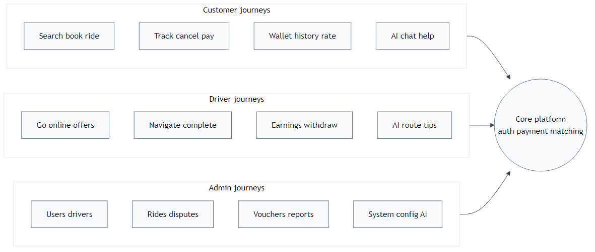

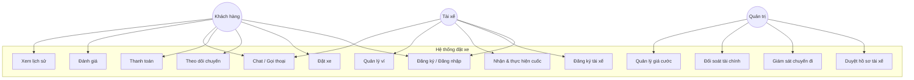
```mermaid
graph TD
    subgraph Hệ thống đặt xe
        UC1[Đăng ký / Đăng nhập]
        UC2[Đặt xe]
        UC3[Theo dõi chuyến]
        UC4[Thanh toán]
        UC5[Chat / Gọi thoại]
        UC6[Đánh giá]
        UC7[Xem lịch sử]
        UC8[Đăng ký tài xế]
        UC9[Nhận & thực hiện cuốc]
        UC10[Quản lý ví]
        UC11[Duyệt hồ sơ tài xế]
        UC12[Giám sát chuyến đi]
        UC13[Đối soát tài chính]
        UC14[Quản lý giá cước]
    end

    KH((Khách hàng)) --> UC1
    KH --> UC2
    KH --> UC3
    KH --> UC4
    KH --> UC5
    KH --> UC6
    KH --> UC7

    TX((Tài xế)) --> UC1
    TX --> UC8
    TX --> UC9
    TX --> UC10
    TX --> UC5

    ADM((Quản trị)) --> UC11
    ADM --> UC12
    ADM --> UC13
    ADM --> UC14
```

## 3.3. Đặc tả Use Case chi tiết

### 3.3.1. UC-02: Đặt xe

**Tên:** Đặt xe trực tuyến  
**Tác nhân chính:** Khách hàng  
**Tiền điều kiện:** Khách hàng đã đăng nhập, có kết nối internet  
**Hậu điều kiện:** Chuyến đi được tạo với trạng thái `CREATED` và nhanh chóng chuyển sang `FINDING_DRIVER`, hệ thống bắt đầu tìm tài xế

| # | Bước | Tác nhân | Hệ thống |
|---|---|---|---|
| 1 | Mở ứng dụng, nhập điểm đón trên bản đồ | Khách hàng | — |
| 2 | — | — | Gọi Nominatim API gợi ý địa chỉ |
| 3 | Xác nhận điểm đón, nhập điểm đến | Khách hàng | — |
| 4 | — | — | Gọi Pricing Service tính giá ước tính |
| 5 | Chọn loại xe, phương thức thanh toán, xác nhận | Khách hàng | — |
| 6 | — | — | Tạo Ride (`CREATED`), chuyển sang `FINDING_DRIVER`, publish `ride.created` |
| 7 | — | — | Dispatch algorithm tìm tài xế phù hợp (≤3 vòng) |
| 8 | — | — | Chuyển Ride sang `OFFERED`, gửi offer socket đến tài xế được chọn |
| 9 | Tài xế chấp nhận | Tài xế | — |
| 10 | — | — | Cập nhật status=`ASSIGNED`, notify khách hàng |
| 11 | Nhận thông báo tài xế đang đến | Khách hàng | — |

**Luồng thay thế A2:** Không có tài xế sau 3 vòng → thông báo thất bại, Ride hủy  
**Luồng thay thế A3:** Tài xế không phản hồi trong 30s → dispatch cho tài xế tiếp theo

### 3.3.2. UC-04: Thanh toán

**Tên:** Thanh toán cuối chuyến  
**Tiền điều kiện:** Chuyến đi ở trạng thái COMPLETED  
**Hậu điều kiện:** Payment COMPLETED, ví tài xế được cập nhật, hoàn tiền nếu cần

| Phương thức | Luồng |
|---|---|
| **CASH** | Khách trả tiền mặt → driver hoàn thành → debit commission → tạo DebtRecord |
| **MOMO** | Redirect sang MoMo → user thanh toán → MoMo gọi IPN → credit pendingBalance |
| **VNPAY** | Redirect sang VNPay → user thanh toán → VNPay gọi IPN → credit pendingBalance |

### 3.3.3. UC-10: Quản lý ví tài xế

**Tên:** Xem và quản lý ví tài xế  
**Tác nhân chính:** Tài xế  
**Tiền điều kiện:** Tài xế đã kích hoạt ví (nạp 300k ký quỹ)

Tác nhân có thể:
1. Xem 4 thành phần số dư: available, pending (T+24h), debt, deposit
2. Xem danh sách DebtRecord với due date và trạng thái
3. Rút tiền về ngân hàng (chỉ từ availableBalance)
4. Nạp tiền (tự động tất toán công nợ trước, phần dư vào available)
5. Xem lịch sử giao dịch với filter theo loại

## 3.4. Yêu cầu chức năng tổng hợp

### 3.4.1. Nhóm Khách hàng

| Mã | Tính năng | Ưu tiên | Microservice |
|---|---|---|---|
| F-C01 | Đăng ký OTP qua số điện thoại | Cao | auth-service |
| F-C02 | Đăng nhập, refresh token | Cao | auth-service |
| F-C03 | Đặt xe với bản đồ tương tác | Cao | ride-service |
| F-C04 | Chọn loại xe và ước tính giá | Cao | pricing-service |
| F-C05 | Theo dõi tài xế real-time | Cao | api-gateway |
| F-C06 | Thanh toán MoMo/VNPay/Tiền mặt | Cao | payment-service |
| F-C07 | Hủy chuyến và yêu cầu hoàn tiền | Trung | payment-service |
| F-C08 | Chat Socket.IO với tài xế | Cao | api-gateway |
| F-C09 | Gọi thoại WebRTC với tài xế | Cao | api-gateway |
| F-C10 | Đánh giá tài xế sau chuyến | Trung | review-service |
| F-C11 | Xem lịch sử chuyến đi | Trung | booking-service |
| F-C12 | Sử dụng voucher giảm giá | Thấp | booking-service |

### 3.4.2. Nhóm Tài xế

| Mã | Tính năng | Ưu tiên | Microservice |
|---|---|---|---|
| F-D01 | Đăng ký hồ sơ (xe, GPLX) | Cao | driver-service |
| F-D02 | Nạp 300k ký quỹ kích hoạt ví | Cao | wallet-service |
| F-D03 | Bật/tắt nhận cuốc | Cao | driver-service |
| F-D04 | Nhận thông báo cuốc và chấp nhận | Cao | api-gateway |
| F-D05 | Cập nhật trạng thái chuyến | Cao | ride-service |
| F-D06 | Xem ví: available/pending/debt/deposit | Cao | wallet-service |
| F-D07 | Rút tiền về ngân hàng | Cao | wallet-service |
| F-D08 | Xem công nợ với due date | Cao | wallet-service |
| F-D09 | Xem lịch sử thu nhập | Trung | wallet-service |
| F-D10 | Chat/gọi thoại với khách | Cao | api-gateway |

### 3.4.3. Nhóm Quản trị viên

| Mã | Tính năng | Ưu tiên | Microservice |
|---|---|---|---|
| F-A01 | Duyệt/từ chối hồ sơ tài xế | Cao | driver-service |
| F-A02 | Bản đồ tài xế online real-time | Cao | api-gateway |
| F-A03 | Danh sách và filter chuyến đi | Cao | ride-service |
| F-A04 | Dashboard tài chính nền tảng | Cao | wallet-service |
| F-A05 | Sổ cái giao dịch và đối soát | Cao | wallet-service |
| F-A06 | Quản lý ví tài xế | Trung | wallet-service |
| F-A07 | Cấu hình giá cước | Trung | pricing-service |
| F-A08 | Quản lý quy tắc thưởng tài xế | Trung | wallet-service |
| F-A09 | Xử lý hoàn tiền | Trung | payment-service |

## 3.5. Yêu cầu phi chức năng

| Loại | Yêu cầu cụ thể |
|---|---|
| **Hiệu năng** | Dispatch tài xế < 5s; API P95 < 300ms |
| **Bảo mật** | JWT 15 phút; OTP chỉ log container; Không expose internal IP |
| **Độ tin cậy** | IPN idempotent; Outbox pattern cho critical events |
| **Khả năng mở rộng** | Stateless services; Redis adapter Socket.IO; Database per service |
| **Khả dụng** | AI service fallback < 150ms; Graceful degradation |
| **Kiểm toán** | Wallet ledger append-only; Merchant ledger bất biến |
| **Tuân thủ** | Không lưu OTP plaintext; Hash SHA-256 |

## 3.6. Phân tích nghiệp vụ chi tiết

Mục này trình bày các nghiệp vụ quan trọng của hệ thống theo dạng có thể sử dụng trực tiếp trong báo cáo Word. Mỗi nghiệp vụ gồm mục tiêu, tác nhân, dữ liệu đầu vào, xử lý chính, kết quả và ngoại lệ cần kiểm soát.

### 3.6.1. Nghiệp vụ đăng ký, đăng nhập và xác thực OTP

**Mục tiêu:** bảo đảm mỗi người dùng trong hệ thống được định danh bằng số điện thoại, có thể đăng nhập an toàn và nhận quyền tương ứng với vai trò khách hàng, tài xế hoặc quản trị viên.

**Tác nhân:** khách hàng, tài xế, quản trị viên, Auth Service, API Gateway.

**Dữ liệu đầu vào:** số điện thoại, mật khẩu, mã OTP, vai trò tài khoản, thông tin thiết bị và địa chỉ IP.

**Quy trình nghiệp vụ:**

| Bước | Mô tả xử lý | Service chịu trách nhiệm |
|---|---|---|
| 1 | Người dùng nhập số điện thoại và yêu cầu gửi OTP | Customer App / Driver App / Admin Dashboard |
| 2 | API Gateway chuyển request đến Auth Service | API Gateway |
| 3 | Auth Service sinh OTP, hash OTP, lưu vào Redis với TTL, đồng thời ghi audit log | Auth Service |
| 4 | Ở môi trường phát triển, OTP được log trong container; ở môi trường thật, OTP được gửi qua SMS provider | Auth Service, SMS Provider |
| 5 | Người dùng nhập OTP để xác minh | Frontend |
| 6 | Auth Service kiểm tra OTP, số lần thử và thời hạn hiệu lực | Auth Service |
| 7 | Khi đăng ký/đăng nhập thành công, Auth Service phát access token và refresh token | Auth Service |
| 8 | API Gateway dùng JWT để xác thực các request sau đó và inject `x-user-id`, `x-user-role`, `x-user-email` cho service phía sau | API Gateway |

**Kết quả:** người dùng có phiên đăng nhập hợp lệ; downstream service nhận được thông tin định danh qua header nội bộ.

**Ngoại lệ:** OTP sai quá số lần cho phép, OTP hết hạn, số điện thoại đã tồn tại, tài khoản bị khóa, refresh token bị thu hồi.

**Hình gợi ý chèn vào Word:** `img/17_sequence_auth_otp.png`.


### 3.6.2. Nghiệp vụ khách hàng đặt xe

**Mục tiêu:** cho phép khách hàng nhập điểm đón, điểm đến, chọn loại xe, xem giá ước tính và xác nhận đặt xe.

**Tác nhân:** khách hàng, API Gateway, Booking Service, Pricing Service, Ride Service, Driver Service.

**Dữ liệu đầu vào:** tọa độ điểm đón/trả, địa chỉ dạng text, loại xe, phương thức thanh toán, voucher, ghi chú chuyến đi.

**Quy trình nghiệp vụ chính:**

| Bước | Mô tả xử lý | Service chịu trách nhiệm |
|---|---|---|
| 1 | Khách hàng chọn điểm đón và điểm đến trên bản đồ | Customer App |
| 2 | Hệ thống chuẩn hóa địa chỉ và lấy tuyến đường dự kiến | API Gateway, Map Adapter |
| 3 | Pricing Service tính khoảng cách, thời gian, surge multiplier và giá ước tính | Pricing Service |
| 4 | Booking Service tạo bản ghi Booking trạng thái `PENDING` để lưu snapshot giá | Booking Service |
| 5 | Khách hàng xác nhận đặt xe | Customer App |
| 6 | Booking chuyển sang `CONFIRMED`, phát event `booking.confirmed` | Booking Service |
| 7 | Ride Service tạo Ride trạng thái `CREATED` rồi chuyển sang `FINDING_DRIVER` | Ride Service |
| 8 | Ride Service phát event `ride.created` để API Gateway kích hoạt matching | Ride Service, API Gateway |

**Kết quả:** một chuyến đi được tạo và hệ thống bắt đầu tìm tài xế.

**Ngoại lệ:** địa chỉ không hợp lệ, không tính được tuyến đường, voucher không hợp lệ, khách hàng có chuyến đang hoạt động, không có tài xế trong phạm vi phục vụ.

**Hình gợi ý chèn vào Word:** `img/10_activity_booking_flow.png` và `img/12_bpmn_booking_lanes.png`.

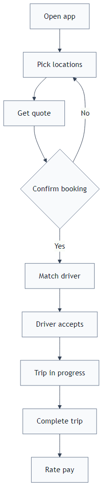

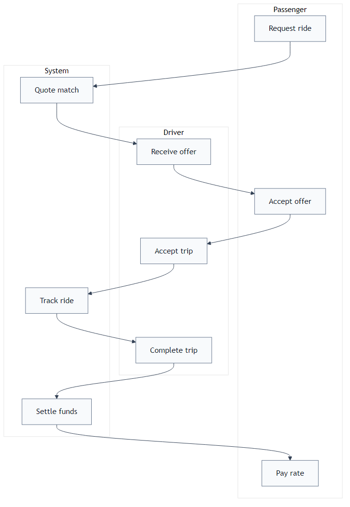

### 3.6.3. Nghiệp vụ điều phối tài xế

**Mục tiêu:** tìm tài xế phù hợp trong thời gian ngắn, ưu tiên tài xế gần, có rating tốt, tỷ lệ nhận chuyến cao và ít hủy chuyến.

**Tác nhân:** API Gateway, Ride Service, Driver Service, tài xế.

**Dữ liệu đầu vào:** vị trí điểm đón, loại xe, danh sách tài xế online trong Redis GEO, thống kê tài xế, trạng thái ví tài xế.

**Quy trình nghiệp vụ:**

| Bước | Mô tả xử lý |
|---|---|
| 1 | API Gateway nhận event `ride.created` từ RabbitMQ |
| 2 | Gateway truy vấn Redis GEO để lấy tài xế trong bán kính vòng 1 là 2km |
| 3 | Hệ thống lọc tài xế theo loại xe, trạng thái online, không bận chuyến khác và đủ điều kiện ví |
| 4 | Các tài xế hợp lệ được tính điểm theo khoảng cách, rating, thời gian rảnh, accept rate và cancel rate |
| 5 | Nếu bật AI, Gateway gọi AI Service để dự đoán xác suất tài xế nhận chuyến; nếu AI lỗi, hệ thống dùng điểm gốc |
| 6 | Gateway gửi offer qua Socket.IO cho tài xế có điểm cao nhất |
| 7 | Nếu tài xế chấp nhận, Ride chuyển sang `ASSIGNED`; nếu từ chối hoặc timeout, hệ thống thử tài xế tiếp theo |
| 8 | Nếu vòng 1 thất bại, Gateway mở rộng sang vòng 2 bán kính 3km và vòng 3 bán kính 5km |
| 9 | Nếu tất cả vòng thất bại, Ride được hủy với lý do không tìm thấy tài xế |

**Kết quả:** chuyến đi được gán tài xế hoặc được hủy có kiểm soát.

**Ngoại lệ:** tài xế offline ngay sau khi nhận offer, tài xế hết điều kiện ví, Socket.IO mất kết nối, không có tài xế phù hợp.

**Hình gợi ý chèn vào Word:** `img/15_driver_matching_flow.png`.

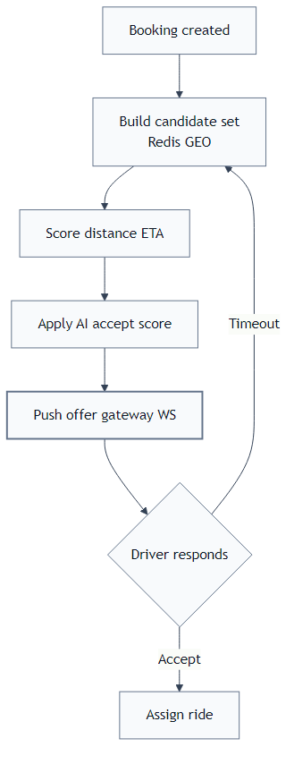

### 3.6.4. Nghiệp vụ tài xế thực hiện chuyến đi

**Mục tiêu:** quản lý toàn bộ quá trình sau khi tài xế nhận chuyến, từ lúc đến điểm đón đến khi hoàn thành.

**Tác nhân:** tài xế, khách hàng, Ride Service, API Gateway.

**Trạng thái chính:** `ASSIGNED`, `ACCEPTED`, `PICKING_UP`, `IN_PROGRESS`, `COMPLETED`, `CANCELLED`.

| Bước | Hành động của tài xế | Xử lý của hệ thống |
|---|---|---|
| 1 | Tài xế chấp nhận offer | Ride chuyển sang `ASSIGNED`, khách hàng nhận thông báo |
| 2 | Tài xế bắt đầu đi đến điểm đón | Ride chuyển sang `ACCEPTED` hoặc `PICKING_UP` tùy hành động |
| 3 | Driver App cập nhật GPS định kỳ | Driver Service lưu vị trí; API Gateway broadcast đến khách hàng |
| 4 | Tài xế xác nhận đã đón khách | Ride chuyển sang `IN_PROGRESS` |
| 5 | Tài xế hoàn thành chuyến | Ride chuyển sang `COMPLETED`, phát event cho Payment Service |
| 6 | Khách hàng và tài xế đánh giá nhau | Review Service lưu đánh giá, cập nhật rating tài xế |

**Ràng buộc:** mọi chuyển trạng thái phải đi qua Ride State Machine; không service nào được cập nhật trực tiếp field `status` nếu transition không hợp lệ.

**Hình gợi ý chèn vào Word:** `img/08_state_machine_ride.png`.

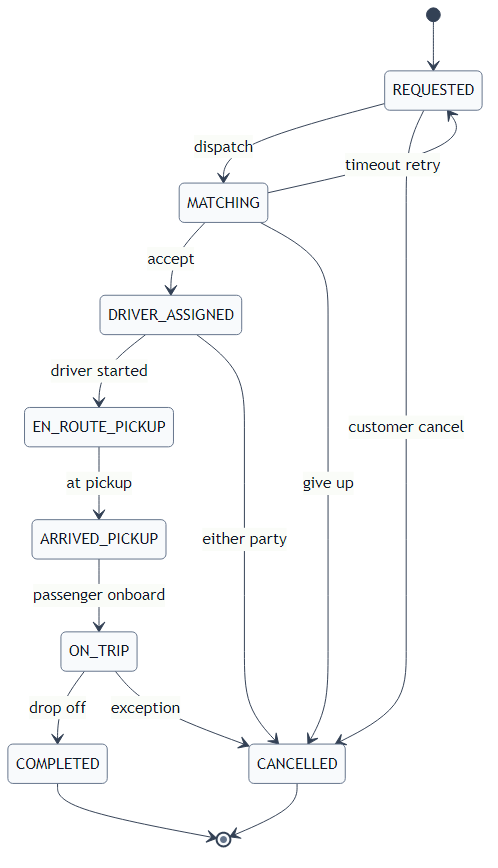

### 3.6.5. Nghiệp vụ thanh toán chuyến đi

**Mục tiêu:** ghi nhận đầy đủ số tiền khách phải trả, khoản hoa hồng nền tảng, thu nhập tài xế và trạng thái thanh toán.

**Tác nhân:** khách hàng, tài xế, Payment Service, Wallet Service, MoMo, VNPay.

**Luồng thanh toán theo phương thức:**

| Phương thức | Cách xử lý | Ảnh hưởng ví tài xế |
|---|---|---|
| Tiền mặt | Khách trả trực tiếp cho tài xế; hệ thống ghi nhận tài xế đã thu toàn bộ gross fare | Tài xế phát sinh `DebtRecord` bằng phần hoa hồng nền tảng |
| MoMo | Khách thanh toán qua MoMo; MoMo gọi IPN về Payment Service | Nền tảng thu tiền, Wallet Service ghi nhận net earning vào pending balance |
| VNPay | Khách thanh toán qua VNPay; VNPay gọi IPN về Payment Service | Tương tự MoMo |
| Wallet | Khấu trừ từ ví nếu có triển khai số dư khách hàng | Ghi nhận ledger nội bộ |

**Quy tắc quan trọng:**

| Quy tắc | Diễn giải |
|---|---|
| Idempotency | IPN từ MoMo/VNPay có thể gửi nhiều lần; `idempotencyKey` bảo đảm không cộng tiền hai lần |
| Outbox Pattern | Payment cập nhật DB và tạo event trong cùng transaction, sau đó worker publish sang RabbitMQ |
| Commission | Nền tảng giữ 15-20% tùy loại xe |
| Voucher | Khoản giảm giá do nền tảng chịu, không làm giảm gross earning của tài xế |
| Refund | Nếu hủy chuyến sau khi đã thanh toán online, Payment Service phát event hoàn tiền |

**Hình gợi ý chèn vào Word:** `img/04_booking_payment_flow.png` và `img/11_activity_payment_branch.png`.

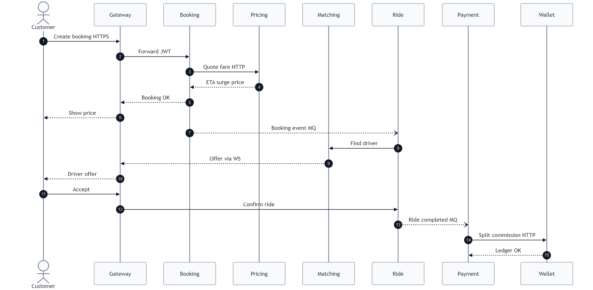

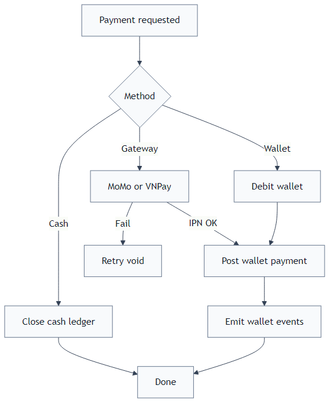

### 3.6.6. Nghiệp vụ ví tài xế, ký quỹ và công nợ

**Mục tiêu:** quản lý chính xác tài chính tài xế, bảo đảm thu nhập, ký quỹ, số dư khả dụng, số dư pending và công nợ được tách bạch.

**Tác nhân:** tài xế, quản trị viên, Wallet Service, Payment Service.

**Các thành phần số dư:**

| Thành phần | Ý nghĩa |
|---|---|
| `balance` | Tổng số dư kế toán của ví |
| `availableBalance` | Số tiền tài xế có thể rút |
| `pendingBalance` | Thu nhập đang giữ T+24h |
| `lockedBalance` | Ký quỹ 300.000 VND để kích hoạt ví |
| `debt` | Tổng công nợ từ các chuyến tiền mặt chưa tất toán |

**Quy trình kích hoạt ví:**

| Bước | Mô tả |
|---|---|
| 1 | Admin duyệt hồ sơ tài xế |
| 2 | Driver Service phát event `driver.approved` |
| 3 | Wallet Service tạo ví trạng thái `INACTIVE` |
| 4 | Tài xế nạp tối thiểu 300.000 VND |
| 5 | Wallet Service chuyển 300.000 VND vào `lockedBalance` và kích hoạt ví |
| 6 | Tài xế được phép bật online nếu không vi phạm ngưỡng nợ |

**Quy trình settlement T+24h:**

| Bước | Mô tả |
|---|---|
| 1 | Payment Service phát event `driver.earnings.settled` sau chuyến hoàn thành |
| 2 | Wallet Service tạo `PendingEarning` với `settleAt = now + 24h` |
| 3 | Khi đến hạn, hệ thống giải phóng pending earning |
| 4 | Nếu tài xế còn nợ, hệ thống tất toán nợ theo FIFO trước |
| 5 | Phần còn lại mới cộng vào `availableBalance` |

**Hình gợi ý chèn vào Word:** `img/09_state_machine_wallet.png`.


### 3.6.7. Nghiệp vụ quản trị viên

**Mục tiêu:** giúp quản trị viên vận hành nền tảng, kiểm duyệt hồ sơ tài xế, giám sát chuyến đi và đối soát tài chính.

| Nhóm nghiệp vụ | Chức năng chính | Service |
|---|---|---|
| Quản lý tài xế | Xem hồ sơ, duyệt, từ chối, tạm ngưng tài xế | Driver Service |
| Quản lý chuyến đi | Xem danh sách chuyến, trạng thái, chi tiết hành trình | Ride Service |
| Quản lý khách hàng | Xem profile, trạng thái tài khoản | User Service, Auth Service |
| Đối soát thanh toán | Xem payment, voucher, refund, trạng thái gateway | Payment Service |
| Đối soát ví | Xem merchant balance, merchant ledger, ví từng tài xế | Wallet Service |
| Duyệt rút tiền | Xem yêu cầu rút tiền, duyệt hoặc từ chối | Wallet Service |
| Giám sát hệ thống | Health check, log, metrics, socket status | API Gateway, Monitoring stack |

**Kết quả:** quản trị viên có đủ công cụ để vận hành hệ thống trong bối cảnh học thuật và demo nghiệp vụ.

### 3.6.8. Nghiệp vụ thông báo, chat và gọi thoại

**Mục tiêu:** bảo đảm người dùng nhận được cập nhật kịp thời trong suốt chuyến đi và có kênh liên hệ trực tiếp khi cần.

| Kênh | Công nghệ | Mục đích |
|---|---|---|
| In-app realtime | Socket.IO | Offer cuốc, trạng thái chuyến, vị trí tài xế |
| Chat | Socket.IO + lưu lịch sử trong Ride Service | Khách và tài xế trao đổi tin nhắn trong chuyến |
| Gọi thoại | WebRTC P2P, Gateway làm signaling server | Gọi nhanh giữa khách và tài xế |
| Email/SMS/Push | Notification Service | Thông báo đăng ký, duyệt tài xế, thanh toán, hủy chuyến |

**Hình gợi ý chèn vào Word:** `img/03_realtime_communication_flow.png`.

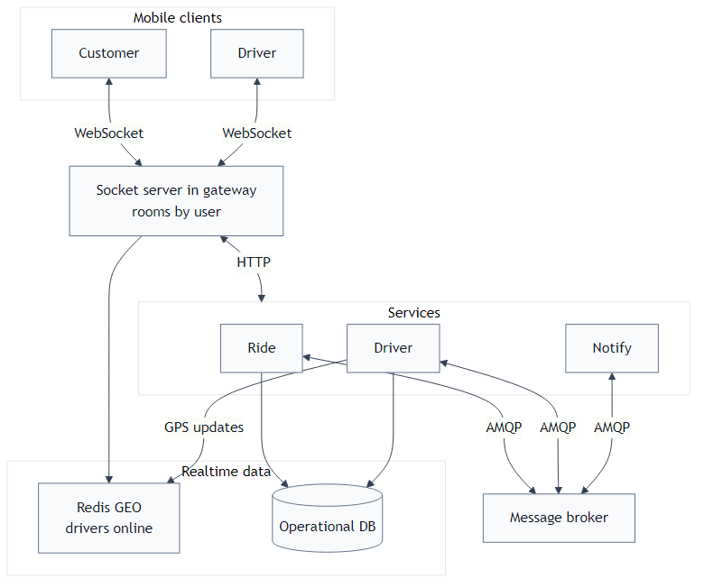

### 3.6.9. Nghiệp vụ AI hỗ trợ giá, matching và chăm sóc khách hàng

**Mục tiêu:** bổ sung năng lực dự đoán để cải thiện trải nghiệm đặt xe, nhưng không làm hệ thống phụ thuộc hoàn toàn vào AI.

| Chức năng AI | Đầu vào | Đầu ra | Service sử dụng |
|---|---|---|---|
| Dự đoán ETA và surge | Khoảng cách, khung giờ, loại ngày | ETA, price multiplier | Pricing Service |
| Dự đoán xác suất nhận chuyến | Thông tin chuyến, thống kê tài xế, demand | `p_accept` | API Gateway |
| Dự đoán thời gian chờ | Demand, số booking, số tài xế online | Wait time | Pricing Service |
| RAG chatbot | Câu hỏi người dùng và knowledge base | Câu trả lời hỗ trợ | Customer App, Driver App |

**Nguyên tắc thiết kế:** AI Service là thành phần tùy chọn. Mọi lời gọi AI có timeout ngắn và fallback về công thức/rule-based để hệ thống vẫn hoạt động khi AI lỗi.

**Hình gợi ý chèn vào Word:** `img/06_ai_ml_pipeline.png` và `img/16_rag_chatbot_architecture.png`.

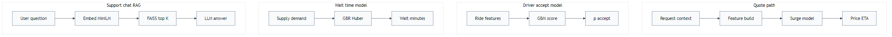

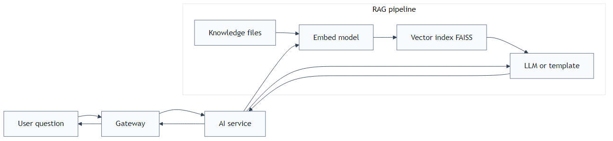

---

# CHƯƠNG 4: THIẾT KẾ HỆ THỐNG THEO DDD

## 4.1. Phân tích Subdomain

Áp dụng Event Storming và Domain Storytelling để nhận diện các subdomain:

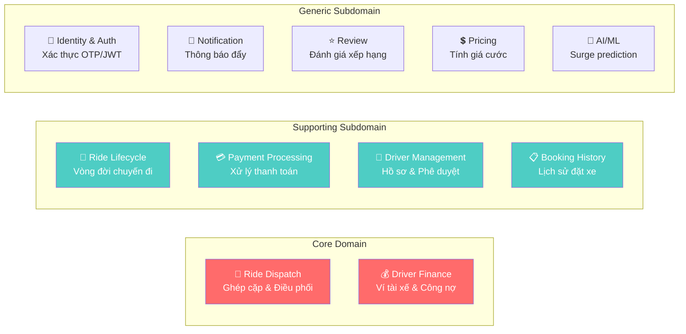
```mermaid
graph LR
    subgraph Core Domain
        D1[🚗 Ride Dispatch\nGhép cặp & Điều phối]
        D2[💰 Driver Finance\nVí tài xế & Công nợ]
    end

    subgraph Supporting Subdomain
        S1[🔔 Ride Lifecycle\nVòng đời chuyến đi]
        S2[💳 Payment Processing\nXử lý thanh toán]
        S3[👤 Driver Management\nHồ sơ & Phê duyệt]
        S4[📋 Booking History\nLịch sử đặt xe]
    end

    subgraph Generic Subdomain
        G1[🔐 Identity & Auth\nXác thực OTP/JWT]
        G2[📱 Notification\nThông báo đẩy]
        G3[⭐ Review\nĐánh giá xếp hạng]
        G4[💲 Pricing\nTính giá cước]
        G5[🤖 AI/ML\nSurge prediction]
    end

    style D1 fill:#ff6b6b,color:#fff
    style D2 fill:#ff6b6b,color:#fff
    style S1 fill:#4ecdc4,color:#fff
    style S2 fill:#4ecdc4,color:#fff
    style S3 fill:#4ecdc4,color:#fff
    style S4 fill:#4ecdc4,color:#fff
```

**Lý do phân loại:**
- **Core Domain** (đỏ): Tạo lợi thế cạnh tranh. Thuật toán dispatch quyết định trải nghiệm người dùng; Mô hình ví tài chính quyết định niềm tin của tài xế.
- **Supporting Subdomain** (xanh): Quan trọng nhưng có thể dùng pattern chuẩn.
- **Generic Subdomain** (xám): Có thể thay bằng giải pháp có sẵn.

## 4.2. Ubiquitous Language

Bảng từ vựng chính thức trong hệ thống:

| Thuật ngữ | Định nghĩa trong hệ thống |
|---|---|
| **Ride** | Một hành trình từ điểm đón đến điểm đến, gắn với một khách hàng và một tài xế |
| **Dispatch** | Hành động hệ thống chọn và giao cuốc cho tài xế phù hợp |
| **Cuốc** | Tiếng địa phương cho "chuyến xe" — đồng nghĩa với Ride trong ngữ cảnh tài xế |
| **Commission** | Phần trăm cước phí nền tảng giữ lại từ tài xế (15–20% tùy loại xe) |
| **cashDebt** | Khoản nợ tài xế phải trả nền tảng từ chuyến tiền mặt (= grossFare × commissionRate) |
| **pendingBalance** | Thu nhập online được giữ T+24h trước khi available |
| **availableBalance** | Số dư có thể rút về ngân hàng ngay |
| **lockedBalance** | Ký quỹ 300.000₫ bị khóa; hoàn trả khi tài xế ngừng hoạt động |
| **DebtRecord** | Bản ghi một khoản nợ cụ thể với due date và trạng thái |
| **Settlement** | Quá trình chuyển pendingBalance → availableBalance sau 24h |
| **IPN** | Instant Payment Notification — callback từ cổng thanh toán |
| **Driver status** | PENDING / APPROVED / REJECTED / SUSPENDED — trạng thái phê duyệt hồ sơ |
| **Availability** | ONLINE / OFFLINE / BUSY — trạng thái nhận cuốc |

## 4.3. Context Map

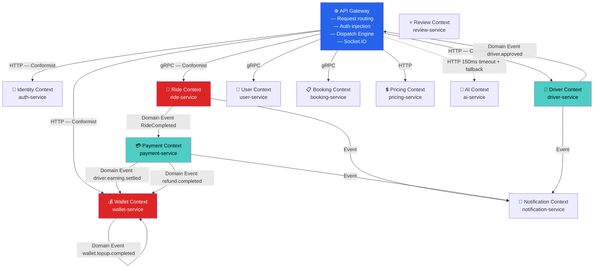
```mermaid
graph TD
    GW[🌐 API Gateway\n— Request routing\n— Auth injection\n— Dispatch Engine\n— Socket.IO]

    AUTH[🔐 Identity Context\nauth-service]
    RIDE[🚗 Ride Context\nride-service]
    DRIVER[👤 Driver Context\ndriver-service]
    PAY[💳 Payment Context\npayment-service]
    WALLET[💰 Wallet Context\nwallet-service]
    USER[👥 User Context\nuser-service]
    BOOKING[📋 Booking Context\nbooking-service]
    NOTIF[🔔 Notification Context\nnotification-service]
    PRICE[💲 Pricing Context\npricing-service]
    REVIEW[⭐ Review Context\nreview-service]
    AI[🤖 AI Context\nai-service]

    GW -->|gRPC — Conformist| RIDE
    GW -->|HTTP — Conformist| DRIVER
    GW -->|HTTP — Conformist| AUTH
    GW -->|HTTP — Conformist| WALLET
    GW -->|gRPC| BOOKING
    GW -->|gRPC| USER
    GW -->|HTTP| PRICE

    RIDE -->|Domain Event RideCompleted| PAY
    PAY -->|Domain Event driver.earning.settled| WALLET
    PAY -->|Domain Event refund.completed| WALLET
    WALLET -->|Domain Event wallet.topup.completed| WALLET
    DRIVER -->|Domain Event driver.approved| GW

    RIDE -->|Event| NOTIF
    PAY -->|Event| NOTIF
    DRIVER -->|Event| NOTIF

    GW -.->|HTTP 150ms timeout + fallback| AI

    style GW fill:#2563eb,color:#fff
    style RIDE fill:#dc2626,color:#fff
    style WALLET fill:#dc2626,color:#fff
    style PAY fill:#4ecdc4,color:#000
    style DRIVER fill:#4ecdc4,color:#000
```

**Quan hệ quan trọng:**
- **API Gateway → Services**: Conformist — Gateway tuân theo interface của từng service
- **Ride → Payment**: Customer/Supplier — Ride là upstream, khi RideCompleted được publish, Payment xử lý
- **Payment → Wallet**: Event-based Published Language — Payment publish event với schema chuẩn; Wallet là autonomous consumer
- **Gateway → AI**: Anti-Corruption Layer với timeout fallback — AI là optional enhancement

## 4.4. Domain Model từng Bounded Context

### 4.4.1. Ride Context — Domain Model

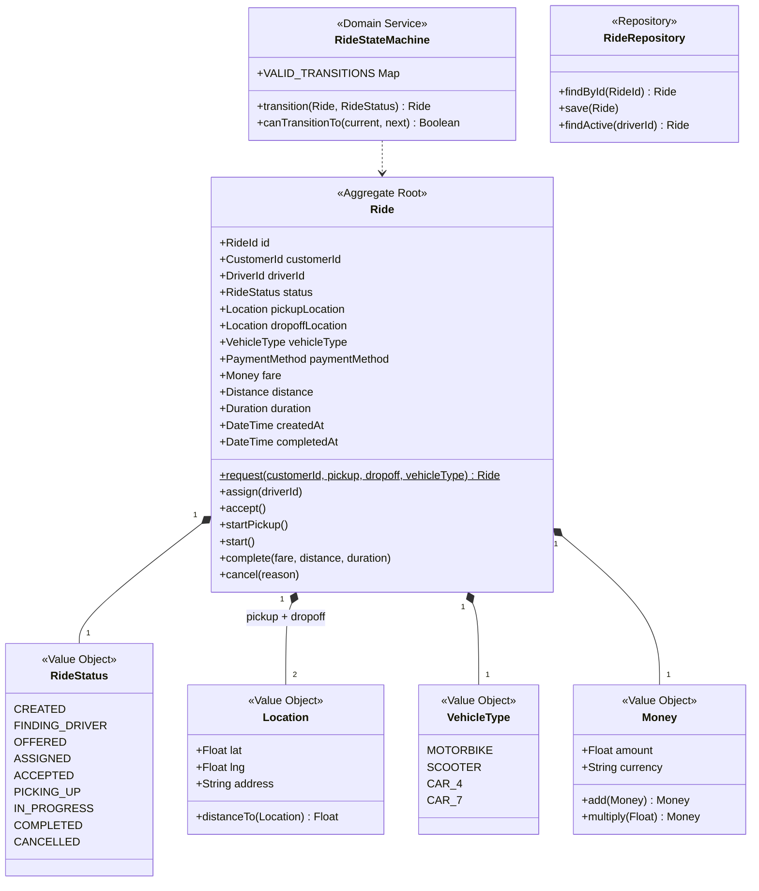
```mermaid
classDiagram
    class Ride {
        <<Aggregate Root>>
        +RideId id
        +CustomerId customerId
        +DriverId driverId
        +RideStatus status
        +Location pickupLocation
        +Location dropoffLocation
        +VehicleType vehicleType
        +PaymentMethod paymentMethod
        +Money fare
        +Distance distance
        +Duration duration
        +DateTime createdAt
        +DateTime completedAt
        +request(customerId, pickup, dropoff, vehicleType) Ride$
        +assign(driverId)
        +accept()
        +startPickup()
        +start()
        +complete(fare, distance, duration)
        +cancel(reason)
    }

    class RideStatus {
        <<Value Object>>
        CREATED
        FINDING_DRIVER
        OFFERED
        ASSIGNED
        ACCEPTED
        PICKING_UP
        IN_PROGRESS
        COMPLETED
        CANCELLED
    }

    class Location {
        <<Value Object>>
        +Float lat
        +Float lng
        +String address
        +distanceTo(Location) Float
    }

    class VehicleType {
        <<Value Object>>
        MOTORBIKE
        SCOOTER
        CAR_4
        CAR_7
    }

    class Money {
        <<Value Object>>
        +Float amount
        +String currency
        +add(Money) Money
        +multiply(Float) Money
    }

    class RideStateMachine {
        <<Domain Service>>
        +VALID_TRANSITIONS Map
        +transition(Ride, RideStatus) Ride
        +canTransitionTo(current, next) Boolean
    }

    class RideRepository {
        <<Repository>>
        +findById(RideId) Ride
        +save(Ride)
        +findActive(driverId) Ride
    }

    Ride "1" *-- "1" RideStatus
    Ride "1" *-- "2" Location : pickup + dropoff
    Ride "1" *-- "1" VehicleType
    Ride "1" *-- "1" Money
    RideStateMachine ..> Ride
```

### 4.4.2. Driver Context — Domain Model

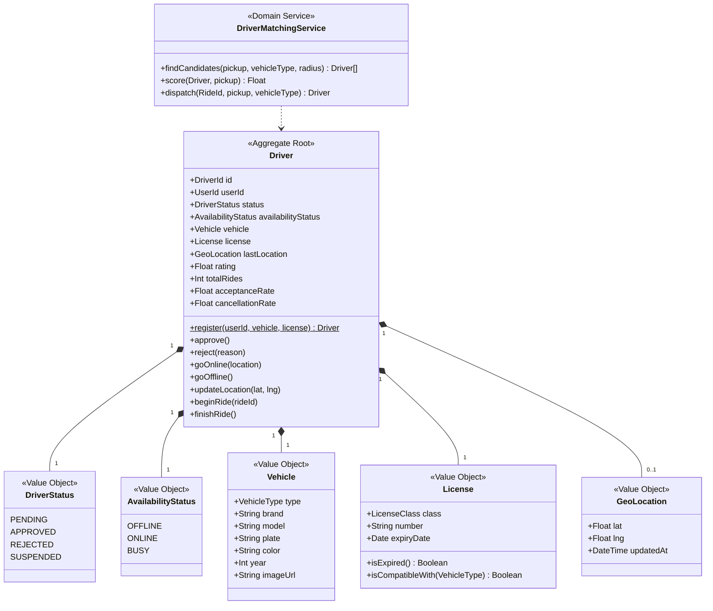
```mermaid
classDiagram
    class Driver {
        <<Aggregate Root>>
        +DriverId id
        +UserId userId
        +DriverStatus status
        +AvailabilityStatus availabilityStatus
        +Vehicle vehicle
        +License license
        +GeoLocation lastLocation
        +Float rating
        +Int totalRides
        +Float acceptanceRate
        +Float cancellationRate
        +register(userId, vehicle, license) Driver$
        +approve()
        +reject(reason)
        +goOnline(location)
        +goOffline()
        +updateLocation(lat, lng)
        +beginRide(rideId)
        +finishRide()
    }

    class DriverStatus {
        <<Value Object>>
        PENDING
        APPROVED
        REJECTED
        SUSPENDED
    }

    class AvailabilityStatus {
        <<Value Object>>
        OFFLINE
        ONLINE
        BUSY
    }

    class Vehicle {
        <<Value Object>>
        +VehicleType type
        +String brand
        +String model
        +String plate
        +String color
        +Int year
        +String imageUrl
    }

    class License {
        <<Value Object>>
        +LicenseClass class
        +String number
        +Date expiryDate
        +isExpired() Boolean
        +isCompatibleWith(VehicleType) Boolean
    }

    class GeoLocation {
        <<Value Object>>
        +Float lat
        +Float lng
        +DateTime updatedAt
    }

    class DriverMatchingService {
        <<Domain Service>>
        +findCandidates(pickup, vehicleType, radius) Driver[]
        +score(Driver, pickup) Float
        +dispatch(RideId, pickup, vehicleType) Driver
    }

    Driver "1" *-- "1" DriverStatus
    Driver "1" *-- "1" AvailabilityStatus
    Driver "1" *-- "1" Vehicle
    Driver "1" *-- "1" License
    Driver "1" *-- "0..1" GeoLocation
    DriverMatchingService ..> Driver
```

### 4.4.3. Wallet Context — Domain Model

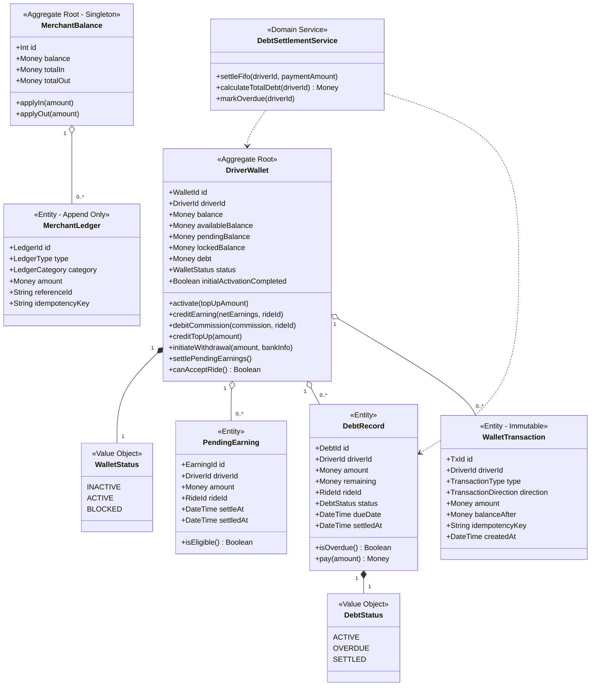
```mermaid
classDiagram
    class DriverWallet {
        <<Aggregate Root>>
        +WalletId id
        +DriverId driverId
        +Money balance
        +Money availableBalance
        +Money pendingBalance
        +Money lockedBalance
        +Money debt
        +WalletStatus status
        +Boolean initialActivationCompleted
        +activate(topUpAmount)
        +creditEarning(netEarnings, rideId)
        +debitCommission(commission, rideId)
        +creditTopUp(amount)
        +initiateWithdrawal(amount, bankInfo)
        +settlePendingEarnings()
        +canAcceptRide() Boolean
    }

    class WalletStatus {
        <<Value Object>>
        INACTIVE
        ACTIVE
        BLOCKED
    }

    class PendingEarning {
        <<Entity>>
        +EarningId id
        +DriverId driverId
        +Money amount
        +RideId rideId
        +DateTime settleAt
        +DateTime settledAt
        +isEligible() Boolean
    }

    class DebtRecord {
        <<Entity>>
        +DebtId id
        +DriverId driverId
        +Money amount
        +Money remaining
        +RideId rideId
        +DebtStatus status
        +DateTime dueDate
        +DateTime settledAt
        +isOverdue() Boolean
        +pay(amount) Money
    }

    class DebtStatus {
        <<Value Object>>
        ACTIVE
        OVERDUE
        SETTLED
    }

    class WalletTransaction {
        <<Entity - Immutable>>
        +TxId id
        +DriverId driverId
        +TransactionType type
        +TransactionDirection direction
        +Money amount
        +Money balanceAfter
        +String idempotencyKey
        +DateTime createdAt
    }

    class MerchantBalance {
        <<Aggregate Root - Singleton>>
        +Int id
        +Money balance
        +Money totalIn
        +Money totalOut
        +applyIn(amount)
        +applyOut(amount)
    }

    class MerchantLedger {
        <<Entity - Append Only>>
        +LedgerId id
        +LedgerType type
        +LedgerCategory category
        +Money amount
        +String referenceId
        +String idempotencyKey
    }

    class DebtSettlementService {
        <<Domain Service>>
        +settleFifo(driverId, paymentAmount)
        +calculateTotalDebt(driverId) Money
        +markOverdue(driverId)
    }

    DriverWallet "1" *-- "1" WalletStatus
    DriverWallet "1" o-- "0..*" PendingEarning
    DriverWallet "1" o-- "0..*" DebtRecord
    DriverWallet "1" o-- "0..*" WalletTransaction
    DebtRecord "1" *-- "1" DebtStatus
    MerchantBalance "1" o-- "0..*" MerchantLedger
    DebtSettlementService ..> DriverWallet
    DebtSettlementService ..> DebtRecord
```

### 4.4.4. Payment Context — Domain Model

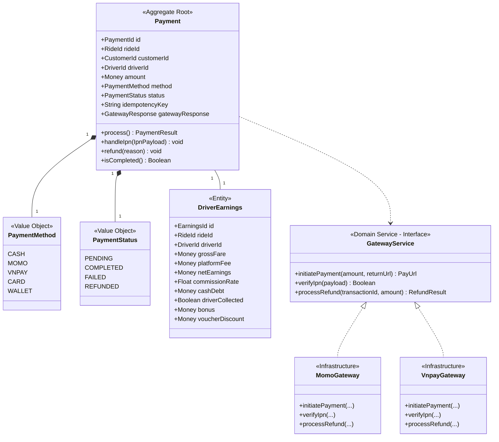
```mermaid
classDiagram
    class Payment {
        <<Aggregate Root>>
        +PaymentId id
        +RideId rideId
        +CustomerId customerId
        +DriverId driverId
        +Money amount
        +PaymentMethod method
        +PaymentStatus status
        +String idempotencyKey
        +GatewayResponse gatewayResponse
        +process() PaymentResult
        +handleIpn(IpnPayload) void
        +refund(reason) void
        +isCompleted() Boolean
    }

    class PaymentMethod {
        <<Value Object>>
        CASH
        MOMO
        VNPAY
        CARD
        WALLET
    }

    class PaymentStatus {
        <<Value Object>>
        PENDING
        COMPLETED
        FAILED
        REFUNDED
    }

    class DriverEarnings {
        <<Entity>>
        +EarningsId id
        +RideId rideId
        +DriverId driverId
        +Money grossFare
        +Money platformFee
        +Money netEarnings
        +Float commissionRate
        +Money cashDebt
        +Boolean driverCollected
        +Money bonus
        +Money voucherDiscount
    }

    class GatewayService {
        <<Domain Service - Interface>>
        +initiatePayment(amount, returnUrl) PayUrl
        +verifyIpn(payload) Boolean
        +processRefund(transactionId, amount) RefundResult
    }

    class MomoGateway {
        <<Infrastructure>>
        +initiatePayment(...)
        +verifyIpn(...)
        +processRefund(...)
    }

    class VnpayGateway {
        <<Infrastructure>>
        +initiatePayment(...)
        +verifyIpn(...)
        +processRefund(...)
    }

    Payment "1" *-- "1" PaymentMethod
    Payment "1" *-- "1" PaymentStatus
    Payment "1" -- "1" DriverEarnings
    GatewayService <|.. MomoGateway
    GatewayService <|.. VnpayGateway
    Payment ..> GatewayService
```

## 4.5. Domain Events Catalog

**Hình gợi ý chèn vào Word:** `img/13_event_flow_rabbitmq.png`

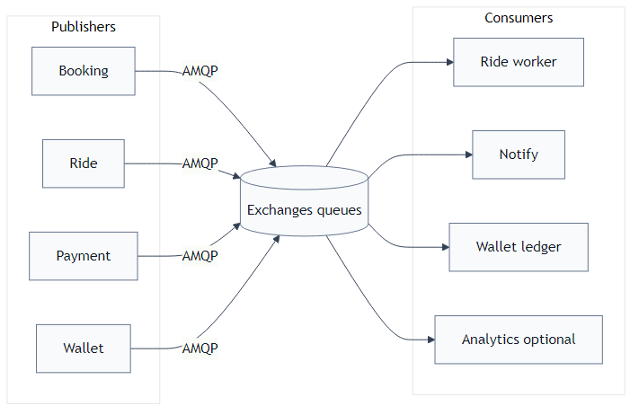

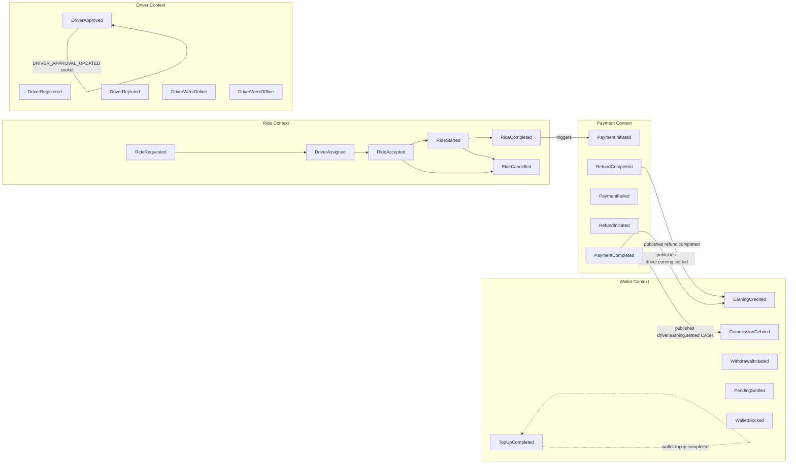
```mermaid
graph LR
    subgraph Ride Context
        R1[RideRequested] --> R2[DriverAssigned]
        R2 --> R3[RideAccepted]
        R3 --> R4[RideStarted]
        R4 --> R5[RideCompleted]
        R3 --> R6[RideCancelled]
        R4 --> R6
    end

    subgraph Payment Context
        P1[PaymentInitiated]
        P2[PaymentCompleted]
        P3[PaymentFailed]
        P4[RefundInitiated]
        P5[RefundCompleted]
    end

    subgraph Wallet Context
        W1[EarningCredited]
        W2[CommissionDebited]
        W3[TopUpCompleted]
        W4[WithdrawalInitiated]
        W5[PendingSettled]
        W6[WalletBlocked]
    end

    subgraph Driver Context
        D1[DriverRegistered]
        D2[DriverApproved]
        D3[DriverRejected]
        D4[DriverWentOnline]
        D5[DriverWentOffline]
    end

    R5 -->|triggers| P1
    P2 -->|publishes driver.earning.settled| W1
    P2 -->|publishes driver.earning.settled CASH| W2
    P5 -->|publishes refund.completed| W1
    W3 -.->|wallet.topup.completed| W3
    D2 -->|DRIVER_APPROVAL_UPDATED socket| D2
```

**Bảng Domain Events:**

| Event | Publisher | Subscribers | Payload chính |
|---|---|---|---|
| `ride.completed` | ride-service | payment-service | rideId, customerId, driverId, paymentMethod, fare |
| `driver.earning.settled` | payment-service | wallet-service | rideId, driverId, paymentMethod, grossFare, netEarnings, cashDebt |
| `refund.completed` | payment-service | wallet-service | rideId, driverId, refundAmount |
| `wallet.topup.completed` | payment-service | wallet-service | orderId, driverId, amount, provider |
| `driver.approved` | driver-service | api-gateway | driverId, userId |
| `driver.rejected` | driver-service | api-gateway | driverId, userId, reason |
| `driver.wallet.blocked` | wallet-service | (notification) | driverId, balance |

## 4.6. Kiến trúc tổng thể

**Hình gợi ý chèn vào Word:** `img/01_system_architecture_overview.png`

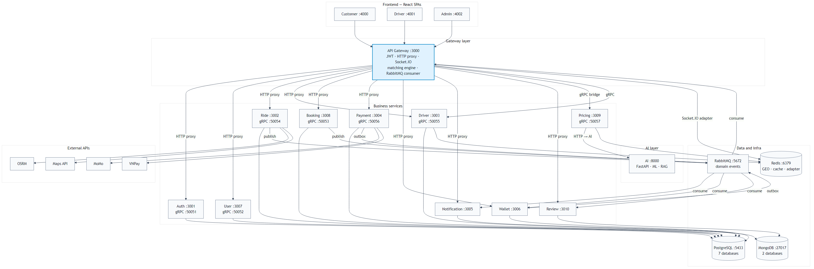

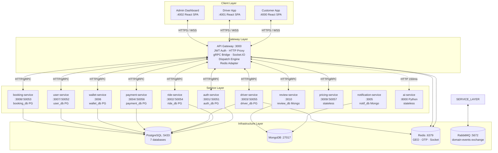
```mermaid
graph TB
    subgraph Client Layer
        CA[Customer App\n:4000 React SPA]
        DA[Driver App\n:4001 React SPA]
        ADM[Admin Dashboard\n:4002 React SPA]
    end

    subgraph Gateway Layer
        GW[API Gateway :3000\nJWT Auth · HTTP Proxy\ngRPC Bridge · Socket.IO\nDispatch Engine\nRedis Adapter]
    end

    subgraph Service Layer
        AUTH[auth-service\n:3001/:50051\nauth_db PG]
        RIDE[ride-service\n:3002/:50054\nride_db PG]
        DRV[driver-service\n:3003/:50055\ndriver_db PG]
        PAY[payment-service\n:3004/:50056\npayment_db PG]
        NOTIF[notification-service\n:3005\nnotif_db Mongo]
        WALLET[wallet-service\n:3006\nwallet_db PG]
        USER[user-service\n:3007/:50052\nuser_db PG]
        BOOK[booking-service\n:3008/:50053\nbooking_db PG]
        PRICE[pricing-service\n:3009/:50057\nstateless]
        REV[review-service\n:3010\nreview_db Mongo]
        AI[ai-service\n:8000 Python\nstateless]
    end

    subgraph Infrastructure Layer
        PG[(PostgreSQL :5433\n7 databases)]
        MONGO[(MongoDB :27017)]
        REDIS[(Redis :6379\nGEO · OTP · Socket)]
        MQ[(RabbitMQ :5672\ndomain-events exchange)]
    end

    CA & DA & ADM <-->|HTTPS / WSS| GW
    GW <-->|HTTP/gRPC| AUTH & RIDE & DRV & PAY & WALLET & USER & BOOK & PRICE & REV
    GW -.->|HTTP 150ms| AI
    GW <--> REDIS
    SERVICE_LAYER <--> MQ
    AUTH & RIDE & DRV & PAY & WALLET & USER & BOOK --> PG
    NOTIF & REV --> MONGO
    GW & DRV --> REDIS
```

## 4.7. State Machine — Vòng đời Chuyến đi

**Hình gợi ý chèn vào Word:** `img/08_state_machine_ride.png`


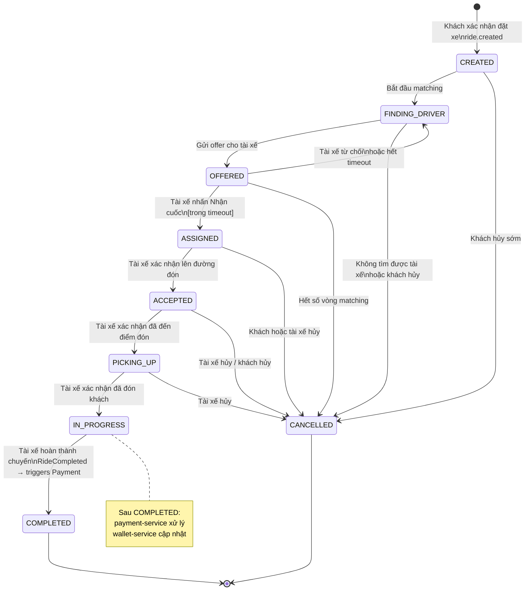
```mermaid
stateDiagram-v2
    [*] --> CREATED : Khách xác nhận đặt xe\nride.created

    CREATED --> FINDING_DRIVER : Bắt đầu matching

    FINDING_DRIVER --> OFFERED : Gửi offer cho tài xế

    OFFERED --> ASSIGNED : Tài xế nhấn Nhận cuốc\n[trong timeout]

    ASSIGNED --> ACCEPTED : Tài xế xác nhận lên đường đón

    ACCEPTED --> PICKING_UP : Tài xế xác nhận đã đến điểm đón

    PICKING_UP --> IN_PROGRESS : Tài xế xác nhận đã đón khách

    IN_PROGRESS --> COMPLETED : Tài xế hoàn thành chuyến\nRideCompleted → triggers Payment

    CREATED --> CANCELLED : Khách hủy sớm
    FINDING_DRIVER --> CANCELLED : Không tìm được tài xế\nhoặc khách hủy
    OFFERED --> FINDING_DRIVER : Tài xế từ chối\nhoặc hết timeout
    OFFERED --> CANCELLED : Hết số vòng matching
    ASSIGNED --> CANCELLED : Khách hoặc tài xế hủy
    ACCEPTED --> CANCELLED : Tài xế hủy / khách hủy
    PICKING_UP --> CANCELLED : Tài xế hủy

    COMPLETED --> [*]
    CANCELLED --> [*]

    note right of IN_PROGRESS
        Sau COMPLETED:
        payment-service xử lý
        wallet-service cập nhật
    end note
```

## 4.8. Luồng thanh toán — Sequence Diagram

**Hình gợi ý chèn vào Word:** `img/04_booking_payment_flow.png`


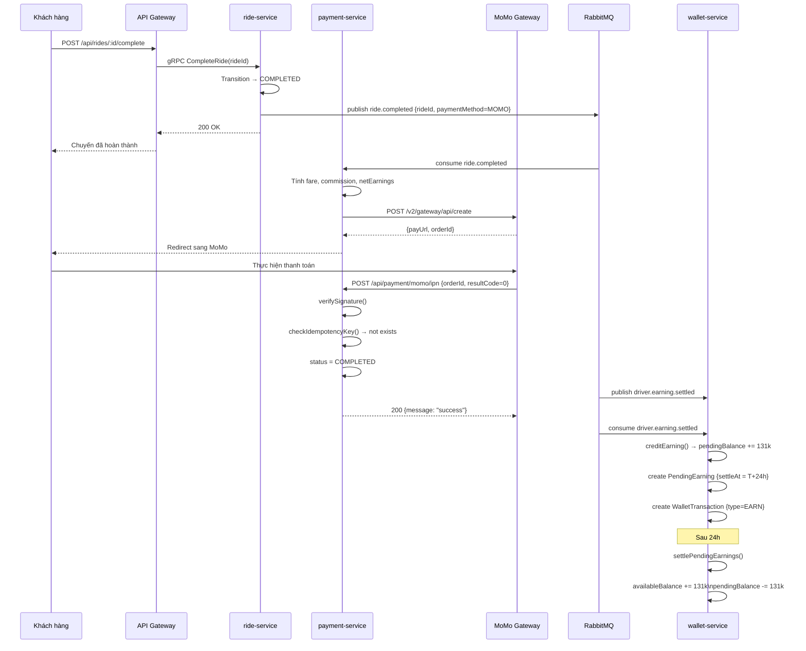
```mermaid
sequenceDiagram
    participant KH as Khách hàng
    participant GW as API Gateway
    participant RIDE as ride-service
    participant PAY as payment-service
    participant MoMo as MoMo Gateway
    participant MQ as RabbitMQ
    participant WALLET as wallet-service

    KH->>GW: POST /api/rides/:id/complete
    GW->>RIDE: gRPC CompleteRide(rideId)
    RIDE->>RIDE: Transition → COMPLETED
    RIDE->>MQ: publish ride.completed {rideId, paymentMethod=MOMO}
    RIDE-->>GW: 200 OK
    GW-->>KH: Chuyến đã hoàn thành

    MQ->>PAY: consume ride.completed
    PAY->>PAY: Tính fare, commission, netEarnings
    PAY->>MoMo: POST /v2/gateway/api/create
    MoMo-->>PAY: {payUrl, orderId}
    PAY-->>KH: Redirect sang MoMo

    KH->>MoMo: Thực hiện thanh toán
    MoMo->>PAY: POST /api/payment/momo/ipn {orderId, resultCode=0}
    PAY->>PAY: verifySignature()
    PAY->>PAY: checkIdempotencyKey() → not exists
    PAY->>PAY: status = COMPLETED
    MQ->>WALLET: publish driver.earning.settled
    PAY-->>MoMo: 200 {message: "success"}

    MQ->>WALLET: consume driver.earning.settled
    WALLET->>WALLET: creditEarning() → pendingBalance += 131k
    WALLET->>WALLET: create PendingEarning {settleAt = T+24h}
    WALLET->>WALLET: create WalletTransaction {type=EARN}

    Note over WALLET: Sau 24h
    WALLET->>WALLET: settlePendingEarnings()
    WALLET->>WALLET: availableBalance += 131k\npendingBalance -= 131k
```

## 4.9. Luồng Dispatch Tài xế — Sequence Diagram

**Hình gợi ý chèn vào Word:** `img/15_driver_matching_flow.png`


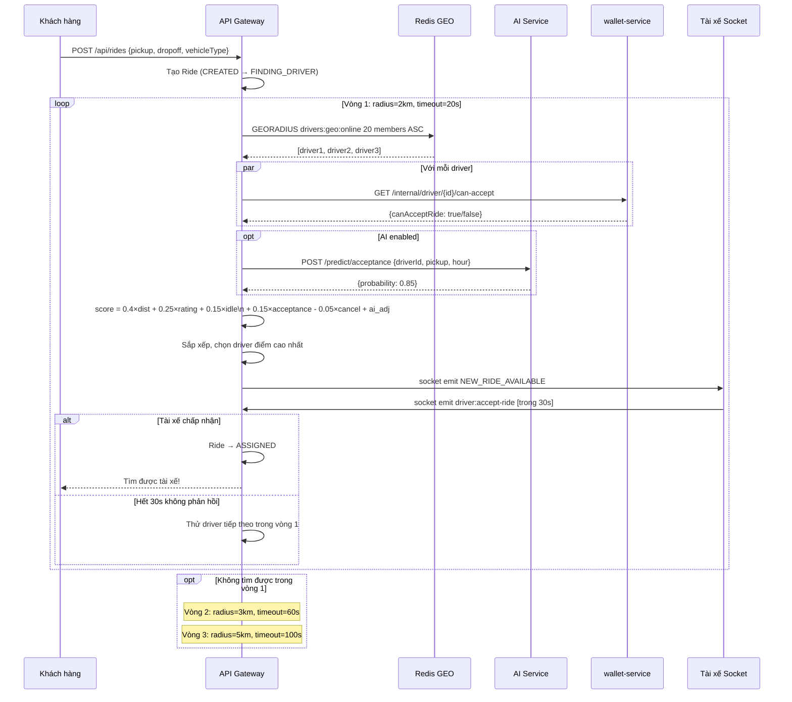
```mermaid
sequenceDiagram
    participant KH as Khách hàng
    participant GW as API Gateway
    participant REDIS as Redis GEO
    participant AI as AI Service
    participant WALLET as wallet-service
    participant TX as Tài xế Socket

    KH->>GW: POST /api/rides {pickup, dropoff, vehicleType}
    GW->>GW: Tạo Ride (CREATED → FINDING_DRIVER)

    loop Vòng 1: radius=2km, timeout=20s
        GW->>REDIS: GEORADIUS drivers:geo:online 20 members ASC
        REDIS-->>GW: [driver1, driver2, driver3]

        par Với mỗi driver
            GW->>WALLET: GET /internal/driver/{id}/can-accept
            WALLET-->>GW: {canAcceptRide: true/false}
        end

        opt AI enabled
            GW->>AI: POST /predict/acceptance {driverId, pickup, hour}
            AI-->>GW: {probability: 0.85}
        end

        GW->>GW: score = 0.4×dist + 0.25×rating + 0.15×idle\n       + 0.15×acceptance - 0.05×cancel + ai_adj
        GW->>GW: Sắp xếp, chọn driver điểm cao nhất

        GW->>TX: socket emit NEW_RIDE_AVAILABLE
        TX->>GW: socket emit driver:accept-ride [trong 30s]

        alt Tài xế chấp nhận
            GW->>GW: Ride → ASSIGNED
            GW-->>KH: Tìm được tài xế!
        else Hết 30s không phản hồi
            GW->>GW: Thử driver tiếp theo trong vòng 1
        end
    end

    opt Không tìm được trong vòng 1
        Note over GW: Vòng 2: radius=3km, timeout=60s
        Note over GW: Vòng 3: radius=5km, timeout=100s
    end
```

## 4.10. Thiết kế Database per Service

**Hình gợi ý chèn vào Word:** `img/05_data_architecture.png` và `img/18_erd_core_services.png`

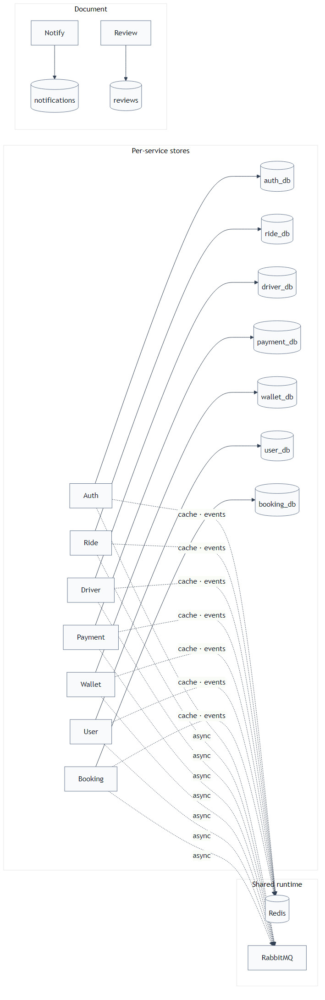


### 4.10.1. ride_db — ERD

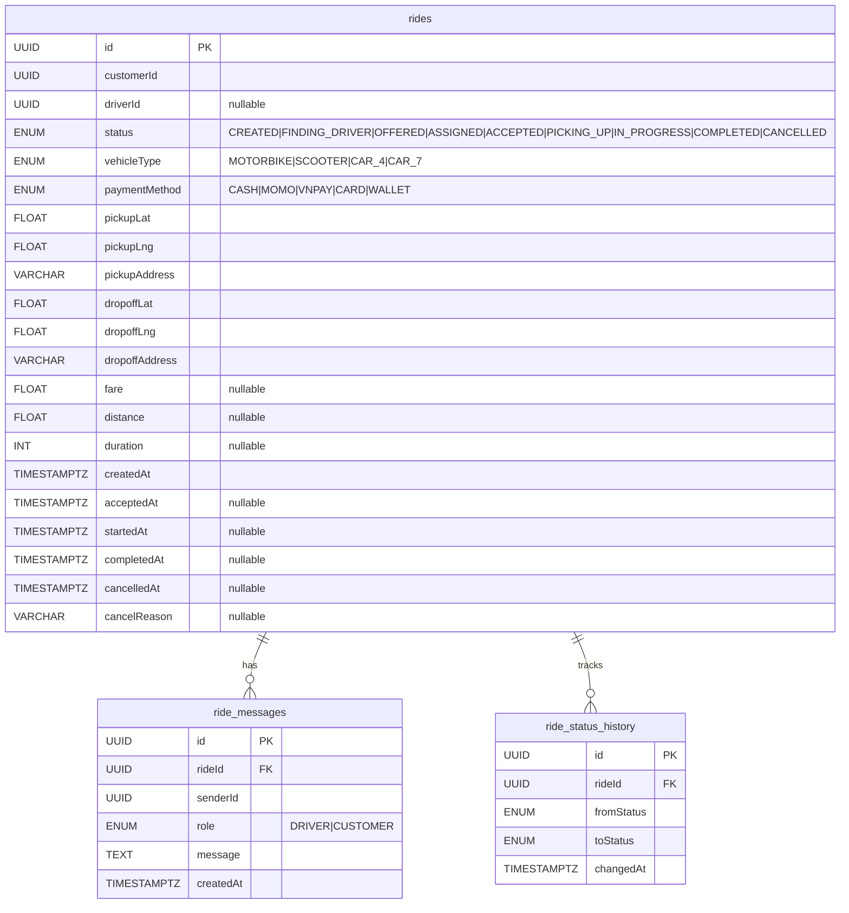
```mermaid
erDiagram
    rides {
        UUID id PK
        UUID customerId
        UUID driverId "nullable"
        ENUM status "CREATED|FINDING_DRIVER|OFFERED|ASSIGNED|ACCEPTED|PICKING_UP|IN_PROGRESS|COMPLETED|CANCELLED"
        ENUM vehicleType "MOTORBIKE|SCOOTER|CAR_4|CAR_7"
        ENUM paymentMethod "CASH|MOMO|VNPAY|CARD|WALLET"
        FLOAT pickupLat
        FLOAT pickupLng
        VARCHAR pickupAddress
        FLOAT dropoffLat
        FLOAT dropoffLng
        VARCHAR dropoffAddress
        FLOAT fare "nullable"
        FLOAT distance "nullable"
        INT duration "nullable"
        TIMESTAMPTZ createdAt
        TIMESTAMPTZ acceptedAt "nullable"
        TIMESTAMPTZ startedAt "nullable"
        TIMESTAMPTZ completedAt "nullable"
        TIMESTAMPTZ cancelledAt "nullable"
        VARCHAR cancelReason "nullable"
    }

    ride_messages {
        UUID id PK
        UUID rideId FK
        UUID senderId
        ENUM role "DRIVER|CUSTOMER"
        TEXT message
        TIMESTAMPTZ createdAt
    }

    ride_status_history {
        UUID id PK
        UUID rideId FK
        ENUM fromStatus
        ENUM toStatus
        TIMESTAMPTZ changedAt
    }

    rides ||--o{ ride_messages : "has"
    rides ||--o{ ride_status_history : "tracks"
```

### 4.10.2. wallet_db — ERD

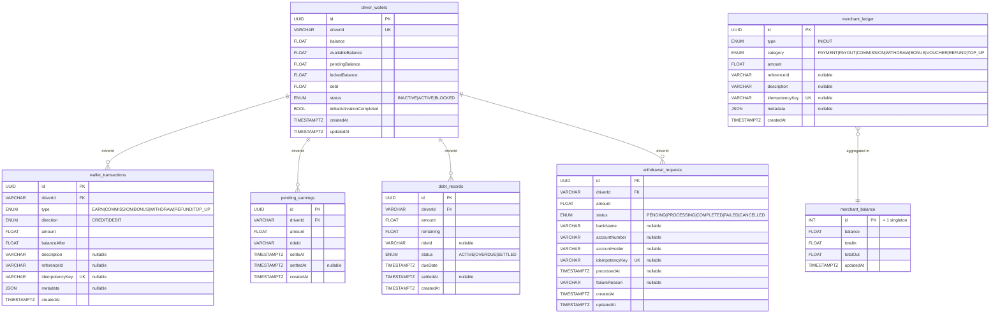
```mermaid
erDiagram
    driver_wallets {
        UUID id PK
        VARCHAR driverId UK
        FLOAT balance
        FLOAT availableBalance
        FLOAT pendingBalance
        FLOAT lockedBalance
        FLOAT debt
        ENUM status "INACTIVE|ACTIVE|BLOCKED"
        BOOL initialActivationCompleted
        TIMESTAMPTZ createdAt
        TIMESTAMPTZ updatedAt
    }

    wallet_transactions {
        UUID id PK
        VARCHAR driverId FK
        ENUM type "EARN|COMMISSION|BONUS|WITHDRAW|REFUND|TOP_UP"
        ENUM direction "CREDIT|DEBIT"
        FLOAT amount
        FLOAT balanceAfter
        VARCHAR description "nullable"
        VARCHAR referenceId "nullable"
        VARCHAR idempotencyKey UK "nullable"
        JSON metadata "nullable"
        TIMESTAMPTZ createdAt
    }

    pending_earnings {
        UUID id PK
        VARCHAR driverId FK
        FLOAT amount
        VARCHAR rideId
        TIMESTAMPTZ settleAt
        TIMESTAMPTZ settledAt "nullable"
        TIMESTAMPTZ createdAt
    }

    debt_records {
        UUID id PK
        VARCHAR driverId FK
        FLOAT amount
        FLOAT remaining
        VARCHAR rideId "nullable"
        ENUM status "ACTIVE|OVERDUE|SETTLED"
        TIMESTAMPTZ dueDate
        TIMESTAMPTZ settledAt "nullable"
        TIMESTAMPTZ createdAt
    }

    withdrawal_requests {
        UUID id PK
        VARCHAR driverId FK
        FLOAT amount
        ENUM status "PENDING|PROCESSING|COMPLETED|FAILED|CANCELLED"
        VARCHAR bankName "nullable"
        VARCHAR accountNumber "nullable"
        VARCHAR accountHolder "nullable"
        VARCHAR idempotencyKey UK "nullable"
        TIMESTAMPTZ processedAt "nullable"
        VARCHAR failureReason "nullable"
        TIMESTAMPTZ createdAt
        TIMESTAMPTZ updatedAt
    }

    merchant_ledger {
        UUID id PK
        ENUM type "IN|OUT"
        ENUM category "PAYMENT|PAYOUT|COMMISSION|WITHDRAW|BONUS|VOUCHER|REFUND|TOP_UP"
        FLOAT amount
        VARCHAR referenceId "nullable"
        VARCHAR description "nullable"
        VARCHAR idempotencyKey UK "nullable"
        JSON metadata "nullable"
        TIMESTAMPTZ createdAt
    }

    merchant_balance {
        INT id PK "= 1 singleton"
        FLOAT balance
        FLOAT totalIn
        FLOAT totalOut
        TIMESTAMPTZ updatedAt
    }

    driver_wallets ||--o{ wallet_transactions : "driverId"
    driver_wallets ||--o{ pending_earnings : "driverId"
    driver_wallets ||--o{ debt_records : "driverId"
    driver_wallets ||--o{ withdrawal_requests : "driverId"
    merchant_ledger }o--|| merchant_balance : "aggregated in"
```

### 4.10.3. payment_db — ERD

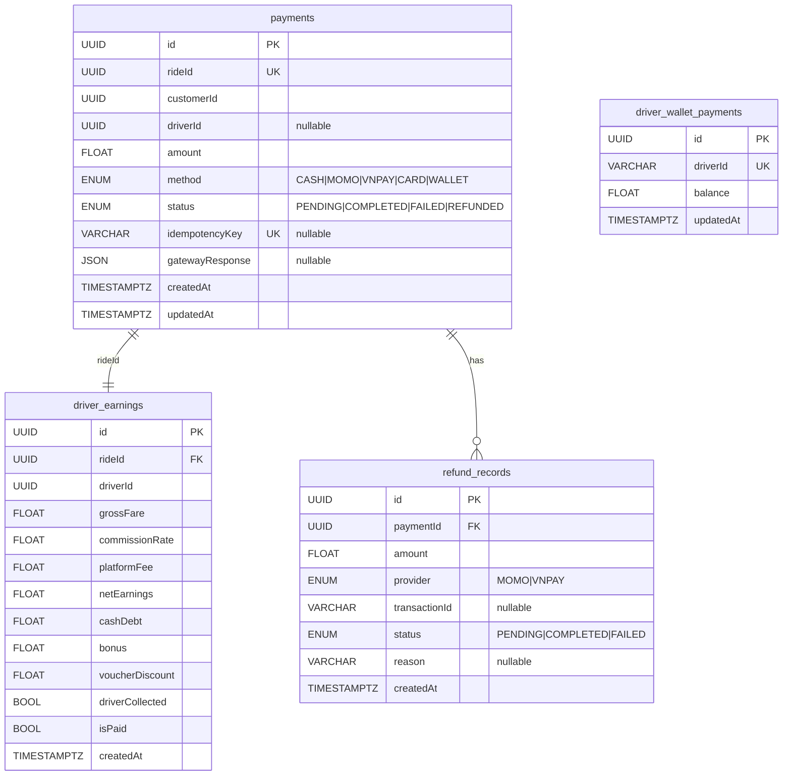
```mermaid
erDiagram
    payments {
        UUID id PK
        UUID rideId UK
        UUID customerId
        UUID driverId "nullable"
        FLOAT amount
        ENUM method "CASH|MOMO|VNPAY|CARD|WALLET"
        ENUM status "PENDING|COMPLETED|FAILED|REFUNDED"
        VARCHAR idempotencyKey UK "nullable"
        JSON gatewayResponse "nullable"
        TIMESTAMPTZ createdAt
        TIMESTAMPTZ updatedAt
    }

    driver_earnings {
        UUID id PK
        UUID rideId FK
        UUID driverId
        FLOAT grossFare
        FLOAT commissionRate
        FLOAT platformFee
        FLOAT netEarnings
        FLOAT cashDebt
        FLOAT bonus
        FLOAT voucherDiscount
        BOOL driverCollected
        BOOL isPaid
        TIMESTAMPTZ createdAt
    }

    refund_records {
        UUID id PK
        UUID paymentId FK
        FLOAT amount
        ENUM provider "MOMO|VNPAY"
        VARCHAR transactionId "nullable"
        ENUM status "PENDING|COMPLETED|FAILED"
        VARCHAR reason "nullable"
        TIMESTAMPTZ createdAt
    }

    driver_wallet_payments {
        UUID id PK
        VARCHAR driverId UK
        FLOAT balance
        TIMESTAMPTZ updatedAt
    }

    payments ||--|| driver_earnings : "rideId"
    payments ||--o{ refund_records : "has"
```

### 4.10.4. driver_db — ERD

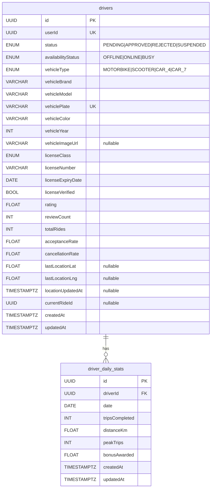
```mermaid
erDiagram
    drivers {
        UUID id PK
        UUID userId UK
        ENUM status "PENDING|APPROVED|REJECTED|SUSPENDED"
        ENUM availabilityStatus "OFFLINE|ONLINE|BUSY"
        ENUM vehicleType "MOTORBIKE|SCOOTER|CAR_4|CAR_7"
        VARCHAR vehicleBrand
        VARCHAR vehicleModel
        VARCHAR vehiclePlate UK
        VARCHAR vehicleColor
        INT vehicleYear
        VARCHAR vehicleImageUrl "nullable"
        ENUM licenseClass
        VARCHAR licenseNumber
        DATE licenseExpiryDate
        BOOL licenseVerified
        FLOAT rating
        INT reviewCount
        INT totalRides
        FLOAT acceptanceRate
        FLOAT cancellationRate
        FLOAT lastLocationLat "nullable"
        FLOAT lastLocationLng "nullable"
        TIMESTAMPTZ locationUpdatedAt "nullable"
        UUID currentRideId "nullable"
        TIMESTAMPTZ createdAt
        TIMESTAMPTZ updatedAt
    }

    driver_daily_stats {
        UUID id PK
        UUID driverId FK
        DATE date
        INT tripsCompleted
        FLOAT distanceKm
        INT peakTrips
        FLOAT bonusAwarded
        TIMESTAMPTZ createdAt
        TIMESTAMPTZ updatedAt
    }

    drivers ||--o{ driver_daily_stats : "has"
```

## 4.11. Thiết kế chi tiết từng microservice

Phần này mô tả rõ trách nhiệm và chức năng của từng service. Cách trình bày đi theo nguyên tắc: mỗi service sở hữu một phạm vi nghiệp vụ riêng, có dữ liệu riêng, API riêng và chỉ phối hợp với service khác thông qua HTTP/gRPC hoặc domain event.

### 4.11.1. API Gateway

**Vai trò:** điểm vào duy nhất của toàn hệ thống, chịu trách nhiệm tiếp nhận request từ ba ứng dụng frontend, xác thực JWT, định tuyến đến service tương ứng, điều phối realtime và chạy matching engine.

**Thông tin kỹ thuật:**

| Thuộc tính | Giá trị |
|---|---|
| Cổng HTTP | `3000` |
| Database/cache | Redis |
| Công nghệ | Node.js, TypeScript, Express, Socket.IO, Redis Adapter |
| Hình nên chèn | `img/14_api_gateway_routing_map.png`, `img/19_component_api_gateway.png` |

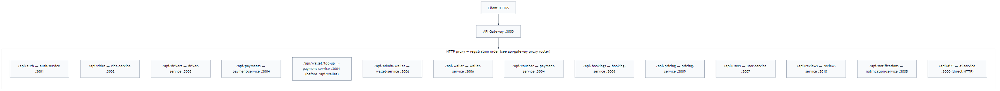


**Chức năng chính:**

| Nhóm chức năng | Mô tả chi tiết |
|---|---|
| Xác thực request | Kiểm tra `Authorization: Bearer <token>`, giải mã JWT và gắn `x-user-id`, `x-user-role`, `x-user-email` vào request nội bộ |
| Định tuyến HTTP | Forward `/api/auth`, `/api/users`, `/api/rides`, `/api/payment`, `/api/wallet`, `/api/reviews`, `/api/ai` đến service tương ứng |
| gRPC bridge | Với các API cần độ trễ thấp như pricing estimate hoặc tra cứu driver, Gateway có thể chuyển HTTP request thành gRPC call |
| Socket.IO hub | Quản lý kết nối realtime, room theo `userId` và `rideId`, phát event trạng thái chuyến, offer tài xế, chat và signaling WebRTC |
| Driver matching | Nhận event `ride.created`, truy vấn Redis GEO, tính điểm tài xế và gửi offer theo nhiều vòng |
| Chuẩn hóa địa chỉ | Chuẩn hóa payload địa chỉ Việt Nam trước khi chuyển đến service phía sau |
| Giám sát | Cung cấp health check, readiness check, metrics Prometheus và Swagger docs |

**Quy tắc thiết kế:** client không gọi trực tiếp vào service phía sau; mọi request đều đi qua Gateway để thống nhất xác thực, logging, rate limiting và realtime fan-out.

### 4.11.2. Auth Service

**Vai trò:** nguồn sự thật duy nhất về danh tính, tài khoản, mật khẩu, OTP, access token và refresh token.

| Thuộc tính | Giá trị |
|---|---|
| Cổng HTTP | `3001` |
| Cổng gRPC | `50051` |
| Database | PostgreSQL `auth_db`, Redis cho OTP |
| Công nghệ | Express, Prisma, bcryptjs, jsonwebtoken, RabbitMQ |
| Hình nên chèn | `img/17_sequence_auth_otp.png` |

**Chức năng chính:**

| Chức năng | Mô tả |
|---|---|
| Đăng ký tài khoản | Tạo user mới theo số điện thoại, mật khẩu và vai trò |
| Gửi OTP | Sinh OTP, hash, lưu TTL trong Redis, gửi qua SMS hoặc log trong mock mode |
| Xác thực OTP | So khớp OTP, kiểm soát số lần thử và thời gian hết hạn |
| Đăng nhập | Kiểm tra mật khẩu bằng bcrypt, phát access token và refresh token |
| Làm mới token | Kiểm tra refresh token trong DB, phát access token mới |
| Đăng xuất | Thu hồi refresh token |
| Audit log | Ghi nhận các hành động nhạy cảm như login, OTP sent, register |
| gRPC validate user | Cho service nội bộ kiểm tra userId hoặc lấy thông tin user cơ bản |

**Dữ liệu chính:** `User`, `RefreshToken`, `OtpRecord`, `AuditLog`.

**Domain event:** khi đăng ký thành công, service phát `user.registered` để User Service tạo profile mặc định.

### 4.11.3. User Service

**Vai trò:** quản lý thông tin hồ sơ người dùng, tách biệt khỏi thông tin xác thực trong Auth Service.

| Thuộc tính | Giá trị |
|---|---|
| Cổng HTTP | `3007` |
| Cổng gRPC | `50052` |
| Database | PostgreSQL `user_db` |
| Công nghệ | Express, Prisma, Joi, gRPC |

**Chức năng chính:**

| Chức năng | Mô tả |
|---|---|
| Tạo profile tự động | Lắng nghe `user.registered` và tạo `UserProfile` tương ứng |
| Xem hồ sơ | Người dùng xem thông tin cá nhân của mình |
| Cập nhật hồ sơ | Cập nhật họ tên, avatar, trạng thái profile |
| Quản trị người dùng | Admin xem danh sách, xem chi tiết và đổi trạng thái tài khoản |
| gRPC profile lookup | Service khác tra cứu tên hiển thị, số điện thoại hoặc avatar khi cần |

**Ràng buộc:** `userId` tham chiếu logic đến `auth_db.User.id` nhưng không dùng foreign key cross-service; tính nhất quán được bảo đảm qua domain event và application logic.

### 4.11.4. Driver Service

**Vai trò:** quản lý vòng đời tài xế, hồ sơ phương tiện, bằng lái, trạng thái nhận cuốc và vị trí địa lý realtime.

| Thuộc tính | Giá trị |
|---|---|
| Cổng HTTP | `3003` |
| Cổng gRPC | `50055` |
| Database | PostgreSQL `driver_db`, Redis GEO |
| Công nghệ | Express, Prisma, Redis, RabbitMQ, gRPC |

**Chức năng chính:**

| Nhóm chức năng | Mô tả |
|---|---|
| Đăng ký tài xế | Lưu thông tin xe, biển số, màu xe, loại xe, bằng lái và ảnh phương tiện |
| Duyệt hồ sơ | Admin duyệt/từ chối/tạm ngưng tài xế; khi duyệt phát `driver.approved` |
| Trạng thái nhận cuốc | Tài xế bật `ONLINE`, tắt `OFFLINE`, hoặc bị chuyển `BUSY` khi đang chạy chuyến |
| Cập nhật vị trí | Lưu vị trí cuối cùng trong DB và cập nhật Redis GEO để Gateway tìm kiếm |
| Kiểm tra khả năng nhận chuyến | gRPC `CheckCanAcceptRide` kiểm tra trạng thái tài xế và điều kiện ví |
| Rating tài xế | Cập nhật `ratingAverage`, `ratingCount` khi nhận event từ Review Service |

**Ràng buộc nghiệp vụ:**

| Quy tắc | Diễn giải |
|---|---|
| Chỉ tài xế `APPROVED` mới được online | Hồ sơ phải được admin duyệt |
| Tài xế `BUSY` không nhận offer mới | Tránh gán nhiều chuyến đồng thời |
| Vị trí online phải có tọa độ hợp lệ | Redis GEO yêu cầu `lat/lng` hợp lệ |
| Ví phải đạt điều kiện | Nếu tài xế có nợ quá hạn hoặc ví chưa kích hoạt, không được nhận chuyến |

### 4.11.5. Booking Service

**Vai trò:** xử lý giai đoạn tiền chuyến đi, khi khách hàng xem giá, tạo booking tạm và xác nhận đặt xe.

| Thuộc tính | Giá trị |
|---|---|
| Cổng HTTP | `3008` |
| Cổng gRPC | `50053` |
| Database | PostgreSQL `booking_db` |
| Công nghệ | Express, Prisma, RabbitMQ, gRPC |

**Chức năng chính:**

| Chức năng | Mô tả |
|---|---|
| Tạo booking | Lưu điểm đón, điểm trả, loại xe, payment method và snapshot giá ước tính |
| Xác nhận booking | Chuyển `PENDING` sang `CONFIRMED` và phát event `booking.confirmed` |
| Hủy booking | Cho phép khách hủy khi chưa chuyển thành chuyến đang chạy |
| Lịch sử booking | Truy vấn lịch sử đặt xe của khách hàng |
| Expiry | Booking có thể hết hạn nếu khách không xác nhận trong thời gian cấu hình |

**Lý do tách khỏi Ride Service:** khách hàng có thể xem giá nhiều lần mà chưa tạo chuyến; Booking Service giúp giảm nhiễu cho Ride Service và là nền tảng để mở rộng đặt xe theo lịch.

### 4.11.6. Ride Service

**Vai trò:** quản lý vòng đời chuyến đi, trạng thái Ride, audit trail và các event nghiệp vụ liên quan đến chuyến.

| Thuộc tính | Giá trị |
|---|---|
| Cổng HTTP | `3002` |
| Cổng gRPC | `50054` |
| Database | PostgreSQL `ride_db` |
| Công nghệ | Express, Prisma, RabbitMQ, gRPC |
| Hình nên chèn | `img/08_state_machine_ride.png` |

**Chức năng chính:**

| Nhóm chức năng | Mô tả |
|---|---|
| Tạo chuyến | Tạo Ride từ request trực tiếp hoặc từ `booking.confirmed` |
| State machine | Kiểm soát transition từ `CREATED` đến `COMPLETED` hoặc `CANCELLED` |
| Điều phối offer | Ghi nhận driver được offer, driver từ chối, timeout và số lần reassign |
| API cho khách | Tạo chuyến, xem chi tiết, hủy chuyến, xem lịch sử, gửi chat |
| API cho tài xế | Nhận cuốc, từ chối, đến điểm đón, bắt đầu, hoàn thành |
| Audit trail | Ghi `RideStateTransition` cho mọi chuyển trạng thái |
| Chat storage | Lưu tin nhắn giữa tài xế và khách trong `RideChatMessage` |

**Domain events published:** `ride.created`, `ride.offered`, `ride.assigned`, `ride.picking_up`, `ride.started`, `ride.completed`, `ride.cancelled`, `ride.chat_message`.

**Ràng buộc:** trạng thái kết thúc `COMPLETED` và `CANCELLED` là terminal state; không được quay lại trạng thái trước.

### 4.11.7. Pricing Service

**Vai trò:** tính giá cước ước tính và giá thực tế dựa trên loại xe, khoảng cách, thời gian, surge và gợi ý AI.

| Thuộc tính | Giá trị |
|---|---|
| Cổng HTTP | `3009` |
| Cổng gRPC | `50057` |
| Database | Không có database quan hệ, dùng Redis cache |
| Công nghệ | Express, Redis, gRPC, OSRM, AI HTTP client |

**Chức năng chính:**

| Chức năng | Mô tả |
|---|---|
| Ước tính giá | Tính `baseFare`, phí dịch vụ, cước km, cước phút, short-trip fee và surge |
| Tính khoảng cách | Ưu tiên OSRM để lấy khoảng cách theo đường đi, fallback Haversine |
| Surge multiplier | Lấy surge từ Redis hoặc AI Service |
| Tích hợp AI | Gọi AI Service để lấy ETA, price multiplier và recommended radius |
| API admin | Cho phép admin xem hoặc cập nhật surge zone trong demo |

**Công thức tổng quát:** `totalFare = max(round(subtotal * surgeMultiplier), minimumFare)`.

**Nguyên tắc khả dụng:** nếu OSRM hoặc AI lỗi, service dùng fallback để vẫn trả được giá ước tính.

### 4.11.8. Payment Service

**Vai trò:** xử lý thanh toán, gateway callback, voucher, fare, hoa hồng, thu nhập tài xế và event tài chính.

| Thuộc tính | Giá trị |
|---|---|
| Cổng HTTP | `3004` |
| Cổng gRPC | `50056` |
| Database | PostgreSQL `payment_db` |
| Công nghệ | Express, Prisma, MoMo, VNPay, RabbitMQ Outbox |
| Hình nên chèn | `img/11_activity_payment_branch.png` |

**Chức năng chính:**

| Nhóm chức năng | Mô tả |
|---|---|
| Khởi tạo thanh toán | Tạo payment intent cho MoMo/VNPay hoặc hoàn tất ngay với CASH |
| Xử lý IPN | Nhận callback từ MoMo/VNPay, kiểm tra chữ ký, cập nhật trạng thái |
| Idempotency | Dùng `idempotencyKey` để chống xử lý trùng IPN |
| Tính fare | Lưu `Fare` gồm base fare, distance fare, time fare, surge, total fare |
| Voucher | Kiểm tra điều kiện mã giảm giá, số lần dùng, thời gian hiệu lực |
| Commission | Tính platform fee theo loại xe |
| Driver earnings | Tạo `DriverEarnings` gồm gross fare, platform fee, net earnings, cash debt |
| Refund | Xử lý hoàn tiền khi chuyến bị hủy sau thanh toán |
| Outbox | Ghi `OutboxEvent` trong cùng transaction với payment để không mất event |

**Event quan trọng:** `payment.completed`, `payment.failed`, `driver.earnings.settled`, `refund.completed`.

### 4.11.9. Wallet Service

**Vai trò:** nguồn sự thật của ví tài xế, quản lý ký quỹ, pending earning, công nợ, rút tiền, merchant ledger và merchant balance.

| Thuộc tính | Giá trị |
|---|---|
| Cổng HTTP | `3006` |
| Database | PostgreSQL `wallet_db` |
| Công nghệ | Express, Prisma, RabbitMQ |
| Hình nên chèn | `img/09_state_machine_wallet.png` |

**Chức năng chính:**

| Nhóm chức năng | Mô tả |
|---|---|
| Tạo ví tài xế | Lắng nghe `driver.approved`, tạo ví `INACTIVE` |
| Ký quỹ | Khi top-up đủ 300.000 VND, chuyển tiền vào `lockedBalance` và kích hoạt ví |
| Ghi nhận thu nhập | Lắng nghe `driver.earnings.settled`, tạo `PendingEarning` T+24h |
| Công nợ CASH | Nếu tài xế thu tiền mặt, tạo `DebtRecord` bằng platform fee |
| Settlement | Sau 24h, giải phóng pending; trả nợ FIFO trước, phần còn lại vào available |
| Rút tiền | Tài xế tạo yêu cầu rút tiền, admin duyệt hoặc từ chối |
| Merchant ledger | Ghi nhận dòng tiền vào/ra của nền tảng |
| Merchant balance | Duy trì số dư tổng hợp của nền tảng |
| Lịch sử giao dịch | `WalletTransaction` lưu snapshot `balanceAfter` và idempotency key |

**Quy tắc tài chính:**

| Quy tắc | Diễn giải |
|---|---|
| Ký quỹ bắt buộc | Tài xế cần locked balance 300.000 VND để kích hoạt |
| Thu nhập không rút ngay | Net earning đi vào `pendingBalance` trong 24h |
| Nợ được tất toán trước | Khi có tiền vào, DebtRecord cũ nhất được trả trước |
| Giao dịch bất biến | Lịch sử ví không update tùy tiện; mỗi thay đổi tạo transaction mới |
| Chống trùng | Mọi top-up, earning, refund dùng idempotency key |

### 4.11.10. Notification Service

**Vai trò:** gửi thông báo đến người dùng qua email, SMS, push và in-app notification dựa trên domain event.

| Thuộc tính | Giá trị |
|---|---|
| Cổng HTTP | `3005` |
| Database | MongoDB `notification_db` |
| Công nghệ | Express, Mongoose, RabbitMQ, Nodemailer, Twilio, FCM |

**Chức năng chính:**

| Chức năng | Mô tả |
|---|---|
| Consume event | Lắng nghe `user.registered`, `ride.assigned`, `ride.completed`, `payment.completed`, `driver.approved` |
| Tạo notification | Lưu notification document với trạng thái `PENDING`, `SENT` hoặc `FAILED` |
| Gửi đa kênh | Email, SMS, push notification hoặc in-app |
| Retry | Thử lại khi gửi thất bại, tăng delay theo số lần retry |
| Admin API | Cho phép admin xem lịch sử thông báo và thống kê gửi thành công/thất bại |

**Lý do dùng MongoDB:** thông báo có schema linh hoạt, có thể thêm template data, channel-specific metadata mà không cần migration phức tạp.

### 4.11.11. Review Service

**Vai trò:** quản lý đánh giá hai chiều sau chuyến đi và cập nhật uy tín tài xế.

| Thuộc tính | Giá trị |
|---|---|
| Cổng HTTP | `3010` |
| Database | MongoDB `review_db` |
| Công nghệ | Express, Mongoose, RabbitMQ |

**Chức năng chính:**

| Chức năng | Mô tả |
|---|---|
| Tạo đánh giá | Khách đánh giá tài xế hoặc tài xế đánh giá khách sau chuyến |
| Kiểm tra hợp lệ | Một người chỉ đánh giá một lần cho một chiều đánh giá của chuyến |
| Lưu tag và nhận xét | Hỗ trợ rating 1-5, comment, tag nghiệp vụ |
| Ẩn đánh giá | Admin có thể ẩn review vi phạm |
| Cập nhật rating | Sau review, service phát `driver.rating_updated` để Driver Service cập nhật rating trung bình |

**Ràng buộc:** chỉ cho phép review trong cửa sổ thời gian cấu hình sau khi chuyến hoàn thành.

### 4.11.12. AI Service

**Vai trò:** cung cấp năng lực dự đoán và chatbot hỗ trợ, tách biệt khỏi backend Node.js để tận dụng hệ sinh thái Python ML.

| Thuộc tính | Giá trị |
|---|---|
| Cổng HTTP | `8000` |
| Database | Không dùng DB, model file `.joblib` và knowledge base text |
| Công nghệ | FastAPI, scikit-learn, joblib, sentence-transformers, FAISS |
| Hình nên chèn | `img/06_ai_ml_pipeline.png`, `img/16_rag_chatbot_architecture.png` |

**Chức năng chính:**

| Chức năng | Mô tả |
|---|---|
| ETA và surge | Dự đoán thời gian đến và hệ số giá theo khoảng cách, giờ, loại ngày |
| Accept probability | Dự đoán xác suất tài xế nhận chuyến dựa trên đặc điểm tài xế và bối cảnh cuốc |
| Wait time | Dự đoán thời gian khách phải chờ dựa trên demand và supply |
| RAG chatbot | Trả lời câu hỏi hỗ trợ dựa trên knowledge base trong `app/data/knowledge` |
| Fallback | Nếu thiếu model hoặc lỗi inference, trả response rule-based để hệ thống không gián đoạn |

**Nguyên tắc tích hợp:** AI Service không phải dependency bắt buộc của nghiệp vụ chính; Pricing Service và API Gateway đều có timeout và fallback.

### 4.11.13. Tổng hợp trách nhiệm service theo nghiệp vụ

| Nghiệp vụ | Service chính | Service phối hợp |
|---|---|---|
| Đăng ký/đăng nhập | Auth Service | API Gateway, User Service, Notification Service |
| Cập nhật hồ sơ khách | User Service | Auth Service |
| Đăng ký tài xế | Driver Service | Auth Service, Wallet Service, Notification Service |
| Duyệt tài xế | Driver Service | Admin Dashboard, Wallet Service |
| Xem giá trước chuyến | Pricing Service | Booking Service, AI Service, API Gateway |
| Đặt xe | Booking Service, Ride Service | Pricing Service, API Gateway |
| Matching tài xế | API Gateway | Driver Service, Wallet Service, AI Service, Redis |
| Thực hiện chuyến | Ride Service | Driver Service, API Gateway |
| Thanh toán | Payment Service | Wallet Service, MoMo, VNPay |
| Ví tài xế | Wallet Service | Payment Service, Driver Service |
| Thông báo | Notification Service | RabbitMQ producers |
| Đánh giá | Review Service | Ride Service, Driver Service |
| Chat/gọi thoại | API Gateway | Ride Service, Customer App, Driver App |
| Chatbot hỗ trợ | AI Service | Customer App, Driver App, API Gateway |

---

# CHƯƠNG 5: GIẢI PHÁP CÔNG NGHỆ

## 5.1. Thuật toán Dispatch Chi tiết

### 5.1.1. Hàm tính điểm

```
score(driver, rideRequest) = 
    w_dist  × (1 - dist_km / max_dist_km)     // 0.40 — gần hơn, điểm cao hơn
  + w_rate  × (rating / 5.0)                  // 0.25 — đánh giá tốt
  + w_idle  × idleTimeFactor(driver)           // 0.15 — chờ lâu, ưu tiên hơn
  + w_acc   × acceptanceRate                   // 0.15 — hay nhận cuốc
  - w_can   × cancellationRate                 // 0.05 — hay hủy, trừ điểm
  + ai_adjustment                              // tùy chọn: [0, 0.1]
```

**idleTimeFactor**: `min(1.0, idleMinutes / 30)` — chuẩn hóa 0→1 trong 30 phút

**ai_adjustment**: xác suất AI dự đoán driver chấp nhận, nhân với 0.1 để giữ tỷ trọng nhỏ

### 5.1.2. Flowchart Dispatch

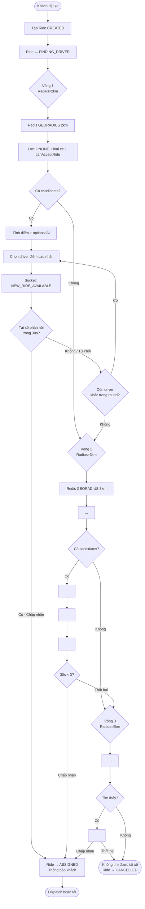
```mermaid
flowchart TD
    START([Khách đặt xe]) --> CREATE[Tạo Ride CREATED]
    CREATE --> FINDING[Ride → FINDING_DRIVER]
    FINDING --> ROUND1{Vòng 1\nRadius=2km}

    ROUND1 --> GEO1[Redis GEORADIUS 2km]
    GEO1 --> FILTER1[Lọc: ONLINE + loại xe + canAcceptRide]
    FILTER1 --> EMPTY1{Có candidates?}

    EMPTY1 -->|Không| ROUND2{Vòng 2\nRadius=3km}
    EMPTY1 -->|Có| SCORE1[Tính điểm + optional AI]

    SCORE1 --> PICK1[Chọn driver điểm cao nhất]
    PICK1 --> NOTIFY1[Socket: NEW_RIDE_AVAILABLE]
    NOTIFY1 --> WAIT1{Tài xế phản hồi\ntrong 30s?}

    WAIT1 -->|Có - Chấp nhận| ASSIGN[Ride → ASSIGNED\nThông báo khách]
    WAIT1 -->|Không / Từ chối| NEXTDRV{Còn driver\nkhác trong round?}

    NEXTDRV -->|Có| PICK1
    NEXTDRV -->|Không| ROUND2

    ROUND2 --> GEO2[Redis GEORADIUS 3km]
    GEO2 --> FILTER2[...]
    FILTER2 --> EMPTY2{Có candidates?}
    EMPTY2 -->|Không| ROUND3{Vòng 3\nRadius=5km}
    EMPTY2 -->|Có| SCORE2[...]
    SCORE2 --> PICK2[...]
    PICK2 --> NOTIFY2[...]
    NOTIFY2 --> WAIT2{30s × 3?}
    WAIT2 -->|Chấp nhận| ASSIGN
    WAIT2 -->|Thất bại| ROUND3

    ROUND3 --> GEO3[...]
    GEO3 --> EMPTY3{Tìm thấy?}
    EMPTY3 -->|Có| WAIT3[...]
    WAIT3 -->|Chấp nhận| ASSIGN
    WAIT3 -->|Thất bại| FAIL

    EMPTY3 -->|Không| FAIL([Không tìm được tài xế\nRide → CANCELLED])

    ASSIGN --> END([Dispatch hoàn tất])
```

## 5.2. Idempotent Payment Processing

### 5.2.1. Vấn đề

```
Timeline của IPN callback:
t=0s:  MoMo gọi IPN lần 1
t=2s:  Backend xử lý OK → credited
t=3s:  Network timeout → MoMo không nhận được response
t=10s: MoMo retry IPN lần 2
       ❌ Nếu không có idempotency: credited 2 lần!
```

### 5.2.2. Giải pháp với idempotencyKey

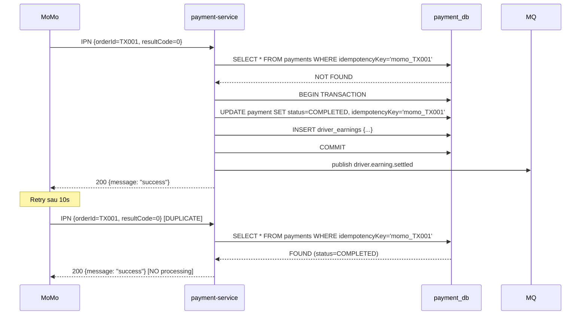
```mermaid
sequenceDiagram
    participant MoMo
    participant PAY as payment-service
    participant DB as payment_db

    MoMo->>PAY: IPN {orderId=TX001, resultCode=0}
    PAY->>DB: SELECT * FROM payments WHERE idempotencyKey='momo_TX001'
    DB-->>PAY: NOT FOUND

    PAY->>DB: BEGIN TRANSACTION
    PAY->>DB: UPDATE payment SET status=COMPLETED, idempotencyKey='momo_TX001'
    PAY->>DB: INSERT driver_earnings {...}
    PAY->>DB: COMMIT
    PAY->>MQ: publish driver.earning.settled
    PAY-->>MoMo: 200 {message: "success"}

    Note over MoMo: Retry sau 10s

    MoMo->>PAY: IPN {orderId=TX001, resultCode=0} [DUPLICATE]
    PAY->>DB: SELECT * FROM payments WHERE idempotencyKey='momo_TX001'
    DB-->>PAY: FOUND (status=COMPLETED)
    PAY-->>MoMo: 200 {message: "success"} [NO processing]
```

## 5.3. Pending Balance Settlement

### 5.3.1. Thiết kế

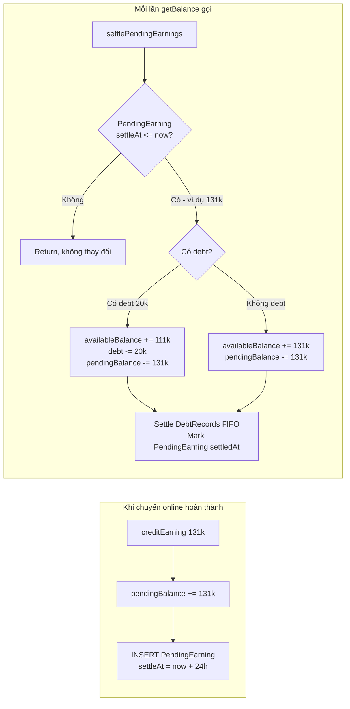
```mermaid
flowchart LR
    subgraph Khi chuyến online hoàn thành
        E1[creditEarning 131k] --> P1[pendingBalance += 131k]
        P1 --> PE1[INSERT PendingEarning\nsettleAt = now + 24h]
    end

    subgraph Mỗi lần getBalance gọi
        SQ1[settlePendingEarnings] --> SQ2{PendingEarning\nsettleAt <= now?}
        SQ2 -->|Không| SQ3[Return, không thay đổi]
        SQ2 -->|Có - ví dụ 131k| SQ4{Có debt?}
        SQ4 -->|Có debt 20k| SQ5[availableBalance += 111k\ndebt -= 20k\npendingBalance -= 131k]
        SQ4 -->|Không debt| SQ6[availableBalance += 131k\npendingBalance -= 131k]
        SQ5 & SQ6 --> SQ7[Settle DebtRecords FIFO\nMark PendingEarning.settledAt]
    end
```

### 5.3.2. Debt Settlement FIFO

```
Ví dụ: Tài xế có 3 khoản nợ
  Nợ A: 20k (oldest, created T-1)
  Nợ B: 30k (created T-0.5)
  Nợ C: 15k (newest)

Thanh toán 40k (từ top-up):
  1. Trả hết Nợ A: 20k → A.status = SETTLED
  2. Trả một phần Nợ B: 20k → B.remaining = 10k, B.status = ACTIVE
  3. Nợ C: chưa đụng
```

## 5.4. WebRTC Architecture

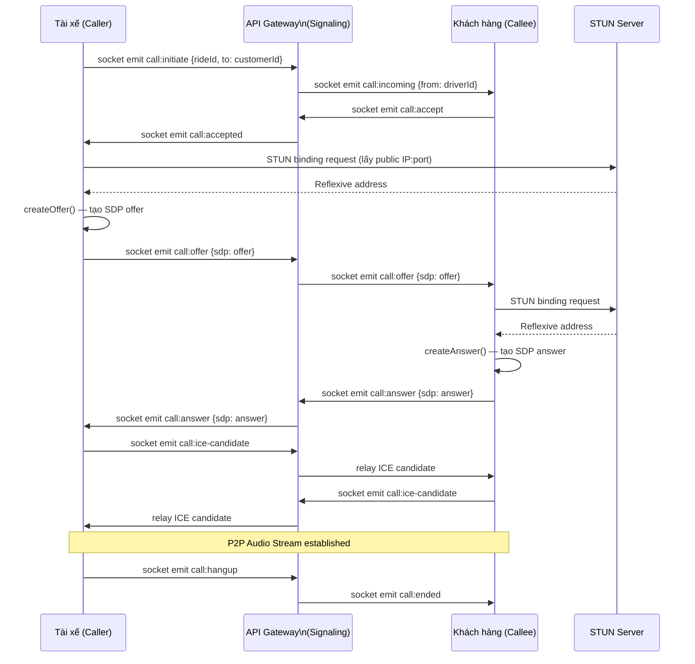
```mermaid
sequenceDiagram
    participant TX as Tài xế (Caller)
    participant GW as API Gateway\n(Signaling)
    participant KH as Khách hàng (Callee)
    participant STUN as STUN Server

    TX->>GW: socket emit call:initiate {rideId, to: customerId}
    GW->>KH: socket emit call:incoming {from: driverId}

    KH->>GW: socket emit call:accept
    GW->>TX: socket emit call:accepted

    TX->>STUN: STUN binding request (lấy public IP:port)
    STUN-->>TX: Reflexive address

    TX->>TX: createOffer() — tạo SDP offer
    TX->>GW: socket emit call:offer {sdp: offer}
    GW->>KH: socket emit call:offer {sdp: offer}

    KH->>STUN: STUN binding request
    STUN-->>KH: Reflexive address

    KH->>KH: createAnswer() — tạo SDP answer
    KH->>GW: socket emit call:answer {sdp: answer}
    GW->>TX: socket emit call:answer {sdp: answer}

    TX->>GW: socket emit call:ice-candidate
    GW->>KH: relay ICE candidate
    KH->>GW: socket emit call:ice-candidate
    GW->>TX: relay ICE candidate

    Note over TX,KH: P2P Audio Stream established

    TX->>GW: socket emit call:hangup
    GW->>KH: socket emit call:ended
```

## 5.5. Tính Hoa hồng

```
Tỷ lệ hoa hồng theo loại xe:
  MOTORBIKE / SCOOTER: 20%
  CAR_4:               18%
  CAR_7:               15%

Ví dụ chuyến CAR_4 cước 163.850₫:
  grossFare     = 163.850₫
  commissionRate = 18%
  platformFee   = 163.850 × 0.18 = 29.493₫
  netEarnings   = 163.850 - 29.493 = 134.357₫

  (nếu có voucher giảm 20k khách dùng):
  voucherDiscount = 20.000₫  ← platform chịu
  grossFare đến tài xế vẫn = 163.850₫ (không đổi)
  netEarnings = 134.357₫ (không đổi)
  Merchant OUT thêm 20k voucher
```

---

# CHƯƠNG 6: HIỆN THỰC VÀ TRIỂN KHAI

## 6.1. Tổ chức Monorepo

```
cab-booking-system/
├── apps/
│   ├── customer-app/     # React SPA :4000 — Material UI + Leaflet
│   ├── driver-app/       # React SPA :4001 — Material UI + Socket.IO
│   └── admin-dashboard/  # React SPA :4002 — Material UI + DataGrid
├── services/
│   ├── api-gateway/      # Express + Socket.IO + gRPC bridge
│   ├── auth-service/     # OTP, JWT, user accounts
│   ├── ride-service/     # Ride lifecycle, state machine
│   ├── driver-service/   # Driver profiles, go-online
│   ├── payment-service/  # MoMo, VNPay, IPN handlers
│   ├── notification-service/
│   ├── wallet-service/   # Driver wallet, settlement
│   ├── user-service/     # Customer profiles
│   ├── booking-service/  # Booking history, vouchers
│   ├── pricing-service/  # Fare calculation, surge
│   ├── review-service/   # Ratings
│   └── ai-service/       # Python/FastAPI surge model
├── shared/
│   ├── types/            # Shared TypeScript interfaces
│   └── proto/            # gRPC .proto definitions
├── scripts/
│   ├── seed-database.ts  # Seed sample data
│   ├── reset-database.sh
│   └── smoke-tests/
└── docker-compose.yml
```

## 6.2. Cấu trúc API Gateway

```mermaid
graph LR
    REQ[HTTP Request] --> MW1[JWT Middleware\nVerify + Inject headers]
    MW1 --> MW2[Address Normalizer\nnormalizeAddressPayloadDeep]
    MW2 --> ROUTER{Route?}

    ROUTER -->|/api/auth/*| HTTP1[HTTP Proxy → auth:3001]
    ROUTER -->|/api/wallet/*| HTTP2[HTTP Proxy → wallet:3006]
    ROUTER -->|/api/drivers/me/*| HTTP3[HTTP Proxy → driver:3003]
    ROUTER -->|/api/rides/*| GRPC1[gRPC Bridge → ride:50054]
    ROUTER -->|/api/drivers/*| GRPC2[gRPC Bridge → driver:50055]
    ROUTER -->|/api/pricing/*| GRPC3[gRPC Bridge → pricing:50057]
    ROUTER -->|/api/booking/*| GRPC4[gRPC Bridge → booking:50053]
    ROUTER -->|/api/admin/*| ADM[Admin Routes\nauthorize ADMIN]

    SOCKET[Socket.IO Server] --> REDIS_PUB[Redis Adapter\nPub/Sub]
    DISPATCH[Dispatch Engine] --> SOCKET
```

**Lý do tách HTTP và gRPC:**
- auth-service và wallet-service: không expose gRPC, dùng HTTP proxy
- `drivers/me/*` routes: dùng HTTP proxy (trust-sensitive, cần flexibility)
- Các route còn lại: gRPC bridge cho hiệu năng

## 6.3. Cấu trúc một Service điển hình — wallet-service

```mermaid
graph TD
    HTTP[Express HTTP :3006]
    GRPC_NOT[Không có gRPC\nwallet chỉ HTTP]

    HTTP --> ROUTES[wallet.routes.ts\nadmin.routes.ts]
    ROUTES --> CTRL[WalletController\nBonusController]
    CTRL --> SVC[DriverWalletService]

    SVC --> PRISMA[Prisma Client\nwallet_db]
    SVC --> EVENTS[EventPublisher\nRabbitMQ]
    SVC --> MERCHANT[MerchantLedgerService]
    SVC --> BANKSIM[BankSimulationService]

    CONSUMER[EventConsumer\nRabbitMQ listener] --> SVC

    INTERNAL[Internal Routes\n/internal/topup-completed\n/internal/driver/:id/can-accept] --> SVC

    subgraph Domain Services
        SETTLE[settlePendingEarnings]
        DEBTFIFO[settleDebtRecordsFifo]
        BONUS[BonusService]
    end

    SVC --> SETTLE & DEBTFIFO & BONUS
```

## 6.4. Flow Đăng ký Tài xế

```mermaid
sequenceDiagram
    participant SV as Sinh viên/Tài xế
    participant DA as Driver App
    participant GW as API Gateway
    participant AUTH as auth-service
    participant DRV as driver-service
    participant WALLET as wallet-service
    participant ADM as Admin Dashboard

    SV->>DA: Nhập số điện thoại
    DA->>GW: POST /api/auth/register {phone}
    GW->>AUTH: Forward
    AUTH->>AUTH: Generate OTP, SHA-256 hash, store Redis TTL=120s
    AUTH-->>DA: {maskedPhone, resendDelay}
    AUTH->>SV: SMS/Log OTP (dev: docker logs)

    SV->>DA: Nhập OTP
    DA->>GW: POST /api/auth/verify-otp {phone, otp}
    GW->>AUTH: Verify hash
    AUTH-->>DA: JWT tokens

    SV->>DA: Điền form hồ sơ (xe, GPLX, ảnh)
    DA->>GW: POST /api/drivers/register {vehicle, license}
    GW->>DRV: Forward
    DRV->>DRV: Create Driver {status: PENDING}
    DRV-->>DA: Driver profile created

    Note over DA: Status = PENDING\nHiển thị "Đang chờ duyệt"

    ADM->>GW: POST /api/admin/drivers/:id/approve
    GW->>DRV: Forward
    DRV->>DRV: status → APPROVED
    DRV->>MQ: publish driver.approved
    MQ->>GW: DRIVER_APPROVAL_UPDATED socket → DA
    DA->>SV: Thông báo "Hồ sơ đã được duyệt!"

    Note over SV: Tiếp theo: nạp 300k ký quỹ
    SV->>DA: Nạp 300k qua MoMo
    DA->>GW: POST /api/wallet/top-up/init {amount: 300000, provider: MOMO}
    GW->>WALLET: Forward
    WALLET->>MQ: Tạo WalletTopUpOrder
    WALLET-->>DA: {payUrl}
    SV->>DA: Redirect sang MoMo, thanh toán

    MoMo->>WALLET: IPN callback
    WALLET->>WALLET: creditTopUp → lockedBalance=300k, status=ACTIVE
    Note over DA: Ví kích hoạt!\nCó thể bật nhận cuốc
```

## 6.5. Giao diện người dùng

### 6.5.1. Customer App — Màn hình chính

Màn hình HomeMap gồm:
- **Bản đồ Leaflet** toàn màn hình, hiển thị marker tài xế online (cập nhật qua Socket.IO)
- **Bottom Sheet** có thể kéo lên: input địa chỉ đón/đến với autocomplete
- **Pending payment banner**: cảnh báo nếu có thanh toán đang chờ
- **Tracking panel**: khi chuyến đang chạy, hiển thị ETA, vị trí tài xế, thông tin chuyến

### 6.5.2. Driver App — Wallet Page

4 thành phần số dư luôn hiển thị:
```
┌─────────────────────────────────────────────┐
│  Số dư khả dụng               450,000₫      │ ← có thể rút
│  Tiền chờ xử lý  ⏱            131,080₫      │ ← T+24h
│  Công nợ platform ⚠            -20,000₫      │ ← chuyến cash
│  Ký quỹ (khoá)  🔒            300,000₫      │ ← không rút được
└─────────────────────────────────────────────┘
```

Tab "Công nợ" hiển thị danh sách DebtRecord:
```
┌─────────────────────────────────────────────┐
│ [Còn 2 ngày]   Mã: ABC123                   │
│ Tạo: 27/04/2025  Hạn: 29/04/2025           │
│                            -20,000₫          │
├─────────────────────────────────────────────┤
│ [Quá hạn!] ⚠  Mã: XYZ789                   │
│ Tạo: 20/04/2025  Hạn: 22/04/2025           │
│                            -15,000₫          │
└─────────────────────────────────────────────┘
```

### 6.5.3. Admin — Driver Approvals

DataGrid với filter theo status (PENDING/APPROVED/REJECTED), hành động Approve/Reject ngay trên row. Socket.IO nhận `driver.approved` event để tự refresh danh sách.

## 6.6. Kiểm thử

### 6.6.1. Unit Tests

Các class được unit test với Jest:

| File | Test case |
|---|---|
| `driver-wallet.service.ts` | `debitCommission` tạo DebtRecord đúng dueDate |
| `driver-wallet.service.ts` | `settlePendingEarnings` trả debt FIFO trước khi credit available |
| `driver-wallet.service.ts` | `applyDelta` EARN → pendingBalance (không vào available) |
| `driver-wallet.service.ts` | `applyDelta` TOP_UP → pay debt trước, dư vào available |
| `ride-state-machine.ts` | Chuyển đổi hợp lệ: CREATED→FINDING_DRIVER→OFFERED→ASSIGNED→ACCEPTED→... |
| `ride-state-machine.ts` | Chuyển đổi không hợp lệ: COMPLETED→IN_PROGRESS throw error |
| `payment.service.ts` | IPN handler idempotent với key trùng lặp |

### 6.6.2. Integration Tests — Các kịch bản đầy đủ

**Kịch bản 1: Chuyến online hoàn thành, thanh toán MoMo**
```
1. Tạo ride, dispatch, driver accept
2. Ride → COMPLETED
3. Publish ride.completed → payment-service
4. Payment create, init MoMo
5. Mock IPN (resultCode=0)
6. Verify: driver_earnings created
7. Verify: driver.earning.settled published
8. wallet-service consume: pendingBalance += netEarnings
9. PendingEarning created với settleAt = T+24h
10. Sau 24h: availableBalance tăng, pendingBalance giảm
```

**Kịch bản 2: Chuyến tiền mặt, công nợ**
```
1. Ride CASH → COMPLETED
2. payment-service publish driver.earning.settled {paymentMethod=CASH}
3. wallet-service: debitCommission → debt += commission
4. DebtRecord created {status=ACTIVE, dueDate=T+2}
5. Sau 2 ngày: cron mark OVERDUE
6. Tài xế nạp tiền: TOP_UP → settle DebtRecords FIFO
```

**Kịch bản 3: IPN trùng lặp không tạo giao dịch kép**
```
1. Payment MoMo IPN lần 1 → processed, credited
2. Payment MoMo IPN lần 2 (same orderId) → idempotencyKey found, skip
3. Verify: wallet balance unchanged after 2nd IPN
```

## 6.7. Bảo mật, hạ tầng và triển khai

### 6.7.1. Ranh giới tin cậy bảo mật

Hệ thống chia thành bốn vùng tin cậy chính: client public, gateway edge, service nội bộ và data/secrets layer. Cách chia này giúp báo cáo rõ ràng hơn khi trình bày vì sao client không được gọi trực tiếp vào database hoặc microservice phía sau.

**Hình gợi ý chèn vào Word:** `img/20_security_trust_boundary.png`

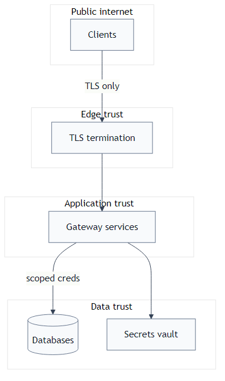

| Vùng | Thành phần | Biện pháp bảo vệ |
|---|---|---|
| Public client | Customer App, Driver App, Admin Dashboard | HTTPS, JWT, CORS, rate limit |
| Edge/Gateway | API Gateway, Socket.IO server | Verify token, inject identity headers, request logging, address normalization |
| Internal services | Auth, Ride, Driver, Payment, Wallet, Pricing, Notification, Review, AI | Internal token, service URL private, validation bằng Joi/Pydantic |
| Data layer | PostgreSQL, MongoDB, Redis, RabbitMQ, secrets | Network isolation trong Docker, không expose credential ra frontend |

**Các điểm bảo mật quan trọng:**

| Rủi ro | Cách xử lý trong hệ thống |
|---|---|
| Lộ mật khẩu | Mật khẩu hash bằng bcrypt, không lưu plaintext |
| Lộ OTP | OTP được hash/lưu TTL, không trả OTP qua API |
| Gọi API trái quyền | API Gateway kiểm tra JWT và role trước khi proxy |
| Callback thanh toán giả | Payment Service kiểm tra chữ ký MoMo/VNPay |
| IPN gọi lặp | Idempotency key ngăn cộng tiền nhiều lần |
| Dữ liệu tài chính sai lệch | Wallet transaction và merchant ledger ghi append-only |
| Service nội bộ bị gọi trực tiếp | Dùng internal token và network private trong Docker |

### 6.7.2. Hạ tầng local và hướng triển khai cloud

Trong phạm vi khóa luận, hệ thống chạy bằng Docker Compose trên môi trường local hoặc máy chủ demo. Các container backend, frontend, database, broker và monitoring được cấu hình để có thể khởi động đồng bộ.

**Thành phần local:**

| Nhóm | Thành phần |
|---|---|
| Frontend | Customer App `:4000`, Driver App `:4001`, Admin Dashboard `:4002` |
| Backend | API Gateway và 11 service nghiệp vụ |
| AI | FastAPI AI Service `:8000` |
| Data | PostgreSQL, MongoDB, Redis |
| Messaging | RabbitMQ topic exchange |
| Monitoring | Prometheus, Grafana, Loki, Promtail |

**Hướng triển khai cloud đề xuất:** nếu triển khai production, có thể đưa frontend lên CloudFront/S3, API Gateway và service lên ECS, database sang RDS, Redis sang ElastiCache, RabbitMQ sang Amazon MQ và secrets sang AWS Secrets Manager.

**Hình gợi ý chèn vào Word:** `img/02_aws_deployment_architecture.png`

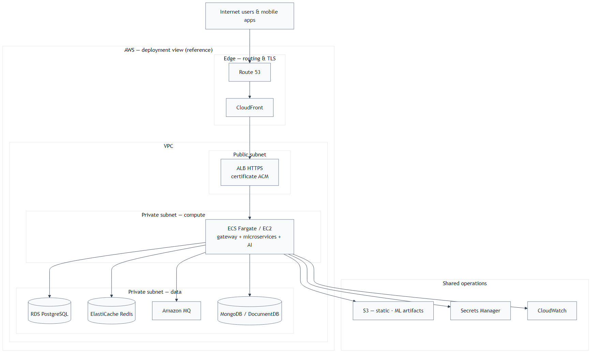

---

# CHƯƠNG 7: ĐÁNH GIÁ VÀ THẢO LUẬN

## 7.1. Đánh giá chức năng

### 7.1.1. Kết quả kiểm thử chức năng

| Kịch bản | Kết quả | Chi tiết |
|---|---|---|
| Đặt xe, thanh toán MoMo | ✅ Đạt | pendingBalance += netEarnings trong < 500ms sau IPN |
| Đặt xe, thanh toán VNPay | ✅ Đạt | VNPay signature verify đúng, idempotent |
| Đặt xe tiền mặt | ✅ Đạt | DebtRecord ACTIVE, dueDate = T+2 |
| IPN trùng lặp | ✅ Đạt | 2nd IPN bị bỏ qua, không credit 2 lần |
| Hủy chuyến online, hoàn tiền | ✅ Đạt | Refund debit ngược wallet driver |
| Tài xế PENDING không go-online | ✅ Đạt | 403 với message tiếng Việt |
| Tài xế chưa nạp 300k không go-online | ✅ Đạt | canAcceptRide=false, wallet INACTIVE |
| Tài xế nạp tiền tất toán nợ FIFO | ✅ Đạt | Nợ cũ nhất được trả trước |
| Settlement T+24h | ✅ Đạt | Available tăng, pending giảm, debt trừ đúng |
| Chat giữa tài xế và khách | ✅ Đạt | Socket.IO message trong 50ms |
| Gọi thoại WebRTC | ✅ Đạt | P2P audio kết nối trên cùng LAN |
| Admin duyệt hồ sơ | ✅ Đạt | Socket notify Driver App ngay lập tức |
| Dispatch 3 vòng | ✅ Đạt | Mở rộng bán kính đúng quy trình |

### 7.1.2. Đánh giá Hệ thống Ví Tài chính

Thực hiện 10 kịch bản tài chính và kiểm tra tính nhất quán:

| Kịch bản | Số dư trước | Operation | Số dư sau (expected) | Kết quả |
|---|---|---|---|---|
| Top-up 300k (kích hoạt) | bal=0 | TOP_UP 300k | locked=300k, avail=0 | ✅ |
| Top-up thêm 100k | avail=0, debt=0 | TOP_UP 100k | avail=100k | ✅ |
| Cash ride commission 20k | avail=100k | COMMISSION 20k | avail=80k, debt=20k | ✅ |
| Top-up 10k trả nợ một phần | debt=20k | TOP_UP 10k | debt=10k, avail+0 | ✅ |
| Top-up 50k trả hết nợ + dư | debt=10k | TOP_UP 50k | debt=0, avail=40k | ✅ |
| Online ride +131k pending | pend=0 | EARN 131k | pend=131k | ✅ |
| Settlement sau 24h (nợ=0) | pend=131k, avail=40k | SETTLE | avail=171k, pend=0 | ✅ |
| Settlement khi có nợ 15k | pend=80k, debt=15k | SETTLE | avail=65k, pend=0, debt=0 | ✅ |
| Rút tiền 50k | avail=65k | WITHDRAW 50k | avail=15k | ✅ |
| Rút quá số dư khả dụng | avail=15k | WITHDRAW 20k | Error 400 | ✅ |

## 7.2. Đánh giá hiệu năng

### 7.2.1. Response time

Đo lường trên môi trường Docker local, 10 requests liên tiếp:

| Endpoint | Min | Avg | Max | P95 |
|---|---|---|---|---|
| GET /wallet/balance | 35ms | 42ms | 68ms | 61ms |
| GET /wallet/debt-records | 28ms | 35ms | 55ms | 49ms |
| POST /drivers/me/online | 150ms | 185ms | 310ms | 280ms |
| POST /rides (đặt xe) | 180ms | 210ms | 380ms | 345ms |
| GET /rides/:id | 22ms | 28ms | 45ms | 40ms |
| POST /rides/:id/accept | 88ms | 110ms | 175ms | 160ms |

*Đo tại: [Thông tin cấu hình máy tính]*

### 7.2.2. Dispatch timing

Mô phỏng với 5 tài xế online:

| Kịch bản | Số vòng | Thời gian |
|---|---|---|
| Tài xế trong 2km (vòng 1) | 1 | ~800ms |
| Tài xế trong 3km, không có 2km | 2 | ~2.1s |
| Tài xế trong 5km | 3 | ~4.5s |
| Không có tài xế trong 5km | 3 (thất bại) | ~5.2s |

## 7.3. Thảo luận

### 7.3.1. Ưu điểm của phương pháp DDD

Việc áp dụng DDD mang lại:
1. **Ranh giới service rõ ràng**: mỗi BC là một bounded context, không service nào biết implementation của service khác.
2. **Ubiquitous language nhất quán**: code dùng đúng tên nghiệp vụ (`pendingBalance`, `cashDebt`, `DebtRecord`) thay vì tên kỹ thuật.
3. **Domain model phong phú**: Wallet không chỉ là CRUD — nó có behavior (`creditEarning`, `settlePendingEarnings`, `settleDebtRecordsFifo`).
4. **Domain Events liên kết loose**: Payment và Wallet không biết nhau trực tiếp, chỉ giao tiếp qua event.

### 7.3.2. Điểm mạnh

- Kiến trúc microservices đầy đủ với database isolation và event-driven communication
- Hệ thống ví tài chính nghiêm ngặt với audit trail bất biến và idempotency ở mọi layer
- Dispatch algorithm có thể mở rộng thêm tiêu chí mà không thay đổi cấu trúc
- Giao tiếp real-time đa kênh: socket, chat, WebRTC
- AI service optional với graceful fallback

### 7.3.3. Hạn chế

- **L3/L4 wallet enforcement** (force deduction từ deposit khi overdue) chưa có cron job chạy định kỳ
- **Load testing** chưa thực hiện — response time đo trên 10 requests, chưa có concurrent load
- **WebRTC TURN** dùng free STUN — không đảm bảo cho mạng cellular với symmetric NAT
- **AI model** dùng dữ liệu mô phỏng — chưa validate với dữ liệu thực tế
- **Triển khai cloud** chưa thực hiện

---

# CHƯƠNG 8: KẾT LUẬN

## 8.1. Tổng kết những gì đã đạt được

Đề tài đã hoàn thành đầy đủ các mục tiêu đề ra:

**Về phân tích thiết kế:**
- Áp dụng DDD phân rã hệ thống thành 11 Bounded Context với Context Map rõ ràng
- Xây dựng Ubiquitous Language nhất quán giữa code và nghiệp vụ
- Thiết kế Domain Model chi tiết cho các BC cốt lõi: Ride, Driver, Wallet, Payment
- Thiết kế Domain Event catalog và luồng event-driven giữa các BC

**Về hiện thực:**
- 11 microservice backend, 3 ứng dụng frontend, 1 AI service — tổng cộng 15 service containerized
- Hệ thống thanh toán dual-gateway (MoMo + VNPay) với idempotent IPN handling
- Hệ thống ví tài xế fintech-grade với 4 thành phần số dư và settlement logic
- Thuật toán dispatch 3 vòng với weighted scoring và AI adjustment
- Real-time communication qua Socket.IO + WebRTC

## 8.2. Bài học rút ra

1. **DDD giúp microservice decomposition tự nhiên hơn** — khi BC được xác định đúng, ranh giới service trở nên hiển nhiên.
2. **Idempotency là bắt buộc cho tài chính** — mọi mutation tài chính phải có `idempotencyKey`.
3. **Event-driven tốt cho loose coupling nhưng phức tạp để debug** — cần correlation ID để trace event qua nhiều service.
4. **Pending balance cần lazy settlement** — gọi `settlePendingEarnings()` trong `getBalance()` (lazy) đơn giản hơn background job nhưng cần careful transaction isolation.

## 8.3. Hướng phát triển

| Hướng | Mô tả | Độ ưu tiên |
|---|---|---|
| **Cloud deployment** | AWS ECS + RDS + ElastiCache + SNS thay RabbitMQ | Cao |
| **L3/L4 debt enforcement** | Cron job hàng giờ check overdue, force deduct từ deposit | Cao |
| **Load testing** | k6 hoặc Locust: 500 concurrent users, measure P99 | Cao |
| **Native mobile** | React Native hoặc Flutter cho iOS/Android | Trung bình |
| **AI improvement** | Thu thập dữ liệu thực, retrain surge model | Trung bình |
| **TURN server** | Coturn self-hosted cho WebRTC reliability | Trung bình |
| **Advanced features** | Đặt xe theo lịch, chia sẻ chuyến, loyalty program | Thấp |

---

## TÀI LIỆU THAM KHẢO

### Tiếng Việt

[1]. Nguyễn Anh Tuấn, Phạm Minh Đức (2023), "Phân tích thị trường ride-hailing Việt Nam giai đoạn 2020–2023", *Tạp chí Kinh tế Số*, Tập 5(2), tr. 18–29.

[2]. Hoàng Vũ Long, Lê Thị Mai (2022), *Phân tích và Thiết kế Hệ thống Thông tin Hướng Đối tượng*, NXB Đại học Quốc gia TP. HCM, Thành phố Hồ Chí Minh.

### Tiếng Anh

[3]. Evans, E. (2003), *Domain-Driven Design: Tackling Complexity in the Heart of Software*, Addison-Wesley, Boston, MA.

[4]. Newman, S. (2021), *Building Microservices: Designing Fine-Grained Systems*, 2nd Edition, O'Reilly Media, Sebastopol, CA.

[5]. Vernon, V. (2013), *Implementing Domain-Driven Design*, Addison-Wesley, Boston, MA.

[6]. Richardson, C. (2018), *Microservices Patterns: With Examples in Java*, Manning Publications, Shelter Island, NY.

[7]. Kleppmann, M. (2017), *Designing Data-Intensive Applications: The Big Ideas Behind Reliable, Scalable, and Maintainable Systems*, O'Reilly Media, Sebastopol, CA.

[8]. Burns, B. (2018), *Designing Distributed Systems: Patterns and Paradigms for Scalable, Reliable Services*, O'Reilly Media, Sebastopol, CA.

[9]. Uber Engineering Blog (2020), "Project DISCO: Dispatch System at Scale", https://eng.uber.com/dispatch-optimization

[10]. Grab Engineering Blog (2021), "Building a Real-time Geolocation System", https://engineering.grab.com/geolocation-system

[11]. Fowler, M. (2011), "CQRS", https://martinfowler.com/bliki/CQRS.html

[12]. Fowler, M. (2010), "Outbox Pattern", https://microservices.io/patterns/data/transactional-outbox.html

[13]. MoMo Developer Portal (2024), "MoMo Payment API v2 Documentation", https://developers.momo.vn/v3/docs/payment/api/wallet

[14]. VNPay Developer Portal (2024), "VNPay Integration Guide — Sandbox", https://sandbox.vnpayment.vn/apis/docs/huong-dan-tich-hop

[15]. Prisma (2024), "Prisma ORM Documentation", https://www.prisma.io/docs

[16]. Socket.IO (2024), "Socket.IO Documentation with Redis Adapter", https://socket.io/docs/v4/redis-adapter

[17]. Redis (2024), "Redis GEO Commands Reference", https://redis.io/commands/georadius

[18]. RabbitMQ (2024), "RabbitMQ Topics — Tutorial 5", https://www.rabbitmq.com/tutorials/tutorial-five-javascript

[19]. WebRTC (2024), "WebRTC API — MDN Web Docs", https://developer.mozilla.org/en-US/docs/Web/API/WebRTC_API

[20]. Statista (2024), "Ride-hailing market in Southeast Asia — Statistics & Facts", https://www.statista.com/topics/5066/ride-hailing-in-southeast-asia

---

## PHỤ LỤC

### Phụ lục A: Tài khoản demo

| Vai trò | Số điện thoại | Mật khẩu | Ghi chú |
|---|---|---|---|
| Khách hàng | 0901234561–0901234580 | Password@1 | 20 tài khoản seed |
| Tài xế (approved, ví kích hoạt) | 0911234561–0911234575 | Password@1 | 15 tài xế seed |
| Quản trị viên | 0900000001 | Password@1 | 1 admin seed |

### Phụ lục B: Hướng dẫn khởi chạy

```bash
# Yêu cầu: Docker Desktop, Node.js 20+

# Bước 1: Cài dependencies
npm install

# Bước 2: Khởi chạy hạ tầng
npm run docker:up

# Bước 3: Chờ healthy (~30s), kiểm tra
docker ps --format "table {{.Names}}\t{{.Status}}"

# Bước 4: Seed dữ liệu
npx tsx scripts/seed-database.ts

# Bước 5: Khởi chạy frontend (3 terminal)
npm run dev:customer      # http://localhost:4000
npm run dev:driver-app    # http://localhost:4001
npm run dev:admin         # http://localhost:4002

# Lấy OTP trong dev mode
docker logs cab-auth-service 2>&1 | grep "OTP\]\["

# Reset toàn bộ
bash scripts/reset-database.sh
```

### Phụ lục C: Danh sách API chính

| Method | Endpoint | Auth | Chức năng |
|---|---|---|---|
| POST | /api/auth/register | — | Đăng ký (gửi OTP) |
| POST | /api/auth/verify-otp | — | Xác thực OTP |
| POST | /api/auth/login | — | Đăng nhập |
| POST | /api/auth/refresh | — | Refresh access token |
| GET | /api/drivers/me | DRIVER | Hồ sơ tài xế |
| POST | /api/drivers/register | DRIVER | Tạo hồ sơ tài xế |
| POST | /api/drivers/me/online | DRIVER | Bật nhận cuốc |
| POST | /api/drivers/me/offline | DRIVER | Tắt nhận cuốc |
| POST | /api/rides | CUSTOMER | Đặt xe |
| GET | /api/rides/:id | AUTH | Chi tiết chuyến |
| POST | /api/rides/:id/accept | DRIVER | Nhận cuốc |
| POST | /api/rides/:id/pickup | DRIVER | Xác nhận đến điểm đón |
| POST | /api/rides/:id/start | DRIVER | Bắt đầu chuyến |
| POST | /api/rides/:id/complete | DRIVER | Hoàn thành chuyến |
| GET | /api/wallet/balance | DRIVER | Số dư ví (4 thành phần) |
| GET | /api/wallet/debt-records | DRIVER | Danh sách công nợ |
| GET | /api/wallet/transactions | DRIVER | Lịch sử giao dịch |
| POST | /api/wallet/withdraw | DRIVER | Rút tiền |
| POST | /api/wallet/top-up/init | DRIVER | Nạp tiền MoMo/VNPay |
| POST | /api/admin/drivers/:id/approve | ADMIN | Duyệt tài xế |
| POST | /api/admin/drivers/:id/reject | ADMIN | Từ chối tài xế |
| GET | /api/admin/wallet/merchant-balance | ADMIN | Số dư nền tảng |
| GET | /api/admin/wallet/ledger | ADMIN | Sổ cái giao dịch |

### Phụ lục D: Cấu hình môi trường quan trọng

```env
# auth-service
OTP_SMS_MODE=mock          # mock | twilio | speedsms | sns
OTP_TTL_SECONDS=120
JWT_EXPIRES_IN=15m
REFRESH_TOKEN_EXPIRES_IN=7d

# wallet-service
INITIAL_ACTIVATION_BALANCE=300000
DEBT_LIMIT=-200000
WARNING_THRESHOLD=-100000
MIN_WITHDRAWAL=50000

# api-gateway (dispatch)
MATCHING_ROUNDS=[{"radiusKm":2,"timeout":20},{"radiusKm":3,"timeout":60},{"radiusKm":5,"timeout":100}]
MATCHING_AI_ADJUSTMENT_ENABLED=false

# payment-service
MOMO_SANDBOX_MODE=true
VNPAY_SANDBOX_MODE=true
```

---

## NHẬT KÍ LÀM VIỆC

**Đề tài:** Thiết kế và Xây dựng Hệ thống Đặt Xe Trực Tuyến  
**Giảng viên hướng dẫn:** [Học hàm/học vị Họ và tên GVHD]  
**Ngày bắt đầu:** [DD/MM/YYYY]

| Tuần | Từ ngày | Đến ngày | Ngày báo cáo GVHD | Tóm tắt công việc |
|---|---|---|---|---|
| 1 | | | | Nghiên cứu DDD, Event Storming, phân tích hệ thống tham khảo (Grab/Gojek) |
| 2 | | | | Thiết kế Context Map, Ubiquitous Language, xác định 11 Bounded Context |
| 3 | | | | Thiết kế Domain Model chi tiết, database schema cho mỗi service |
| 4 | | | | Triển khai api-gateway, auth-service, Docker Compose infrastructure |
| 5 | | | | Triển khai ride-service, driver-service, Redis GEO dispatch |
| 6 | | | | Triển khai payment-service, tích hợp MoMo sandbox |
| 7 | | | | Tích hợp VNPay, idempotent IPN, refund flow |
| 8 | | | | Triển khai wallet-service: pendingBalance, DebtRecord, settlement |
| 9 | | | | Xây dựng Customer App: bản đồ, đặt xe, theo dõi |
| 10 | | | | Xây dựng Driver App: dashboard, ví 4-section, công nợ |
| 11 | | | | Xây dựng Admin Dashboard: duyệt tài xế, wallet admin |
| 12 | | | | Tích hợp WebRTC chat/voice call |
| 13 | | | | pricing-service, review-service, AI service |
| 14 | | | | Kiểm thử integration, sửa lỗi, đánh giá hiệu năng |
| 15 | | | | Viết báo cáo, thiết kế sơ đồ, chuẩn bị slide |
