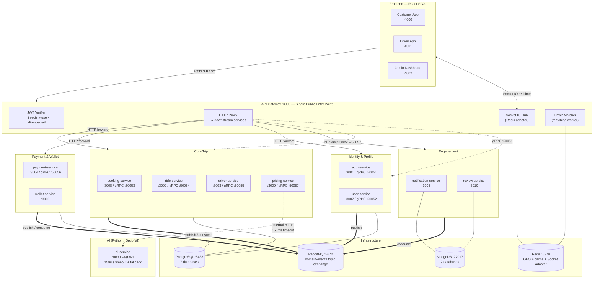

# System Architecture Overview

```mermaid
graph TB
    subgraph Clients["Frontend — React SPAs"]
        C["Customer App\n:4000"]
        D["Driver App\n:4001"]
        A["Admin Dashboard\n:4002"]
    end

    subgraph GW["API Gateway :3000 — Single Public Entry Point"]
        direction LR
        GW_JWT["JWT Verifier\n→ injects x-user-id/role/email"]
        GW_PROXY["HTTP Proxy\n→ downstream services"]
        GW_SOCK["Socket.IO Hub\n(Redis adapter)"]
        GW_MATCH["Driver Matcher\n(matching worker)"]
    end

    subgraph Core["Core Trip"]
        BOOKING["booking-service\n:3008 / gRPC :50053"]
        RIDE["ride-service\n:3002 / gRPC :50054"]
        DRIVER["driver-service\n:3003 / gRPC :50055"]
        PRICING["pricing-service\n:3009 / gRPC :50057"]
    end

    subgraph Money["Payment & Wallet"]
        PAYMENT["payment-service\n:3004 / gRPC :50056"]
        WALLET["wallet-service\n:3006"]
    end

    subgraph Identity["Identity & Profile"]
        AUTH["auth-service\n:3001 / gRPC :50051"]
        USER["user-service\n:3007 / gRPC :50052"]
    end

    subgraph Engagement["Engagement"]
        NOTIF["notification-service\n:3005"]
        REVIEW["review-service\n:3010"]
    end

    subgraph AI["AI (Python / Optional)"]
        AI_SVC["ai-service\n:8000 FastAPI\n150ms timeout + fallback"]
    end

    subgraph Infra["Infrastructure"]
        PG[("PostgreSQL :5433\n7 databases")]
        MONGO[("MongoDB :27017\n2 databases")]
        REDIS[("Redis :6379\nGEO + cache + Socket adapter")]
        MQ[("RabbitMQ :5672\ndomain-events topic exchange")]
    end

    Clients -->|"HTTPS REST"| GW
    Clients <-->|"Socket.IO realtime"| GW_SOCK

    GW_PROXY -->|"HTTP forward"| Core
    GW_PROXY -->|"HTTP forward"| Money
    GW_PROXY -->|"HTTP forward"| Identity
    GW_PROXY -->|"HTTP forward"| Engagement
    GW_PROXY -.->|"gRPC :50051–:50057"| Core
    GW_PROXY -.->|"gRPC :50051"| Identity

    PRICING -.->|"internal HTTP\n150ms timeout"| AI_SVC

    Core ==>|"publish / consume"| MQ
    Money ==>|"publish / consume"| MQ
    Identity ==>|"publish"| MQ
    Engagement ==>|"consume"| MQ

    Core --- PG
    Money --- PG
    Identity --- PG
    NOTIF --- MONGO
    REVIEW --- MONGO
    GW_SOCK --- REDIS
    GW_MATCH --- REDIS
```
