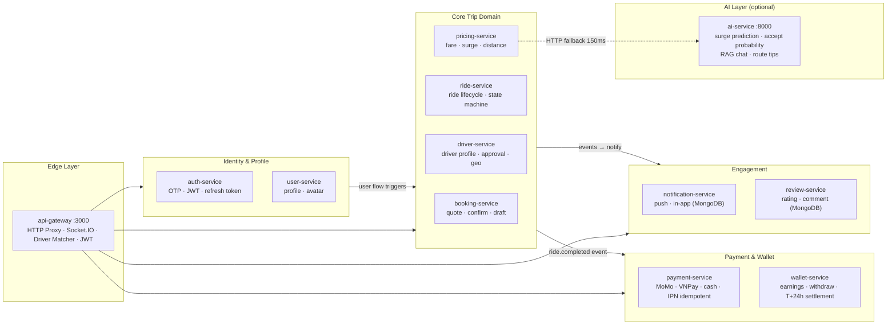

# Service Domain Map

Phân nhóm 11 microservice theo bounded context.

```mermaid
graph LR
    subgraph edge["Edge Layer"]
        GW["api-gateway :3000\nHTTP Proxy · Socket.IO · Driver Matcher · JWT"]
    end

    subgraph identity["Identity & Profile"]
        AUTH["auth-service\nOTP · JWT · refresh token"]
        USER["user-service\nprofile · avatar"]
    end

    subgraph core_trip["Core Trip Domain"]
        BOOKING["booking-service\nquote · confirm · draft"]
        RIDE["ride-service\nride lifecycle · state machine"]
        DRIVER["driver-service\ndriver profile · approval · geo"]
        PRICING["pricing-service\nfare · surge · distance"]
    end

    subgraph money["Payment & Wallet"]
        PAYMENT["payment-service\nMoMo · VNPay · cash · IPN idempotent"]
        WALLET["wallet-service\nearnings · withdraw · T+24h settlement"]
    end

    subgraph engagement["Engagement"]
        NOTIF["notification-service\npush · in-app (MongoDB)"]
        REVIEW["review-service\nrating · comment (MongoDB)"]
    end

    subgraph ai["AI Layer (optional)"]
        AI["ai-service :8000\nsurge prediction · accept probability\nRAG chat · route tips"]
    end

    GW --> identity
    GW --> core_trip
    GW --> money
    GW --> engagement

    identity -->|"user flow triggers"| core_trip
    core_trip -->|"ride.completed event"| money
    core_trip -->|"events → notify"| engagement
    PRICING -.->|"HTTP fallback 150ms"| AI
```
