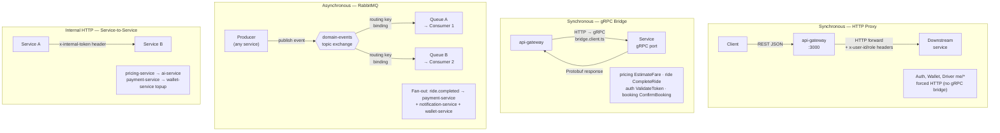

# Inter-Service Communication Patterns

Ba cơ chế giao tiếp trong hệ thống.

```mermaid
graph TB
    subgraph sync_http["Synchronous — HTTP Proxy"]
        direction LR
        C1["Client"] -->|"REST JSON"| GW1["api-gateway\n:3000"]
        GW1 -->|"HTTP forward\n+ x-user-id/role headers"| SVC1["Downstream\nservice"]
        note1["Auth, Wallet, Driver me/*\nforced HTTP (no gRPC bridge)"]
    end

    subgraph sync_grpc["Synchronous — gRPC Bridge"]
        direction LR
        GW2["api-gateway"] -->|"HTTP → gRPC\nbridge.client.ts"| SVC2["Service\ngRPC port"]
        SVC2 -->|"Protobuf response"| GW2
        note2["pricing EstimateFare · ride CompleteRide\nauth ValidateToken · booking ConfirmBooking"]
    end

    subgraph async_mq["Asynchronous — RabbitMQ"]
        direction LR
        PUB["Producer\n(any service)"] -->|"publish event"| EX{{"domain-events\ntopic exchange"}}
        EX -->|"routing key\nbinding"| Q1["Queue A\n→ Consumer 1"]
        EX -->|"routing key\nbinding"| Q2["Queue B\n→ Consumer 2"]
        note3["Fan-out: ride.completed → payment-service\n+ notification-service + wallet-service"]
    end

    subgraph internal_http["Internal HTTP — Service-to-Service"]
        direction LR
        SVC3["Service A"] -->|"x-internal-token header"| SVC4["Service B"]
        note4["pricing-service → ai-service\npayment-service → wallet-service topup"]
    end
```
