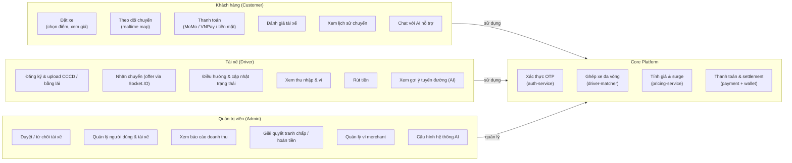

# Use Case Diagram — 3 Vai (Roles)

```mermaid
graph LR
    subgraph Customer["Khách hàng (Customer)"]
        UC1["Đặt xe\n(chọn điểm, xem giá)"]
        UC2["Theo dõi chuyến\n(realtime map)"]
        UC3["Thanh toán\n(MoMo / VNPay / tiền mặt)"]
        UC4["Đánh giá tài xế"]
        UC5["Xem lịch sử chuyến"]
        UC6["Chat với AI hỗ trợ"]
    end

    subgraph Driver["Tài xế (Driver)"]
        UC7["Đăng ký & upload CCCD / bằng lái"]
        UC8["Nhận chuyến (offer via Socket.IO)"]
        UC9["Điều hướng & cập nhật trạng thái"]
        UC10["Xem thu nhập & ví"]
        UC11["Rút tiền"]
        UC12["Xem gợi ý tuyến đường (AI)"]
    end

    subgraph Admin["Quản trị viên (Admin)"]
        UC13["Duyệt / từ chối tài xế"]
        UC14["Quản lý người dùng & tài xế"]
        UC15["Xem báo cáo doanh thu"]
        UC16["Giải quyết tranh chấp / hoàn tiền"]
        UC17["Quản lý ví merchant"]
        UC18["Cấu hình hệ thống AI"]
    end

    subgraph Platform["Core Platform"]
        P1["Xác thực OTP\n(auth-service)"]
        P2["Ghép xe đa vòng\n(driver-matcher)"]
        P3["Tính giá & surge\n(pricing-service)"]
        P4["Thanh toán & settlement\n(payment + wallet)"]
    end

    Customer -->|"sử dụng"| Platform
    Driver -->|"sử dụng"| Platform
    Admin -->|"quản lý"| Platform
```
