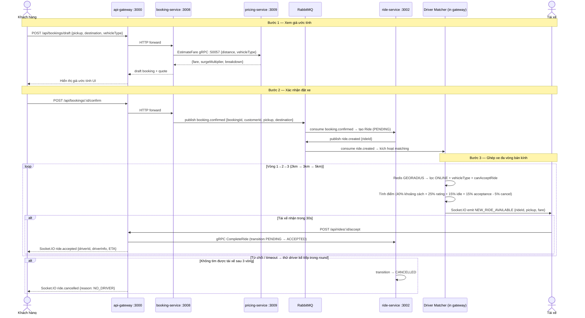

# Sequence: Đặt xe → Ghép tài xế → Nhận chuyến

```mermaid
sequenceDiagram
    actor C as Khách hàng
    participant GW as api-gateway :3000
    participant BK as booking-service :3008
    participant PR as pricing-service :3009
    participant MQ as RabbitMQ
    participant RD as ride-service :3002
    participant GW_M as Driver Matcher (in gateway)
    actor DR as Tài xế

    Note over C,DR: Bước 1 — Xem giá ước tính
    C->>GW: POST /api/bookings/draft {pickup, destination, vehicleType}
    GW->>BK: HTTP forward
    BK->>PR: EstimateFare gRPC :50057 {distance, vehicleType}
    PR-->>BK: {fare, surgeMultiplier, breakdown}
    BK-->>GW: draft booking + quote
    GW-->>C: Hiển thị giá ước tính UI

    Note over C,DR: Bước 2 — Xác nhận đặt xe
    C->>GW: POST /api/bookings/:id/confirm
    GW->>BK: HTTP forward
    BK->>MQ: publish booking.confirmed {bookingId, customerId, pickup, destination}
    MQ->>RD: consume booking.confirmed → tạo Ride (PENDING)
    RD->>MQ: publish ride.created {rideId}
    MQ->>GW_M: consume ride.created → kích hoạt matching

    Note over GW_M,DR: Bước 3 — Ghép xe đa vòng bán kính
    loop Vòng 1→2→3 (2km → 3km → 5km)
        GW_M->>GW_M: Redis GEORADIUS → lọc ONLINE + vehicleType + canAcceptRide
        GW_M->>GW_M: Tính điểm (40% khoảng cách + 25% rating + 15% idle + 15% acceptance - 5% cancel)
        GW_M->>DR: Socket.IO emit NEW_RIDE_AVAILABLE {rideId, pickup, fare}
        alt Tài xế nhận trong 30s
            DR->>GW: POST /api/rides/:id/accept
            GW->>RD: gRPC CompleteRide (transition PENDING → ACCEPTED)
            GW-->>C: Socket.IO ride.accepted {driverId, driverInfo, ETA}
        else Từ chối / timeout → thử driver kế tiếp trong round
        end
    end

    alt Không tìm được tài xế sau 3 vòng
        RD->>RD: transition → CANCELLED
        GW-->>C: Socket.IO ride.cancelled {reason: NO_DRIVER}
    end
```
