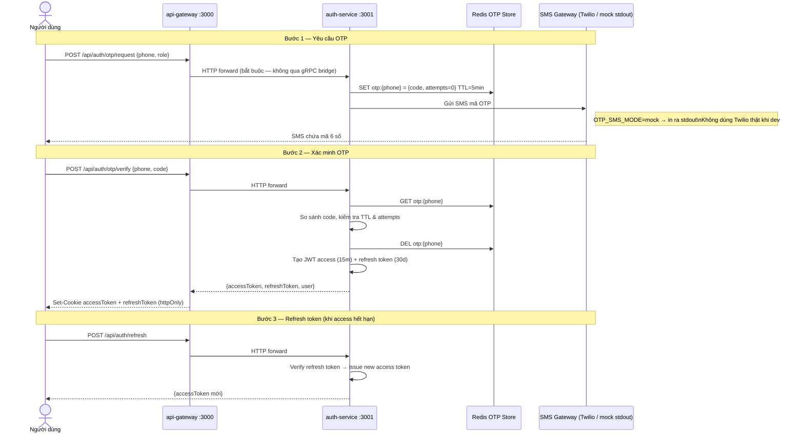

# Sequence: Đăng ký / Đăng nhập OTP

```mermaid
sequenceDiagram
    actor U as Người dùng
    participant GW as api-gateway :3000
    participant AUTH as auth-service :3001
    participant REDIS as Redis OTP Store
    participant SMS as SMS Gateway (Twilio / mock stdout)

    Note over U,SMS: Bước 1 — Yêu cầu OTP
    U->>GW: POST /api/auth/otp/request {phone, role}
    GW->>AUTH: HTTP forward (bắt buộc — không qua gRPC bridge)
    AUTH->>REDIS: SET otp:{phone} = {code, attempts=0} TTL=5min
    AUTH->>SMS: Gửi SMS mã OTP
    Note right of SMS: OTP_SMS_MODE=mock → in ra stdout\nKhông dùng Twilio thật khi dev
    SMS-->>U: SMS chứa mã 6 số

    Note over U,SMS: Bước 2 — Xác minh OTP
    U->>GW: POST /api/auth/otp/verify {phone, code}
    GW->>AUTH: HTTP forward
    AUTH->>REDIS: GET otp:{phone}
    AUTH->>AUTH: So sánh code, kiểm tra TTL & attempts
    AUTH->>REDIS: DEL otp:{phone}
    AUTH->>AUTH: Tạo JWT access (15m) + refresh token (30d)
    AUTH-->>GW: {accessToken, refreshToken, user}
    GW-->>U: Set-Cookie accessToken + refreshToken (httpOnly)

    Note over U,SMS: Bước 3 — Refresh token (khi access hết hạn)
    U->>GW: POST /api/auth/refresh
    GW->>AUTH: HTTP forward
    AUTH->>AUTH: Verify refresh token → issue new access token
    AUTH-->>U: {accessToken mới}
```
