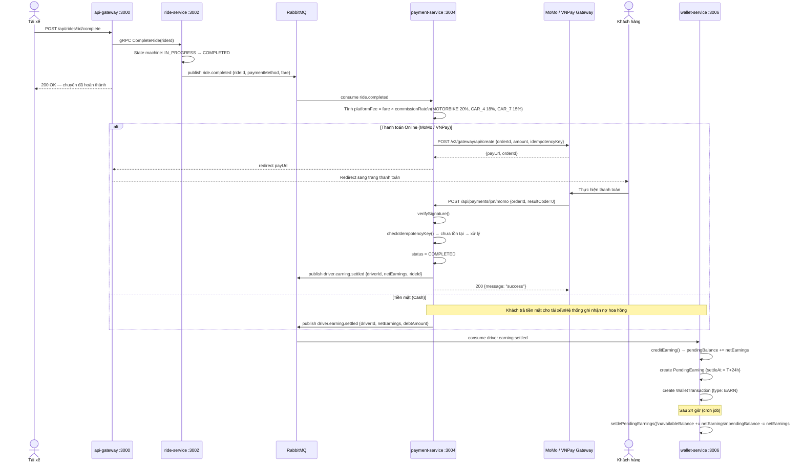

# Sequence: Thanh toán sau khi hoàn thành chuyến

Bao gồm cả hai luồng: tiền mặt (cash) và thanh toán online (MoMo/VNPay).

```mermaid
sequenceDiagram
    actor DR as Tài xế
    participant GW as api-gateway :3000
    participant RD as ride-service :3002
    participant MQ as RabbitMQ
    participant PM as payment-service :3004
    participant MOMO as MoMo / VNPay Gateway
    actor C as Khách hàng
    participant WL as wallet-service :3006

    DR->>GW: POST /api/rides/:id/complete
    GW->>RD: gRPC CompleteRide(rideId)
    RD->>RD: State machine: IN_PROGRESS → COMPLETED
    RD->>MQ: publish ride.completed {rideId, paymentMethod, fare}
    GW-->>DR: 200 OK — chuyến đã hoàn thành

    MQ->>PM: consume ride.completed
    PM->>PM: Tính platformFee = fare × commissionRate\n(MOTORBIKE 20%, CAR_4 18%, CAR_7 15%)

    alt Thanh toán Online (MoMo / VNPay)
        PM->>MOMO: POST /v2/gateway/api/create {orderId, amount, idempotencyKey}
        MOMO-->>PM: {payUrl, orderId}
        PM-->>GW: redirect payUrl
        GW-->>C: Redirect sang trang thanh toán
        C->>MOMO: Thực hiện thanh toán
        MOMO->>PM: POST /api/payments/ipn/momo {orderId, resultCode=0}
        PM->>PM: verifySignature()
        PM->>PM: checkIdempotencyKey() → chưa tồn tại → xử lý
        PM->>PM: status = COMPLETED
        PM->>MQ: publish driver.earning.settled {driverId, netEarnings, rideId}
        PM-->>MOMO: 200 {message: "success"}
    else Tiền mặt (Cash)
        Note over PM,WL: Khách trả tiền mặt cho tài xế\nHệ thống ghi nhận nợ hoa hồng
        PM->>MQ: publish driver.earning.settled {driverId, netEarnings, debtAmount}
    end

    MQ->>WL: consume driver.earning.settled
    WL->>WL: creditEarning() → pendingBalance += netEarnings
    WL->>WL: create PendingEarning {settleAt = T+24h}
    WL->>WL: create WalletTransaction {type: EARN}
    Note over WL: Sau 24 giờ (cron job)
    WL->>WL: settlePendingEarnings()\navailableBalance += netEarnings\npendingBalance -= netEarnings
```
