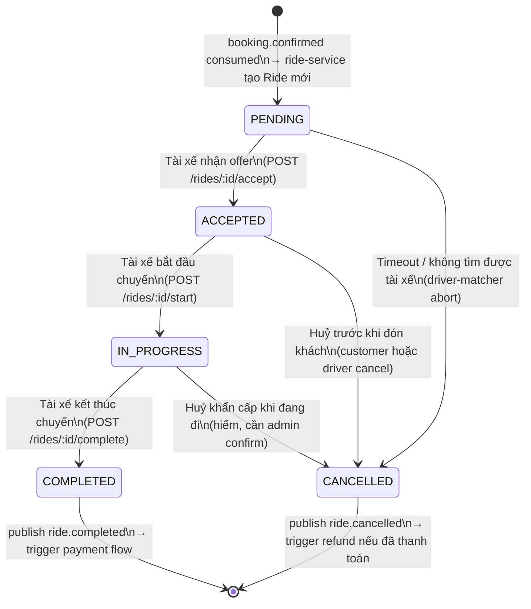

# State Machine: Ride Lifecycle

Mọi thay đổi trạng thái Ride phải đi qua `ride-state-machine.ts` — không cập nhật `Ride.status` trực tiếp.

## Các transition hợp lệ (VALID_TRANSITIONS)

| Từ trạng thái | Sang trạng thái | Điều kiện |
|---|---|---|
| PENDING | ACCEPTED | Driver accept offer |
| PENDING | CANCELLED | No driver / timeout |
| ACCEPTED | IN_PROGRESS | Driver starts trip |
| ACCEPTED | CANCELLED | Cancel before pickup |
| IN_PROGRESS | COMPLETED | Driver ends route |
| IN_PROGRESS | CANCELLED | Emergency cancel |
