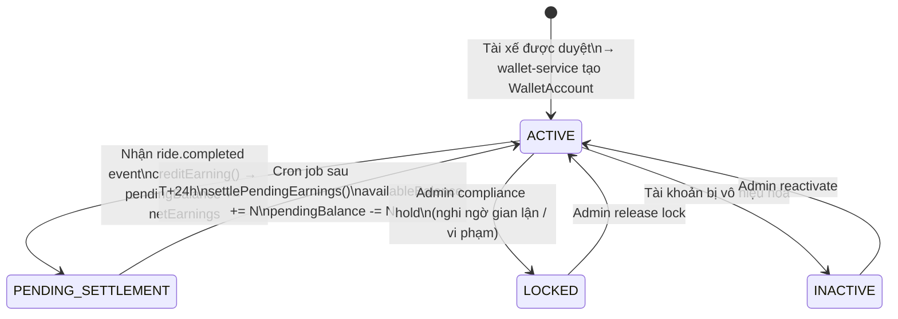
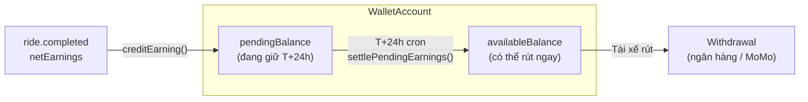

# State Machine: Driver Wallet (T+24h Settlement)

Ví tài xế áp dụng mô hình fintech T+24h: thu nhập vào `pendingBalance` trước, sau 24h mới chuyển sang `availableBalance`.

## Cấu trúc số dư ví

## Luồng tiền hoa hồng

| Loại xe | commissionRate | Ví dụ fare 100k |
|---------|---------------|-----------------|
| MOTORBIKE / SCOOTER | 20% | platformFee = 20k, netEarnings = 80k |
| CAR_4 | 18% | platformFee = 18k, netEarnings = 82k |
| CAR_7 | 15% | platformFee = 15k, netEarnings = 85k |
