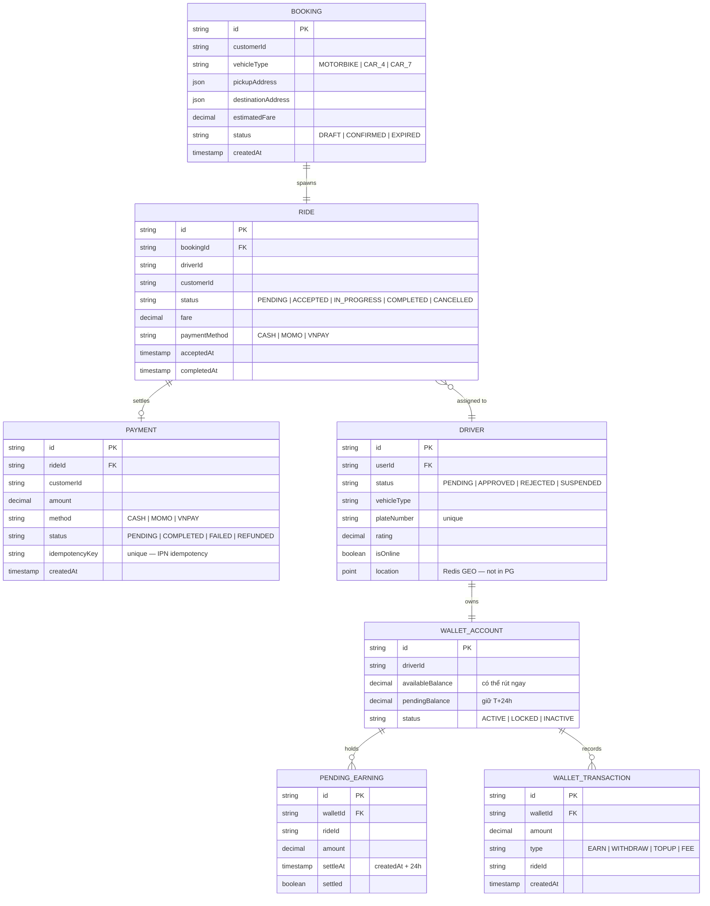

# ERD: Core Bounded Contexts

Quan hệ giữa các aggregate root chính — mỗi service sở hữu dữ liệu riêng, không chia sẻ database.

> **Lưu ý kiến trúc**: Mỗi service có Prisma client riêng trong `src/generated/prisma-client/`. Các bảng trên thuộc các database khác nhau và chỉ liên kết qua ID — không có foreign key cross-database.
