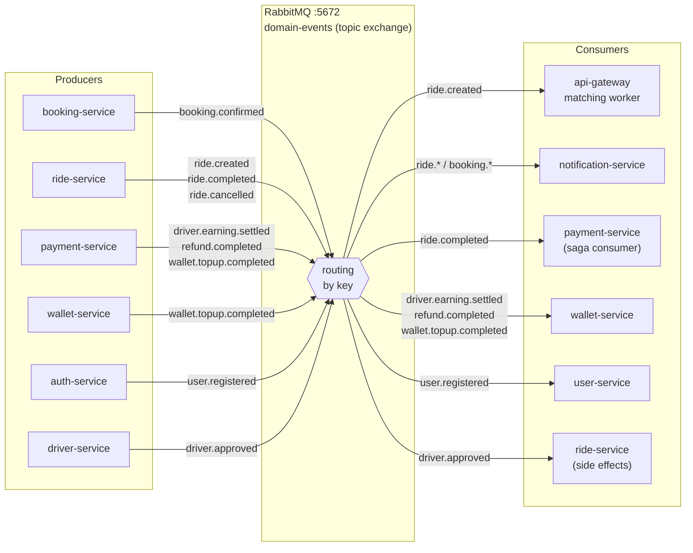

# RabbitMQ Event Bus — Producers & Consumers

Topic exchange `domain-events` — async communication giữa các service.

## Bảng routing key chính

| Event | Producer | Consumers | Tác dụng |
|-------|----------|-----------|----------|
| `booking.confirmed` | booking | api-gateway, ride | Kích hoạt tạo Ride + matching |
| `ride.created` | ride | api-gateway | Bắt đầu vòng ghép xe |
| `ride.completed` | ride | payment | Tính phí, tạo thanh toán |
| `driver.earning.settled` | payment | wallet | Credit thu nhập tài xế |
| `refund.completed` | payment | wallet | Hoàn tiền vào ví |
| `wallet.topup.completed` | wallet/payment | wallet | Xác nhận nạp tiền |
| `user.registered` | auth | user | Tạo profile người dùng |
| `driver.approved` | driver | ride, notification | Kích hoạt driver profile |
