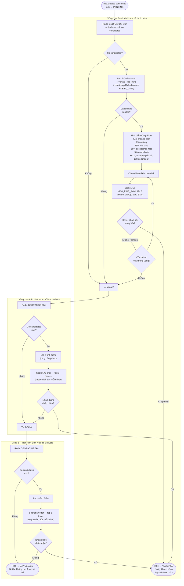

# Driver Dispatch Algorithm — Multi-Radius Matching

Thuật toán ghép xe 3 vòng bán kính mở rộng, với tính điểm đa tiêu chí.



## Công thức tính điểm

```
score = (1 - distRatio) × 0.40
      + rating / 5.0    × 0.25
      + idleRatio        × 0.15
      + acceptanceRate   × 0.15
      - cancelRate       × 0.05
      + AI_adjustment    (nếu MATCHING_AI_ADJUSTMENT_ENABLED=true)
```

> **Wallet Gate**: Trước khi offer, driver-service gọi payment-service `canAcceptRide` — từ chối tài xế có nợ quá `DEBT_LIMIT`.
