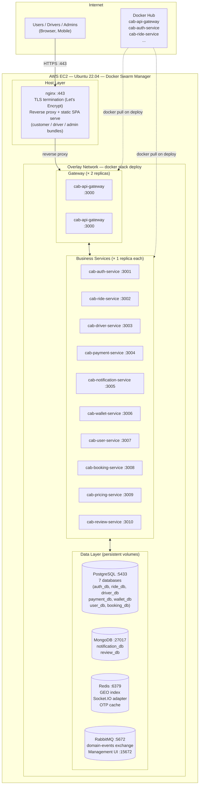

# Deployment Topology — Docker Swarm trên EC2

## DNS & Subdomain (foxgo.io.vn)

| Subdomain | Trỏ tới | Mục đích |
|-----------|---------|----------|
| `api.foxgo.io.vn` | EC2 IP :443 | REST API + Socket.IO |
| `foxgo.io.vn` | EC2 IP :443 | Customer SPA |
| `driver.foxgo.io.vn` | EC2 IP :443 | Driver SPA |
| `admin.foxgo.io.vn` | EC2 IP :443 | Admin Dashboard |
