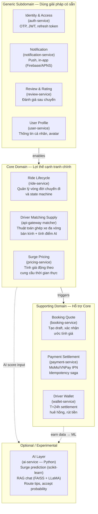

# DDD — Phân loại Subdomain & Bounded Context

## Mapping Service → Domain Type

| Service | Domain Type | Justification |
|---------|-------------|---------------|
| ride-service | **Core** | State machine chuyến đi là business logic độc quyền |
| api-gateway (matcher) | **Core** | Thuật toán ghép xe là differentiator chính |
| pricing-service | **Core** | Surge pricing tạo doanh thu |
| booking-service | **Supporting** | Orchestrate quote + confirm |
| payment-service | **Supporting** | Payment gateway integration |
| wallet-service | **Supporting** | Commission + settlement fintech |
| auth-service | **Generic** | OTP auth — có thể dùng service có sẵn |
| notification-service | **Generic** | Push notification — Firebase SDK |
| review-service | **Generic** | Rating — standard CRUD |
| user-service | **Generic** | Profile management |
| ai-service | **Experimental** | Optional, 150ms timeout + fallback |
