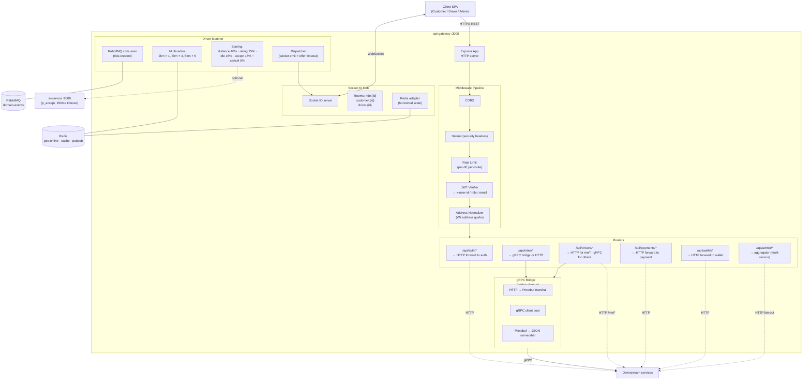

# API Gateway — Internal Components

Cấu trúc bên trong `api-gateway:3000` — single public entry point của hệ thống.

```mermaid
graph TB
    CLIENT["Client SPA<br/>(Customer / Driver / Admin)"]

    subgraph GW["api-gateway :3000"]
        direction TB

        EXPRESS["Express App<br/>HTTP server"]

        subgraph MID["Middleware Pipeline"]
            CORS["CORS"]
            HELMET["Helmet (security headers)"]
            RATELIMIT["Rate Limit<br/>(per-IP, per-route)"]
            JWT["JWT Verifier<br/>→ x-user-id / role / email"]
            ADDR["Address Normalizer<br/>(VN address quirks)"]
        end

        subgraph ROUTERS["Routers"]
            AUTH_R["/api/auth/*<br/>→ HTTP forward to auth"]
            RIDE_R["/api/rides/*<br/>→ gRPC bridge or HTTP"]
            DRIVER_R["/api/drivers/*<br/>→ HTTP for me/* · gRPC for others"]
            PAY_R["/api/payments/*<br/>→ HTTP forward to payment"]
            WAL_R["/api/wallet/*<br/>→ HTTP forward to wallet"]
            ADMIN_R["/api/admin/*<br/>→ aggregator (multi-service)"]
        end

        subgraph BRIDGE["gRPC Bridge<br/>(bridge.client.ts)"]
            BR1["HTTP → Protobuf marshal"]
            BR2["gRPC client pool"]
            BR3["Protobuf → JSON unmarshal"]
        end

        subgraph SOCKET["Socket.IO Hub"]
            IO["Socket.IO server"]
            ROOM["Rooms: ride:{id}<br/>customer:{id}<br/>driver:{id}"]
            ADAPTER["Redis adapter<br/>(horizontal scale)"]
        end

        subgraph MATCH["Driver Matcher"]
            CONS["RabbitMQ consumer<br/>(ride.created)"]
            ALGO["Multi-radius<br/>2km × 1, 3km × 3, 5km × 5"]
            SCORE["Scoring:<br/>distance 40% · rating 25% ·<br/>idle 15% · accept 15% − cancel 5%"]
            DISP["Dispatcher<br/>(socket emit + offer timeout)"]
        end
    end

    REDIS[("Redis<br/>geo:online · cache · pubsub")]
    MQ[("RabbitMQ<br/>domain-events")]
    DOWN["Downstream services"]
    AI["ai-service :8000<br/>(p_accept, 150ms timeout)"]

    CLIENT -->|HTTPS REST| EXPRESS
    CLIENT <-->|WebSocket| IO

    EXPRESS --> CORS --> HELMET --> RATELIMIT --> JWT --> ADDR
    ADDR --> ROUTERS

    AUTH_R -.->|HTTP| DOWN
    RIDE_R --> BRIDGE
    DRIVER_R --> BRIDGE
    DRIVER_R -.->|HTTP /me/*| DOWN
    PAY_R -.->|HTTP| DOWN
    WAL_R -.->|HTTP| DOWN
    ADMIN_R -.->|HTTP fan-out| DOWN

    BRIDGE -->|gRPC| DOWN

    ADAPTER --- REDIS
    CONS --- MQ
    ALGO --- REDIS
    SCORE -.->|optional| AI
    DISP --> IO
```
