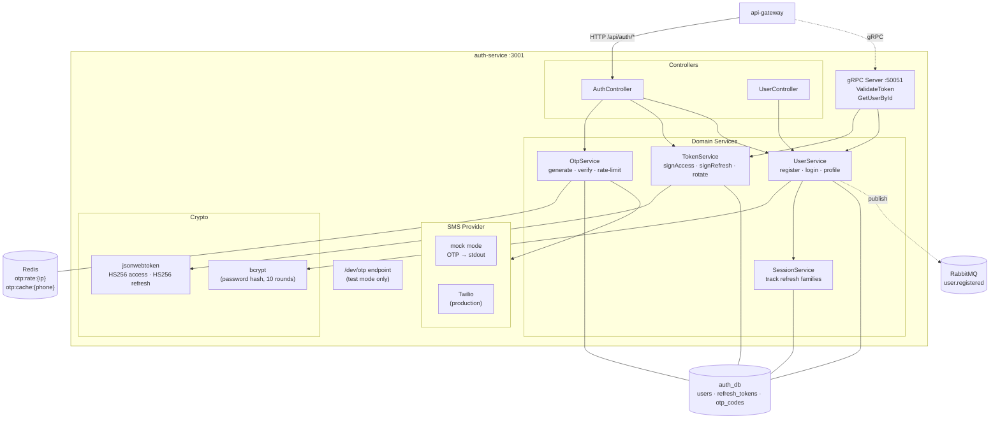

# Auth Service — Internal Architecture

Bên trong `auth-service:3001` — quản lý OTP, JWT, refresh token.

## Endpoints chính

| Endpoint | Mục đích |
|----------|---------|
| `POST /register-phone/start` | Sinh OTP + lưu Redis (rate-limited 10/60s/IP) |
| `POST /register-phone/verify` | Đối chiếu OTP, đánh dấu pre-registered |
| `POST /register-phone/complete` | Tạo user + bcrypt password + cấp tokens |
| `POST /login` | Verify password, cấp access (15m) + refresh (7d) |
| `POST /refresh` | Rotate refresh token (single-use family) |
| `gRPC ValidateToken` | Verify JWT cho service nội bộ |
