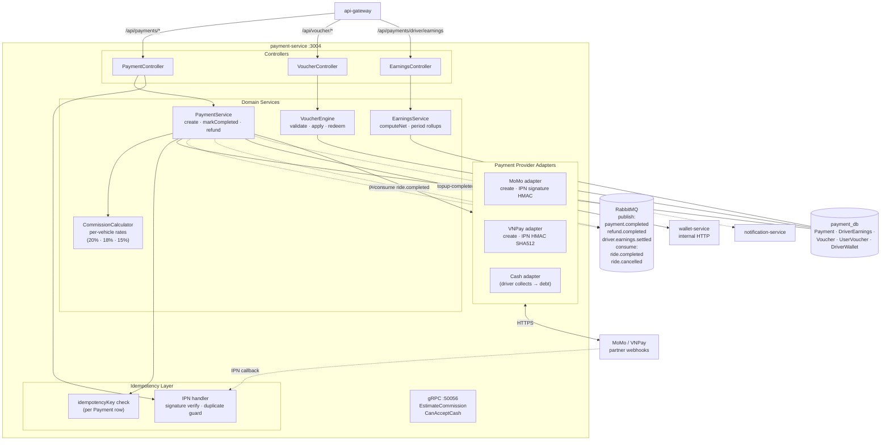

# Payment Service — Internal Architecture

Bên trong `payment-service:3004` — quản lý thanh toán MoMo / VNPay / cash, voucher engine, idempotency.

## Cơ chế quan trọng

- **Idempotency**: Mỗi `Payment` có `idempotencyKey`. IPN từ MoMo/VNPay có thể gọi N lần — handler check key trước khi xử lý.
- **Voucher 2 lớp**: `Voucher` (master catalog) + `UserVoucher` (đã thu thập); `usedCount` tăng atomically khi apply.
- **Commission per vehicle type**: MOTORBIKE/SCOOTER 20%, CAR_4 18%, CAR_7 15%.
- **Cash debt**: Cash ride không phát sinh PAYMENT giữa khách và platform; chỉ debit hoa hồng khỏi ví tài xế.
