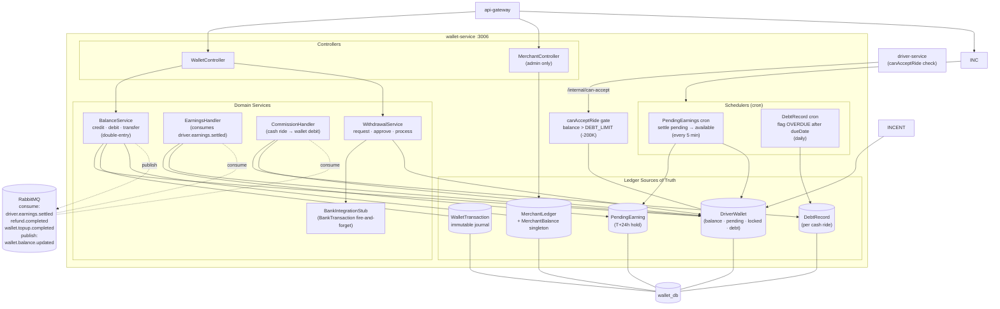

# Wallet Service — Internal Architecture

Bên trong `wallet-service:3006` — source of truth cho ví tài xế (driver-facing balance), MerchantLedger và T+24h settlement.

## 4 nguồn tiền song song

| Bảng | Vai trò |
|------|---------|
| `DriverWallet.balance` | Số dư tổng (có thể âm khi nợ) |
| `DriverWallet.pendingBalance` | Thu nhập online hold T+24h, chưa khả dụng |
| `DriverWallet.lockedBalance` | Ký quỹ ban đầu (khoá đến khi dừng HĐ) |
| `DriverWallet.debt` | Tuyệt đối hoá phần balance < 0 |
| `WalletTransaction` | Ledger bất biến — mọi giao dịch ghi 1 dòng |
| `MerchantLedger` | Sổ cái platform: PAYMENT(IN), COMMISSION(IN), PAYOUT(OUT), VOUCHER(OUT)... |
| `MerchantBalance` (singleton) | Snapshot O(1) cho admin dashboard |
| `PendingEarning` | Mỗi online ride → 1 row, cron move sang available sau 24h |
| `DebtRecord` | Mỗi cash ride → 1 row debt, dueDate = +2 ngày |
