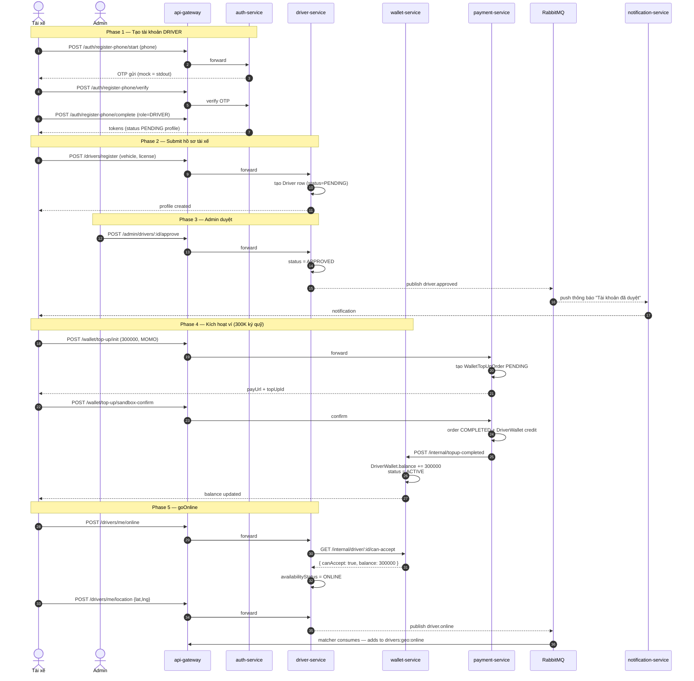

# Sequence — Driver Registration & Approval

Đăng ký tài xế từ OTP → submit hồ sơ xe/GPLX → admin duyệt → kích hoạt ví → goOnline.

```mermaid
sequenceDiagram
    autonumber
    actor U as Tài xế
    actor A as Admin
    participant GW as api-gateway
    participant Auth as auth-service
    participant Drv as driver-service
    participant Wal as wallet-service
    participant Pay as payment-service
    participant MQ as RabbitMQ
    participant Notif as notification-service

    Note over U,Auth: Phase 1 — Tạo tài khoản DRIVER
    U->>GW: POST /auth/register-phone/start (phone)
    GW->>Auth: forward
    Auth-->>U: OTP gửi (mock = stdout)
    U->>GW: POST /auth/register-phone/verify
    GW->>Auth: verify OTP
    U->>GW: POST /auth/register-phone/complete (role=DRIVER)
    Auth-->>U: tokens (status PENDING profile)

    Note over U,Drv: Phase 2 — Submit hồ sơ tài xế
    U->>GW: POST /drivers/register (vehicle, license)
    GW->>Drv: forward
    Drv->>Drv: tạo Driver row (status=PENDING)
    Drv-->>U: profile created

    Note over A,Drv: Phase 3 — Admin duyệt
    A->>GW: POST /admin/drivers/:id/approve
    GW->>Drv: forward
    Drv->>Drv: status = APPROVED
    Drv-->>MQ: publish driver.approved
    MQ-->>Notif: push thông báo "Tài khoản đã duyệt"
    Notif-->>U: notification

    Note over U,Wal: Phase 4 — Kích hoạt ví (300K ký quỹ)
    U->>GW: POST /wallet/top-up/init (300000, MOMO)
    GW->>Pay: forward
    Pay->>Pay: tạo WalletTopUpOrder PENDING
    Pay-->>U: payUrl + topUpId
    U->>GW: POST /wallet/top-up/sandbox-confirm
    GW->>Pay: confirm
    Pay->>Pay: order COMPLETED + DriverWallet credit
    Pay->>Wal: POST /internal/topup-completed
    Wal->>Wal: DriverWallet.balance += 300000<br/>status = ACTIVE
    Wal-->>U: balance updated

    Note over U,Drv: Phase 5 — goOnline
    U->>GW: POST /drivers/me/online
    GW->>Drv: forward
    Drv->>Wal: GET /internal/driver/:id/can-accept
    Wal-->>Drv: { canAccept: true, balance: 300000 }
    Drv->>Drv: availabilityStatus = ONLINE
    U->>GW: POST /drivers/me/location {lat,lng}
    GW->>Drv: forward
    Drv-->>MQ: publish driver.online
    MQ->>GW: matcher consumes — adds to drivers:geo:online
```
