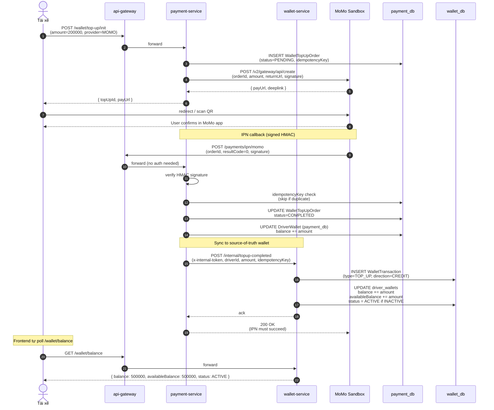

# Sequence — Wallet Top-up (MoMo Sandbox)

Tài xế nạp tiền vào ví: init → MoMo sandbox → IPN callback → wallet credit (kép trên 2 DB).

## Lưu ý kỹ thuật

- **Idempotency**: IPN MoMo có thể fire lại nhiều lần — check `idempotencyKey` trên Payment row để skip duplicate.
- **2-DB sync**: payment_db.DriverWallet là internal tracker, wallet_db.driver_wallets mới là source of truth cho driver balance UI.
- **Sandbox confirm**: Trong dev, có thêm endpoint `POST /wallet/top-up/sandbox-confirm` để skip MoMo redirect.
- **Initial activation**: Lần top-up đầu tiên ≥ 300K → status INACTIVE → ACTIVE → driver có thể goOnline.
