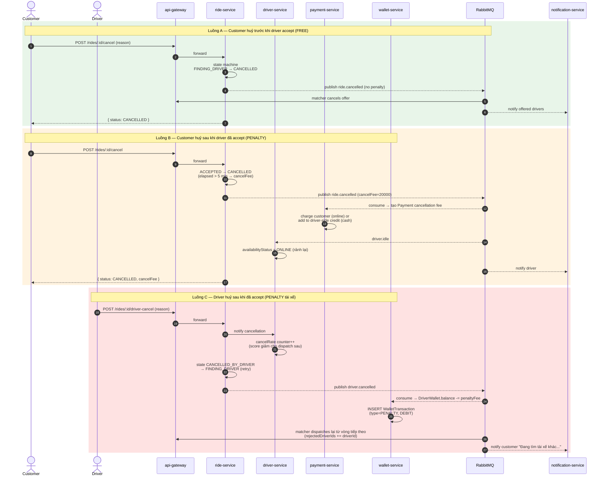

# Sequence — Cancel Ride (Customer / Driver)

Hai luồng huỷ chuyến: khách huỷ trước khi tài xế nhận (free) hoặc sau khi nhận (penalty); tài xế huỷ (penalty + acceptance rate giảm).

## Quy tắc penalty

| Tình huống | Cancel fee | Acceptance/Cancel rate impact |
|-----------|-----------|------------------------------|
| Customer huỷ trước driver accept | 0 đ | Không |
| Customer huỷ ≤ 5 phút sau accept | 0 đ | Không |
| Customer huỷ > 5 phút sau accept | 20.000 đ | Không |
| Driver huỷ sau accept | Penalty 30.000 đ | cancelRate ↑ → score ↓ |
| Driver từ chối popup | 0 đ | acceptRate ↓ → score ↓ |
