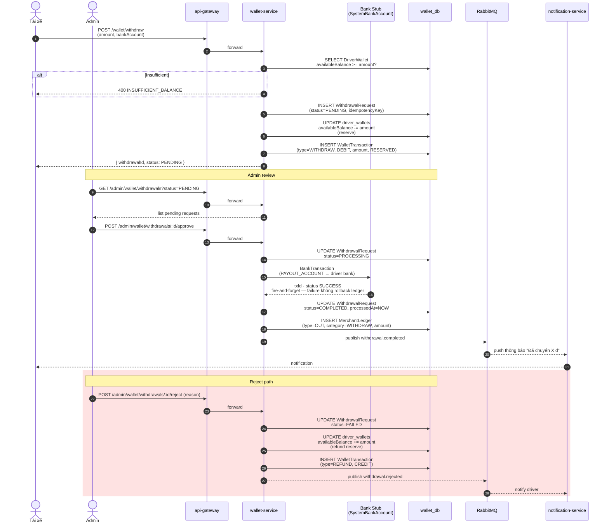

# Sequence — Driver Withdrawal

Tài xế rút tiền từ ví: request → admin approve → BankTransaction → `WalletTransaction(WITHDRAW)`.

## Lưu ý

- **Reserve trước khi approve**: `availableBalance` giảm ngay khi request, tránh double-spend nếu driver liên tục request.
- **Bank fire-and-forget**: `BankTransaction` lỗi không rollback ledger — `BANK_SIMULATION_ENABLED=true` cho dev/thesis.
- **Idempotency**: `WithdrawalRequest.idempotencyKey` unique → admin click approve 2 lần không double-pay.
