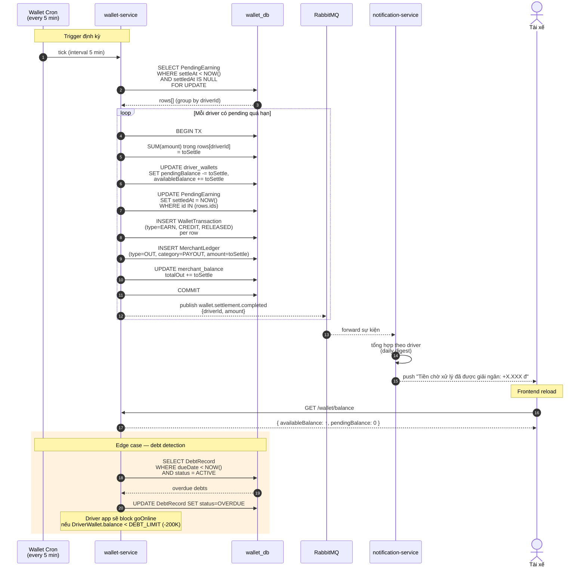

# Sequence — T+24h Settlement (Cron)

Cron trong wallet-service quét `PendingEarning` quá `settleAt` → move sang `availableBalance`. Anti-fraud: tài xế phải hoàn thành 24h mới rút được tiền online ride.



## Logic chi tiết

| Trạng thái | Ý nghĩa | Action |
|----------|--------|--------|
| `PendingEarning.settledAt = NULL` | Chưa giải ngân | Cron đang check |
| `settleAt > NOW()` | Trong window 24h | Skip |
| `settleAt < NOW()`, `settledAt = NULL` | Quá hạn, chưa settle | Settle ngay |
| `settledAt != NULL` | Đã settle | Skip |

## Tăng tốc demo

```bash
# Force settle tất cả pending (giả lập 25h trôi qua)
docker exec cab-postgres psql -U postgres -d wallet_db \
  -c "UPDATE pending_earnings SET \"settleAt\" = NOW() - INTERVAL '25 hours' WHERE \"settledAt\" IS NULL;"
# Cron sẽ pick up trong vòng 5 phút, hoặc gọi trigger manually qua admin endpoint.
```
