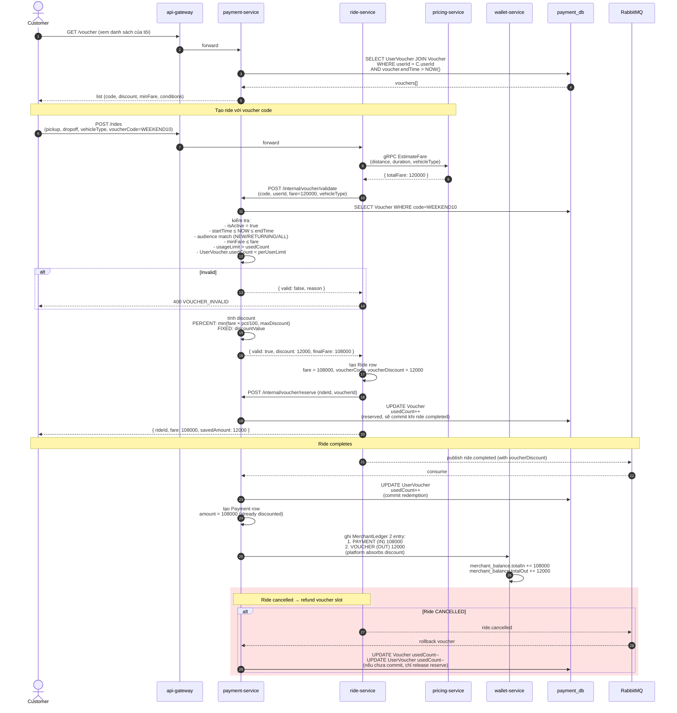

# Sequence — Voucher Redemption

Customer áp voucher khi đặt xe → hệ thống validate audience/usage limit → trừ giá vào fare → khi ride completed, ghi nhận `MerchantLedger VOUCHER (CHI)` đối với platform.

## Voucher seed có sẵn (5 mã)

| Code | Audience | Discount | Min fare |
|------|----------|----------|---------|
| `WELCOME20` | NEW | 20% (max 50K) | 0 |
| `FLAT30K` | ALL | flat 30.000đ | 80.000 |
| `NEWUSER50` | NEW | 50% (max 100K) | 0 |
| `WEEKEND10` | ALL | 10% (max 30K) | 0 |
| `OLDUSER15` | RETURNING | 15% (max 40K) | 50.000 |
