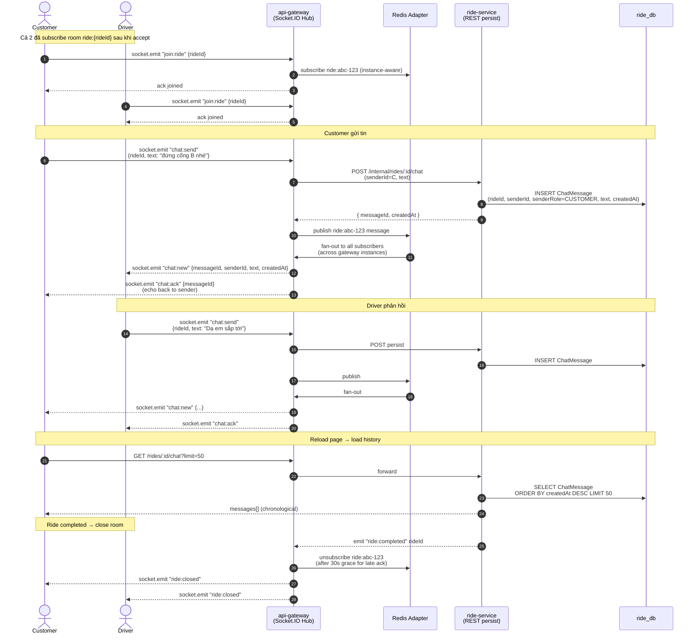

# Sequence — In-Ride Chat (Socket.IO Realtime)

Khách & tài xế nhắn tin trong chuyến đang chạy. Sử dụng Socket.IO room `ride:{rideId}`, persist tin nhắn vào ride-service, delivery ack.

## Đặc điểm

- **Room model**: `ride:{rideId}` chứa cả 2 phía. Server tạo room khi `ride.accepted`, xoá sau `ride.completed`.
- **Redis adapter**: Cho phép horizontal scale gateway — message từ instance A vẫn fan-out sang client connect instance B.
- **Persist**: REST POST sang ride-service trước khi emit, đảm bảo message không mất khi reload.
- **Rate limit**: Per-socket 1 msg/500ms, max 200 msg/ride (anti-spam).
- **Ordering**: `createdAt` server-side timestamp; client sort khi load history.
