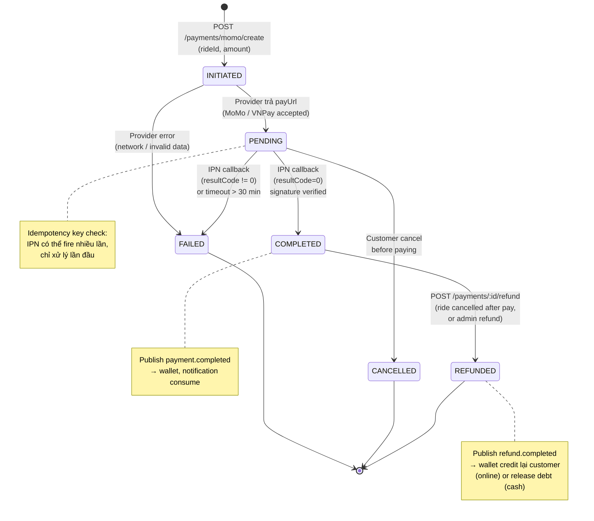

# State Machine — Payment Lifecycle

Vòng đời `Payment` row trong `payment_db`. Idempotency đảm bảo IPN gọi N lần chỉ chuyển state 1 lần.

## Mapping với phương thức thanh toán

| Method | INITIATED | PENDING | COMPLETED | Note |
|--------|-----------|---------|-----------|------|
| **CASH** | (skip) | (skip) | Tự động khi ride.completed | Không có Payment row đến platform; chỉ ghi DriverEarnings + cash debt |
| **MOMO** | `/momo/create` | Đợi user redirect + IPN | IPN resultCode=0 | Có row Payment |
| **VNPAY** | `/vnpay/create` | Đợi user redirect + IPN | IPN responseCode=00 | Có row Payment |
| **WALLET** | (atomic) | (skip) | Trừ balance ngay | Đồng bộ trong 1 transaction |

## Edge cases

- **Double IPN**: `idempotencyKey` unique → INSERT conflict → skip xử lý.
- **IPN trễ**: PENDING quá 30 phút → cron auto-mark FAILED, customer được hoàn tiền nếu đã trừ.
- **Race với cancel**: Customer cancel trong PENDING → state CANCELLED; nếu IPN sau đó tới → idempotency block transition.
