# State Machine — Driver Availability

Vòng đời `availabilityStatus` của Driver — quyết định khi nào driver được dispatch.

```mermaid
stateDiagram-v2
    [*] --> OFFLINE : Driver login<br/>(default)

    OFFLINE --> ONLINE : POST /drivers/me/online<br/>+ wallet check<br/>(balance > DEBT_LIMIT)
    OFFLINE --> OFFLINE : Re-login<br/>(stay OFFLINE)

    ONLINE --> OFFLINE : POST /drivers/me/offline<br/>(thủ công)
    ONLINE --> OFFLINE : Socket disconnect<br/>+ no-heartbeat 30s
    ONLINE --> BUSY : Driver accepts ride<br/>(currentRideId set)

    BUSY --> ONLINE : Ride completed/cancelled<br/>(currentRideId cleared)
    BUSY --> OFFLINE : Socket disconnect<br/>(rare; ride bị reassign)

    ONLINE --> OFFLINE : Wallet drops below DEBT_LIMIT<br/>(force offline)

    note right of OFFLINE
        Không nhận popup dispatch.
        Không có trong drivers:geo:online.
    end note

    note right of ONLINE
        Trong Redis geo set,
        nhận popup dispatch theo round.
        Heartbeat /location mỗi 5s.
    end note

    note right of BUSY
        Có currentRideId.
        Loại khỏi geo set tạm thời
        cho đến khi ride done.
    end note
```



## Side effects per transition

| Transition | Side effects |
|----------|-------------|
| `OFFLINE → ONLINE` | Add vào `drivers:geo:online` Redis set; publish `driver.online` event |
| `ONLINE → OFFLINE` | Remove khỏi geo set; publish `driver.offline` |
| `ONLINE → BUSY` | Set `currentRideId`; remove khỏi geo set (không dispatch nữa) |
| `BUSY → ONLINE` | Clear `currentRideId`; re-add vào geo set với location mới nhất |
| `Wallet trigger force OFFLINE` | wallet-service publish `wallet.balance.low` → driver-service consume → set OFFLINE + push notification |

## Wallet gate

Trước khi cho `OFFLINE → ONLINE`, driver-service gọi:

```
GET /internal/driver/{userId}/can-accept
→ wallet-service trả { canAccept, balance, reason }
```

Nếu `canAccept = false` (balance ≤ DEBT_LIMIT = -200K, debt overdue, hoặc wallet INACTIVE) → goOnline bị reject với `WALLET_BLOCKED`.
