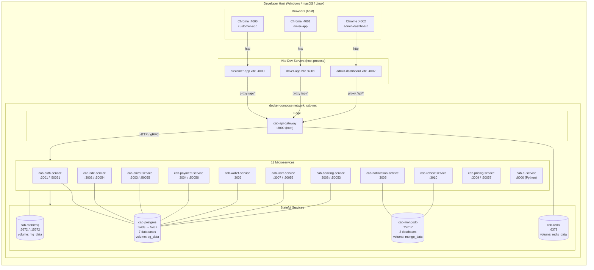

# Deployment — Docker Compose (Dev Environment)

Topology dev local — tất cả service chạy trên 1 máy qua `docker-compose.yml`.



## File / config quan trọng

| File | Vai trò |
|------|---------|
| `docker-compose.yml` | Định nghĩa 15 service (11 backend + 4 stateful) |
| `scripts/init-db.sql` | Bootstrap 7 PG database lần đầu start |
| `env/*.env` | Biến môi trường per-service |
| `Dockerfile.root.*` | Multi-stage build dùng workspace root (cần `shared/`) |
| `services/*/Dockerfile` | Dockerfile riêng cho service local-context |

## Lệnh thường dùng

```bash
npm run docker:up                  # bring up toàn bộ stack
docker compose ps                  # check status
docker compose logs -f cab-api-gateway --tail 100
docker compose restart wallet-service  # rebuild after schema change
docker compose down -v             # NUKE everything (volumes too)
```

## Khác biệt với production (Swarm)

| Aspect | Dev (Compose) | Prod (Swarm) |
|--------|---------------|--------------|
| Replicas | 1 per service | N per service (load-balanced) |
| Network | bridge `cab-net` | overlay `swarm-net` (mTLS) |
| Frontend | Vite dev server (host) | Built static + nginx container |
| Reset DB | `compose down -v` | manual SQL drop (xem PHASE 15 trong SWARM-SETUP.md) |
| Logs | `docker compose logs` | `docker service logs` |
