# Deployment — Build Pipeline & Release Flow

Quy trình từ code commit → build image → deploy lên Swarm. Chưa wire GitHub Actions thực tế (manual orchestration), nhưng cấu trúc dưới đây phản ánh các bước thực thi.

```mermaid
flowchart LR
    DEV["Developer<br/>local commit"]

    subgraph CI["CI (manual / GitHub Actions sau này)"]
        direction TB
        LINT["npm run lint"]
        TEST["npm run test:unit<br/>npm run test:contract"]
        BUILD["npm run build:shared<br/>npm run build (services)"]
        IMG["docker build<br/>multi-stage<br/>node:18-alpine"]
        TAG["tag :git-sha + :latest"]
        PUSH["docker push<br/>registry.cab.local"]
    end

    REG["Docker Registry<br/>(GHCR / private)"]

    subgraph CD["CD (Swarm Manager)"]
        direction TB
        PULL["docker service update<br/>--image registry/svc:sha"]
        ROLL["Rolling update<br/>parallelism: 1<br/>delay: 10s"]
        HC["healthcheck endpoint<br/>/health 200 OK"]
        FAIL{"health<br/>OK?"}
        ROLLBACK["docker service rollback"]
    end

    subgraph PROD["Production Swarm (EC2)"]
        S1["api-gateway × 2"]
        S2["auth × 2"]
        S3["ride / driver / pay × 2"]
        S4["other × 1"]
        DB[("PG / Mongo / Redis / MQ<br/>(constraint: manager node)")]
    end

    DEV -->|push to main| LINT
    LINT --> TEST
    TEST --> BUILD
    BUILD --> IMG
    IMG --> TAG
    TAG --> PUSH
    PUSH --> REG
    REG --> PULL
    PULL --> ROLL
    ROLL --> HC
    HC --> FAIL
    FAIL -->|yes| PROD
    FAIL -->|no| ROLLBACK
    ROLLBACK --> PROD

    style FAIL fill:#fff3e0
    style ROLLBACK fill:#fee2e2
```



## Các bước thực thi hiện tại

| Bước | Tự động? | Reference |
|------|----------|----------|
| Lint / unit test | ❌ thủ công | `npm run lint`, `npm run test:unit` |
| Build shared package | ❌ | `npm run build:shared` |
| Build images | ❌ | Có `services/*/Dockerfile` + `Dockerfile.root.*` |
| Push to registry | ❌ | Cần private registry trên EC2 hoặc GHCR |
| Rolling deploy | ✅ via Swarm | `deploy/SWARM-SETUP.md` PHASE 12 |
| Health check | ✅ Docker | `HEALTHCHECK` trong từng Dockerfile |
| Rollback | ✅ via Swarm | `docker service rollback <name>` |

## Kế hoạch CI/CD (đề xuất)

```yaml
# .github/workflows/deploy.yml (proposed)
on: { push: { branches: [main] } }
jobs:
  build:
    steps:
      - uses: actions/checkout@v4
      - run: npm ci && npm run lint && npm run test:unit
      - run: npm run build:shared && npm run build
      - run: docker build -f Dockerfile.root.api-gateway -t ghcr.io/.../gateway:${{ github.sha }} .
      - run: docker push ghcr.io/.../gateway:${{ github.sha }}
  deploy:
    needs: build
    steps:
      - run: ssh swarm-manager "docker service update --image ghcr.io/.../gateway:${{ github.sha }} cab_api-gateway"
```

→ **Trạng thái thực tế hiện tại**: Manual deploy bằng tay theo doc `deploy/SWARM-SETUP.md`. CI/CD nêu trên là roadmap.
