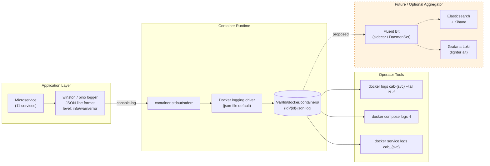

# Monitoring — Logs Flow

Pipeline thu log: app code → stdout → Docker daemon → tooling (tail / aggregator). Hiện tại không có ELK, dùng `docker logs` trực tiếp + structured JSON line.



## Patterns đang dùng

| Need | Command |
|------|---------|
| Lấy OTP dev | `docker logs cab-auth-service 2>&1 \| grep OTP \| tail -1` |
| Theo dõi gateway realtime | `docker logs cab-api-gateway --tail 50 -f` |
| Tìm error 500 hôm nay | `docker logs cab-payment-service --since 24h \| grep -i error` |
| Driver matching trace | `docker logs cab-api-gateway \| grep DISPATCH` |
| Full stack tail (compose) | `docker compose logs -f --tail=20` |

## Log levels & cấu trúc

```json
{
  "timestamp": "2026-05-10T12:34:56.789Z",
  "level": "info",
  "service": "ride-service",
  "event": "ride.transition",
  "rideId": "abc-123",
  "from": "FINDING_DRIVER",
  "to": "ASSIGNED",
  "driverId": "drv-789",
  "elapsedMs": 4521
}
```

- **Levels**: `error` (cần alert) · `warn` (degraded) · `info` (business event) · `debug` (dev-only, OFF in prod)
- **Correlation**: `requestId` được injected từ gateway, propagate qua tất cả service via header `x-request-id`
- **Sensitive data**: passwords, OTP, tokens **không bao giờ log** (LoggerService có sanitizer)

## Limitations hiện tại

- Không có centralized search → tìm event cross-service phải `grep` qua nhiều container
- Không có retention policy → Docker `json-file` mặc định không rotate; cần `--log-opt max-size=10m max-file=5`
- Không có alerting → cần Fluent Bit + Loki + Grafana Alert (đề xuất)
