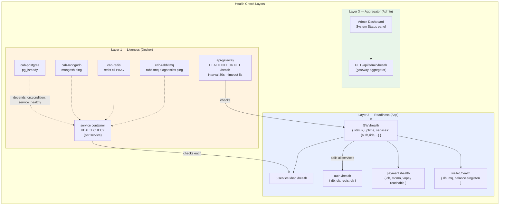

# Monitoring — Health Check Map

Mỗi service expose `GET /health` (HTTP) hoặc gRPC `Check`; Docker dùng để decide healthy/unhealthy; gateway aggregate cho admin dashboard.



## Health endpoint contract

```typescript
// Mỗi service cài đặt:
GET /health
→ 200 OK
{
  "status": "healthy" | "degraded" | "unhealthy",
  "service": "wallet-service",
  "version": "1.0.0",
  "uptime_sec": 12345,
  "checks": {
    "database": { "status": "ok", "latency_ms": 3 },
    "rabbitmq": { "status": "ok" },
    "merchant_balance_singleton": { "status": "ok", "id": 1 }
  }
}
→ 503 Service Unavailable (nếu critical dependency fail)
```

## Docker compose healthcheck

```yaml
# Ví dụ trong docker-compose.yml
api-gateway:
  healthcheck:
    test: ["CMD", "curl", "-fsS", "http://localhost:3000/health"]
    interval: 30s
    timeout: 5s
    retries: 3
    start_period: 20s
  depends_on:
    cab-postgres:
      condition: service_healthy
    cab-redis:
      condition: service_healthy
    cab-rabbitmq:
      condition: service_healthy
```

## Service dependencies (start order)

| Layer | Services | Depends on |
|-------|---------|-----------|
| L0 (Infra) | postgres, mongo, redis, rabbitmq | — |
| L1 (Core) | auth-service | postgres |
| L2 (Domain) | ride/driver/payment/wallet/booking/pricing/user | postgres + L1 |
| L3 (Engagement) | notification, review | mongo + rabbitmq |
| L4 (Edge) | api-gateway | L1+L2+L3 healthy |
| L5 (Optional) | ai-service | — (start last, optional) |

→ Compose chờ L0 healthy → start L1 → L2 ... → đảm bảo no race.
