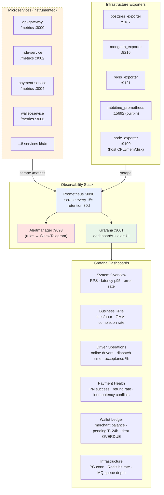

# Monitoring — Metrics Stack (Proposed)

Đề xuất Prometheus + Grafana stack cho production. **Trạng thái hiện tại**: chưa wire instrumentation đầy đủ; diagram dưới đây là target architecture.

## Metrics đề xuất per service

### api-gateway
- `gateway_http_requests_total{method,route,status}` (counter)
- `gateway_http_duration_seconds{route}` (histogram)
- `gateway_socket_connections{role}` (gauge)
- `gateway_dispatch_round_total{round,outcome}` (counter)
- `gateway_dispatch_duration_seconds` (histogram)

### ride-service
- `rides_total{status}` (counter — by transition)
- `ride_state_duration_seconds{from,to}` (histogram)
- `rides_active` (gauge)

### payment-service
- `payments_total{method,status}` (counter)
- `payment_ipn_total{provider,resultCode}` (counter)
- `payment_idempotency_conflicts_total` (counter)
- `voucher_redemptions_total{code}` (counter)

### wallet-service
- `wallet_balance_sum_vnd` (gauge — sum across drivers)
- `wallet_pending_earnings_sum_vnd` (gauge)
- `wallet_overdue_debts_count` (gauge)
- `wallet_settlement_runs_total` (counter)
- `merchant_balance_total_in/out_vnd` (gauge)

## Alert rules đề xuất

| Severity | Condition | Action |
|----------|-----------|--------|
| critical | `up{service=*} == 0` for 2m | page oncall |
| critical | `payment_ipn_total{resultCode!="0"}` rate > 5% | page oncall |
| warning | `gateway_http_duration_seconds{quantile="0.95"} > 2s` for 5m | Slack alert |
| warning | `wallet_overdue_debts_count > 50` | email manager |
| info | `rides_total{status="cancelled"} / rides_total > 0.25` for 30m | log only |

## Bước đầu để implement

1. Add `prom-client` (Node.js) hoặc `prometheus_client` (Python AI service) làm dependency
2. Inject middleware ghi `gateway_http_requests_total` & `_duration_seconds`
3. Expose `/metrics` endpoint (port giống service hoặc port riêng)
4. Tạo `prometheus.yml` với scrape config trỏ tới `cab-{svc}:port/metrics`
5. Spin Prometheus + Grafana container vào `docker-compose.observability.yml`
6. Import dashboards JSON (open-source templates: Node.js, PostgreSQL, RabbitMQ)

→ Đây là **roadmap**. Khi luận văn cần "monitoring section", trình bày diagram này như target architecture với note rõ ràng phần đã/chưa wire.
