# THIẾT KẾ VÀ XÂY DỰNG HỆ THỐNG ĐẶT XE TRỰC TUYẾN

## ABSTRACT

**DESIGN AND DEVELOPMENT OF AN ONLINE CAB BOOKING SYSTEM**

**Context and aim.** Applications for on-demand mobility rely on low-latency matching, reliable payments across distributed components, and explicit domain boundaries. This graduation thesis presents the analysis, architectural design, and implementation of an online cab booking system that emulates industry-grade flows at a scale appropriate for final-year assessment.

**Approach.** Requirements and business processes are structured using Domain-Driven Design (DDD): bounded contexts drive service decomposition. The implemented system adopts a microservice style on the Node.js/TypeScript stack (eleven services), a complementary Python/FastAPI component for optional analytics and retrieval-augmented user assistance, and three React single-page front ends. Persistent state is split per service (PostgreSQL and MongoDB); Redis supports geospatial driver search, caching, and Socket.IO scaling; RabbitMQ carries asynchronous domain events. Synchronous calls use HTTP and gRPC as needed through a single API Gateway responsible for security, routing, WebSockets, and dispatch logic.

**Scope of the report.** The document covers context mapping, core domain models (ride lifecycle with a validating state machine, driver, wallet, payment), integration patterns (transactional outbox, idempotent handling of MoMo and VNPay notifications), multi-round radius-based dispatch with weighted scoring, wallet policies (deposit, T+24h pending earnings, dated cash-ride obligations, FIFO settlement), and in-trip messaging with WebRTC signaling. Engineering practices for observability, continuous integration and delivery, and an illustrative Docker Swarm deployment on cloud infrastructure are also described.

**Findings.** Tests on the delivered software indicate that matching terminates within the designed search rounds under simulated load, repeated payment callbacks do not create duplicate monetary effects, and wallet rules respect the intended order between debt clearance and release to withdrawable funds.

**Keywords:** ride-hailing, Domain-Driven Design, microservices, geospatial dispatch, idempotent payment, driver wallet, WebRTC, Node.js, React, Docker

---

## TÓM TẮT

**THIẾT KẾ VÀ XÂY DỰNG HỆ THỐNG ĐẶT XE TRỰC TUYẾN**

**Bối cảnh và mục tiêu.** Ứng dụng đặt xe theo nhu cầu đặt ra yêu cầu ghép cặp đáp ứng nhanh, xử lý thanh toán tin cậy trên nhiều thành phần phân tán và ranh giới miền nghiệp vụ rõ ràng. Khóa luận trình bày quá trình phân tích, thiết kế kiến trúc và cài đặt một hệ thống đặt xe trực tuyến trên nền web, phục vụ mục đích đào tạo và đánh giá cuối khóa.

**Phương pháp.** Các yêu cầu và quy trình được hệ thống hóa theo Thiết kế hướng lĩnh vực (DDD): bounded context là cơ sở phân rã dịch vụ. Hệ thống hiện thực theo kiến trúc vi dịch vụ gồm mười một dịch vụ Node.js/TypeScript, một thành phần Python/FastAPI cho các chức năng dự đoán và hỗ trợ người dùng kiểu RAG (tùy cấu hình), cùng ba ứng dụng đơn trang React cho khách hàng, tài xế và quản trị. Dữ liệu được tách theo dịch vụ (PostgreSQL, MongoDB); Redis phục vụ truy vấn địa lý, bộ nhớ đệm và mở rộng Socket.IO; RabbitMQ vận chuyển sự kiện miền bất đồng bộ. Giao tiếp đồng bộ kết hợp HTTP và gRPC; một API Gateway thống nhất xử lý bảo mật, định tuyến, WebSocket và logic điều phối.

**Phạm vi nội dung báo cáo.** Văn bản trình bày đặc tả yêu cầu, bản đồ ngữ cảnh, mô hình miền cho các context trọng tâm (vòng đời chuyến đi với máy trạng thái, tài xế, ví, thanh toán), nguyên tắc mỗi dịch vụ sở hữu một cơ sở dữ liệu riêng, các mẫu tích hợp như transactional outbox và xử lý thông báo thanh toán bất biến đối với MoMo và VNPay, chính sách điều phối đa vòng theo bán kính và hàm điểm, cơ chế ví tài xế (ký quỹ, giữ thu nhập T+24h, công nợ chuyến tiền mặt có thời hạn, tất toán FIFO), cùng trao đổi trong chuyến và báo hiệu thoại WebRTC. Phần công nghệ vận hành gồm giám sát (Prometheus, Grafana), CI/CD và minh họa triển khai Docker Swarm trên hạ tầng đám mây.

**Kết quả đạt được.** Kiểm thử chức năng và tích hợp trên bản hiện thực cho thấy bước ghép cặp kết thúc trong số vòng tìm kiếm đã cấu hình trong điều kiện thử nghiệm, gọi lặp callback thanh toán không tạo hiệu ứng ghi có trùng, và quy tắc quyết toán ví tuân thức trừ nợ trước khi chuyển phần khả dụng để rút.

**Từ khóa:** đặt xe trực tuyến, thiết kế hướng lĩnh vực, kiến trúc vi dịch vụ, điều phối địa lý, thanh toán bất biến, ví tài xế, WebRTC, Node.js, React, Docker

---

## LỜI CẢM ƠN

Chúng em xin trân trọng cảm ơn **[Học hàm — Họ và tên Giảng viên hướng dẫn]**, người đã tận tình hướng dẫn chọn hướng đề tài, định hình phương pháp phân tích và thiết kế hệ thống theo hướng miền (DDD) cũng như kiến trúc vi dịch vụ; đồng thời thường xuyên góp ý chuyên môn, kiểm tra tiến độ và tạo điều kiện để chúng em hoàn thành khóa luận tốt nghiệp.

Xin cảm ơn quý **Thầy, Cô Khoa Công nghệ Thông tin**, **Trường Đại học Công nghiệp Thành phố Hồ Chí Minh**, đã trang bị kiến thức nền tảng và chuyên sâu trong suốt quá trình đào tạo, giúp chúng em đủ năng lực lý thuyết và thực hành để triển khai đồ án.

Chúng em kính ghi nhận sự quan tâm của **Ban Giám hiệu**, **Phòng Đào tạo** và các đơn vị liên quan đã tạo môi trường học tập, thí nghiệm và tra cứu tài liệu thuận lợi.

Xin được cảm ơn **gia đình** đã động viên về vật chất và tinh thần; **bạn bè và tập thể lớp** đã trao đổi, hỗ trợ trong học tập và hoàn thiện báo cáo.

Do thời gian và kinh nghiệm còn hạn chế, khóa luận không tránh khỏi thiếu sót. Chúng em kính mong nhận được ý kiến đóng góp của quý Thầy, Cô hội đồng và bạn đọc để đề tài được hoàn thiện hơn.

| | |
|---|---|
| **TP. Hồ Chí Minh,** | ngày … tháng … năm 2026 |
| **Sinh viên thực hiện** | *[Chữ ký]* |
| | **[Họ và tên]** |
| | MSSV: **[……]** |
| | *(Nếu nhóm 2 thành viên: lặp khối trên cho sinh viên thứ hai)* |

---

## DANH MỤC CÁC THUẬT NGỮ VIẾT TẮT

| Viết tắt | Đầy đủ | Nghĩa |
|---|---|---|
| DDD | Domain-Driven Design | Thiết kế hướng lĩnh vực |
| BC | Bounded Context | Ngữ cảnh giới hạn (trong DDD) |
| AR | Aggregate Root | Gốc tập hợp (trong DDD) |
| VO | Value Object | Đối tượng giá trị (trong DDD) |
| DE | Domain Event | Sự kiện miền |
| API | Application Programming Interface | Giao diện lập trình ứng dụng |
| SPA | Single Page Application | Ứng dụng đơn trang |
| JWT | JSON Web Token | Token xác thực |
| gRPC | Google Remote Procedure Call | Giao thức gọi hàm từ xa |
| ORM | Object-Relational Mapping | Ánh xạ đối tượng–CSDL |
| IPN | Instant Payment Notification | Thông báo thanh toán tức thời |
| GPS | Global Positioning System | Hệ thống định vị toàn cầu |
| WebRTC | Web Real-Time Communication | Giao tiếp thời gian thực web |
| CQRS | Command Query Responsibility Segregation | Phân tách lệnh–truy vấn |
| TTL | Time To Live | Thời gian tồn tại |
| FIFO | First In First Out | Vào trước ra trước |
| MSA | Microservices Architecture | Kiến trúc vi dịch vụ |
| SAD | System Architecture Design | Thiết kế kiến trúc hệ thống |
| CI/CD | Continuous Integration / Delivery | Tích hợp & triển khai liên tục |
| RAG | Retrieval-Augmented Generation | Sinh văn bản bổ trợ truy hồi (chatbot) |
| SLA | Service Level Agreement | Thỏa thuận mức dịch vụ |

---

## MỤC LỤC

| Phần | Nội dung chính |
|---|---|
| **Phần 1** | Đặt vấn đề (Problem and scope) |
| **Phần 2** | Thu thập yêu cầu và khảo sát nghiệp vụ (Requirement and survey) |
| **Phần 3** | Phân tích Domain-Driven Design cho hệ thống |
| **Phần 4** | Thiết kế kiến trúc hệ thống (System architecture design - SAD) |
| **Phần 5** | Các mẫu thiết kế phần mềm (Design Pattern) |
| **Phần 6** | Tối ưu kiến trúc giao dịch với thanh toán trực tuyến trong MSA |
| **Phần 7** | Ứng dụng AI (AI / AI agent pipeline) |
| **Phần 8** | Giám sát hệ thống (System monitor) |
| **Phần 9** | Bảo mật hệ thống và dữ liệu (Information Security, Data security) |
| **Phần 10** | Cài đặt và triển khai (CI/CD) |
| **Phần 11** | Tối ưu hóa hệ thống đáp ứng nhu cầu (System scalability) |
| **Phần 12** | Kết luận |
| **Tài liệu tham khảo / Phụ lục** | Tài liệu trích dẫn, API, cấu hình, hướng dẫn chạy |

---

# 1. ĐẶT VẤN ĐỀ (PROBLEM AND SCOPE)

## 1.1. Bối cảnh và lý do chọn đề tài

### 1.1.1. Thực trạng thị trường

Thị trường đặt xe công nghệ tại Việt Nam tăng trưởng mạnh trong giai đoạn 2018–2024. Sự phổ biến của điện thoại thông minh, 4G/5G và thanh toán số tạo điều kiện cho mô hình ride-hailing mở rộng nhanh, nhưng đồng thời đặt ra yêu cầu cao về thời gian thực, khả năng mở rộng và độ tin cậy của hệ thống.

Ở góc nhìn hệ thống thông tin, một nền tảng đặt xe không chỉ là ứng dụng gọi xe trên điện thoại mà là một hệ thống số nhiều tác nhân vận hành đồng thời. Trong cùng một thời điểm, khách hàng tạo yêu cầu đặt xe, tài xế cập nhật vị trí, cổng thanh toán gửi callback, quản trị viên theo dõi bảng điều khiển, còn hệ thống phải liên tục tính toán lại trạng thái thực tế. Điều đó khiến bài toán thiết kế không còn là CRUD đơn giản mà trở thành bài toán điều phối nghiệp vụ, dữ liệu và giao tiếp thời gian thực.

### 1.1.2. Thách thức kỹ thuật

Hệ thống đặt xe trực tuyến phải đồng thời giải quyết bốn nhóm thách thức:

- **Thời gian thực:** vị trí tài xế thay đổi liên tục, quá trình ghép cuốc phải kết thúc trong vài giây.
- **Nhất quán tài chính:** callback thanh toán có thể lặp, ví tài xế phải có lịch sử bất biến và dễ kiểm toán.
- **Phân rã nghiệp vụ:** xác thực, điều phối, thanh toán, ví, đánh giá và thông báo là các miền khác nhau, không nên dồn vào một khối CRUD.
- **Mở rộng vận hành:** mỗi thành phần cần có khả năng scale tương đối độc lập, trong khi vẫn giữ ranh giới trách nhiệm rõ ràng.

### 1.1.3. Lý do chọn DDD và microservices

Đề tài chọn DDD vì nghiệp vụ đặt xe không chỉ là tập hợp API mà là một tổ hợp quy tắc domain gồm ride lifecycle, dispatch, payment và wallet. DDD giúp xác định rõ ngôn ngữ chung, ranh giới mô hình và cách ánh xạ sang microservices. Kiến trúc vi dịch vụ được dùng để hiện thực hóa các bounded context này thành các service triển khai độc lập.

Trong phạm vi khóa luận, DDD không được sử dụng như một nhãn trang trí cho kiến trúc mà là trục chính để phân tích hệ thống. Cụ thể, mỗi quyết định về service ownership, database ownership, event ownership hay transaction boundary đều phải truy ngược về domain model. Nhờ đó, báo cáo có thể giải thích tại sao `Ride` phải được quản lý bởi ride-service, tại sao ví tài xế là một bounded context độc lập, và vì sao thanh toán phải đi theo mô hình event-driven thay vì transaction xuyên service.

## 1.2. Mục tiêu đề tài

| # | Mục tiêu | Cách đo lường |
|---|---|---|
| 1 | Phân tích hệ thống theo đúng tinh thần DDD | Có subdomain, bounded context, context map, domain model, aggregate boundary |
| 2 | Thiết kế kiến trúc vi dịch vụ rõ ràng | 11 service nghiệp vụ và 1 API Gateway tách biệt |
| 3 | Hiện thực ba ứng dụng frontend | Customer App, Driver App, Admin Dashboard hoạt động |
| 4 | Xử lý thanh toán MoMo/VNPay an toàn | IPN idempotent, không ghi nhận trùng |
| 5 | Xây dựng ví tài xế có quy tắc nghiệp vụ rõ | pendingBalance, lockedBalance, debt, FIFO settlement hoạt động đúng |
| 6 | Tối ưu ghép tài xế theo địa lý | Dispatch đa vòng, trọng số rõ ràng, thời gian trong ngưỡng thiết kế |
| 7 | Bổ sung năng lực AI nhưng không phụ thuộc AI | ETA/surge/RAG có fallback khi AI lỗi |

## 1.3. Phạm vi đề tài

**Trong phạm vi:**
- Đăng ký, đăng nhập, OTP và refresh token.
- Đặt xe, điều phối tài xế, theo dõi chuyến và hoàn thành chuyến.
- Thanh toán tiền mặt, MoMo, VNPay và hoàn tiền.
- Ví tài xế: ký quỹ, công nợ, thu nhập chờ xử lý, rút tiền.
- Chat, gọi thoại và thông báo trong chuyến.
- Dashboard quản trị và giám sát nghiệp vụ.
- AI hỗ trợ surge pricing, accept probability và RAG chatbot.
- Docker Compose, Docker Swarm demo và CI/CD trên GitHub Actions.

**Ngoài phạm vi:**
- Ứng dụng native iOS/Android.
- Hệ thống khuyến mãi phức tạp ngoài voucher cơ bản.
- Hạ tầng production-grade đa vùng với SLA thương mại đầy đủ.
- Dữ liệu AI thực tế quy mô lớn và huấn luyện liên tục online.

## 1.4. Phương pháp thực hiện

1. Nghiên cứu tài liệu về DDD, microservices, distributed systems và payment integration.
2. Khảo sát các quy trình nghiệp vụ cốt lõi của một nền tảng đặt xe.
3. Dùng DDD để phân rã domain, xác định bounded context và service ownership.
4. Hiện thực theo monorepo với Node.js/TypeScript cho backend, React cho frontend, FastAPI cho AI.
5. Kiểm thử unit, integration và kiểm tra các luồng phân tán quan trọng.

Phương pháp trên được triển khai theo chuỗi lặp. Trước hết, nhóm tác giả xác định bài toán nghiệp vụ và ranh giới phân tích. Tiếp theo, các luồng đặt xe, dispatch, thanh toán và ví được mô tả dưới góc nhìn nghiệp vụ trước khi chuyển sang mô hình DDD. Sau khi kiến trúc và các bounded context được chốt, từng service mới được hiện thực hóa, kiểm thử và đối chiếu ngược lại với yêu cầu ban đầu. Cách làm này giúp giảm rủi ro “thiết kế xong mới phát hiện sai domain” và giữ sự nhất quán giữa báo cáo với codebase thực tế.

## 1.5. Luồng nghiệp vụ tổng thể

1. **Định danh:** người dùng đăng ký hoặc đăng nhập qua auth-service; API Gateway xác thực JWT và gắn header nội bộ.
2. **Tiền chuyến:** booking-service lưu snapshot đặt xe; pricing-service tính giá ước tính.
3. **Tạo chuyến:** ride-service tạo `Ride`; khi đủ điều kiện dispatch sẽ phát `ride.finding_driver_requested`.
4. **Điều phối:** API Gateway dùng Redis GEO, scoring và tùy chọn AI để gửi offer cho tài xế.
5. **Thực hiện chuyến:** tài xế cập nhật GPS; khách theo dõi realtime; chat và voice call đi qua Gateway.
6. **Thanh toán và ví:** `ride.completed` kích hoạt payment-service; wallet-service xử lý pending earning, debt và settlement.
7. **Sau chuyến:** review-service và notification-service xử lý đánh giá, thông báo và đối soát.

Luồng này tương ứng với các sơ đồ dưới đây.

Việc trình bày luồng tổng thể ngay từ Phần 1 có vai trò định khung cho toàn bộ báo cáo. Phần 2 sẽ đi sâu vào yêu cầu và khảo sát quy trình của từng nhóm tác nhân; Phần 3 chuyển hóa luồng này thành mô hình DDD; các phần sau đó lần lượt giải thích kiến trúc, giao dịch, AI, giám sát và triển khai. Nhờ vậy, người đọc có thể theo dõi một mạch xuyên suốt từ vấn đề kinh doanh đến quyết định kỹ thuật.


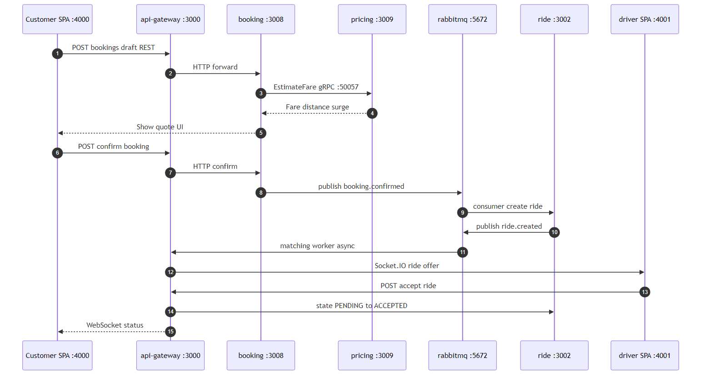

---

# 2. THU THẬP YÊU CẦU VÀ KHẢO SÁT NGHIỆP VỤ (REQUIREMENT AND SURVEY)

## 2.1. Cách tiếp cận thu thập yêu cầu

Nguồn yêu cầu của hệ thống được hình thành từ ba lớp thông tin:

- **Lớp nghiệp vụ:** hành trình khách hàng, tài xế và quản trị viên trong một nền tảng đặt xe.
- **Lớp kiến trúc:** các ràng buộc triển khai thật trong repo như Gateway là entry point duy nhất, wallet có logic công nợ, payment cần idempotency.
- **Lớp vận hành:** nhu cầu monitor, bảo mật, CI/CD và khả năng mở rộng khi số lượng tài xế online tăng.

Thay vì mô tả hệ thống như tập hợp màn hình, phần này tập trung vào yêu cầu nghiệp vụ làm đầu vào cho phần DDD ở Phần 3.

Về phương pháp, yêu cầu không được rút ra chỉ từ mong muốn tính năng mà còn từ quy tắc domain thực tế của codebase. Ví dụ, việc tài xế chỉ được bật online khi ví đạt điều kiện, hay việc thanh toán online phải chờ IPN xác nhận trước khi hoàn tất một số bước hậu thanh toán, đều là những ràng buộc nghiệp vụ có ảnh hưởng trực tiếp đến thiết kế. Vì vậy, phần thu thập yêu cầu ở đây đồng thời là bước khảo sát logic domain đang được hiện thực trong hệ thống.

## 2.2. Yêu cầu chức năng

### 2.2.1. Nhóm khách hàng

| Mã | Tính năng | Mức ưu tiên | Service hiện thực |
|---|---|---|---|
| F-C01 | Đăng ký và xác thực OTP | Cao | auth-service |
| F-C02 | Đăng nhập và refresh token | Cao | auth-service |
| F-C03 | Chọn điểm đón/điểm đến trên bản đồ | Cao | booking-service, pricing-service |
| F-C04 | Xem giá ước tính theo loại xe | Cao | pricing-service |
| F-C05 | Đặt xe và theo dõi tiến trình chuyến | Cao | ride-service, api-gateway |
| F-C06 | Thanh toán tiền mặt, MoMo, VNPay | Cao | payment-service |
| F-C07 | Chat và gọi thoại với tài xế | Cao | api-gateway |
| F-C08 | Xem lịch sử chuyến, đánh giá | Trung bình | booking-service, review-service |
| F-C09 | Hỏi đáp hỗ trợ bằng AI chatbot | Thấp | ai-service |

### 2.2.2. Nhóm tài xế

| Mã | Tính năng | Mức ưu tiên | Service hiện thực |
|---|---|---|---|
| F-D01 | Đăng ký hồ sơ tài xế | Cao | driver-service |
| F-D02 | Bật/tắt nhận cuốc | Cao | driver-service |
| F-D03 | Nhận và phản hồi offer cuốc | Cao | api-gateway, ride-service |
| F-D04 | Cập nhật trạng thái chuyến | Cao | ride-service |
| F-D05 | Xem và quản lý ví | Cao | wallet-service |
| F-D06 | Nạp tiền, rút tiền, theo dõi công nợ | Cao | wallet-service |
| F-D07 | Chat/gọi thoại với khách | Cao | api-gateway |

### 2.2.3. Nhóm quản trị viên

| Mã | Tính năng | Mức ưu tiên | Service hiện thực |
|---|---|---|---|
| F-A01 | Duyệt hoặc từ chối hồ sơ tài xế | Cao | driver-service |
| F-A02 | Theo dõi tài xế online và chuyến đi | Cao | api-gateway, ride-service |
| F-A03 | Xem dashboard tài chính | Cao | wallet-service, payment-service |
| F-A04 | Quản lý ví tài xế và merchant ledger | Cao | wallet-service |
| F-A05 | Kiểm tra log, health, metrics | Trung bình | api-gateway, monitoring stack |

Ba nhóm yêu cầu chức năng trên cho thấy hệ thống phải phục vụ đồng thời ba góc nhìn khác nhau. Khách hàng quan tâm đến tính thuận tiện và minh bạch của hành trình; tài xế quan tâm tới khả năng nhận cuốc, thu nhập và công nợ; quản trị viên quan tâm tới khả năng giám sát và đối soát. Đây là cơ sở quan trọng để ở Phần 3 tách domain thành các bounded context thay vì gom toàn bộ vào một service dùng chung.

## 2.3. Yêu cầu phi chức năng

| Loại | Yêu cầu |
|---|---|
| Hiệu năng | Dispatch hoàn tất trong số vòng bán kính cấu hình; API P95 trong ngưỡng chấp nhận được |
| Độ tin cậy | IPN idempotent; wallet ledger bất biến; outbox cho luồng ghi DB + phát event |
| Bảo mật | JWT ngắn hạn; OTP TTL; chữ ký IPN; internal header chỉ tin cậy sau Gateway |
| Khả dụng | AI timeout ngắn và fallback; dịch vụ stateless có thể mở rộng ngang |
| Kiểm toán | Merchant ledger và wallet transactions lưu dấu vết đầy đủ |
| Khả năng mở rộng | Database per service, Redis adapter, RabbitMQ event-driven |

Trong hệ thống đặt xe, yêu cầu phi chức năng không phải phần bổ sung về sau mà là điều kiện tồn tại của giải pháp. Nếu dispatch chậm, trải nghiệm khách hàng giảm ngay lập tức; nếu IPN không idempotent, sai lệch tài chính sẽ tích lũy; nếu realtime không ổn định, tài xế và khách hàng mất khả năng phối hợp trong chuyến. Vì vậy, các yêu cầu phi chức năng này được dùng như tiêu chí kiểm chứng xuyên suốt cho các quyết định ở Phần 4 đến Phần 11.

## 2.4. Khảo sát các quy trình nghiệp vụ chính

Các quy trình dưới đây được sắp theo đúng vòng đời nghiệp vụ của hệ thống, từ định danh đến hậu chuyến. Cách sắp xếp này giúp làm rõ điểm bắt đầu, điểm chuyển tiếp và điểm kết thúc của từng dòng sự kiện, đồng thời tạo đầu vào trực tiếp cho việc nhận diện domain event ở phần phân tích DDD.

### 2.4.1. Đăng ký và xác thực OTP

Luồng xác thực bắt đầu khi người dùng nhập số điện thoại và yêu cầu OTP. Auth-service sinh OTP, hash OTP, lưu TTL trong Redis và trả kết quả xác minh qua Gateway. Ở môi trường dev, OTP có thể lấy qua endpoint debug; ở production, OTP không được trả qua API mà chỉ đi qua nhà cung cấp SMS.

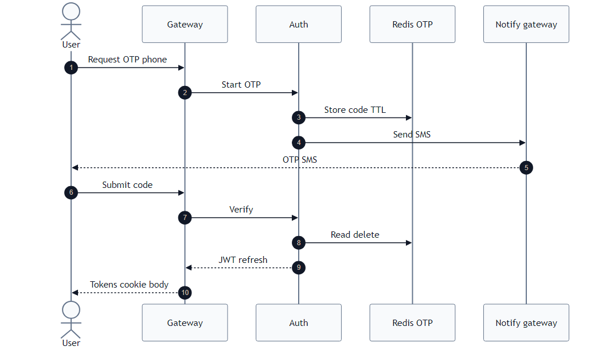

### 2.4.2. Đặt xe và điều phối tài xế

Khách hàng chọn điểm đón, điểm trả và loại xe. Booking-service lưu booking `PENDING`, pricing-service trả giá ước tính. Sau khi khách xác nhận, booking chuyển `CONFIRMED`; ride-service tạo `Ride`; khi đủ điều kiện tìm tài xế, ride-service phát `ride.finding_driver_requested`. Gateway sau đó dùng Redis GEO, các chỉ số tài xế và tùy chọn AI để dispatch đa vòng.

Về mặt phân tích nghiệp vụ, việc tách booking-service khỏi ride-service phản ánh đúng sự khác nhau giữa “yêu cầu đặt xe” và “chuyến đi đã bước vào vòng đời vận hành”. Người dùng có thể thay đổi thông tin, xem giá nhiều lần hoặc dừng ở bước đặt chỗ mà chưa tạo một `Ride` thực sự. Chỉ khi yêu cầu được xác nhận và đủ điều kiện, ride-service mới tạo aggregate `Ride` và khởi phát luồng điều phối.


### 2.4.3. Thực hiện chuyến đi

Sau khi tài xế chấp nhận cuốc, ride-service điều khiển vòng đời chuyến qua state machine: `ASSIGNED`, `ACCEPTED`, `PICKING_UP`, `IN_PROGRESS`, `COMPLETED` hoặc `CANCELLED`. Driver-service cập nhật vị trí; Gateway phát realtime cho khách hàng.

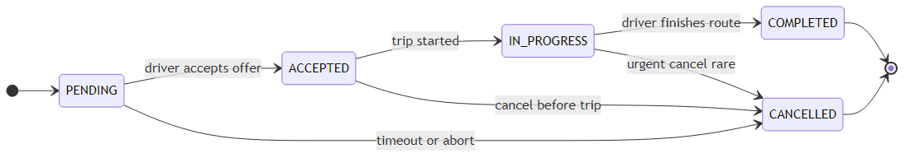

### 2.4.4. Thanh toán và ví tài xế

Payment-service xử lý tiền mặt, MoMo và VNPay. Với giao dịch online, IPN được xác minh chữ ký và xử lý idempotent. Khi thanh toán thành công, service phát `driver.earning.settled`; wallet-service tạo pending earning T+24h, ưu tiên tất toán công nợ FIFO trước khi cộng available balance.

Khảo sát quy trình này cho thấy payment và wallet không thể gộp làm một khối duy nhất. Payment chịu trách nhiệm xác minh giao dịch và trạng thái thanh toán với đối tác ngoài; Wallet chịu trách nhiệm sổ cái nội bộ, công nợ và khả năng rút tiền của tài xế. Đây là một ví dụ điển hình cho việc một quy trình nghiệp vụ duy nhất phải được chia ra nhiều bounded context nhưng vẫn giữ được mạch xử lý nhờ event-driven integration.


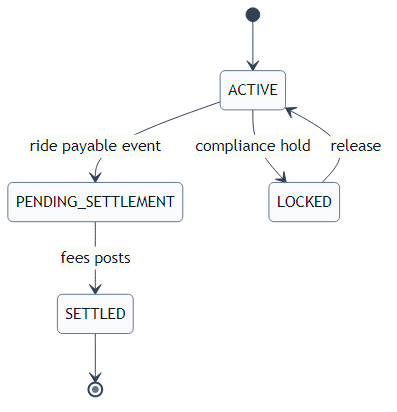

### 2.4.5. Realtime, quản trị và AI hỗ trợ

Gateway là hub duy nhất cho Socket.IO và signaling WebRTC. Notification-service đảm trách kênh email/SMS/push. AI-service hỗ trợ ETA, surge, accept probability và RAG chatbot nhưng luôn ở chế độ optional, không nắm trạng thái nghiệp vụ lõi.

Việc khảo sát nhóm quy trình này giúp làm rõ một nguyên tắc quan trọng của hệ thống: các thành phần hỗ trợ như realtime hub, notification hay AI phải cải thiện trải nghiệm nhưng không được trở thành nơi nắm giữ source of truth của domain. Nhờ ràng buộc đó, hệ thống vẫn giữ được khả năng vận hành khi một thành phần hỗ trợ suy giảm hoặc bị tách ra để mở rộng độc lập.


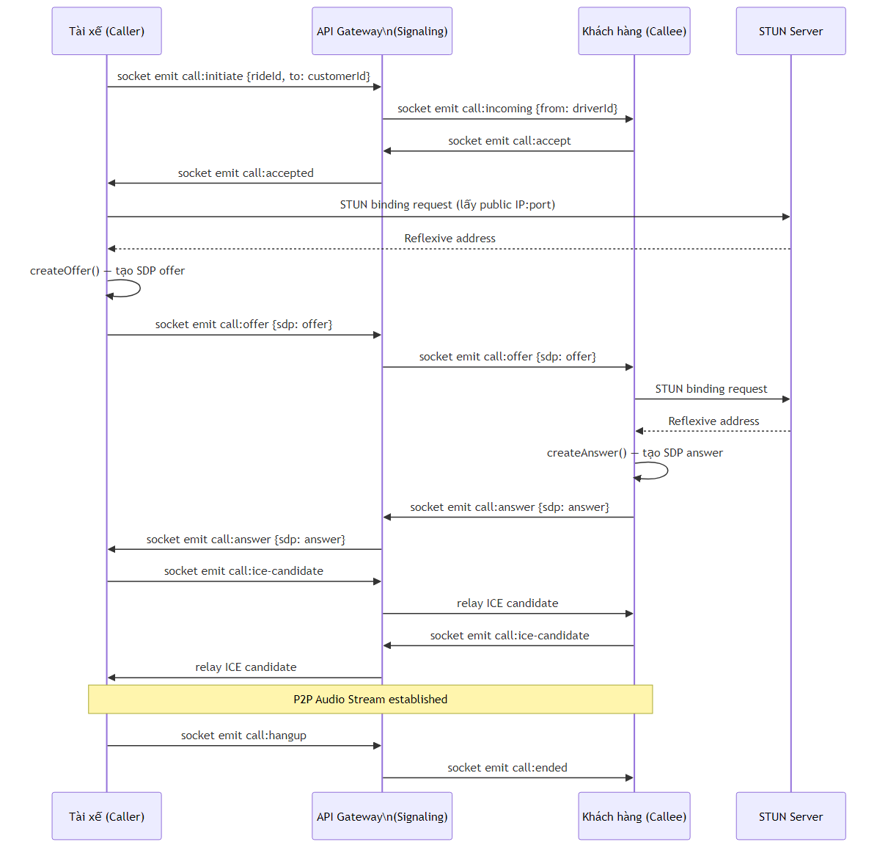

---

# 3. PHÂN TÍCH DOMAIN-DRIVEN DESIGN CHO HỆ THỐNG

Phần này là trung tâm của báo cáo. Các yêu cầu ở Phần 2 được chuyển hóa thành mô hình domain, bounded context, aggregate boundary, microservice ownership và integration pattern. Mục tiêu không phải liệt kê thêm một lần các tính năng, mà là trả lời câu hỏi: **ai sở hữu quy tắc nào, dữ liệu nào, event nào, và ranh giới nhất quán nằm ở đâu**.

Trình tự phân tích được đi từ bề mặt tương tác đến chiều sâu mô hình. Trước hết là actors và use cases để nhận biết các vai trò và điểm chạm với hệ thống. Sau đó là domain, subdomain và bounded context để xác định ranh giới mô hình. Cuối cùng mới đến aggregate boundary, giao tiếp giữa microservice, data ownership và integration pattern. Cách đi này giúp phần DDD bám sát domain thay vì bị trượt sang mô tả hạ tầng thuần túy.

## 3.1. Xác định các Actors

| Actor | Loại | Vai trò nghiệp vụ |
|---|---|---|
| Khách hàng | Primary | Đặt xe, thanh toán, theo dõi, đánh giá |
| Tài xế | Primary | Nhận cuốc, thực hiện chuyến, quản lý ví |
| Quản trị viên | Primary | Duyệt tài xế, giám sát, đối soát |
| API Gateway | System | Entry point, routing, dispatch, realtime |
| MoMo / VNPay | External | Cổng thanh toán |
| AI Service | External | Prediction và RAG |
| STUN Server | External | NAT traversal cho WebRTC |

## 3.2. Xác định Use Cases

Use case được xem như bề mặt tương tác của domain. Các use case trọng tâm của hệ thống gồm đăng ký/đăng nhập, đặt xe, điều phối tài xế, thanh toán, quản lý ví, quản trị và realtime support.


| UC | Tác nhân chính | Kết quả chính |
|---|---|---|
| UC-01 | Khách hàng | Xác thực thành công và có phiên đăng nhập hợp lệ |
| UC-02 | Khách hàng | Tạo booking và khởi phát luồng tìm tài xế |
| UC-03 | Tài xế | Nhận hoặc từ chối offer cuốc |
| UC-04 | Khách hàng / Hệ thống | Thanh toán chuyến đi và cập nhật trạng thái payment |
| UC-05 | Tài xế | Xem ví, công nợ, thu nhập chờ xử lý và số dư khả dụng |
| UC-06 | Quản trị viên | Duyệt hồ sơ tài xế, theo dõi nền tảng |

## 3.3. Xác định Domain và Subdomain

Domain tổng quát của hệ thống là **nền tảng đặt xe trực tuyến thời gian thực**. Bên trong domain này, các subdomain được phân loại như sau:

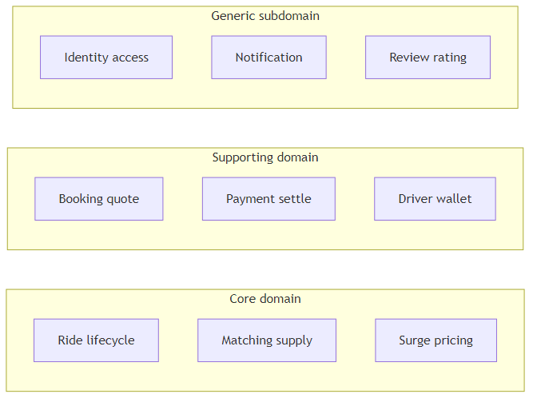

| Nhóm | Subdomain | Lý do |
|---|---|---|
| Core Domain | Dispatch / Ride orchestration | Ảnh hưởng trực tiếp tới trải nghiệm người dùng và năng lực cạnh tranh |
| Core Domain | Driver wallet & settlement | Quy định niềm tin tài chính của tài xế, có nhiều rule riêng |
| Supporting | Payment | Quan trọng nhưng có thể xây bằng pattern chuẩn |
| Supporting | Driver management | Hỗ trợ vận hành nền tảng |
| Supporting | Booking / Pricing | Tách bước tiền chuyến và định giá |
| Generic | Authentication | Có thể dựa trên pattern/giải pháp phổ biến |
| Generic | Notification | Luồng hỗ trợ đa kênh |
| Generic | Review | Phản hồi sau chuyến |
| Generic / Optional | AI support | Tăng chất lượng nhưng không phải dependency bắt buộc |

## 3.4. Xác định Bounded Context

Bounded Context là nơi một mô hình domain có nghĩa nhất quán. Với hệ thống này, các BC chính được xác định như sau:

| Bounded Context | Trách nhiệm | Aggregate Root chính | Microservice hiện thực |
|---|---|---|---|
| Auth | Định danh, OTP, token | `User` | auth-service |
| User Profile | Thông tin hồ sơ người dùng | `UserProfile` | user-service |
| Driver | Hồ sơ tài xế, xe, availability, location | `Driver` | driver-service |
| Booking | Snapshot tiền chuyến, yêu cầu đặt xe | `Booking` | booking-service |
| Ride | Vòng đời chuyến đi, audit trail, chat | `Ride` | ride-service |
| Pricing | Giá cước, surge, ETA | `PricingQuote` | pricing-service |
| Payment | Thanh toán, IPN, refund, earnings | `Payment` | payment-service |
| Wallet | Ví tài xế, debt, pending settlement | `DriverWallet` | wallet-service |
| Notification | Thông báo đa kênh | `Notification` | notification-service |
| Review | Đánh giá sau chuyến | `Review` | review-service |
| AI Support | Prediction và RAG | `InferenceRequest` / `ChatSession` | ai-service |

Việc xác định bounded context theo bảng trên có ý nghĩa lớn hơn việc “chia service cho đẹp”. Mỗi bounded context đại diện cho một phạm vi mà ngôn ngữ nghiệp vụ có thể được dùng nhất quán. Ví dụ, từ `status` trong Ride Context mô tả vòng đời chuyến đi; trong Payment Context, trạng thái lại mang nghĩa về kết quả giao dịch; còn trong Driver Context, trạng thái gắn với quy trình phê duyệt hồ sơ hoặc availability. Nếu không tách ranh giới này, cùng một từ sẽ bị dùng với nhiều nghĩa khác nhau và dẫn tới mô hình không ổn định.

## 3.5. Context Mapping: Xác định cách các bounded context giao tiếp với nhau

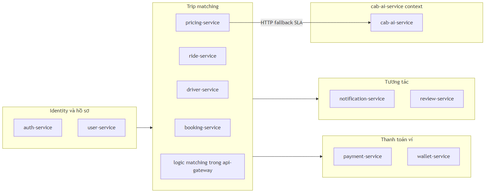

Các quan hệ quan trọng:

- **Gateway → các service:** Conformist, vì Gateway tuân theo API contract của downstream service.
- **Ride → Payment:** Customer/Supplier. Ride phát `ride.completed`; Payment tiêu thụ và xử lý thanh toán.
- **Payment → Wallet:** Published Language qua domain events. Wallet không gọi trực tiếp vào DB của Payment.
- **Gateway → AI:** Anti-Corruption Layer với timeout và fallback để tách domain lõi khỏi AI.
- **Auth → User Profile / Driver:** Upstream identity; downstream chỉ dùng identity đã chuẩn hóa.

Context map vì thế không chỉ là sơ đồ kết nối, mà là sơ đồ quan hệ phụ thuộc giữa các mô hình. Một context upstream có thể chi phối cách context downstream hiểu dữ liệu; ngược lại, downstream có thể phải thêm lớp dịch để tránh bị rò rỉ khái niệm không phù hợp. Đối với hệ thống đặt xe, đây là điểm mấu chốt để vừa tận dụng được service độc lập, vừa tránh tình trạng mọi service phải biết chi tiết nội bộ của nhau.

## 3.6. Xác định Domain Model

Các BC lõi được mô hình hóa bằng aggregate diagram riêng để bảo đảm rule được neo vào đúng domain object.

### 3.6.1. Ride Context

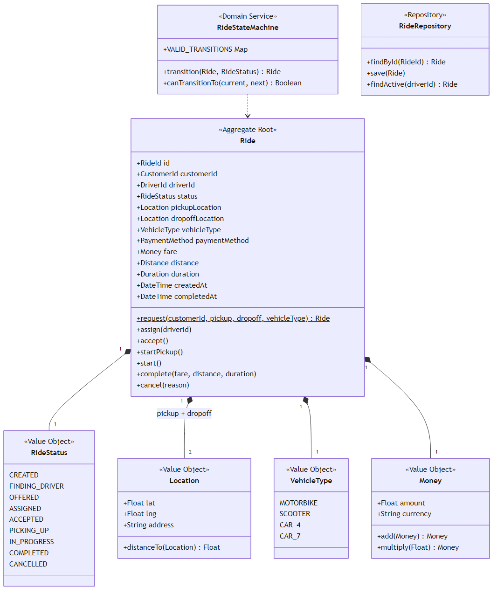

Ride aggregate chịu trách nhiệm trạng thái chuyến, tài xế gán cho chuyến, hành trình, thông điệp và audit trail.

### 3.6.2. Driver Context

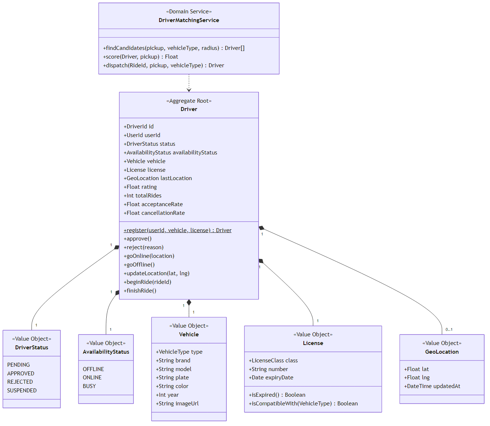

Driver aggregate bao gồm hồ sơ tài xế, thông tin xe, giấy phép, availability và vị trí.

### 3.6.3. Wallet Context

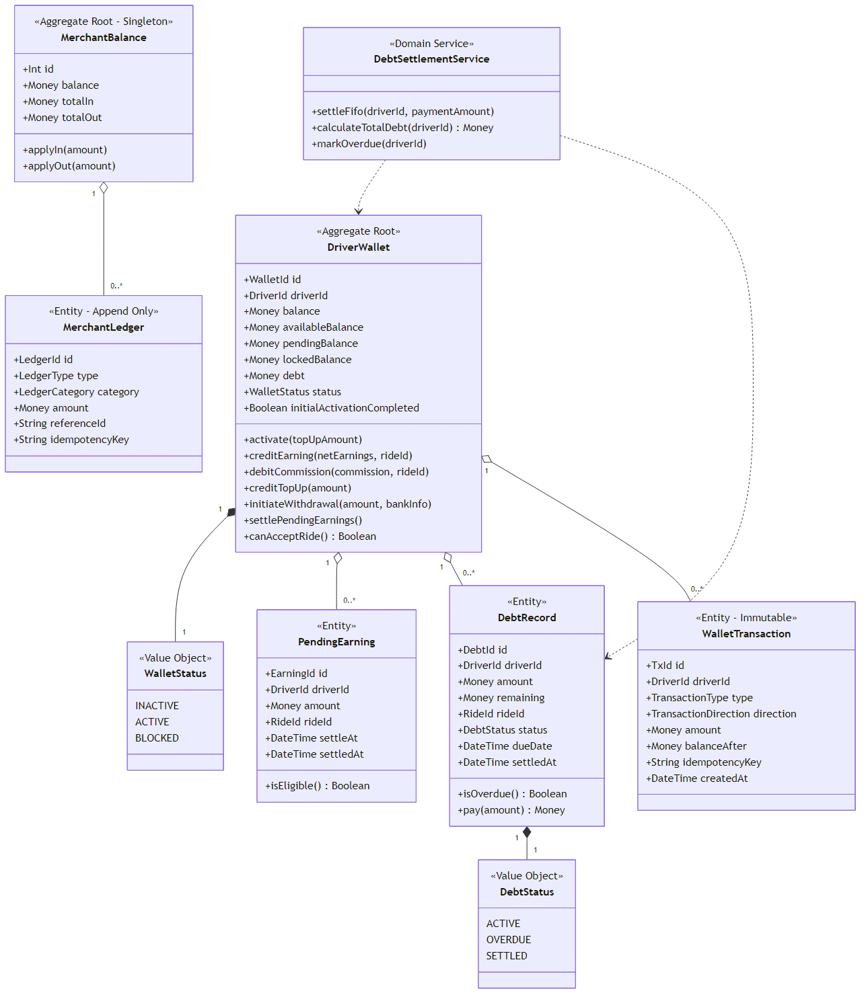

Wallet aggregate thể hiện rõ bốn lớp giá trị: locked, pending, available, debt và các transaction bất biến.

### 3.6.4. Payment Context

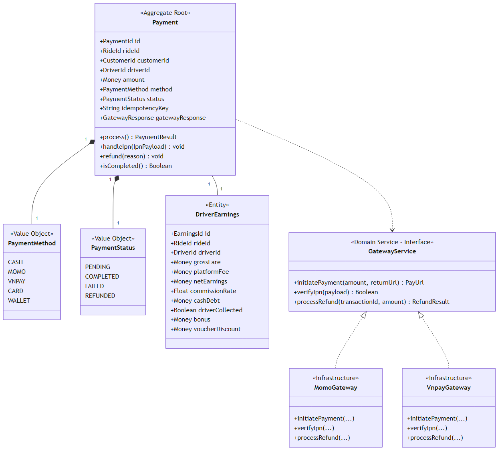

Payment aggregate quản lý payment intent, IPN result, refund, commission và outbox.

## 3.7. Xác định Aggregate Boundaries

| Bounded Context | Aggregate Root | Lý do chọn ranh giới |
|---|---|---|
| Ride | `Ride` | Mọi chuyển trạng thái chuyến phải đi qua một entry point duy nhất |
| Driver | `Driver` | Availability, vehicle và location phụ thuộc cùng identity nghiệp vụ |
| Wallet | `DriverWallet` | Các thay đổi balance, debt, pending phải giữ nhất quán nội bộ |
| Payment | `Payment` | Trạng thái thanh toán và outbox cần cùng transaction logic |
| Booking | `Booking` | Snapshot tiền chuyến độc lập với ride lifecycle |
| Auth | `User` | Token, OTP và account status xoay quanh cùng một identity |

Nguyên tắc được áp dụng là: bên ngoài chỉ được thay đổi trạng thái thông qua aggregate root hoặc application service của đúng bounded context; không cập nhật xuyên service vào bảng của context khác.

Ở mức triển khai, aggregate boundary chính là transaction boundary hợp lý nhất của hệ thống. Ví dụ, việc chuyển `Ride` từ `ASSIGNED` sang `IN_PROGRESS` phải được xác thực và ghi nhận trọn vẹn trong ride-service; việc cộng pending earning và tất toán debt phải được khép kín trong wallet-service. Nhờ vậy, mỗi service có thể tự bảo toàn tính nhất quán cục bộ của mình, trong khi nhất quán toàn hệ thống được bảo đảm bằng sự kiện và choreography.

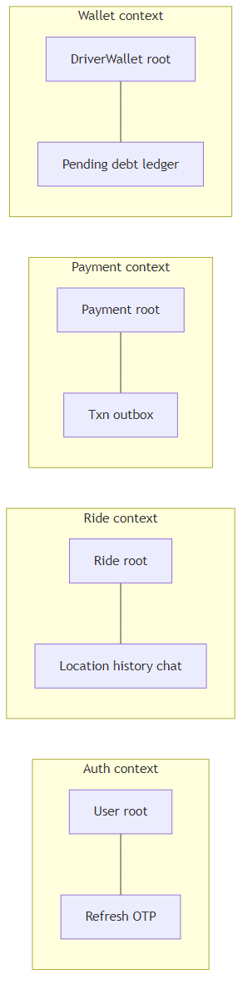

## 3.8. Xác định MicroServices

| Microservice | Bounded Context / vai trò | Database / hạ tầng chính | Giao tiếp nổi bật |
|---|---|---|---|
| api-gateway | Entry point, routing, dispatch, realtime | Redis | HTTP proxy, gRPC bridge, Socket.IO |
| auth-service | Auth | PostgreSQL `auth_db`, Redis | HTTP, gRPC, RabbitMQ |
| user-service | User Profile | PostgreSQL `user_db` | HTTP, gRPC |
| driver-service | Driver | PostgreSQL `driver_db`, Redis GEO | HTTP, gRPC, RabbitMQ |
| booking-service | Booking | PostgreSQL `booking_db` | HTTP, gRPC, RabbitMQ |
| ride-service | Ride | PostgreSQL `ride_db` | HTTP, gRPC, RabbitMQ |
| pricing-service | Pricing | Redis cache | HTTP, gRPC |
| payment-service | Payment | PostgreSQL `payment_db` | HTTP, gRPC, RabbitMQ |
| wallet-service | Wallet | PostgreSQL `wallet_db` | HTTP, RabbitMQ |
| notification-service | Notification | MongoDB `notification_db` | HTTP, RabbitMQ |
| review-service | Review | MongoDB `review_db` | HTTP, RabbitMQ |
| ai-service | AI Support | Model files + vector store | HTTP |

Microservice ở đây là quyết định hiện thực từ bounded context, nhưng không phải BC nào cũng là service “thuần domain”: API Gateway là component kỹ thuật, không phải bounded context nghiệp vụ.

Điểm cần nhấn mạnh là việc tách microservice không dựa trên tiêu chí kỹ thuật đơn lẻ như “mỗi bảng một service”, mà dựa trên mật độ quy tắc nghiệp vụ và mức độ thay đổi cùng nhau của dữ liệu. Các service như Wallet, Payment và Ride được tách mạnh vì có mô hình và giao dịch riêng biệt; trong khi các thành phần như Gateway được giữ ở vai trò điều phối kỹ thuật để tránh làm loãng mô hình domain.

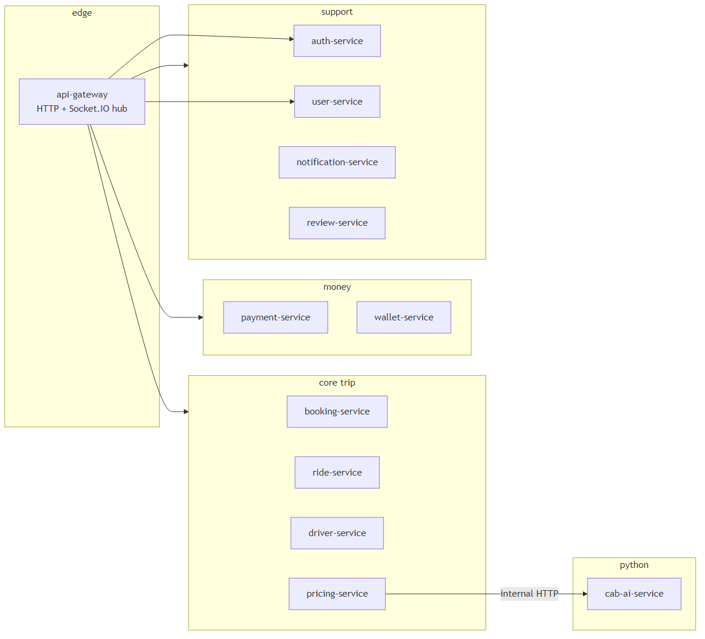

## 3.9. Thiết kế các giao tiếp giữa MicroServices

### 3.9.1. Giao tiếp đồng bộ

- Client → API Gateway: HTTPS / Socket.IO.
- Gateway → service: HTTP proxy hoặc gRPC tùy độ trễ và contract.
- Pricing, Booking, Ride, Driver lookup: ưu tiên gRPC khi cần tốc độ và type-safety.

### 3.9.2. Giao tiếp bất đồng bộ

RabbitMQ dùng topic exchange để lan truyền domain events giữa các bounded context. Mô hình này giúp giảm temporal coupling và cho phép eventual consistency thay cho distributed transaction 2PC.

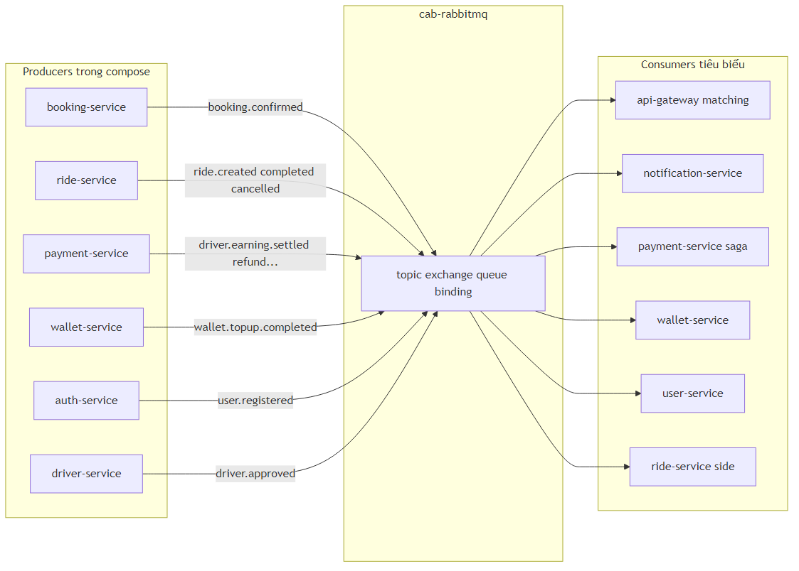

### 3.9.3. Domain event catalog cốt lõi

| Event | Publisher | Subscriber | Ý nghĩa |
|---|---|---|---|
| `booking.confirmed` | booking-service | ride-service | Khách đã chốt yêu cầu đặt xe |
| `ride.created` | ride-service | downstream observers | Chuyến đã được tạo |
| `ride.finding_driver_requested` | ride-service | api-gateway | Bắt đầu matching |
| `ride.completed` | ride-service | payment-service | Kích hoạt thanh toán |
| `payment.completed` | payment-service | ride-service, notification-service | Xác nhận thanh toán online thành công |
| `driver.earning.settled` | payment-service | wallet-service | Ghi nhận thu nhập tài xế |
| `refund.completed` | payment-service | wallet-service | Hoàn tiền hoặc điều chỉnh ví |
| `driver.approved` | driver-service | wallet-service, api-gateway | Tài xế đã được duyệt |

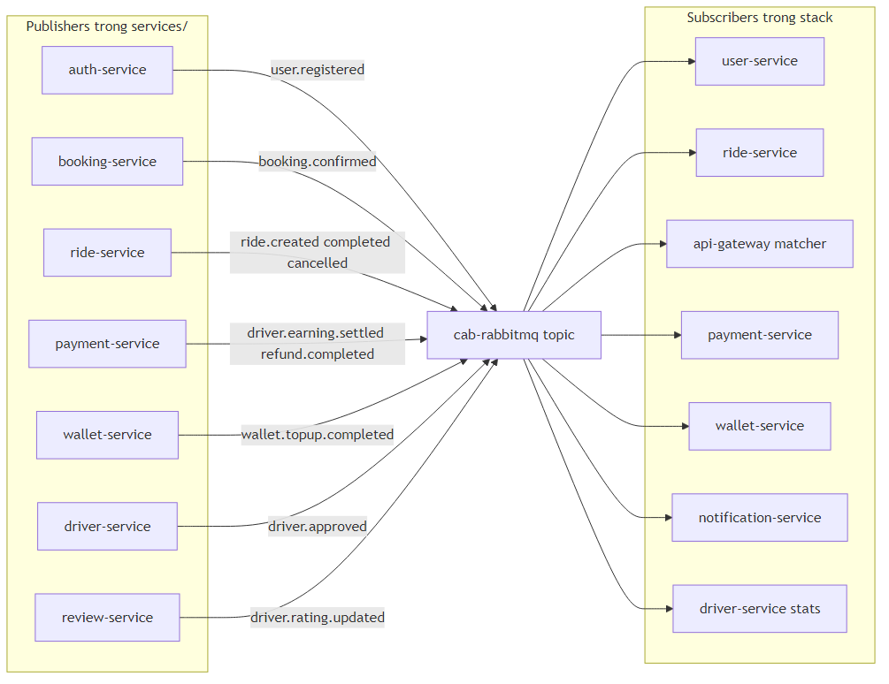

## 3.10. Thiết kế Data Ownership

Nguyên tắc cốt lõi là **database per service**. Mỗi microservice sở hữu schema hoặc database riêng, tự kiểm soát migration, client và transaction. Không có foreign key xuyên service.

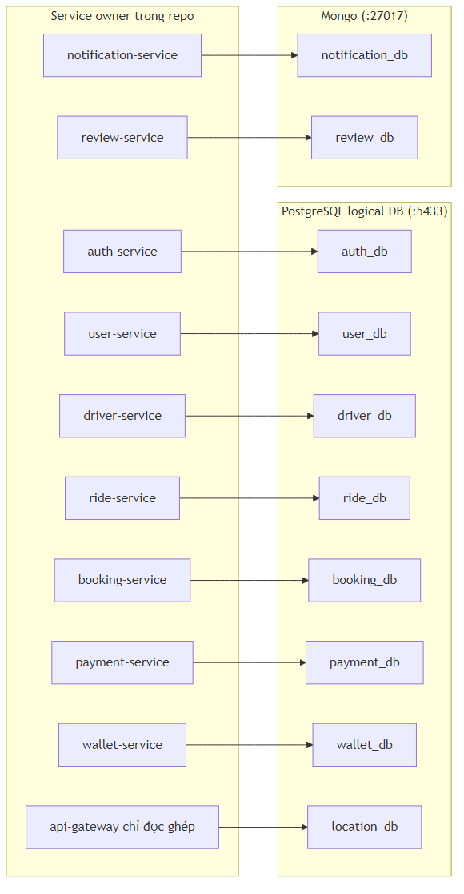

| Service | Database |
|---|---|
| auth-service | PostgreSQL `auth_db` |
| user-service | PostgreSQL `user_db` |
| driver-service | PostgreSQL `driver_db` |
| booking-service | PostgreSQL `booking_db` |
| ride-service | PostgreSQL `ride_db` |
| payment-service | PostgreSQL `payment_db` |
| wallet-service | PostgreSQL `wallet_db` |
| notification-service | MongoDB `notification_db` |
| review-service | MongoDB `review_db` |
| api-gateway | Redis |
| pricing-service | Redis / stateless cache |
| ai-service | Model files, vector data |

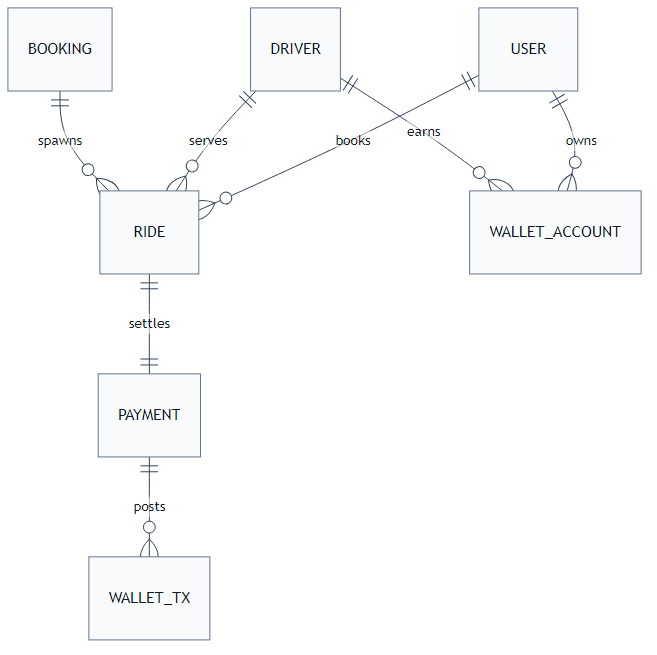

Data ownership theo kiểu này giúp từng service có thể tự quản migration, schema evolution và chiến lược truy vấn của riêng mình. Đồng thời, nó buộc mọi giao tiếp xuyên service phải đi qua API công khai hoặc domain event, nhờ đó ranh giới bounded context được duy trì không chỉ trên sơ đồ mà cả ở mức kỹ thuật vận hành.

Chi tiết schema của các service có domain model phức tạp được mô tả riêng theo từng bounded context:

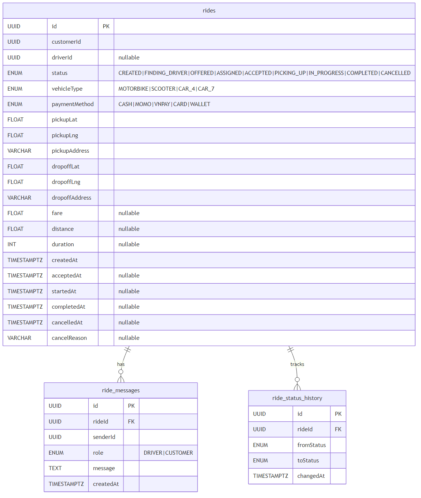

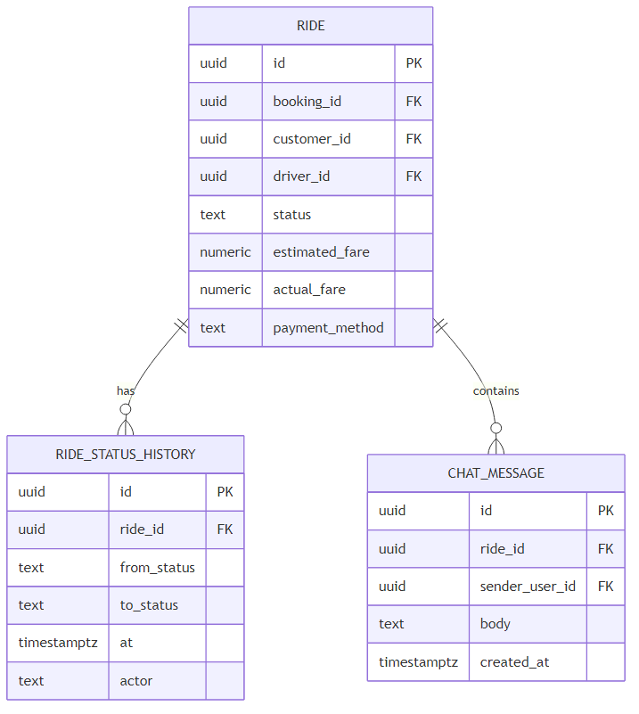

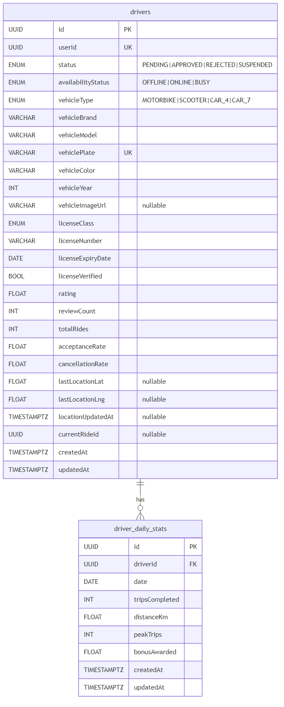

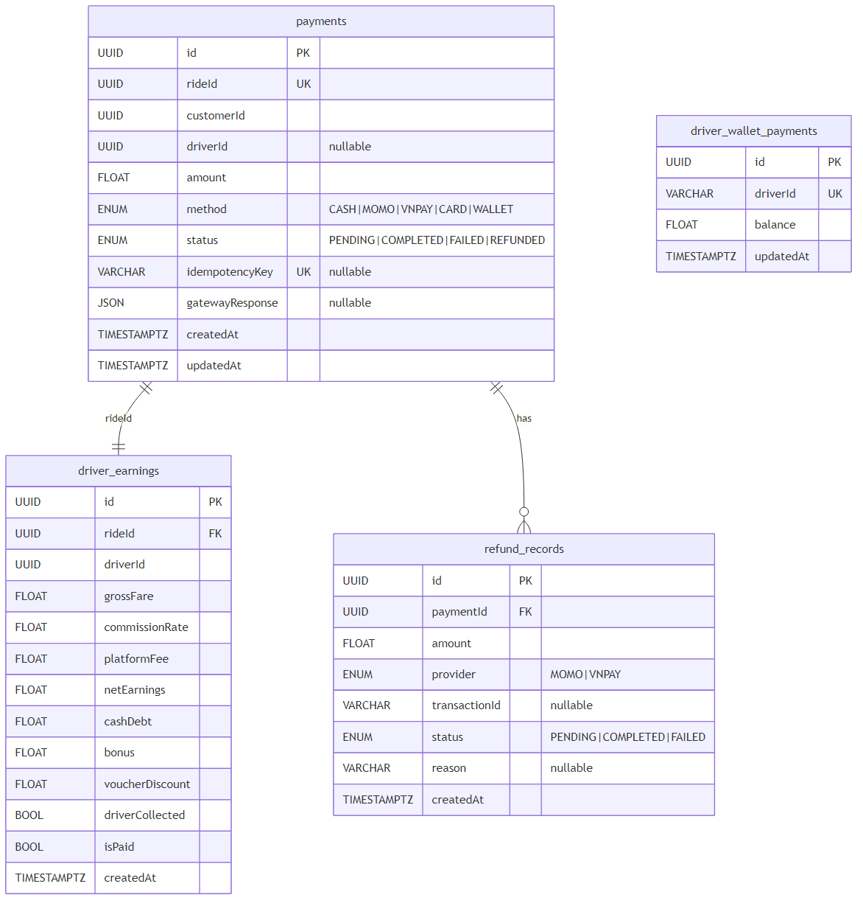

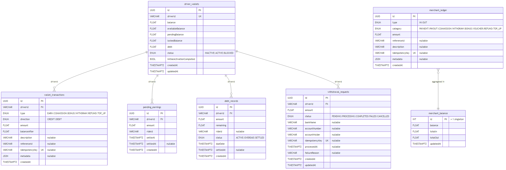

## 3.11. Xác định Integration Pattern

| Pattern | Mục đích | Vị trí áp dụng |
|---|---|---|
| Database per Service | Tách dữ liệu theo context | Toàn bộ hệ thống |
| Transactional Outbox | Ghi DB và phát event an toàn | payment-service |
| Idempotent Consumer | Ngăn xử lý lặp IPN / earning | payment-service, wallet-service |
| Anti-Corruption Layer | Cô lập contract ngoài domain lõi | api-gateway, AI integration |
| Saga / Choreography | Điều phối ride → payment → wallet | Luồng hậu thanh toán |
| Facade | Một entry point public duy nhất | api-gateway |
| Adapter | Redis Adapter, HTTP↔gRPC bridge | api-gateway |
| State | Quản lý vòng đời Ride | ride-service |

Việc lựa chọn pattern ở đây bám theo hai tiêu chí: độ nhạy cảm của giao dịch và mức coupling chấp nhận được. Chỗ nào cần nhất quán tài chính mạnh thì ưu tiên Outbox và idempotency; chỗ nào cần giao tiếp nhanh nhưng rõ contract thì dùng gRPC; chỗ nào cần cô lập khỏi đối tác ngoài hoặc AI thì dùng ACL và adapter. Nhờ vậy, pattern không bị dùng dàn trải mà gắn với một lý do thiết kế rõ ràng.

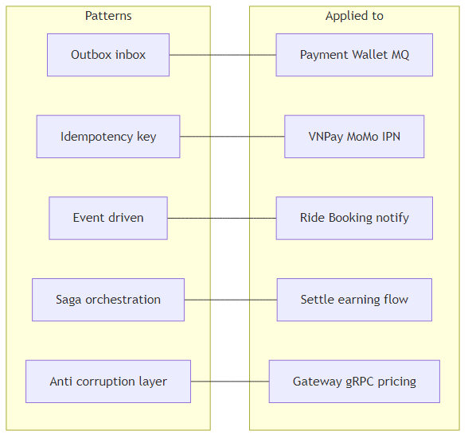

## 3.12. Refine & Validate

Mô hình DDD chỉ có giá trị khi được kiểm chứng bằng hành vi thật. Việc refine & validate trong đề tài được thực hiện ở ba mức:

| Mức kiểm chứng | Cách kiểm tra | Kết quả mong muốn |
|---|---|---|
| Nhất quán domain | State machine, aggregate rules, event ownership | Không có chuyển trạng thái hoặc mutation trái BC |
| Nhất quán tài chính | Test IPN lặp, pending settlement, FIFO debt | Không ghi nhận kép, trừ nợ đúng thứ tự |
| Hiệu quả vận hành | Dispatch timing, response time, health check | Đạt ngưỡng chấp nhận trong môi trường thử nghiệm |

Các kết quả đo và đánh giá được tổng hợp lại ở Phần 11 và Phần 12.

Theo cách hiểu này, refine & validate không phải bước làm sau cùng một cách hình thức, mà là cơ chế quay lại kiểm tra xem mô hình DDD có thực sự phản ánh đúng hành vi của hệ thống hay không. Nếu kết quả kiểm thử cho thấy ownership không rõ, event phát sai chỗ hoặc transaction boundary chưa hợp lý, mô hình phải được tinh chỉnh lại trước khi xem là hoàn chỉnh.

---

# 4. THIẾT KẾ KIẾN TRÚC HỆ THỐNG (SYSTEM ARCHITECTURE DESIGN - SAD)

## 4.1. Kiến trúc tổng thể nhiều lớp

Kiến trúc của hệ thống gồm bốn lớp chính: presentation layer, edge/gateway layer, domain service layer và infrastructure/data layer. Cách chia lớp này giúp phân biệt rõ phần tương tác người dùng, phần orchestration, phần xử lý nghiệp vụ và phần hạ tầng dữ liệu - message broker.

Ở lớp trình bày, ba ứng dụng frontend chịu trách nhiệm hiển thị, nhập liệu và phản hồi realtime cho từng vai trò. Ở lớp edge, API Gateway đóng vai trò cổng vào duy nhất, là nơi áp chính sách xác thực, định tuyến và fan-out sự kiện realtime. Lớp domain service thực hiện nghiệp vụ theo bounded context đã xác định trong Phần 3. Cuối cùng, lớp hạ tầng cung cấp storage, broker, cache và các công cụ observability. Việc tách thành các lớp như vậy giúp mỗi nhóm vấn đề được giải quyết tại đúng vị trí và hạn chế sự rò rỉ trách nhiệm giữa giao diện, orchestration và domain.

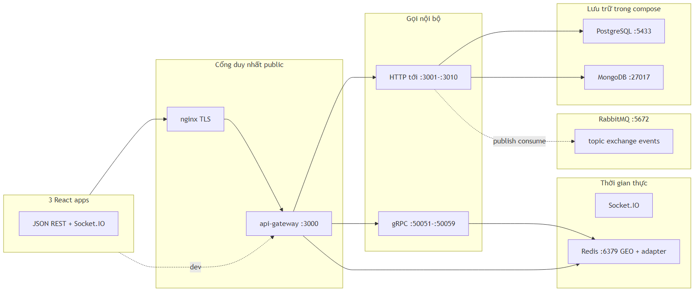

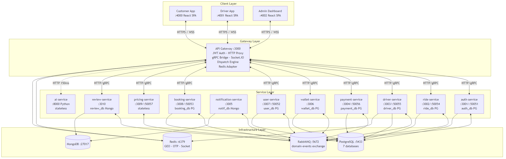

## 4.2. Thiết kế điểm vào hệ thống và API Gateway

API Gateway là entry point duy nhất cho cả ba frontend. Thành phần này chịu trách nhiệm xác thực JWT, proxy request, chuyển đổi REST ↔ gRPC, quản lý Socket.IO và chạy matching engine.

Thiết kế này giải quyết hai mục tiêu cùng lúc. Thứ nhất, tất cả request từ bên ngoài được gom qua một điểm kiểm soát duy nhất, nhờ đó việc áp dụng xác thực, logging, rate limiting và policy trở nên nhất quán. Thứ hai, Gateway có thể đóng vai trò lớp thích nghi giữa frontend và backend, che giấu sự khác biệt giữa HTTP proxy, gRPC bridge và realtime event. Tuy nhiên, Gateway không được trở thành “siêu service” chứa toàn bộ domain rule; các quy tắc nghiệp vụ cốt lõi vẫn phải ở downstream bounded context tương ứng.

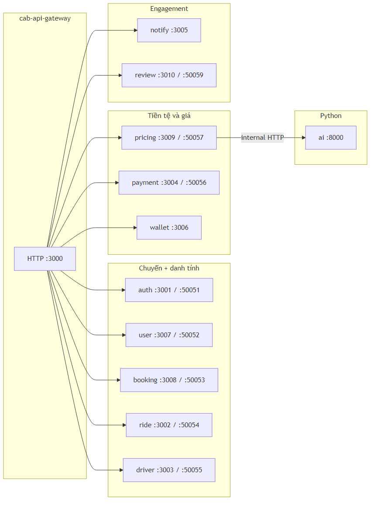

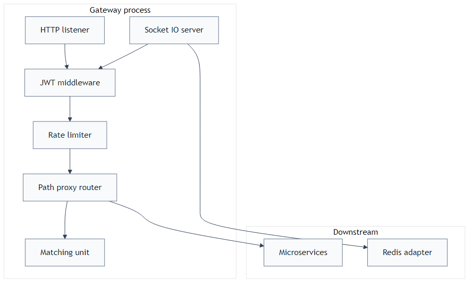

Ở mức triển khai chi tiết hơn, Gateway gồm router, middleware xác thực, gRPC bridge, Socket.IO rooms, consumer RabbitMQ và các adapter hạ tầng.

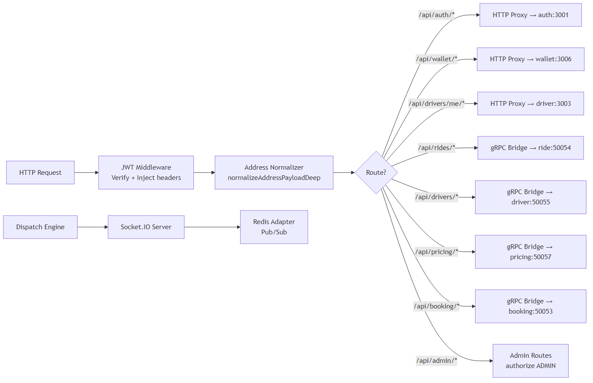

## 4.3. Thiết kế các luồng hệ thống trọng yếu

### 4.3.1. Ride lifecycle

Ride service bảo đảm mọi state transition đều đi qua state machine. Điều này bảo vệ domain khỏi việc cập nhật `status` tùy tiện từ controller hay service khác.

Ở góc nhìn kiến trúc, state machine là một hàng rào bảo vệ domain rất quan trọng. Nó biến các quy tắc kiểu “đã hoàn thành thì không thể quay lại đang chạy” hay “chưa assigned thì không thể start trip” thành luật thực thi được bởi code, thay vì chỉ là quy ước trong tài liệu. Nhờ đó, ride-service vừa đóng vai trò service nghiệp vụ vừa là nơi cưỡng chế tính hợp lệ của vòng đời chuyến.

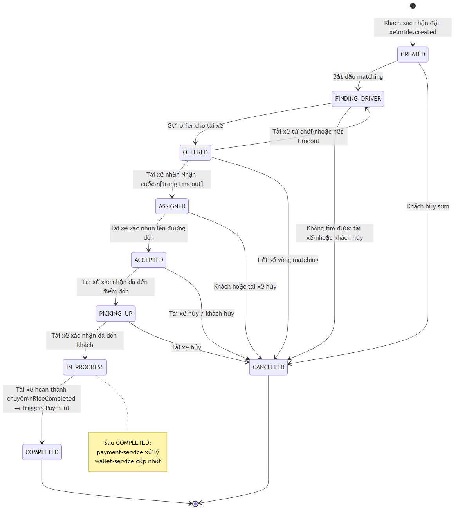

### 4.3.2. Sequence đặt xe và thanh toán

Sequence này mô tả mối quan hệ giữa booking-service, ride-service, payment-service và wallet-service ở góc nhìn runtime.

Điểm quan trọng của sequence này là nó cho thấy một use case duy nhất của người dùng thực chất được hiện thực bởi nhiều bounded context nối tiếp nhau. Booking xử lý snapshot tiền chuyến, Ride quản lý vòng đời, Payment xử lý đối tác ngoài, còn Wallet chịu trách nhiệm phản ánh tài chính nội bộ. Sự phân công này làm tăng số bước giao tiếp, nhưng đổi lại giúp mỗi service giữ mô hình của mình gọn và đúng domain hơn.


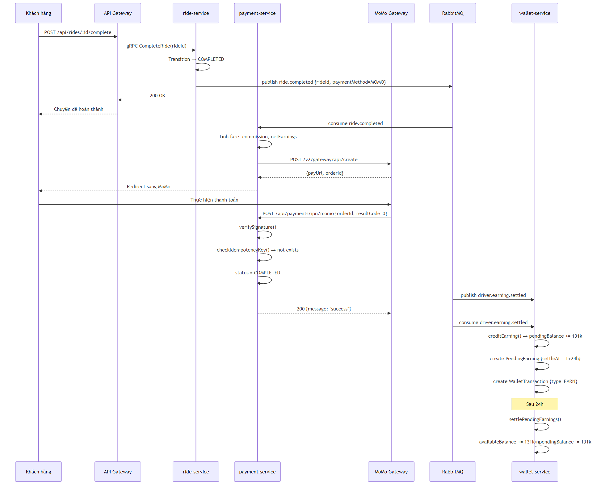

### 4.3.3. Sequence dispatch tài xế

Dispatch được thiết kế như một tiến trình nhiều vòng, mở rộng bán kính khi chưa tìm được tài xế thích hợp.

Về mặt kiến trúc, dispatch không chỉ là một thuật toán chọn tài xế gần nhất. Đây là một tiến trình phối hợp giữa Redis GEO, scoring logic, availability của driver, điều kiện ví và tùy chọn AI adjustment. Bằng cách triển khai theo nhiều vòng bán kính tăng dần, hệ thống vừa ưu tiên tài xế gần, vừa tránh thất bại sớm khi vùng xung quanh điểm đón quá thưa tài xế.


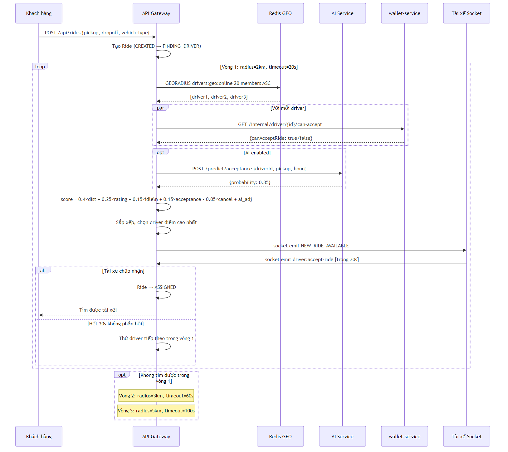

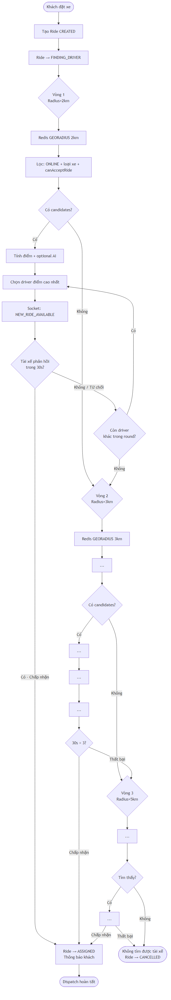

## 4.4. Thiết kế các thành phần đại diện

### 4.4.1. Wallet service như một service điển hình theo layered architecture

Wallet-service là đại diện tốt cho cách hiện thực một service domain nặng rule: controller, application service, domain logic, repository, event consumer và persistence được tách lớp rõ ràng.

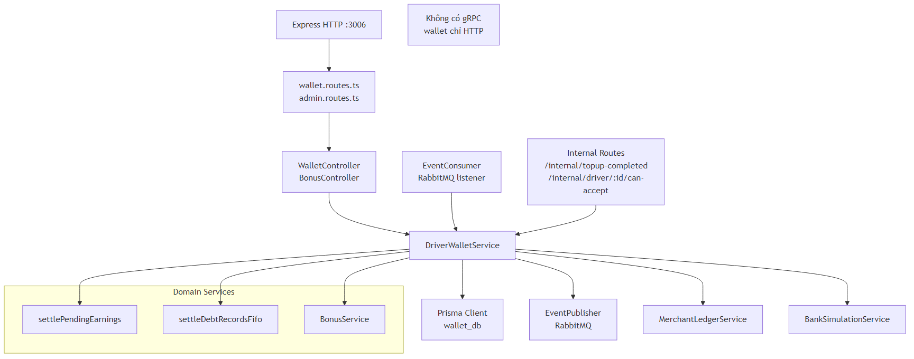

### 4.4.2. Luồng đăng ký và duyệt tài xế

Luồng này kết nối Driver, Wallet và Notification theo đúng tinh thần choreography thay vì viết logic xuyên service.

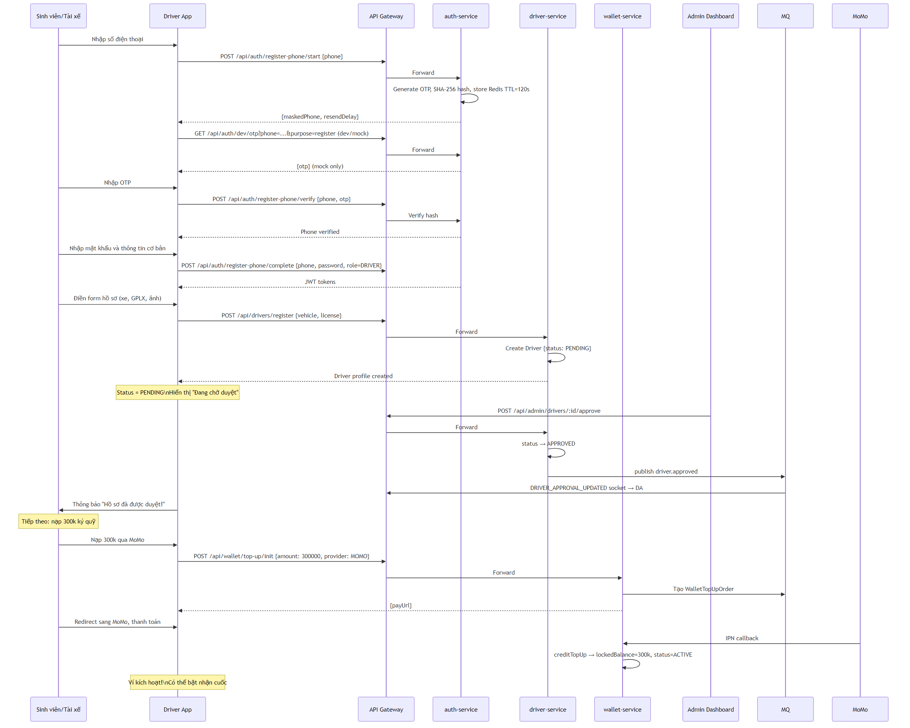

### 4.4.3. Lớp trình bày

Ba frontend được thiết kế theo vai trò:

- **Customer App:** bản đồ, đặt xe, theo dõi chuyến, thanh toán và hỗ trợ.
- **Driver App:** nhận cuốc, quản lý ví, công nợ, trạng thái online.
- **Admin Dashboard:** duyệt tài xế, theo dõi chuyến, đối soát tài chính.

Lớp trình bày không chứa business rule cốt lõi; mọi quy tắc nghiệp vụ quan trọng đều nằm ở bounded context tương ứng phía backend.

Điều này giúp frontend có thể thay đổi giao diện, bố cục hoặc trải nghiệm người dùng mà không phá vỡ mô hình nghiệp vụ. Nó cũng làm cho việc phát triển ba ứng dụng theo vai trò trở nên tự nhiên hơn: mỗi app có thể tối ưu theo bối cảnh sử dụng riêng, trong khi backend vẫn giữ cùng một source of truth cho domain.

### 4.4.4. <span style="color:#0B6E4F;">Thiết kế cụ thể theo từng microservice</span>

<span style="color:#0B6E4F;">Nội dung màu xanh trong mục này là phần được chỉnh sửa để trình bày từng service một thay vì gộp trong một bảng duy nhất. Phụ lục C vẫn giữ vai trò liệt kê API công khai; còn mục này tập trung vào ownership, giao tiếp và chức năng kỹ thuật của từng microservice.</span>

#### 4.4.4.1. <span style="color:#0B6E4F;">API Gateway</span>

- <span style="color:#0B6E4F;">**Vai trò:** là entry point public duy nhất cho toàn bộ hệ thống, đồng thời là nơi xác thực JWT, định tuyến request, quản lý Socket.IO và chạy driver matching engine.</span>
- <span style="color:#0B6E4F;">**Lưu trữ / hạ tầng sở hữu:** Redis cho geospatial index, Socket.IO adapter và trạng thái hỗ trợ realtime.</span>
- <span style="color:#0B6E4F;">**Đầu vào chính:** HTTP từ customer-app, driver-app, admin-dashboard; WebSocket từ client; domain events từ RabbitMQ.</span>
- <span style="color:#0B6E4F;">**Đầu ra / phụ thuộc:** gọi HTTP hoặc gRPC tới các downstream service, đọc Redis GEO, phát sự kiện realtime tới room của ride hoặc user.</span>
- <span style="color:#0B6E4F;">**Endpoint hoặc hành động đại diện:** proxy `/api/*`, xác thực header nội bộ, `ride:offer`, `ride:status_update`, matching theo bán kính nhiều vòng.</span>

#### 4.4.4.2. <span style="color:#0B6E4F;">auth-service</span>

- <span style="color:#0B6E4F;">**Vai trò:** quản lý đăng ký bằng OTP, đăng nhập, refresh token và source of truth cho identity của người dùng.</span>
- <span style="color:#0B6E4F;">**Lưu trữ / hạ tầng sở hữu:** PostgreSQL `auth_db` cho account và refresh token; Redis cho OTP TTL.</span>
- <span style="color:#0B6E4F;">**Đầu vào chính:** HTTP request xác thực và gRPC validate user.</span>
- <span style="color:#0B6E4F;">**Đầu ra / phụ thuộc:** publish `user.registered`, tích hợp SMS provider hoặc mock OTP tùy môi trường.</span>
- <span style="color:#0B6E4F;">**Endpoint đại diện:** `/api/auth/register-phone/start`, `/api/auth/register-phone/verify`, `/api/auth/login`, `/api/auth/refresh`.</span>

#### 4.4.4.3. <span style="color:#0B6E4F;">user-service</span>

- <span style="color:#0B6E4F;">**Vai trò:** quản lý hồ sơ mở rộng của người dùng sau khi identity đã được tạo bởi auth-service.</span>
- <span style="color:#0B6E4F;">**Lưu trữ / hạ tầng sở hữu:** PostgreSQL `user_db`.</span>
- <span style="color:#0B6E4F;">**Đầu vào chính:** HTTP lookup profile, gRPC profile lookup, consumer của event `user.registered`.</span>
- <span style="color:#0B6E4F;">**Đầu ra / phụ thuộc:** cung cấp thông tin hiển thị cho review-service, admin hoặc các service cần projection profile.</span>
- <span style="color:#0B6E4F;">**Hành động đại diện:** tự tạo hồ sơ khi user mới đăng ký, tra cứu `UserProfile` theo `userId`.</span>

#### 4.4.4.4. <span style="color:#0B6E4F;">driver-service</span>

- <span style="color:#0B6E4F;">**Vai trò:** quản lý hồ sơ tài xế, giấy phép, trạng thái duyệt, online/offline và cập nhật vị trí thời gian thực.</span>
- <span style="color:#0B6E4F;">**Lưu trữ / hạ tầng sở hữu:** PostgreSQL `driver_db` và Redis GEO cho vị trí tài xế đang online.</span>
- <span style="color:#0B6E4F;">**Đầu vào chính:** HTTP từ tài xế và admin, gRPC lookup driver, RabbitMQ consumer cho các sự kiện liên quan.</span>
- <span style="color:#0B6E4F;">**Đầu ra / phụ thuộc:** gọi payment-service hoặc wallet gate để kiểm tra điều kiện nhận cuốc; publish `driver.approved` hoặc `driver.rejected`.</span>
- <span style="color:#0B6E4F;">**Endpoint đại diện:** `/api/drivers/register`, `/api/drivers/me`, `/api/drivers/me/online`, `/api/drivers/me/offline`, cập nhật location.</span>

#### 4.4.4.5. <span style="color:#0B6E4F;">ride-service</span>

- <span style="color:#0B6E4F;">**Vai trò:** sở hữu ride aggregate, state machine của chuyến đi, thông tin gán tài xế và chat trong chuyến.</span>
- <span style="color:#0B6E4F;">**Lưu trữ / hạ tầng sở hữu:** PostgreSQL `ride_db`.</span>
- <span style="color:#0B6E4F;">**Đầu vào chính:** HTTP cho lifecycle của ride, gRPC cho các lookup nội bộ, consumer của event booking/matching.</span>
- <span style="color:#0B6E4F;">**Đầu ra / phụ thuộc:** gọi pricing-service ở giai đoạn cần tính toán; publish `ride.created`, `ride.finding_driver_requested`, `ride.completed`, `ride.cancelled`.</span>
- <span style="color:#0B6E4F;">**Endpoint đại diện:** `/api/rides`, `/api/rides/:id/accept`, `/api/rides/:id/pickup`, `/api/rides/:id/start`, `/api/rides/:id/complete`.</span>

#### 4.4.4.6. <span style="color:#0B6E4F;">booking-service</span>

- <span style="color:#0B6E4F;">**Vai trò:** quản lý booking ở giai đoạn tiền chuyến, lưu snapshot điểm đón/điểm đến và xác nhận booking trước khi ride được tạo.</span>
- <span style="color:#0B6E4F;">**Lưu trữ / hạ tầng sở hữu:** PostgreSQL `booking_db`.</span>
- <span style="color:#0B6E4F;">**Đầu vào chính:** HTTP từ customer app và gRPC cho các lookup cần thiết.</span>
- <span style="color:#0B6E4F;">**Đầu ra / phụ thuộc:** gọi pricing-service để lấy giá ước tính; publish `booking.confirmed` cho ride-service.</span>
- <span style="color:#0B6E4F;">**Hành động đại diện:** tạo booking, xác nhận booking, trả lịch sử booking hoặc snapshot giá.</span>

#### 4.4.4.7. <span style="color:#0B6E4F;">pricing-service</span>

- <span style="color:#0B6E4F;">**Vai trò:** tính giá, ETA, surge multiplier và kết hợp tín hiệu AI theo thời gian timeout ngắn.</span>
- <span style="color:#0B6E4F;">**Lưu trữ / hạ tầng sở hữu:** Redis cache và các thành phần tính toán stateless.</span>
- <span style="color:#0B6E4F;">**Đầu vào chính:** HTTP/gRPC request từ booking-service, payment-service hoặc gateway.</span>
- <span style="color:#0B6E4F;">**Đầu ra / phụ thuộc:** gọi AI service, routing/distance service; trả `PricingQuote` cho downstream service.</span>
- <span style="color:#0B6E4F;">**Endpoint đại diện:** estimate fare, lấy surge hiện tại, gRPC `EstimateFare()`.</span>

#### 4.4.4.8. <span style="color:#0B6E4F;">payment-service</span>

- <span style="color:#0B6E4F;">**Vai trò:** quản lý payment intent, tích hợp MoMo/VNPay, xử lý IPN callback, voucher, refund, commission và outbox.</span>
- <span style="color:#0B6E4F;">**Lưu trữ / hạ tầng sở hữu:** PostgreSQL `payment_db`.</span>
- <span style="color:#0B6E4F;">**Đầu vào chính:** HTTP webhook hoặc API nội bộ, consumer của event `ride.completed`.</span>
- <span style="color:#0B6E4F;">**Đầu ra / phụ thuộc:** gọi cổng thanh toán MoMo/VNPay; publish `payment.completed`, `driver.earning.settled`, `refund.completed`.</span>
- <span style="color:#0B6E4F;">**Endpoint đại diện:** tạo thanh toán điện tử, callback `/api/payments/ipn/momo`, callback `/api/payments/ipn/vnpay`, apply voucher, refund.</span>

#### 4.4.4.9. <span style="color:#0B6E4F;">wallet-service</span>

- <span style="color:#0B6E4F;">**Vai trò:** quản lý ví tài xế, ký quỹ kích hoạt, pending earning T+24h, debt FIFO, withdrawal và merchant ledger.</span>
- <span style="color:#0B6E4F;">**Lưu trữ / hạ tầng sở hữu:** PostgreSQL `wallet_db`.</span>
- <span style="color:#0B6E4F;">**Đầu vào chính:** HTTP từ driver/admin, internal HTTP top-up completed, consumer của event payment và refund.</span>
- <span style="color:#0B6E4F;">**Đầu ra / phụ thuộc:** trả trạng thái ví cho driver-service/payment-service; thực hiện payout simulation; ghi merchant ledger.</span>
- <span style="color:#0B6E4F;">**Endpoint đại diện:** `/api/wallet/balance`, `/api/wallet/debt-records`, `/api/wallet/transactions`, `/api/wallet/withdraw`.</span>

#### 4.4.4.10. <span style="color:#0B6E4F;">notification-service</span>

- <span style="color:#0B6E4F;">**Vai trò:** phát thông báo email, SMS, push hoặc in-app dựa trên sự kiện phát sinh từ các bounded context khác.</span>
- <span style="color:#0B6E4F;">**Lưu trữ / hạ tầng sở hữu:** MongoDB `notification_db`.</span>
- <span style="color:#0B6E4F;">**Đầu vào chính:** RabbitMQ consumer, không phải public API chính.</span>
- <span style="color:#0B6E4F;">**Đầu ra / phụ thuộc:** đẩy qua email/SMS/push và phối hợp với gateway khi cần thông báo realtime.</span>
- <span style="color:#0B6E4F;">**Hành động đại diện:** consume `ride.*`, `payment.*`, `driver.approved`, `user.registered` để gửi thông báo tương ứng.</span>

#### 4.4.4.11. <span style="color:#0B6E4F;">review-service</span>

- <span style="color:#0B6E4F;">**Vai trò:** quản lý đánh giá hai chiều customer-driver và tổng hợp thống kê rating hậu chuyến.</span>
- <span style="color:#0B6E4F;">**Lưu trữ / hạ tầng sở hữu:** MongoDB `review_db`.</span>
- <span style="color:#0B6E4F;">**Đầu vào chính:** HTTP tạo hoặc truy vấn review; consumer của `ride.completed` để mở quyền đánh giá.</span>
- <span style="color:#0B6E4F;">**Đầu ra / phụ thuộc:** publish `driver.rating_updated`, gọi user-service để lấy thông tin hiển thị.</span>
- <span style="color:#0B6E4F;">**Endpoint đại diện:** tạo review, lấy review nhận được, lấy thống kê rating tài xế hoặc khách hàng.</span>

#### 4.4.4.12. <span style="color:#0B6E4F;">ai-service</span>

- <span style="color:#0B6E4F;">**Vai trò:** cung cấp dự đoán ETA/surge, xác suất tài xế nhận cuốc, thời gian chờ và RAG chatbot.</span>
- <span style="color:#0B6E4F;">**Lưu trữ / hạ tầng sở hữu:** file model `.joblib`, embedding model và chỉ mục FAISS trong bộ nhớ.</span>
- <span style="color:#0B6E4F;">**Đầu vào chính:** HTTP từ pricing-service, gateway hoặc client-facing chatbot flows.</span>
- <span style="color:#0B6E4F;">**Đầu ra / phụ thuộc:** có thể gọi Claude/Groq/OpenAI ở lớp RAG; trả prediction có fallback cho downstream service.</span>
- <span style="color:#0B6E4F;">**Endpoint đại diện:** `/api/predict`, `/api/predict/accept/batch`, `/api/predict/wait-time`, `/api/chat`, `/api/recommend-driver`.</span>

<span style="color:#0B6E4F;">Cách trình bày theo từng service như trên phù hợp hơn với mẫu báo cáo kỹ thuật vì nó trả lời trực tiếp bốn câu hỏi mà hội đồng thường đặt ra: service đó sở hữu dữ liệu gì, ai gọi vào nó, nó gọi ra đâu và route hay hành động nào đại diện cho trách nhiệm của nó. Nếu cần mô tả sâu hơn về route, schema hoặc sequence của từng service, bộ tài liệu `docs/services/01...12` có thể được dùng làm nguồn phụ lục kỹ thuật chi tiết.</span>

---

# 5. CÁC MẪU THIẾT KẾ PHẦN MỀM (DESIGN PATTERN)

Các design pattern được sử dụng theo kiểu “giải quyết vấn đề thật”, không trình bày lý thuyết rời rạc.

| Pattern | Vai trò trong hệ thống | Nơi áp dụng |
|---|---|---|
| State | Quản lý vòng đời Ride | ride-state-machine, Ride aggregate |
| Strategy | Thay đổi scoring dispatch hoặc nhánh payment provider | Gateway dispatch, payment handler |
| Repository | Tách domain logic khỏi truy cập DB | Prisma repositories trong từng service |
| Domain Event / Observer | Kết nối các BC theo cách loosely coupled | RabbitMQ event consumers |
| Transactional Outbox | Đảm bảo DB update và event publish nhất quán | payment-service |
| Saga / Choreography | Điều phối ride → payment → wallet không cần 2PC | payment/wallet flow |
| Adapter | Redis Adapter cho Socket.IO, bridge HTTP↔gRPC | api-gateway |
| Facade | Một cổng duy nhất cho client | api-gateway |
| Anti-Corruption Layer | Bảo vệ domain khỏi contract ngoài | Gateway khi tích hợp AI, map, payment |

Điểm quan trọng là pattern chỉ được dùng khi có nhu cầu thật: ví dụ State pattern là cần thiết cho Ride, nhưng không áp dụng cưỡng ép cho mọi service CRUD.

Nhìn tổng thể, các pattern này tạo thành hai lớp bảo vệ chính cho hệ thống. Lớp thứ nhất bảo vệ domain khỏi sự hỗn loạn nội bộ, điển hình là State, Repository và Saga/Outbox. Lớp thứ hai bảo vệ hệ thống khỏi sự phức tạp bên ngoài, điển hình là Facade, Adapter và Anti-Corruption Layer. Khi kết hợp lại, chúng làm cho codebase vừa rõ trách nhiệm vừa đủ linh hoạt để tích hợp thêm provider hoặc mở rộng số lượng service mà không phải viết lại mô hình lõi.

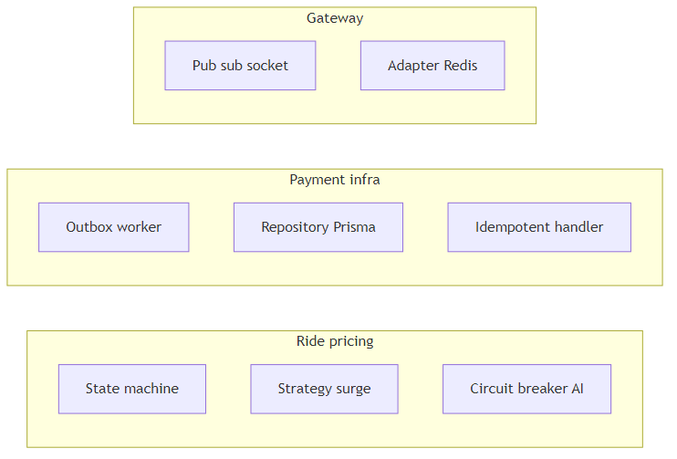

---

# 6. TỐI ƯU KIẾN TRÚC GIAO DỊCH VỚI THANH TOÁN TRỰC TUYẾN TRONG MSA

## 6.1. Bài toán giao dịch trong kiến trúc vi dịch vụ

Trong hệ thống này, các thay đổi tài chính liên quan ít nhất ba database: `ride_db`, `payment_db` và `wallet_db`. Không thể dùng một transaction ACID duy nhất bao phủ các database này mà vẫn giữ ranh giới service độc lập. Vì vậy, đề tài chọn cách tiếp cận:

- tách trách nhiệm domain rõ ràng,
- dùng event-driven choreography,
- chấp nhận eventual consistency có kiểm soát,
- bảo vệ các điểm nhạy cảm bằng idempotency và audit trail.

Đây là một lựa chọn kiến trúc có chủ đích. Nếu cố áp transaction xuyên `ride_db`, `payment_db` và `wallet_db`, hệ thống sẽ phải hy sinh tính độc lập của service và phụ thuộc vào cơ chế điều phối phức tạp, khó mở rộng. Ngược lại, khi chấp nhận eventual consistency nhưng kiểm soát chặt idempotency, event ordering và audit trail, hệ thống đạt được sự cân bằng tốt hơn giữa độ an toàn và khả năng triển khai thực tế trong MSA.

## 6.2. Idempotent payment processing

Vấn đề điển hình là MoMo hoặc VNPay có thể gửi IPN nhiều lần khi timeout mạng hoặc retry. Nếu không có idempotency key, cùng một giao dịch có thể bị cộng tiền hai lần.

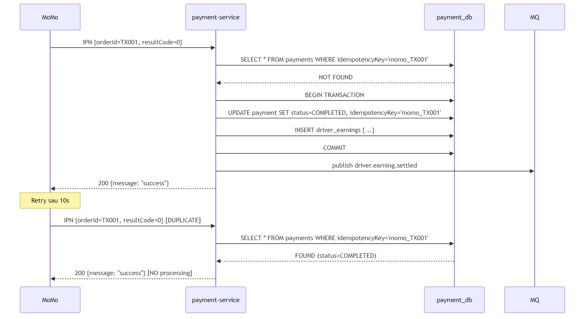

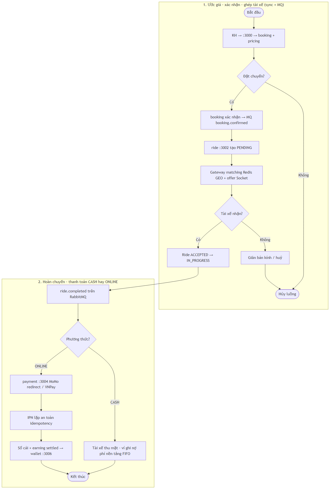

Cách xử lý trong hệ thống:

1. Xác minh chữ ký callback.
2. Tạo hoặc tra cứu `idempotencyKey` theo order/payment reference.
3. Nếu đã xử lý trước đó, trả kết quả thành công mà không ghi nhận thêm.
4. Nếu chưa xử lý, mới commit payment state và publish event.

Điểm then chốt ở đây là idempotency không chỉ ngăn cộng tiền trùng, mà còn bảo vệ toàn bộ chuỗi hậu thanh toán. Nếu payment bị ghi nhận hai lần, wallet-service sẽ nhận earning hai lần, merchant ledger sẽ lệch và đối soát sau đó sẽ sai theo. Vì vậy, idempotency tại payment-service chính là điểm khóa đầu tiên của tính nhất quán tài chính trong toàn hệ thống.

## 6.3. Transactional Outbox và choreography

Payment-service dùng Outbox pattern để tránh lỗi “ghi DB thành công nhưng publish event thất bại” hoặc ngược lại. Ride, Payment và Wallet phối hợp qua event choreography theo chuỗi:

1. `ride.completed`
2. `payment.completed` hoặc `payment.failed`
3. `driver.earning.settled` hoặc `refund.completed`
4. wallet-service cập nhật pending earning, debt hoặc refund adjustment

Nhờ đó, hệ thống không cần 2PC nhưng vẫn giữ được nhất quán nghiệp vụ ở mức chấp nhận được.

Trong cách tiếp cận này, mỗi service chỉ cam kết điều đúng trong phạm vi domain của mình. Ride cam kết rằng chuyến đã hoàn tất hợp lệ. Payment cam kết rằng kết quả thanh toán là đúng và đã được xác nhận. Wallet cam kết rằng sổ cái nội bộ phản ánh chính xác earnings, debt và available balance. Không có service nào phải nắm toàn bộ transaction xuyên suốt, nhưng cả chuỗi vẫn đạt tính nhất quán ở mức nghiệp vụ nhờ choreography.

## 6.4. Pending settlement T+24h và tất toán FIFO

Thu nhập online của tài xế không đi thẳng vào available balance. Thay vào đó, nó được giữ tại `pendingBalance` trong 24 giờ rồi mới được giải phóng. Nếu tài xế còn công nợ, hệ thống ưu tiên tất toán nợ cũ nhất trước.

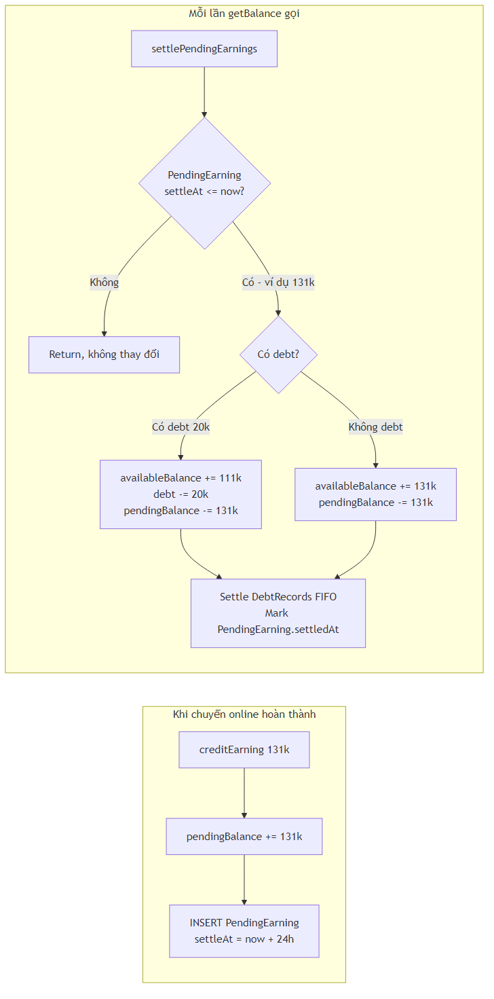

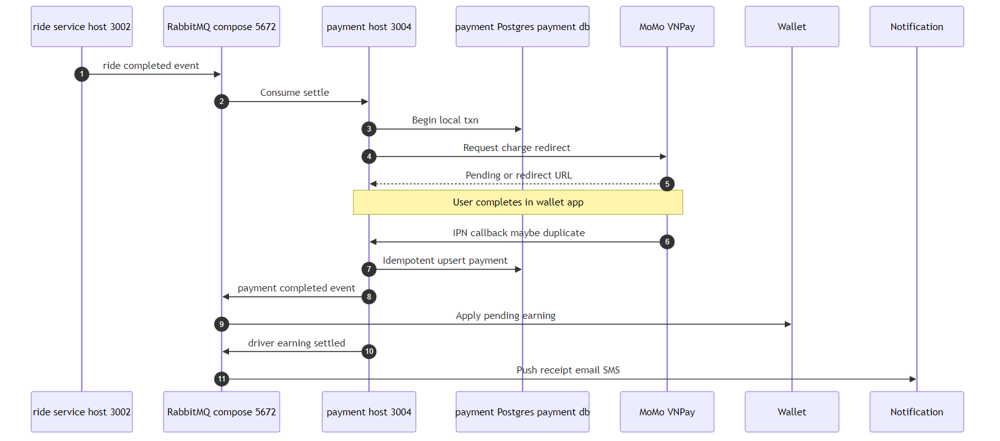

Ví dụ FIFO:

```text
Nợ A: 20k (cũ nhất)
Nợ B: 30k
Tài xế top-up 40k
→ Trả hết Nợ A 20k
→ Trả một phần Nợ B 20k
→ B còn 10k
```

Quy tắc T+24h và FIFO không chỉ là chi tiết kỹ thuật mà là cơ chế quản trị rủi ro tài chính. Việc giữ tiền ở `pendingBalance` tạo khoảng đệm cho hoàn tiền, tranh chấp hoặc đối soát với cổng thanh toán. Còn FIFO làm cho thứ tự thanh toán nợ minh bạch, dễ giải thích với tài xế và dễ kiểm toán đối với merchant ledger.

## 6.5. Quy tắc hoa hồng, voucher và refund

- MOTORBIKE / SCOOTER: 20%
- CAR_4: 18%
- CAR_7: 15%

Nguyên tắc kế toán:

- **grossFare** là giá trị chuyến đi trước phần giữ lại của nền tảng.
- **platformFee** được tính theo loại xe.
- **netEarnings** là phần thuộc tài xế sau khi trừ commission.
- **voucherDiscount** do nền tảng chịu, không làm giảm gross earning của tài xế.
- **refund.completed** điều chỉnh lại dòng tiền khi khách đã thanh toán online nhưng chuyến bị hủy.

Nhờ mô hình này, hệ thống tách được ba khái niệm thường bị lẫn trong các thiết kế đơn giản: giá trị dịch vụ khách hàng nhìn thấy, phần doanh thu thực thuộc tài xế và phần dòng tiền thuộc nền tảng. Sự tách bạch đó đặc biệt quan trọng khi cần giải thích báo cáo tài chính, ledger và các trường hợp hoàn tiền có sử dụng voucher.

---

# 7. ỨNG DỤNG AI (AI / AI AGENT PIPELINE)

## 7.1. Vai trò của AI trong hệ thống

AI trong đề tài không thay thế domain logic. Nó chỉ đóng vai trò hỗ trợ ra quyết định hoặc hỗ trợ người dùng tại các điểm sau:

- dự đoán ETA và hệ số giá,
- dự đoán xác suất tài xế nhận cuốc,
- ước lượng thời gian chờ từ lúc tạo yêu cầu đến khi có tài xế nhận,
- RAG chatbot trả lời câu hỏi hỗ trợ dựa trên tri thức nội bộ.

Trong implementation hiện tại, `ai-service` không phải một mô hình duy nhất mà là một tập bốn pipeline AI tách biệt, trong đó ba pipeline đầu là mô hình học có giám sát và pipeline cuối là truy hồi sinh câu trả lời. Bảng dưới đây tóm tắt đúng bề mặt kỹ thuật của service.

| Thành phần AI | Endpoint | Input chính | Output chính | Kỹ thuật | Vai trò nghiệp vụ |
|---|---|---|---|---|---|
| ETA + price prediction | `/api/predict` | `distance_km`, `time_of_day`, `day_type` | `eta_minutes`, `price_multiplier`, `surge_hint`, `recommended_driver_radius_km`, `confidence_score` | `MultiOutputRegressor(RandomForestRegressor)` | hỗ trợ pricing và gợi ý mức áp lực cung-cầu |
| Accept probability | `/api/predict/accept/batch` | ngữ cảnh chuyến + danh sách tài xế ứng viên | `p_accept`, `p_accept_clamped`, `confidence` cho từng tài xế | `GradientBoostingClassifier` | điều chỉnh điểm dispatch theo xác suất tài xế sẽ nhận cuốc |
| Wait-time prediction | `/api/predict/wait-time` | đặc trưng cung-cầu theo vùng và thời điểm | `wait_time_minutes`, `confidence` | `GradientBoostingRegressor` với `Huber loss` | ước lượng thời gian khách phải chờ trước khi có tài xế nhận |
| RAG chatbot | `/api/chat` | `message`, `history`, `top_k` | `answer`, `sources`, `mode`, `latency_ms` | `SentenceTransformer` + `FAISS` + `BM25` + LLM tùy chọn | hỗ trợ khách hàng và tài xế theo dữ liệu tri thức nội bộ |

Ngoài bốn pipeline trên, service còn có endpoint `/api/recommend-driver`. Đây không phải một mô hình thứ năm mà là lớp orchestration ghép ba mô hình dự đoán đầu tiên để xếp hạng ứng viên tài xế theo cùng một pipeline AI thống nhất.

Nhìn từ kiến trúc tổng thể, AI chỉ can thiệp ở lớp hỗ trợ quyết định chứ không được chạm vào transaction boundary. Một dự đoán sai có thể làm dispatch kém hiệu quả hơn hoặc ETA kém chính xác hơn, nhưng không được phép làm sai payment state, ride state hay wallet balance. Đây là nguyên tắc giúp hệ thống vừa tận dụng được AI vừa không đánh đổi tính ổn định của domain lõi.

## 7.2. Pipeline dự đoán machine learning

Ba mô hình dự đoán trong `ai-service` đều theo cùng một nguyên tắc triển khai: huấn luyện offline bằng script Python độc lập, lưu payload dưới dạng `.joblib`, sau đó FastAPI chỉ nạp model vào bộ nhớ để suy luận online. Các model được train ngay trong quá trình build image Docker và được lưu vào thư mục `app/models/`.

Việc tách train và infer thành hai giai đoạn riêng mang lại ba lợi ích. Thứ nhất, service suy luận có thể nhỏ gọn và dễ triển khai hơn. Thứ hai, quá trình huấn luyện lại model không làm gián đoạn luồng request chính. Thứ ba, backend Node.js có thể coi AI như một dependency HTTP thuần túy, nhờ đó giảm mức coupling giữa domain service và hạ tầng machine learning.

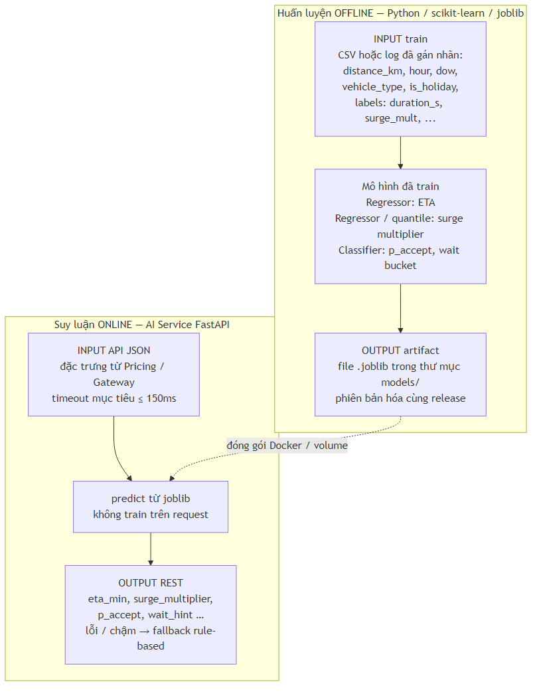

### 7.2.1. Mô hình ETA và hệ số giá (`/api/predict`)

Đây là mô hình hồi quy đa đầu ra dùng để dự đoán đồng thời hai đại lượng: thời gian ETA và hệ số giá theo ngữ cảnh chuyến. Mô hình phục vụ lớp pricing và lớp hỗ trợ điều phối, chứ không tự ý cập nhật giá cuối cùng hay trạng thái chuyến.

- **Input API:** `distance_km`, `time_of_day`, `day_type`.
- **Mã hóa đầu vào:** service biến `time_of_day` thành nhị phân `0/1` cho `OFF_PEAK/RUSH_HOUR`, `day_type` thành `0/1` cho `WEEKDAY/WEEKEND`, sau đó ghép với `distance_km` thành vector 3 chiều và chuẩn hóa bằng `StandardScaler`.
- **Output model:** hai giá trị liên tục là `eta_minutes` và `price_multiplier`.
- **Output response:** ngoài hai giá trị dự đoán, service còn sinh thêm `recommended_driver_radius_km`, `surge_hint`, `confidence_score`, `reason_code`, `model_version`, `feature_version`, `inference_ms` và `insights` để downstream có thể dùng trực tiếp.
- **Train như nào:** script `training/train_model.py` sinh 1000 mẫu synthetic. Nhãn `eta_minutes` được tạo từ công thức vận tốc nền `30 km/h` khi vắng và `20 km/h` khi giờ cao điểm; nhãn `price_multiplier` được tạo từ base `1.0`, cộng thêm `0.10–0.15` cho giờ cao điểm và giảm `0.05` cho cuối tuần. Sau đó dữ liệu được chia train/test theo tỷ lệ `80/20`, chuẩn hóa đầu vào, rồi huấn luyện `MultiOutputRegressor` bọc `RandomForestRegressor` với `100` cây và `max_depth = 10`.
- **Tính năng nghiệp vụ:** mô hình này không chỉ dự đoán ETA cho UI mà còn tạo ra gợi ý radius tìm tài xế và mức surge gợi ý đã được chặn biên (`bounded`) trước khi trả về pricing/gateway.

Sơ đồ xử lý của mô hình ETA và hệ số giá như sau:

```text
distance_km + time_of_day + day_type
		↓
      encode nhị phân + StandardScaler
		↓
   Multi-Output Random Forest Regressor
		↓
     eta_minutes + price_multiplier
		↓
 clamp biên + confidence + surge/radius hints
		↓
	  phản hồi cho pricing/gateway
```

### 7.2.2. Mô hình dự đoán xác suất tài xế nhận cuốc (`/api/predict/accept/batch`)

Khác với mô hình ETA, mô hình này không trả ra một giá trị cho cả chuyến mà trả ra xác suất chấp nhận cho từng tài xế ứng viên trong cùng một batch. Đây là thành phần quan trọng nhất của lớp AI hỗ trợ dispatch vì nó giúp hệ thống phân biệt tài xế “gần” với tài xế “gần và nhiều khả năng sẽ nhận cuốc”.

- **Input API cấp ngữ cảnh chuyến:** `distance_km`, `fare_estimate`, `surge_multiplier`, `hour_of_day`, `pickup_zone`, `demand_level`, `available_driver_count`.
- **Input API cấp tài xế:** với mỗi ứng viên, request mang `driver_id`, `eta_minutes`, `driver_accept_rate`, `driver_cancel_rate`.
- **Mã hóa đầu vào:** service biến request thành vector 15 đặc trưng cho mỗi cặp `(chuyến, tài xế)`, gồm `eta_log`, `distance_log`, `fare_k_log`, `surge`, `accept_rate`, `cancel_rate`, `hour_sin`, `hour_cos`, one-hot `zone_A/B/C`, `demand_score`, `avail_log`, `fare_per_eta`, `demand_supply_ratio`.
- **Output model:** xác suất nhị phân `p_accept = P(driver sẽ nhận cuốc)`.
- **Output response:** cho mỗi tài xế, service trả `p_accept`, `p_accept_clamped` trong khoảng `[0.3, 1.2]` để dùng trực tiếp như hệ số điều chỉnh điểm dispatch, cùng với `confidence`, `model_version`, `reason_code` và `inference_ms`.
- **Train như nào:** script `training/train_accept_model.py` sinh 5000 mẫu synthetic. Nhãn `accept` được lấy bằng cách xây dựng một `logit` mô phỏng hành vi tài xế thực tế rồi lấy mẫu Bernoulli qua hàm sigmoid. Các luật sinh nhãn gồm: ETA dưới 5 phút tăng xác suất nhận, ETA trên 15 phút giảm, `driver_accept_rate` kéo xác suất lên, `driver_cancel_rate` kéo xuống mạnh, cầu cao làm xác suất tăng, giá quá thấp làm xác suất giảm. Mô hình được huấn luyện bằng `GradientBoostingClassifier` với `200` cây, `max_depth = 4`, `learning_rate = 0.05`, `subsample = 0.8`, `min_samples_leaf = 20`, chia tập train/test có `stratify` và đánh giá bằng `ROC-AUC` cùng `classification_report`.
- **Tính năng nghiệp vụ:** mô hình này cho phép AI không thay thế hoàn toàn scoring rule-based mà chỉ hiệu chỉnh có kiểm soát; nếu mô hình không khả dụng, service trả về `p_accept = 1.0` như một hệ số trung tính để không phá vỡ dispatch hiện tại.

Sơ đồ xử lý của mô hình xác suất nhận cuốc như sau:

```text
ngữ cảnh chuyến + danh sách tài xế ứng viên
		↓
    feature engineering cho từng (ride, driver)
		↓
     Gradient Boosting Classifier (15 features)
		↓
  p_accept cho từng tài xế trong batch suy luận
		↓
 clamp [0.3, 1.2] + confidence + reason_code
		↓
      đưa vào engine xếp hạng dispatch
```

### 7.2.3. Mô hình dự đoán thời gian chờ (`/api/predict/wait-time`)

Mô hình thứ ba tập trung vào trải nghiệm tiền chuyến của khách hàng. Thay vì dự đoán thời gian di chuyển, mô hình này dự đoán số phút từ lúc hệ thống bắt đầu tìm tài xế đến khi có tài xế nhận cuốc.

- **Input API:** `demand_level`, `active_booking_count`, `available_driver_count`, `hour_of_day`, `day_of_week`, `surge_multiplier`, `avg_accept_rate`, `historical_wait_p50`, `pickup_zone`.
- **Mã hóa đầu vào:** service ánh xạ `demand_level` thành thứ bậc `0/1/2`, lấy `log1p` cho booking và số tài xế khả dụng, dùng đặc trưng chu kỳ `hour_sin/hour_cos` và `dow_sin/dow_cos`, đồng thời tạo thêm `zone_A` và `demand_supply_ratio`. Tổng cộng mô hình dùng 12 đặc trưng.
- **Output model:** `wait_time_minutes` trong khoảng `[1, 15]`.
- **Output response:** `wait_time_minutes`, `confidence`, `model_version`, `reason_code`, `inference_ms`.
- **Train như nào:** script `training/train_wait_model.py` sinh 6000 mẫu synthetic và sinh nhãn theo logic domain: cầu cao làm tăng thời gian chờ, nhiều tài xế làm giảm, nhiều booking đang hoạt động làm tăng, giờ cao điểm làm tăng, `avg_accept_rate` thấp làm tăng, `surge` cao có thể kéo thời gian chờ xuống do thu hút thêm tài xế. Giá trị cuối cùng còn được hòa trộn với `historical_wait_p50` và thêm nhiễu Gaussian để tránh dữ liệu quá lý tưởng. Mô hình dùng `GradientBoostingRegressor` với `Huber loss`, `200` cây, `max_depth = 4`, `learning_rate = 0.08`, `subsample = 0.85`, `min_samples_leaf = 10`, đánh giá bằng `MAE` và `MAPE` trước khi lưu.
- **Tính năng nghiệp vụ:** mô hình này hỗ trợ hiển thị thời gian chờ cho khách hàng, đánh giá vùng thiếu cung và có thể dùng như tín hiệu vận hành cho gateway hoặc dashboard.

Sơ đồ xử lý của mô hình wait-time như sau:

```text
các tín hiệu cung-cầu theo vùng và thời điểm
		↓
  ordinal/log/cyclical encoding + feature engineering
		↓
 Gradient Boosting Regressor (Huber loss, 12 features)
		↓
	 wait_time_minutes [1, 15]
		↓
       confidence + heuristic fallback nếu lỗi
		↓
     phản hồi cho UI và lớp orchestration dispatch
```

### 7.2.4. Lớp orchestration xếp hạng tài xế (`/api/recommend-driver`)

Endpoint `/api/recommend-driver` là lớp phối hợp chứ không phải một mô hình huấn luyện riêng. Nó gọi lần lượt ba pipeline dự đoán phía trên rồi hợp nhất kết quả để tạo danh sách tài xế đã được xếp hạng. Trình tự bên trong endpoint như sau:

1. Gọi mô hình ETA + surge để lấy `surge_hint`, `price_multiplier`, `eta_minutes` và `confidence_score` cho ngữ cảnh chuyến.
2. Gọi mô hình accept probability theo batch để lấy `p_accept` cho toàn bộ ứng viên.
3. Gọi mô hình wait-time để lấy `wait_time_minutes` toàn cục cho bối cảnh hiện tại.
4. Áp công thức điểm tổng hợp: `score = (0.40×eta + 0.20×rating + 0.15×accept - 0.15×cancel + 0.05×idle + 0.05×priority + aiAdj) × pAccept`.
5. Trả về `ranked_drivers`, `surge_prediction`, `wait_time_prediction`, `demand_level`, `ai_pipeline_summary` và `inference_ms`.

Điểm quan trọng của endpoint này là AI không trực tiếp quyết định tài xế thắng theo kiểu “black box”. Nó vẫn bám vào scoring formula của gateway và chỉ dùng kết quả mô hình để hiệu chỉnh các thành phần của điểm, nhờ đó hệ thống vẫn giải thích được vì sao một tài xế được ưu tiên.

Sơ đồ orchestration như sau:

```text
request chuyến + danh sách candidates
		↓
      /predict  → ETA + price multiplier
		↓
 /predict/accept/batch → p_accept từng tài xế
		↓
 /predict/wait-time → thời gian chờ toàn cục
		↓
  hợp nhất theo scoring formula của dispatch
		↓
	trả về danh sách tài xế xếp hạng
```

## 7.3. AI agent / RAG pipeline

Khác với ba mô hình dự đoán phía trên, pipeline RAG không học nhãn đầu ra từ dữ liệu huấn luyện có giám sát. Nó kết hợp mô hình embedding, chỉ mục truy hồi và LLM tùy chọn để trả lời câu hỏi hỗ trợ dựa trên kho tri thức nội bộ của FoxGo.

- **Input API:** `message`, `history`, `top_k`.
- **Output response:** `answer`, `sources`, `retrieval_count`, `score_max`, `mode`, `latency_ms`.
- **Nguồn tri thức:** các file `.txt` trong thư mục `app/data/knowledge/`, bao phủ booking guide, pricing, payment, vouchers, cancellation, safety, wallet, FAQ, earnings, disputes và vận hành tài xế.
- **Indexing như nào:** khi service khởi động, tài liệu được nạp vào bộ nhớ, tách theo cặp Hỏi/Đáp và chunk theo kích thước khoảng `450` ký tự với overlap `80`, sau đó được embed bằng `paraphrase-multilingual-MiniLM-L12-v2`. Các vector được đưa vào chỉ mục `FAISS` trong bộ nhớ, đồng thời một chỉ mục `BM25` được xây song song để phục vụ truy hồi từ khóa.
- **Suy luận như nào:** ở thời điểm chat, service làm giàu câu hỏi bằng lịch sử hội thoại gần nhất, sinh embedding cho truy vấn, chạy hybrid search theo hai kênh semantic và keyword, gộp kết quả bằng `Reciprocal Rank Fusion`, dựng `context` rồi mới gọi LLM.
- **Sinh câu trả lời như nào:** thứ tự provider được ưu tiên là `Claude → Groq → OpenAI → template retrieval fallback`. Nếu không có context phù hợp, service trả về thông điệp `no_context`; nếu các LLM ngoài thất bại, service vẫn có thể trả lời bằng đoạn trích sạch từ chunk tốt nhất.
- **Tính năng nghiệp vụ:** hỗ trợ cả khách hàng và tài xế bằng tiếng Việt, có khả năng xử lý câu hỏi nối tiếp, có trích nguồn tri thức và không được phép thay đổi bất kỳ trạng thái nghiệp vụ lõi nào.

RAG được dùng ở đây với mục tiêu hỗ trợ người dùng và giảm tải cho kênh hỗ trợ thủ công, chứ không phải để điều hành nghiệp vụ. Điều này rất quan trọng vì câu trả lời của AI có thể hữu ích về mặt giao tiếp nhưng không đủ điều kiện để trở thành một hành động giao dịch. Bởi vậy, mọi output của RAG chỉ dừng ở mức tư vấn, giải thích hoặc dẫn hướng thao tác cho người dùng.

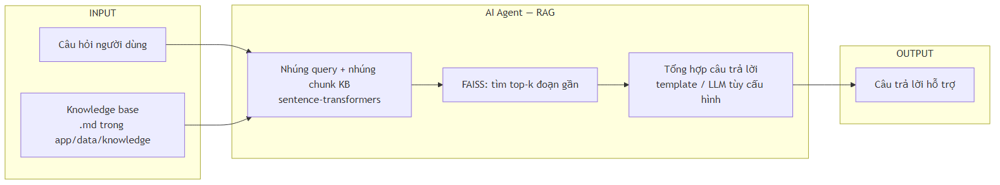

Sơ đồ logic của pipeline RAG như sau:

```text
knowledge base .txt
	↓
Q&A-aware chunking + embedding multilingual
	↓
      FAISS index + BM25 index
	↓
message + history + top_k
	↓
query enrichment + hybrid retrieval + RRF fusion
	↓
context builder
	↓
Claude / Groq / OpenAI / template fallback
	↓
answer + sources + mode + latency
```

## 7.4. Nguyên tắc tích hợp và fallback

1. AI Service là **optional component**.
2. Gateway và Pricing luôn đặt **timeout ngắn** cho request AI.
3. Khi AI lỗi, hệ thống dùng công thức rule-based để vẫn hoạt động bình thường.
4. AI không được sở hữu source of truth của bất kỳ trạng thái nghiệp vụ lõi nào.

Ở mức triển khai cụ thể, chiến lược fallback của từng pipeline như sau:

| Thành phần | Cách đóng gói / train | Fallback cục bộ | Ý nghĩa |
|---|---|---|---|
| ETA + price | train trong `Dockerfile` bằng `python training/train_model.py`, lưu `eta_price_model.joblib` | downstream service giới hạn lại surge/radius và có thể quay về rule-based nếu AI timeout hoặc phản hồi không hợp lệ | không để AI làm vỡ luồng pricing hoặc matching |
| Accept probability | train bằng `python training/train_accept_model.py`, lưu `accept_model.joblib` | nếu model không nạp được, service trả `p_accept = 1.0` như hệ số trung tính | dispatch vẫn chạy theo base score hiện có |
| Wait-time | train bằng `python training/train_wait_model.py`, lưu `wait_model.joblib` | nếu model lỗi hoặc thiếu, service dùng heuristic từ tỷ lệ cung-cầu | UI vẫn có thể hiển thị thời gian chờ gần đúng |
| RAG chatbot | không train nhãn; service chỉ index tri thức lúc startup và nạp embedding model | nếu không có ngữ cảnh hoặc LLM ngoài lỗi, chatbot trả template answer / `no_context` | chatbot không làm gián đoạn hệ thống lõi |

Ngoài ra, `Dockerfile` của `ai-service` còn tải sẵn embedding model `paraphrase-multilingual-MiniLM-L12-v2` trong giai đoạn build để giảm thời gian warm-up khi container khởi động. Ba file model `.joblib` được sinh sẵn trong image giúp service luôn khởi động với mô hình đồng bộ, hạn chế lệch phiên bản giữa train và infer.

Nhờ bốn nguyên tắc này, AI trở thành một lớp tăng cường năng lực thay vì một điểm nghẽn hệ thống. Đây cũng là lý do phần AI được tách riêng trong báo cáo: nó có vai trò kiến trúc rõ ràng, nhưng không làm thay đổi ownership của các bounded context đã xác định ở Phần 3.

---

# 8. GIÁM SÁT HỆ THỐNG (SYSTEM MONITOR)

## 8.1. Thành phần quan sát hệ thống

| Thành phần | Vai trò |
|---|---|
| Prometheus | Thu metrics HTTP, service metrics, system metrics |
| Grafana | Hiển thị dashboard CPU, RAM, container, request metrics |
| Health endpoints | Kiểm tra nhanh tình trạng sẵn sàng của Gateway và service |
| Loki / Promtail (khi bật) | Thu log tập trung và tra cứu theo service |

Bốn thành phần này phản ánh ba mức quan sát khác nhau. Metrics cho biết xu hướng tải và hiệu năng, health endpoint cho biết service còn sẵn sàng hay không, còn log tập trung cho phép truy vết nguyên nhân khi có sự cố. Sự kết hợp này đặc biệt cần thiết trong hệ vi dịch vụ vì lỗi thường không nằm trọn trong một process duy nhất mà lan qua nhiều hop giao tiếp.

## 8.2. Mục tiêu giám sát

Phần monitor không chỉ phục vụ vận hành mà còn là căn cứ đánh giá hệ thống trong báo cáo. Các chỉ số được quan tâm gồm:

- số lượng container / service đang hoạt động,
- latency các API chính,
- thời gian dispatch,
- tình trạng RabbitMQ, Redis, PostgreSQL, MongoDB,
- tỷ lệ lỗi của payment callback và realtime connection.

Những chỉ số này được chọn vì chúng bám trực tiếp vào các use case quan trọng nhất của hệ thống. Nếu latency API tăng cao, trải nghiệm đặt xe sẽ giảm. Nếu dispatch kéo dài, tỷ lệ tìm được tài xế sẽ giảm. Nếu Redis hoặc RabbitMQ bất ổn, các luồng realtime và event-driven sẽ bị ảnh hưởng dây chuyền. Do đó, monitor trong đề tài không chỉ để “xem máy chủ còn sống” mà để liên hệ trực tiếp giữa hành vi hạ tầng với chất lượng nghiệp vụ.

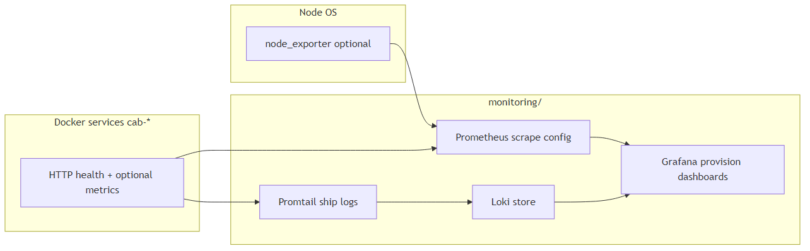

## 8.3. Kết nối monitor với mô hình triển khai

Trong triển khai Docker Compose hoặc Swarm demo, stack quan sát chạy cùng cluster ứng dụng. Điều này cho phép quan sát hành vi của các service mà không cần truy cập trực tiếp vào từng container bằng tay.

Ở góc độ vận hành, cách bố trí này còn hỗ trợ quá trình đánh giá và demo hệ thống. Người vận hành có thể đối chiếu nhanh giữa log của một service, metric của một container và event xuất hiện trong RabbitMQ để xác định nghẽn ở đâu. Đây là nền tảng để sau này mở rộng sang alerting, tracing hoặc SLO/SLA nếu hệ thống được nâng lên môi trường production.

---

# 9. BẢO MẬT HỆ THỐNG VÀ DỮ LIỆU (INFORMATION SECURITY, DATA SECURITY)

## 9.1. Ranh giới tin cậy và bề mặt tấn công

Hệ thống được chia thành bốn vùng: client public, gateway edge, internal services và data layer. Cách chia này giúp xác định chính xác nơi nào kiểm tra token, nơi nào được tin cậy, và nơi nào không được exposed ra ngoài.

Việc phân chia trust boundary như vậy giúp tránh một lỗi thiết kế thường gặp trong các demo microservices: coi mọi traffic trong cluster là an toàn tuyệt đối. Trong đề tài này, chỉ sau khi request đi qua gateway và được chuẩn hóa header định danh thì downstream service mới xử lý tiếp theo contract nội bộ. Điều đó làm rõ nơi đặt cơ chế bảo vệ và giảm nguy cơ mở nhầm service ra Internet hoặc bỏ sót bước xác thực ở edge.


## 9.2. Cơ chế bảo mật chính

| Rủi ro | Cách xử lý |
|---|---|
| Lộ mật khẩu | bcrypt hash, không lưu plaintext |
| Lộ OTP | hash + TTL trong Redis; endpoint debug chỉ bật ở dev |
| Gọi API sai quyền | Gateway kiểm tra JWT và role trước khi forward |
| Giả mạo IPN | Payment xác minh chữ ký MoMo/VNPay |
| Gọi thẳng service nội bộ | internal token, private network |
| Sửa sai dữ liệu tài chính | wallet transactions và merchant ledger append-only |

Các cơ chế trên thể hiện cách tiếp cận phòng thủ nhiều lớp. Mỗi lớp chỉ giải quyết một kiểu rủi ro cụ thể, nhưng khi ghép lại sẽ tạo thành chuỗi bảo vệ tương đối hoàn chỉnh từ danh tính người dùng, phân quyền API, xác minh đối tác ngoài cho đến kiểm toán dữ liệu tài chính. Cách tiếp cận này phù hợp với hệ thống có nhiều điểm tích hợp như ride-hailing, nơi rủi ro không chỉ đến từ người dùng cuối mà còn từ callback, service nội bộ và sai sót vận hành.

## 9.3. Bảo mật dữ liệu và kiểm toán

Ba nhóm dữ liệu cần kiểm soát chặt nhất là:

- **dữ liệu định danh:** số điện thoại, thông tin tài khoản, refresh token,
- **dữ liệu vận hành chuyến:** vị trí tài xế, trạng thái ride, log realtime,
- **dữ liệu tài chính:** payment, refund, pending earning, debt, merchant ledger.

Trong hệ thống, source of truth của dữ liệu tài chính được tách riêng theo bounded context và ghi dấu vết bằng transaction log thay vì cập nhật đè không truy vết.

Từ góc nhìn kiểm toán, đây là điểm rất quan trọng. Khi phát sinh tranh chấp hoặc cần giải trình số dư, hệ thống phải trả lời được dữ liệu nào sinh ra từ event nào, do service nào ghi nhận và đã đi qua những trạng thái nào. Vì vậy, append-only transaction log và merchant ledger không chỉ có ý nghĩa kỹ thuật mà còn là cơ sở để duy trì tính minh bạch và khả năng truy xuất nguồn gốc dữ liệu.

---

# 10. CÀI ĐẶT VÀ TRIỂN KHAI (CI/CD)

## 10.1. Tổ chức mã nguồn theo monorepo

```text
cab-booking-system/
├── apps/
│   ├── customer-app/
│   ├── driver-app/
│   └── admin-dashboard/
├── services/
│   ├── api-gateway/
│   ├── auth-service/
│   ├── user-service/
│   ├── driver-service/
│   ├── booking-service/
│   ├── ride-service/
│   ├── pricing-service/
│   ├── payment-service/
│   ├── wallet-service/
│   ├── notification-service/
│   ├── review-service/
│   └── ai-service/
├── shared/
├── scripts/
├── docs/
└── docker-compose.yml
```

Monorepo giúp quản lý thống nhất type dùng chung, proto files, scripts seed/reset, docker stack và tài liệu dịch vụ.

Đối với đề tài này, monorepo còn giúp việc giữ đồng bộ giữa code, tài liệu và triển khai trở nên dễ hơn. Khi một bounded context thay đổi contract hoặc shared type, frontend, gateway và service liên quan có thể được cập nhật trong cùng một nhịp. Đây là lợi thế đáng kể so với mô hình multi-repo trong bối cảnh nghiên cứu và phát triển một hệ thống nhiều service có quan hệ chặt chẽ.

## 10.2. Môi trường chạy cục bộ

Môi trường dev chuẩn dùng Docker Compose cho database, broker và backend; frontend có thể chạy riêng ở chế độ dev server. Các lệnh chi tiết được giữ nguyên trong Phụ lục B để tránh lặp lại trong thân báo cáo.

Thiết kế môi trường như vậy cân bằng giữa tính tiện dụng và tính gần với thực tế triển khai. Các thành phần hạ tầng như PostgreSQL, MongoDB, Redis và RabbitMQ được container hóa để giảm sai khác giữa máy phát triển. Trong khi đó, frontend dev server vẫn chạy riêng để hỗ trợ hot reload và rút ngắn vòng lặp chỉnh sửa giao diện. Nhờ vậy, quá trình phát triển vừa linh hoạt vừa vẫn giữ được bức tranh đầy đủ của hệ thống phân tán.

## 10.3. Triển khai thử nghiệm trên AWS và Docker Swarm

Repo kèm cấu hình và tài liệu cho triển khai demo trên AWS EC2 bằng Docker Swarm. Mục tiêu của tầng này là minh họa cách scale service, tổ chức manager/worker và dùng Elastic IP cho entry point công khai.

Phạm vi triển khai ở đây được xác định rõ là triển khai thử nghiệm phục vụ nghiên cứu và minh họa kiến trúc, chưa phải môi trường production-grade hoàn chỉnh. Tuy nhiên, việc chuẩn bị sẵn topology manager/worker, overlay network và image deployment pipeline cho thấy giải pháp đã vượt qua mức prototype cục bộ và đủ cơ sở để phát triển tiếp lên môi trường vận hành nghiêm túc hơn.

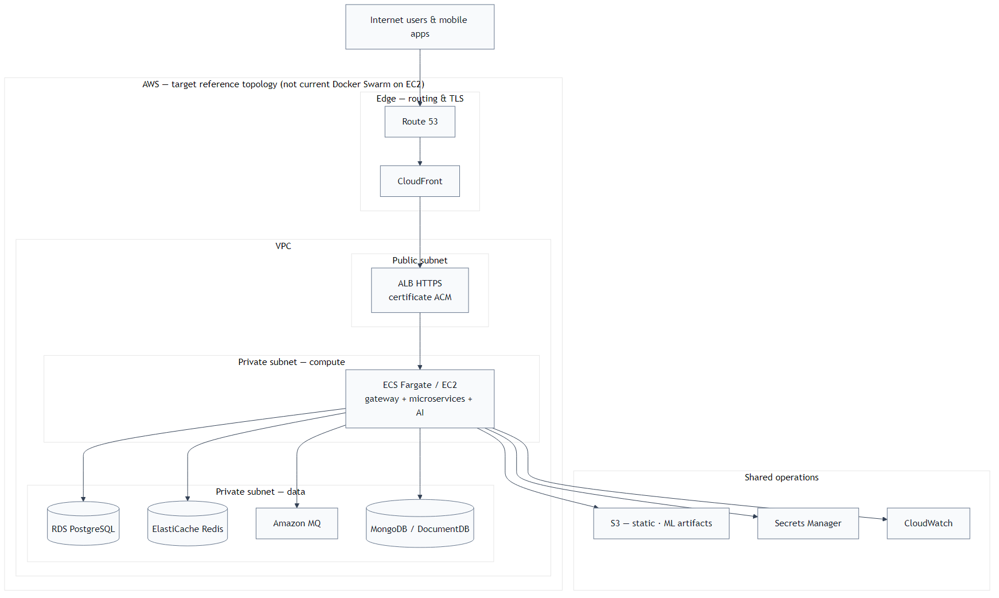

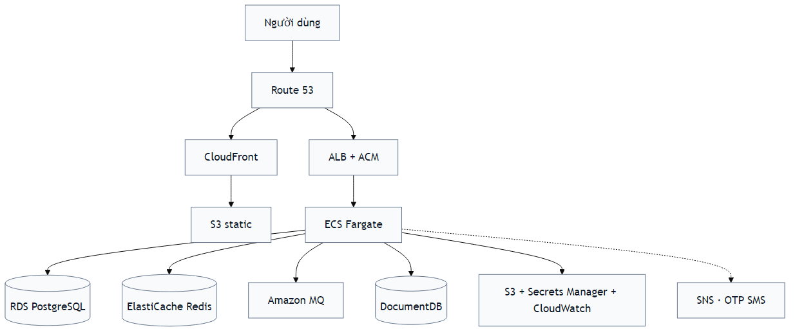

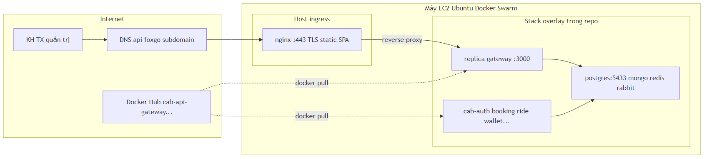

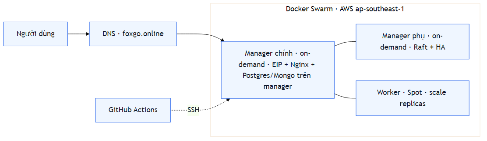

## 10.4. Quy trình CI/CD

Pipeline CI/CD được xây theo các bước:

1. checkout mã nguồn,
2. cài dependency và build,
3. build Docker image,
4. đẩy image lên Docker Hub,
5. SSH vào node manager và chạy `docker stack deploy` hoặc script triển khai tương ứng.

Trong monorepo nhiều workspace, CI/CD không chỉ là tự động build image mà còn là cơ chế giữ tính nhất quán phát hành. Một thay đổi ở `shared/` có thể ảnh hưởng đến nhiều service; một thay đổi ở gateway có thể tác động trực tiếp tới cả ba frontend. Vì vậy, pipeline phải đảm bảo thứ tự build, version image và cấu hình môi trường được quản lý minh bạch để tránh tình trạng service chạy lệch contract sau khi deploy.

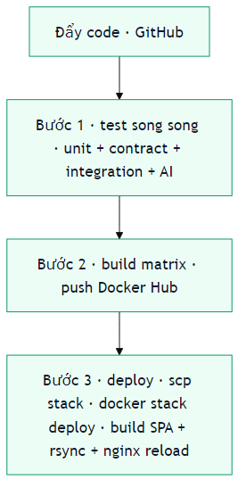

## 10.5. Mối liên hệ giữa triển khai và vận hành

Triển khai không được xem là bước tách rời với DDD hay kiến trúc. Việc giữ rõ data ownership, event flow, health endpoint và monitor stack ngay từ đầu giúp pipeline triển khai đơn giản hơn và ít lỗi hơn khi nâng số lượng replica.

Điều này cho thấy giá trị thực tế của việc phân tích DDD đúng ngay từ đầu. Khi ownership rõ ràng, service có thể được đóng gói và triển khai độc lập hơn. Khi event flow rõ ràng, việc quan sát và rollback dễ hơn. Khi health endpoint và metrics được chuẩn hóa, vận hành không còn phụ thuộc vào việc ssh thủ công để đoán tình trạng hệ thống. Triển khai vì vậy là phần nối dài tự nhiên của quyết định thiết kế, không phải bước chắp vá sau cùng.

---

# 11. TỐI ƯU HÓA HỆ THỐNG ĐÁP ỨNG NHU CẦU (SYSTEM SCALABILITY)

## 11.1. Mục tiêu mở rộng

Hệ thống cần đáp ứng hai hướng mở rộng chính:

- tăng số lượng tài xế online và khách hàng gửi request đồng thời,
- tăng số sự kiện thanh toán, wallet settlement và realtime messages mà không làm sập một service đơn lẻ.

Hai mục tiêu này tương ứng với hai loại áp lực khác nhau. Áp lực thứ nhất là lưu lượng tương tác đồng bộ, thường tác động mạnh lên gateway, Redis GEO và các API đọc/ghi chính. Áp lực thứ hai là lưu lượng bất đồng bộ và hậu giao dịch, thường dồn vào RabbitMQ, payment-service và wallet-service. Việc nhận diện riêng hai nhóm tải này giúp chọn chiến lược scale phù hợp thay vì chỉ tăng tài nguyên đồng loạt.

## 11.2. Các chiến lược scale được áp dụng

| Chiến lược | Ý nghĩa |
|---|---|
| Stateless services + replicas | Cho phép scale ngang Gateway và nhiều service backend |
| Redis GEO | Truy vấn tài xế gần nhất nhanh hơn so với quét DB |
| Redis Adapter cho Socket.IO | Hỗ trợ nhiều Gateway instance dùng chung realtime rooms |
| RabbitMQ | Tách producer và consumer theo mô hình async |
| Database per service | Tránh bottleneck schema dùng chung |
| AI tách service riêng | Scale AI độc lập, không làm nghẽn domain lõi |

Các chiến lược này bổ trợ cho nhau thay vì hoạt động độc lập. Stateless service giúp tăng replica; Redis và RabbitMQ hấp thụ áp lực truy vấn vị trí và event; database per service giới hạn phạm vi nghẽn cổ chai; còn AI tách riêng giúp hệ lõi không bị phụ thuộc vào tài nguyên suy luận. Kết hợp lại, chúng tạo nên một kiến trúc có thể mở rộng theo từng điểm nóng thay vì buộc cả hệ thống phải scale đồng loạt.

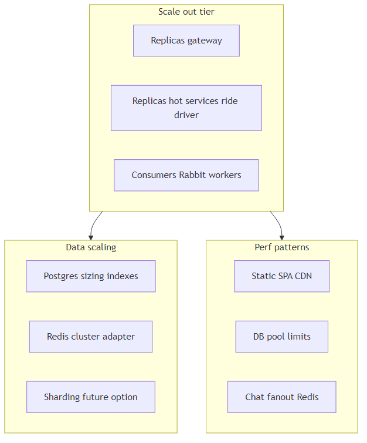

## 11.3. Kết quả đo đáp ứng

### 11.3.1. Response time của các API chính

| Endpoint | Min | Avg | Max | P95 |
|---|---|---|---|---|
| GET /wallet/balance | 35ms | 42ms | 68ms | 61ms |
| GET /wallet/debt-records | 28ms | 35ms | 55ms | 49ms |
| POST /drivers/me/online | 150ms | 185ms | 310ms | 280ms |
| POST /rides | 180ms | 210ms | 380ms | 345ms |
| GET /rides/:id | 22ms | 28ms | 45ms | 40ms |
| POST /rides/:id/accept | 88ms | 110ms | 175ms | 160ms |

Các số liệu này cho thấy những API đọc hoặc truy vấn trạng thái cục bộ có độ trễ thấp và ổn định, trong khi các API khởi phát luồng nghiệp vụ dài như tạo chuyến hay bật online tài xế có độ trễ cao hơn do phải đi qua nhiều bước kiểm tra và phối hợp liên service. Đây là kết quả phù hợp với kiến trúc đã chọn và phản ánh đúng bản chất khác nhau giữa read path và orchestration path.

### 11.3.2. Dispatch timing theo số vòng bán kính

| Kịch bản | Số vòng | Thời gian |
|---|---|---|
| Có tài xế trong 2km | 1 | ~800ms |
| Có tài xế trong 3km | 2 | ~2.1s |
| Có tài xế trong 5km | 3 | ~4.5s |
| Không có tài xế trong 5km | 3 (thất bại) | ~5.2s |

Kết quả này cho thấy chi phí của chiến lược multi-round dispatch nằm ở độ trễ tăng dần khi cần mở rộng bán kính. Tuy nhiên, đổi lại hệ thống cải thiện xác suất tìm được tài xế mà không phải broadcast ngay từ đầu tới toàn bộ khu vực rộng. Đây là một đánh đổi hợp lý cho bối cảnh đề tài, nơi ưu tiên cân bằng giữa trải nghiệm chờ đợi và hiệu quả sử dụng tài nguyên điều phối.

### 11.3.3. <span style="color:#0B6E4F;">Phân tầng kiểm thử đã áp dụng</span>

<span style="color:#0B6E4F;">Nội dung màu xanh trong hai mục kiểm thử dưới đây là phần bổ sung để làm rõ hệ thống đã được kiểm thử theo tầng nào, bằng công cụ gì và nhằm giảm loại rủi ro nào.</span>

<span style="color:#0B6E4F;">Để việc đánh giá không dừng ở mức “hệ thống đã chạy được”, quá trình kiểm thử trong repo được tổ chức theo nhiều tầng khác nhau. Mỗi tầng nhắm vào một loại rủi ro riêng: sai logic cục bộ, lệch contract giữa service, hạ tầng không sẵn sàng, lỗi tích hợp giữa frontend và backend, hoặc lỗi ở các flow demo phân tán.</span>

| Tầng kiểm thử | Công cụ / lệnh | Phạm vi | Mục tiêu chính |
|---|---|---|---|
| Unit test backend | `npm run test:unit` | các service Node.js/TypeScript và shared package | kiểm tra logic cục bộ như commission, refund, idempotency, state transitions |
| Contract test | `npm run test:contract` | driver-service và ride-service | kiểm tra contract giữa các service nội bộ không bị lệch khi thay đổi response |
| Integration infrastructure check | `npm run test:integration` | PostgreSQL, MongoDB, Redis, RabbitMQ, AI service trong môi trường tích hợp | xác nhận hạ tầng và health endpoint reachable trước khi chạy stack đầy đủ |
| Browser smoke test | `npm run smoke:browser` hoặc các spec Cypress riêng | customer-app, driver-app, admin-dashboard thông qua gateway | kiểm tra luồng người dùng thực từ UI đến backend |
| AI API test | `pytest services/ai-service/tests/test_predict_api.py` | FastAPI endpoints của ai-service | kiểm tra schema response, validation 422, dải giá trị dự đoán |
| Manual/demo scenario | `docs/test-scenarios.md` | flow liên service và nghiệp vụ phân tán | kiểm tra dispatch nhiều vòng, voucher, chat, admin dashboard, AI fallback |

<span style="color:#0B6E4F;">Việc kết hợp giữa test tự động và scenario demo thủ công là phù hợp với bối cảnh khóa luận. Test tự động giúp chặn regression ở các quy tắc cục bộ; còn scenario thủ công giúp chứng minh các luồng end-to-end nhiều service, vốn thường khó gói gọn hết trong một unit test đơn lẻ.</span>

### 11.3.4. <span style="color:#0B6E4F;">Ma trận test case tiêu biểu</span>

<span style="color:#0B6E4F;">Để phần kiểm thử có tính báo cáo rõ ràng hơn, các test case trọng yếu có thể được trình bày dưới dạng ma trận như sau. Bảng này không thay thế toàn bộ test suite, nhưng cho hội đồng thấy mỗi rủi ro chính của hệ thống đã được kiểm tra bằng cơ chế nào.</span>

| Mã TC | Test case | Hình thức | Điều kiện / bước kiểm tra chính | Kết quả mong đợi |
|---|---|---|---|---|
| TC-01 | Health check hạ tầng tích hợp | Tự động | chạy `npm run test:integration`, kiểm tra PostgreSQL, MongoDB, Redis, RabbitMQ và AI service ở các cổng test | toàn bộ service hạ tầng reachable hoặc trả health hợp lệ |
| TC-02 | Validation cho AI predict API | Tự động | gửi request hợp lệ và không hợp lệ tới `/api/health`, `/api/predict`, `/api/stats` | request hợp lệ trả 200 với giá trị trong dải cho phép; request sai trả 422 |
| TC-03 | Khách hàng tạo ride từ giao diện | Tự động | Cypress login, chọn điểm đón/trả, mở booking flow, xác nhận đặt xe | điều hướng sang `/ride/{id}` và hiển thị trạng thái đang tìm tài xế |
| TC-04 | Khách hủy chuyến trước khi được gán tài xế | Tự động | tạo ride chưa assigned, khách hủy từ UI, admin mở trang rides | customer thấy receipt hủy chuyến; admin thấy ride ở trạng thái `CANCELLED` |
| TC-05 | Refund UI cho thanh toán MoMo | Tự động | Cypress mock trạng thái ride `CANCELLED` và payment `COMPLETED` hoặc `REFUNDED` | UI hiển thị đúng cảnh báo hoàn tiền đang chờ hoặc đã hoàn tất |
| TC-06 | Duplicate callback và idempotency | Tự động | replay callback hoặc gọi `confirmTopUp` lần hai trong payment-service tests | không tạo earning/top-up trùng; lần gọi sau trả kết quả hiện có |
| TC-07 | Cash debt và debt limit | Tự động | hoàn tất chuyến tiền mặt, trừ `cashDebt`, kiểm tra trường hợp balance sau dự kiến xuống dưới `DEBT_LIMIT` | ví ghi nhận công nợ đúng; tài xế bị chặn nhận cuốc khi vượt ngưỡng |
| TC-08 | Dispatch 3 vòng bán kính | Thủ công có kịch bản | theo `docs/test-scenarios.md`, cho 3 tài xế ở khoảng cách 2km, 3km, 5km lần lượt từ chối/nhận cuốc | gateway mở rộng bán kính theo cấu hình và chọn đúng tài xế còn lại |
| TC-09 | End-to-end ride lifecycle + review | Thủ công có kịch bản | đặt xe, nhận cuốc, bắt đầu, hoàn tất, đánh giá hai chiều | state machine đi hết vòng đời; lịch sử và review hiển thị đúng |
| TC-10 | Đối soát ví và merchant ledger | Thủ công kết hợp kiểm tra admin | sau ride hoàn tất hoặc top-up, mở admin dashboard và merchant ledger | số liệu hoa hồng, pending earning, voucher cost và payout phản ánh đúng nghiệp vụ |

<span style="color:#0B6E4F;">Nhờ ma trận này, phần kiểm thử không còn là một đoạn kết luận ngắn mà trở thành bằng chứng thiết kế có thể đối chiếu được: mỗi test case gắn với một flow, một rủi ro và một kết quả mong đợi cụ thể. Nếu cần trình bày sâu hơn khi nộp bản hoàn chỉnh theo mẫu Word, bảng trên có thể được chuyển nguyên dạng sang phần “Kiểm thử hệ thống” hoặc tách thêm thành phụ lục riêng kèm ảnh chụp màn hình kết quả chạy test.</span>

## 11.4. Giới hạn hiện tại và hướng tối ưu tiếp theo

Các giới hạn hiện tại gồm:

- chưa có load test concurrent quy mô lớn,
- TURN server cho WebRTC chưa được self-host,
- AI model chủ yếu dùng dữ liệu mô phỏng,
- cơ chế overdue debt enforcement cấp cao chưa có cron job production-ready.

Tuy vậy, kiến trúc hiện tại đã chuẩn bị trước các điểm mở rộng cần thiết như stateless deployment, event-driven integration, Redis-based realtime scaling và data ownership theo bounded context.

Điểm quan trọng là các giới hạn này chủ yếu nằm ở mức độ hoàn thiện vận hành và dữ liệu thực tế, không nằm ở việc mô hình kiến trúc bị bế tắc. Nói cách khác, phần lõi của hệ thống đã được tổ chức theo cách đủ tốt để tiếp tục đầu tư vào load test, production hardening và tối ưu thuật toán mà không phải phá bỏ các ranh giới domain hiện có.

---

# 12. KẾT LUẬN

## 12.1. Kết quả đạt được

Đề tài đã hoàn thành bốn nhóm mục tiêu chính:

- mô hình hóa hệ thống đặt xe theo đúng tinh thần DDD,
- hiện thực một nền tảng vi dịch vụ có thể chạy được end-to-end,
- xử lý được các bài toán khó như dispatch, IPN idempotent, wallet settlement và realtime,
- mở rộng báo cáo sang các phần vận hành như monitor, security, CI/CD và scalability.

Nếu nhìn như một chuỗi phát triển hoàn chỉnh, đề tài đã đi được từ phân tích bài toán kinh doanh đến hiện thực hệ thống chạy được, rồi tiếp tục mở rộng sang các mối quan tâm mà một sản phẩm thật bắt buộc phải có như giám sát, bảo mật và triển khai. Đây là điểm khác biệt quan trọng so với các đồ án chỉ dừng ở mức giao diện hoặc CRUD service rời rạc.

## 12.2. Bài học rút ra

1. DDD hữu ích nhất khi domain thực sự phức tạp, có nhiều rule và nhiều nhóm trách nhiệm.
2. Trong hệ phân tán, idempotency và event ownership quan trọng hơn việc cố ép ACID xuyên service.
3. API Gateway chỉ nên làm orchestration ở edge, không trở thành nơi chứa toàn bộ business rule.
4. AI chỉ nên là lớp hỗ trợ; source of truth của nghiệp vụ phải nằm ở domain service.

Bài học lớn nhất rút ra từ quá trình thực hiện là kiến trúc chỉ thực sự có giá trị khi nó giải thích được hành vi của hệ thống trong các tình huống khó. Các khái niệm như bounded context, outbox hay ACL chỉ có ý nghĩa khi giúp trả lời rõ ràng rằng sự cố sẽ được khoanh ở đâu, dữ liệu nào là chuẩn và service nào phải chịu trách nhiệm khi một luồng nghiệp vụ thất bại.

## 12.3. Hướng phát triển

| Hướng | Mô tả | Ưu tiên |
|---|---|---|
| Production cloud deployment | Nâng cấp lên ECS/EKS hoặc kiến trúc production-grade | Cao |
| Load testing quy mô lớn | k6/Locust với concurrent users cao hơn | Cao |
| Overdue debt enforcement | Cron job và chính sách cưỡng chế nợ nhiều mức | Cao |
| TURN server | Tăng độ ổn định cho WebRTC trên mạng di động | Trung bình |
| AI retraining bằng dữ liệu thật | Tăng độ chính xác ETA và matching support | Trung bình |
| Mở rộng nghiệp vụ | Đặt xe theo lịch, chia sẻ chuyến, loyalty program | Thấp |

Các hướng phát triển này có thể được triển khai theo từng giai đoạn. Giai đoạn đầu nên tập trung vào production hardening và load testing để xác nhận khả năng vận hành thực tế. Giai đoạn tiếp theo mở rộng AI bằng dữ liệu thật và nâng chất lượng realtime. Cuối cùng mới mở rộng sang các nghiệp vụ mới như loyalty hay chia sẻ chuyến, vì các tính năng đó chỉ có ý nghĩa khi nền tảng lõi đã đủ ổn định.

---

## TÀI LIỆU THAM KHẢO

### Tiếng Việt

[1]. Nguyễn Anh Tuấn, Phạm Minh Đức (2023), "Phân tích thị trường ride-hailing Việt Nam giai đoạn 2020–2023", *Tạp chí Kinh tế Số*, Tập 5(2), tr. 18–29.

[2]. Hoàng Vũ Long, Lê Thị Mai (2022), *Phân tích và Thiết kế Hệ thống Thông tin Hướng Đối tượng*, NXB Đại học Quốc gia TP. HCM, Thành phố Hồ Chí Minh.

### Tiếng Anh

[3]. Evans, E. (2003), *Domain-Driven Design: Tackling Complexity in the Heart of Software*, Addison-Wesley, Boston, MA.

[4]. Newman, S. (2021), *Building Microservices: Designing Fine-Grained Systems*, 2nd Edition, O'Reilly Media, Sebastopol, CA.

[5]. Vernon, V. (2013), *Implementing Domain-Driven Design*, Addison-Wesley, Boston, MA.

[6]. Richardson, C. (2018), *Microservices Patterns: With Examples in Java*, Manning Publications, Shelter Island, NY.

[7]. Kleppmann, M. (2017), *Designing Data-Intensive Applications: The Big Ideas Behind Reliable, Scalable, and Maintainable Systems*, O'Reilly Media, Sebastopol, CA.

[8]. Burns, B. (2018), *Designing Distributed Systems: Patterns and Paradigms for Scalable, Reliable Services*, O'Reilly Media, Sebastopol, CA.

[9]. Uber Engineering Blog (2020), "Project DISCO: Dispatch System at Scale", https://eng.uber.com/dispatch-optimization

[10]. Grab Engineering Blog (2021), "Building a Real-time Geolocation System", https://engineering.grab.com/geolocation-system

[11]. Fowler, M. (2011), "CQRS", https://martinfowler.com/bliki/CQRS.html

[12]. Fowler, M. (2010), "Outbox Pattern", https://microservices.io/patterns/data/transactional-outbox.html

[13]. MoMo Developer Portal (2024), "MoMo Payment API v2 Documentation", https://developers.momo.vn/v3/docs/payment/api/wallet

[14]. VNPay Developer Portal (2024), "VNPay Integration Guide — Sandbox", https://sandbox.vnpayment.vn/apis/docs/huong-dan-tich-hop

[15]. Prisma (2024), "Prisma ORM Documentation", https://www.prisma.io/docs

[16]. Socket.IO (2024), "Socket.IO Documentation with Redis Adapter", https://socket.io/docs/v4/redis-adapter

[17]. Redis (2024), "Redis GEO Commands Reference", https://redis.io/commands/georadius

[18]. RabbitMQ (2024), "RabbitMQ Topics — Tutorial 5", https://www.rabbitmq.com/tutorials/tutorial-five-javascript

[19]. WebRTC (2024), "WebRTC API — MDN Web Docs", https://developer.mozilla.org/en-US/docs/Web/API/WebRTC_API

[20]. Statista (2024), "Ride-hailing market in Southeast Asia — Statistics & Facts", https://www.statista.com/topics/5066/ride-hailing-in-southeast-asia

---

## PHỤ LỤC

### Phụ lục A: Tài khoản demo

| Vai trò | Số điện thoại | Mật khẩu | Ghi chú |
|---|---|---|---|
| Khách hàng | 0901234561–0901234580 | Password@1 | 20 tài khoản seed |
| Tài xế (approved, ví kích hoạt) | 0911234561–0911234575 | Password@1 | 15 tài xế seed |
| Quản trị viên | 0900000001 | Password@1 | 1 admin seed |

### Phụ lục B: Hướng dẫn khởi chạy

```bash
# Yêu cầu: Docker Desktop, Node.js 20+

# Bước 1: Cài dependencies
npm install

# Bước 2: Khởi chạy hạ tầng
npm run docker:up

# Bước 3: Chờ healthy (~30s), kiểm tra
docker ps --format "table {{.Names}}\t{{.Status}}"

# Bước 4: Seed dữ liệu
npx tsx scripts/seed-database.ts

# Bước 5: Khởi chạy frontend (3 terminal)
npm run dev:customer      # http://localhost:4000
npm run dev:driver-app    # http://localhost:4001
npm run dev:admin         # http://localhost:4002

# Lấy OTP trong dev/mock mode bằng Postman hoặc curl
curl "http://localhost:3000/api/auth/dev/otp?phone=0901234501&purpose=register"

# Reset toàn bộ
bash scripts/reset-database.sh
```

### Phụ lục C: Danh sách API chính

| Method | Endpoint | Auth | Chức năng |
|---|---|---|---|
| POST | /api/auth/register-phone/start | — | Gửi OTP đăng ký |
| GET | /api/auth/dev/otp | — dev/mock | Lấy OTP khi test Docker Compose/Postman |
| POST | /api/auth/register-phone/verify | — | Xác thực OTP đăng ký |
| POST | /api/auth/register-phone/complete | — | Hoàn tất đăng ký |
| POST | /api/auth/login | — | Đăng nhập |
| POST | /api/auth/refresh | — | Refresh access token |
| GET | /api/drivers/me | DRIVER | Hồ sơ tài xế |
| POST | /api/drivers/register | DRIVER | Tạo hồ sơ tài xế |
| POST | /api/drivers/me/online | DRIVER | Bật nhận cuốc |
| POST | /api/drivers/me/offline | DRIVER | Tắt nhận cuốc |
| POST | /api/rides | CUSTOMER | Đặt xe |
| GET | /api/rides/:id | AUTH | Chi tiết chuyến |
| POST | /api/rides/:id/accept | DRIVER | Nhận cuốc |
| POST | /api/rides/:id/pickup | DRIVER | Xác nhận đến điểm đón |
| POST | /api/rides/:id/start | DRIVER | Bắt đầu chuyến |
| POST | /api/rides/:id/complete | DRIVER | Hoàn thành chuyến |
| GET | /api/wallet/balance | DRIVER | Số dư ví (4 thành phần) |
| GET | /api/wallet/debt-records | DRIVER | Danh sách công nợ |
| GET | /api/wallet/transactions | DRIVER | Lịch sử giao dịch |
| POST | /api/wallet/withdraw | DRIVER | Rút tiền |
| POST | /api/wallet/top-up/init | DRIVER | Nạp tiền MoMo/VNPay |
| POST | /api/admin/drivers/:id/approve | ADMIN | Duyệt tài xế |
| POST | /api/admin/drivers/:id/reject | ADMIN | Từ chối tài xế |
| GET | /api/admin/wallet/merchant-balance | ADMIN | Số dư nền tảng |
| GET | /api/admin/wallet/ledger | ADMIN | Sổ cái giao dịch |

### Phụ lục D: Cấu hình môi trường quan trọng

```env
# auth-service
OTP_SMS_MODE=mock          # mock | twilio | speedsms | sns
OTP_TTL_SECONDS=120
JWT_EXPIRES_IN=15m
REFRESH_TOKEN_EXPIRES_IN=7d

# wallet-service
INITIAL_ACTIVATION_BALANCE=300000
DEBT_LIMIT=-200000
WARNING_THRESHOLD=-100000
MIN_WITHDRAWAL=50000

# api-gateway (dispatch)
MATCHING_ROUNDS=[{"radiusKm":2,"timeout":20},{"radiusKm":3,"timeout":60},{"radiusKm":5,"timeout":100}]
MATCHING_AI_ADJUSTMENT_ENABLED=false

# payment-service
MOMO_SANDBOX_MODE=true
VNPAY_SANDBOX_MODE=true
```

### Phụ lục E: Cấu trúc thư mục mã nguồn (tham chiếu nhanh)

| Đường dẫn | Mô tả |
|---|---|
| `apps/customer-app`, `apps/driver-app`, `apps/admin-dashboard` | Ba ứng dụng React |
| `services/api-gateway` | Gateway, Socket.IO, dispatch, bridge gRPC |
| `services/auth-service`, `user-service`, `driver-service`, `ride-service`, `booking-service`, `pricing-service`, `payment-service`, `wallet-service`, `notification-service`, `review-service` | Microservices nghiệp vụ |
| `services/ai-service` | FastAPI, ML/RAG |
| `shared/proto`, `shared/types` | Hợp đồng gRPC / kiểu dùng chung |
| `docs/diagram` | Thư mục ảnh sơ đồ dùng chèn vào báo cáo (`*.png`) |
| `deploy/SWARM-SETUP.md`, `docker-stack.thesis.yml` | Triển khai Swarm (nếu dùng) |
| `.github/workflows` | CI/CD GitHub Actions |

Tài liệu chi tiết từng service: thư mục `docs/services/`.

---
